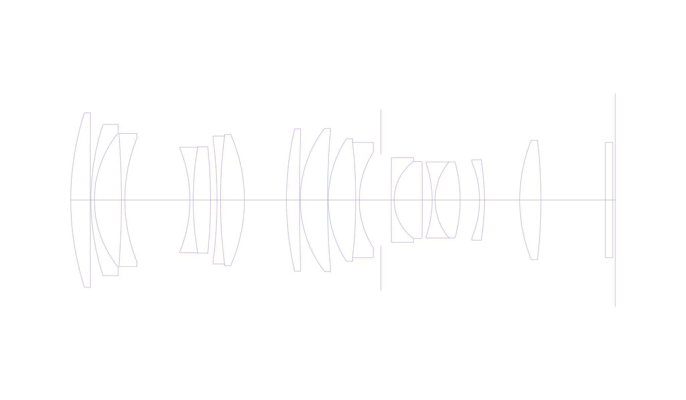
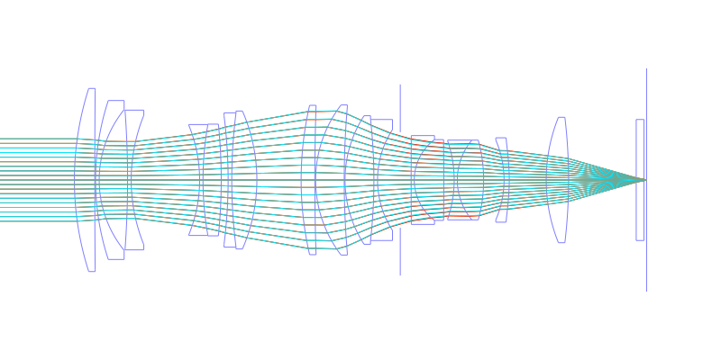
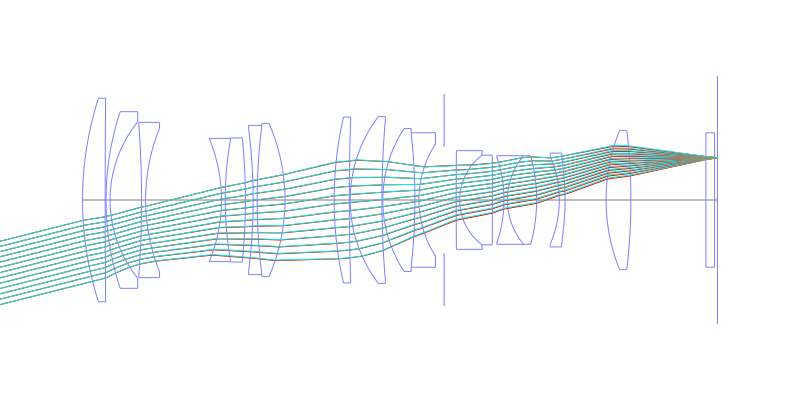
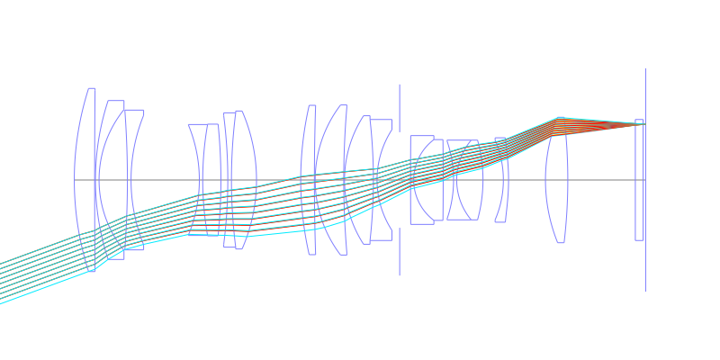
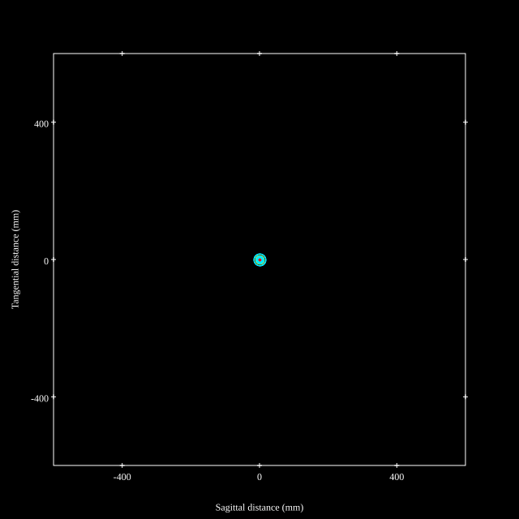
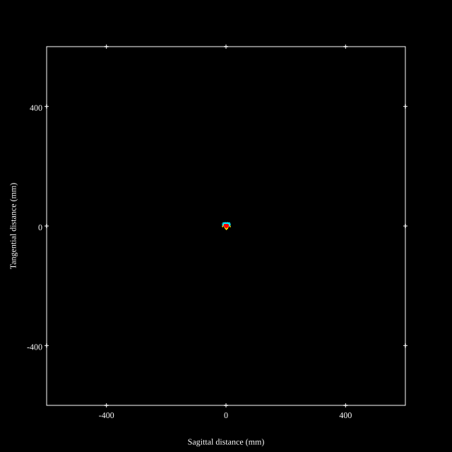
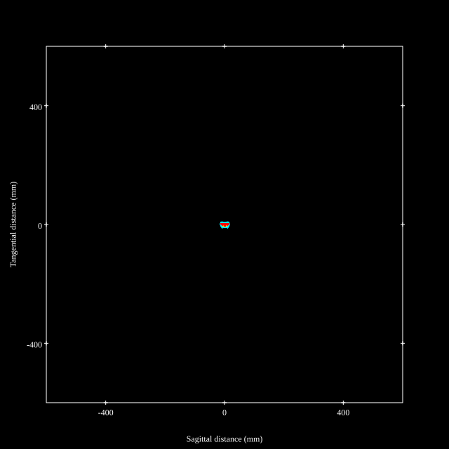
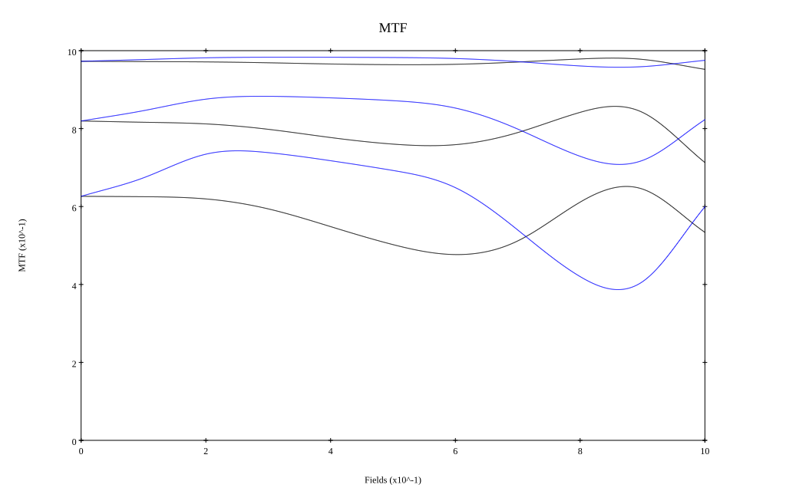

## Surface Data
Note that where glass types are shown the refractive index and abbe number is as per assigned glass type

| ID  | Radius | Thickness | Diameter | nd  | vd  | Glass Make | Glass |
| --- | ---    | ---       | ---      | --- | --- | ---        | ---   |
| 1 | 115.495 | 7.84 | 70.5 | 1.85025 | 30.05 | Ohara | S-NBH57 |
| 2 | 4082.497 | 0.3 | 68.8 |  |  |  |
| 3 | 98.124 | 1.4 | 61.2 | 1.497 | 81.55 | Ohara | S-FPL51 |
| 4 | 43.105 | 10.91 | 54.2 |  |  |  |
| 5 | -366.637 | 1.4 | 53.8 | 1.497 | 81.55 | Ohara | S-FPL51 |
| 6 | 66.495 | 26.3 | 49.8 |  |  |  |
| 7 | -55.393 | 1.3 | 42.3 | 1.5927 | 35.31 | Ohara | S-FTM16 |
| 8 | 122.653 | 7.0 | 42.7 | 1.497 | 81.55 | Ohara | S-FPL51 |
| 9 | -212.834 | 2.66 | 43.0 |  |  |  |
| 10 | -195.021 | 1.4 | 49.5 | 1.78472 | 25.68 | Ohara | S-TIH11 |
| 11 | 205.08 | 9.65 | 51.7 | 1.618 | 63.33 | Ohara | S-PHM52 |
| 12 | -66.268 | 17.02 | 53.1 |  |  |  |
| 13 | 128.319 | 5.27 | 57.5 | 1.80809 | 22.76 | Ohara | S-NPH1 |
| 14 | 886.07 | 0.3 | 57.5 |  |  |  |
| 15 | 47.577 | 11.0 | 57.8 | 1.80809 | 22.76 | Ohara | S-NPH1 |
| 16 | 330.282 | 0.3 | 56.2 |  |  |  |
| 17 | 45.429 | 11.11 | 49.5 | 1.59522 | 67.74 | Ohara | S-FPM2 |
| 18 | -209.692 | 1.4 | 46.6 | 1.80518 | 25.43 | Ohara | S-TIH6 |
| 19 | 35.638 | 8.74 | 38.8 |  |  |  |
| 20 | AS | 4.18 | 36.8 |  |  |  |
| 21 | 2304.09 | 1.2 | 34.2 | 1.85478 | 24.8 | Ohara | S-NBH56 |
| 22 | 19.436 | 11.35 | 31.1 | 1.72916 | 54.68 | Ohara | S-LAL18 |
| 23 | -1472.152 | 4.0 | 30.5 |  |  |  |
| 24 | -46.214 | 1.2 | 30.0 | 1.6134 | 44.27 | Ohara | S-NBM51 |
| 25 | 23.874 | 10.12 | 30.7 | 1.7859 | 44.2 | Ohara | S-LAH51 |
| 26 | -57.399 | 7.85 | 30.5 |  |  |  |
| 27 | -38.61 | 2.0 | 30.6 | 1.80835 | 40.55 | Ohara | L-LAH84 |
| 28 | -81.197 | 14.21 | 32.5 |  |  |  |
| 29 | 64.476 | 8.6 | 48.3 | 1.80809 | 22.76 | Ohara | S-NPH1 |
| 30 | -205.186 | 26.0 | 48.3 |  |  |  |
| 31 | 0.0 | 3.0 | 46.6 | 1.5168 | 64.17 | Schott | N-BK7 |
| 32 | 0.0 | 1.0 | 46.6 |  |  |  |
## Aspherical Data
| ID  | k   | P1  | P2  | P3  | P3 | P5 | P6 | P7 | P8 | P9 | P10 |
| --- | --- | --- | --- | --- | --- | --- | --- | --- | --- | --- | --- |
| 28 | 0.0415 | 0.0 | 4.36743E-6 | 3.48768E-9 | 1.16694E-11 | -3.46071E-14 | 8.79343E-17 | 0.0 | 0.0 | 0.0 | 0.0 |
## Layouts

## Spot Diagrams

## Paraxial Parameters
| parameter | value |
| ---       | ---   |
| effective_focal_length |57.994
| back_focal_length | 1.002
| optical_invariant | 6.262
| object_distance | 1.0E10
| image_distance | 1.002
| power | 0.017
| pp1_H | 114.935
| ppk_H' | -56.992
| ffl_F | 56.941
| fno | 1.7
| enp_dist_P | 75.893
| enp_radius | 17.057
| exp_dist_P' | -176.463
| exp_radius | 52.196
| m | -0
| red | -1.7243222181866762E8
| n_obj | 1
| n_img | 1
| img_ht | 21.292
| obj_ang | 20.16
| obj_na | 0
| img_na | -0.282|
## Spot Analysis
| Field | Spot Mean Radius | Spot Max Radius |
| ---   | ---              | ---             |
 | Field(x=0.0, y=0.0) | 5.242 | 17.152|
 | Field(x=0.0, y=0.1) | 5.104 | 18.408|
 | Field(x=0.0, y=0.2) | 4.627 | 19.854|
 | Field(x=0.0, y=0.3) | 4.618 | 21.296|
 | Field(x=0.0, y=0.4) | 4.849 | 21.991|
 | Field(x=0.0, y=0.5) | 4.949 | 20.751|
 | Field(x=0.0, y=0.6) | 5.011 | 19.041|
 | Field(x=0.0, y=0.7) | 5.135 | 15.926|
 | Field(x=0.0, y=0.8) | 5.26 | 14.448|
 | Field(x=0.0, y=0.9) | 5.433 | 14.681|
 | Field(x=0.0, y=1.0) | 5.788 | 15.805|
## Geometric MTF

* 10,30,50 cycles/mm
* Black lines represent sagittal, blue tangential
## Resources
* [OpticalBench Compatible Data File, tab delimited](./US20200341250_Example01.txt)
* [Zemax file](./US20200341250_Example01.zmx)
