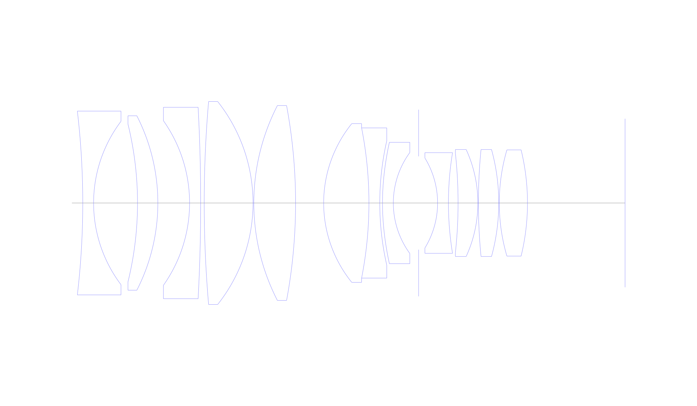
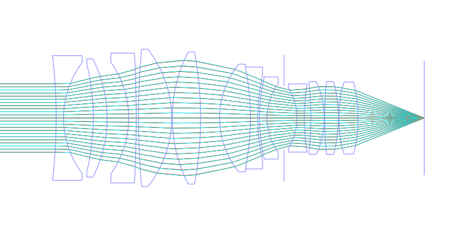
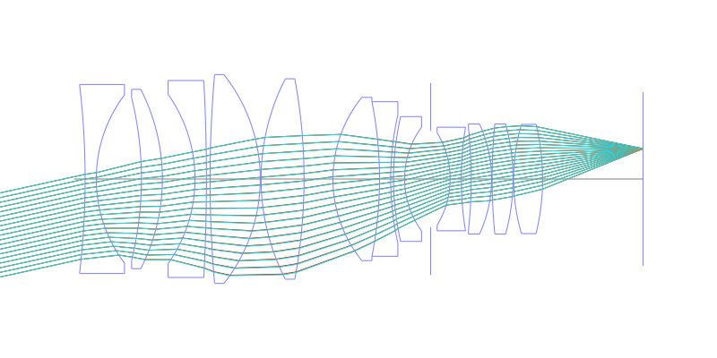
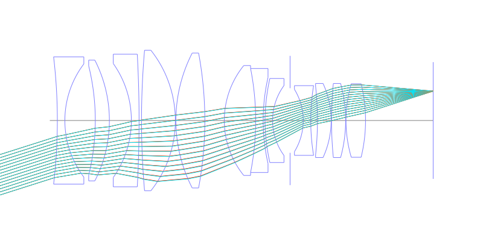
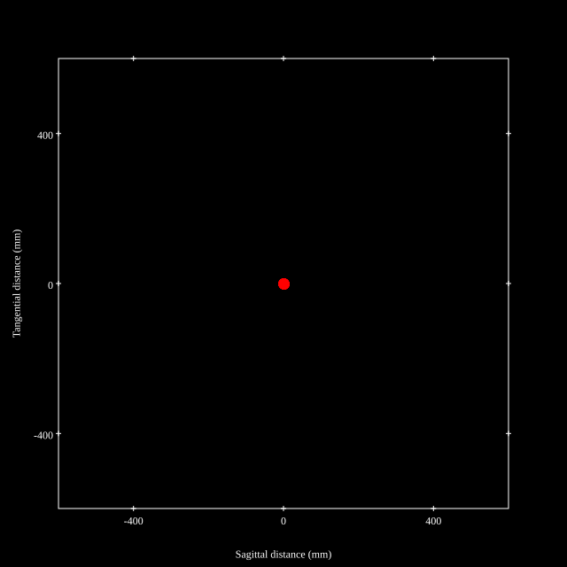
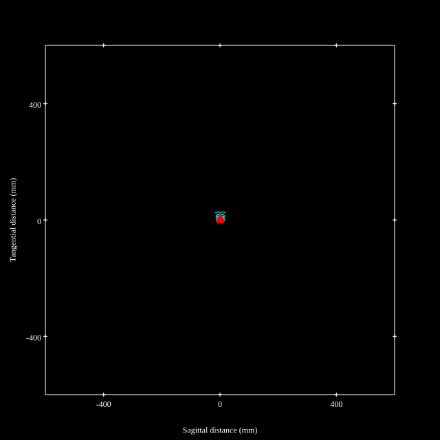
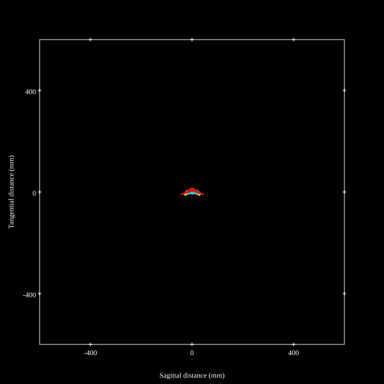
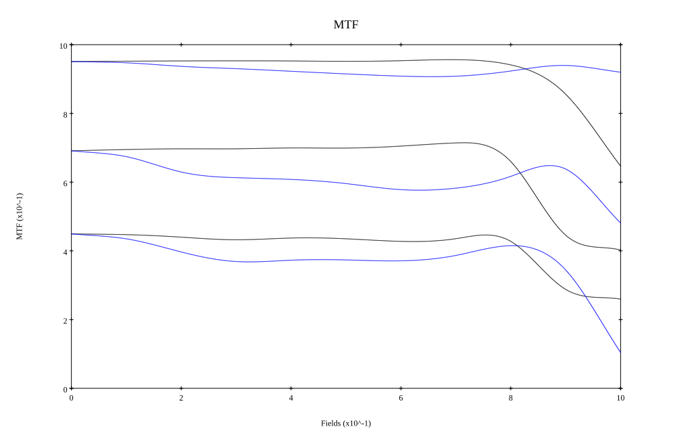
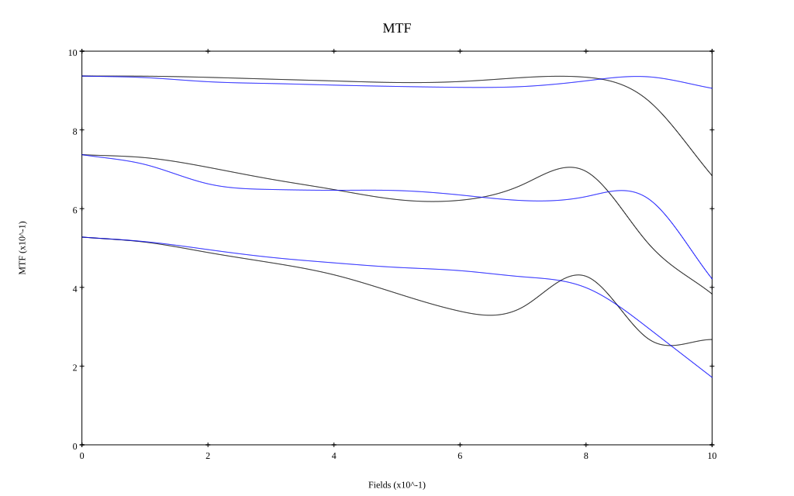

# ARRI Zeiss Master Prime T1.3 50mm
## Patent Information
| Country | Patent Number | Example | Year of Application | Inventors | Organisation | Link |
| ---     | ---           | ---     | ---                 | ---       | ---          | ---  |
|US | US20070236805 | EX 1 | 2005 | Juergen Klein,Juergen Noffke,Dietmar Gaengler | Carl Zeiss AG | [link](https://patents.google.com/patent/US7446944B2/en) |
## Surface Data
Note that where glass types are shown the refractive index and abbe number is as per assigned glass type

| ID  | Radius | Thickness | Diameter | nd  | vd  | Glass Make | Glass |
| --- | ---    | ---       | ---      | --- | --- | ---        | ---   |
| 1 | -290.07 | 4.0 | 67.88 | 1.48749 | 70.41 | Schott | N-FK5 |
| 2 | 50.119 | 16.2 | 60.36 |  |  |  |
| 3 | -122.32 | 7.5 | 58.28 | 1.7552 | 27.58 | Schott | SF4 |
| 4 | -70.795 | 11.7 | 64.4 |  |  |  |
| 5 | -52.708 | 4.1 | 60.78 | 1.65412 | 39.63 | Schott | KZFSN5 |
| 6 | -658.79 | 1.3 | 70.72 |  |  |  |
| 7 | 434.01 | 18.0 | 74.98 | 1.52855 | 76.98 | Schott | N-PK51 |
| 8 | -60.43 | 0.3 | 74.98 |  |  |  |
| 9 | 78.863 | 15.4 | 71.96 | 1.497 | 81.61 | Schott | N-PK52A |
| 10 | -196.68 | 10.361 | 71.96 |  |  |  |
| 11 | 46.639 | 16.7 | 58.62 | 1.72 | 43.69 | Ohara | S-LAM52 |
| 12 | -143.3 | 4.0 | 55.48 | 1.65412 | 39.63 | Schott | KZFSN5 |
| 13 | 103.66 | 1.0 | 45.95 |  |  |  |
| 14 | 92.48961 | 4.0 | 44.82 | 1.71736 | 29.62 | Schott | N-SF1 |
| 15 | 31.623 | 9.32 | 37.27 |  |  |  |
| 16 | AS | 7.0 | 34.481 |  |  |  |
| 17 | -31.851 | 4.0 | 33.22 | 1.67271 | 32.25 | Schott | N-SF5 |
| 18 | 114.65 | 3.56 | 37.18 |  |  |  |
| 19 | -170.31 | 7.3 | 36.64 | 1.741 | 52.64 | Ohara | S-LAL61 |
| 20 | -47.315 | 0.2 | 39.5 |  |  |  |
| 21 | 202.42 | 7.5 | 39.5 | 1.52855 | 76.98 | Schott | N-PK51 |
| 22 | -74.452 | 0.2 | 39.5 |  |  |  |
| 23 | 69.783 | 10.4 | 39.22 | 1.497 | 81.61 | Schott | N-PK52A |
| 24 | -82.937 | 36.004 | 39.22 |  |  |  |
## Aspherical Data
| ID  | k   | P1  | P2  | P3  | P3 | P5 | P6 | P7 | P8 | P9 | P10 |
| --- | --- | --- | --- | --- | --- | --- | --- | --- | --- | --- | --- |
| 14 | 0.0 | 0.0 | -1.132E-6 | 4.95E-10 | -1.325E-13 | 6.213E-16 | 0.0 | 0.0 | 0.0 | 0.0 | 0.0 |
## Layouts

## Spot Diagrams

## Paraxial Parameters
| parameter | value |
| ---       | ---   |
| effective_focal_length |49.989
| back_focal_length | 36.006
| optical_invariant | 6.419
| object_distance | 1.0E10
| image_distance | 36.006
| power | 0.02
| pp1_H | 90.284
| ppk_H' | -13.983
| ffl_F | 40.295
| fno | 1.24
| enp_dist_P | 63.846
| enp_radius | 20.157
| exp_dist_P' | -70.096
| exp_radius | 42.784
| m | -0
| red | -2.0004355985535344E8
| n_obj | 1
| n_img | 1
| img_ht | 15.92
| obj_ang | 17.665
| obj_na | 0
| img_na | -0.374|
## Spot Analysis
| Field | Spot Mean Radius | Spot Max Radius |
| ---   | ---              | ---             |
 | Field(x=0.0, y=0.0) | 6.467 | 13.358|
 | Field(x=0.0, y=0.1) | 6.598 | 14.366|
 | Field(x=0.0, y=0.2) | 7.28 | 20.551|
 | Field(x=0.0, y=0.3) | 7.374 | 22.829|
 | Field(x=0.0, y=0.4) | 7.463 | 27.272|
 | Field(x=0.0, y=0.5) | 7.797 | 30.395|
 | Field(x=0.0, y=0.6) | 8.174 | 32.559|
 | Field(x=0.0, y=0.7) | 8.013 | 32.31|
 | Field(x=0.0, y=0.8) | 8.038 | 24.635|
 | Field(x=0.0, y=0.9) | 10.15 | 27.764|
 | Field(x=0.0, y=1.0) | 16.012 | 43.951|
## Polychromatic Geometric MTF

* 10,30,50 cycles/mm
* Black lines represent sagittal, blue tangential
* To generate above, MTFs for wavelengths 587.5618(d), 486.1327(F), 656.2725(C) were calculated across 10 fields, and then averaged
## Polychromatic Geometric MTF (Weighted)

* 10,30,50 cycles/mm
* Black lines represent sagittal, blue tangential
* To generate above, MTFs for wavelengths 587.5618(d) wt(1.0), 656.2725(C) wt(0.475), 546.074(e) wt(0.98), 486.1327(F) wt(0.49), 435.8343(g) wt(0.15) were calculated across 10 fields, and then combined using weighted average
## Resources
* [OpticalBench Compatible Data File, tab delimited](./US20070236805_Example01.txt)
* [Zemax file](./US20070236805_Example01.zmx)
