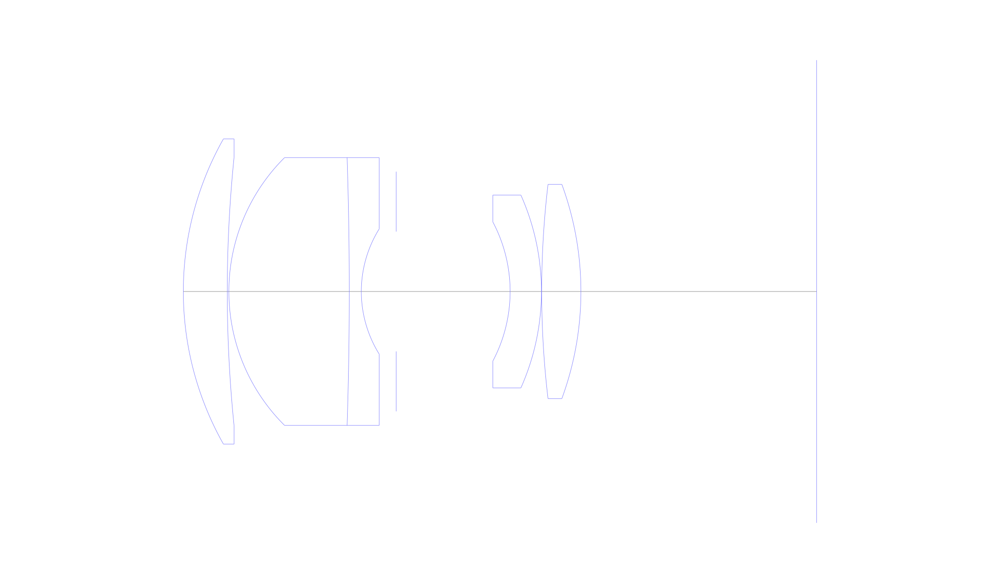
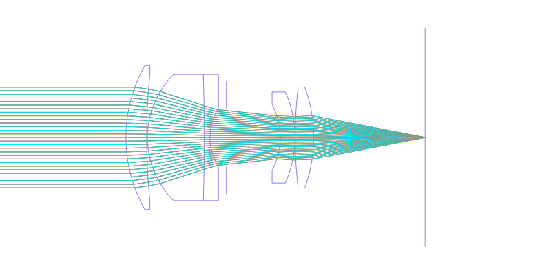
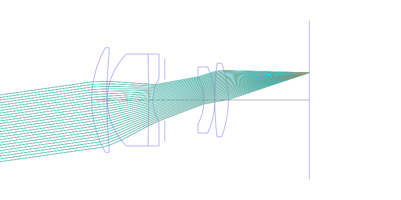
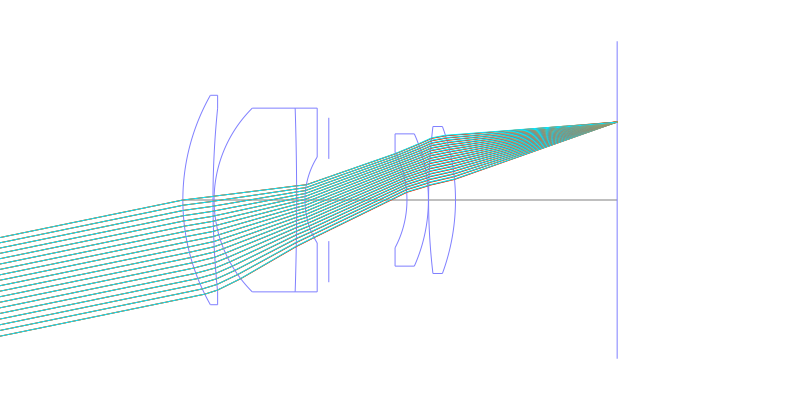
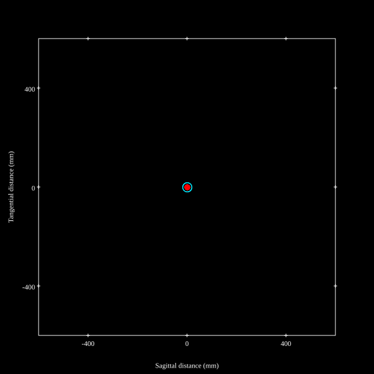
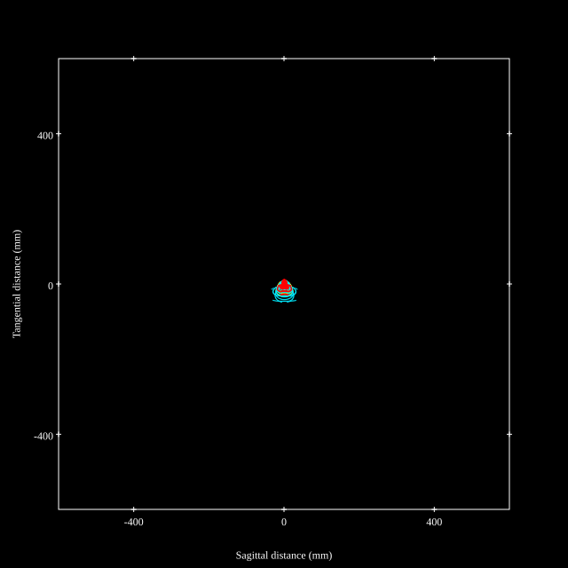
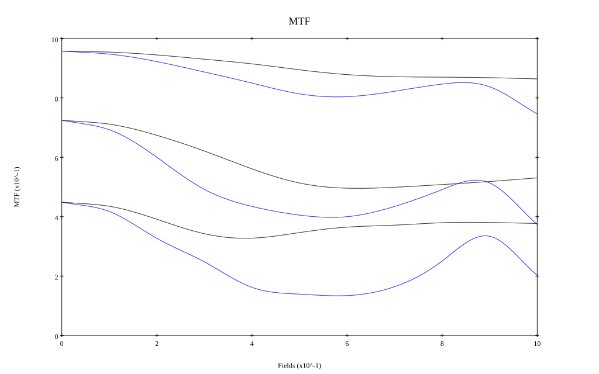
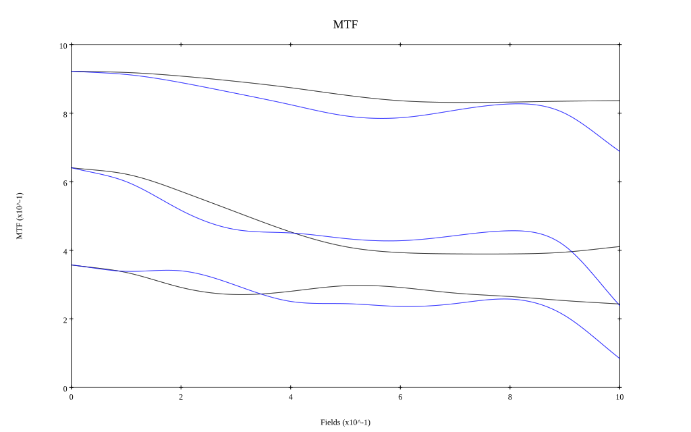

# Nikkor 105mm f2.5
## Surface Data
Note that where glass types are shown the refractive index and abbe number is as per assigned glass type

| ID  | Radius | Thickness | Diameter | nd  | vd  | Glass Make | Glass |
| --- | ---    | ---       | ---      | --- | --- | ---        | ---   |
| 1 | 58.0 | 8.2 | 57.0 | 1.6968 | 55.53 | Ohara | S-LAL14 |
| 2 | 247.78 | 0.3 | 50.0 |  |  |  |
| 3 | 35.27 | 22.47 | 50.0 | 1.51633 | 64.14 | Ohara | S-BSL7 |
| 4 | -772.2 | 2.25 | 50.0 | 1.68893 | 31.08 | Ohara | PBM28 |
| 5 | 22.15 | 6.5 | 23.4 |  |  |  |
| 6 | AS | 21.27 | 22.3792301464 |  |  |  |
| 7 | -27.7436835537 | 5.84 | 26.0 | 1.72151 | 29.24 | Ohara | PBH18 |
| 8 | -44.2 | 0.05 | 36.0 |  |  |  |
| 9 | 169.92 | 7.32 | 40.0 | 1.804 | 46.58 | Ohara | S-LAH65V |
| 10 | -58.0 | 44.0 | 40.0 |  |  |  |
## Layouts

## Spot Diagrams

## Paraxial Parameters
| parameter | value |
| ---       | ---   |
| effective_focal_length |104.974
| back_focal_length | 44.107
| optical_invariant | 4.302
| object_distance | 1.0E10
| image_distance | 44.107
| power | 0.01
| pp1_H | 49.885
| ppk_H' | -60.867
| ffl_F | -55.089
| fno | 2.504
| enp_dist_P | 57.486
| enp_radius | 20.959
| exp_dist_P' | -53.672
| exp_radius | 19.544
| m | -0
| red | -9.526201498769511E7
| n_obj | 1
| n_img | 1
| img_ht | 21.548
| obj_ang | 11.6
| obj_na | 0
| img_na | -0.196|
## Spot Analysis
| Field | Spot Mean Radius | Spot Max Radius |
| ---   | ---              | ---             |
 | Field(x=0.0, y=0.0) | 6.362 | 18.551|
 | Field(x=0.0, y=0.1) | 6.938 | 29.077|
 | Field(x=0.0, y=0.2) | 8.167 | 36.247|
 | Field(x=0.0, y=0.3) | 9.685 | 41.212|
 | Field(x=0.0, y=0.4) | 10.813 | 44.935|
 | Field(x=0.0, y=0.5) | 12.296 | 47.982|
 | Field(x=0.0, y=0.6) | 13.072 | 50.218|
 | Field(x=0.0, y=0.7) | 13.014 | 51.904|
 | Field(x=0.0, y=0.8) | 12.604 | 53.019|
 | Field(x=0.0, y=0.9) | 12.956 | 57.085|
 | Field(x=0.0, y=1.0) | 15.206 | 61.736|
## Polychromatic Geometric MTF

* 10,30,50 cycles/mm
* Black lines represent sagittal, blue tangential
* To generate above, MTFs for wavelengths 587.5618(d), 486.1327(F), 656.2725(C) were calculated across 10 fields, and then averaged
## Polychromatic Geometric MTF (Weighted)

* 10,30,50 cycles/mm
* Black lines represent sagittal, blue tangential
* To generate above, MTFs for wavelengths 587.5618(d) wt(1.0), 656.2725(C) wt(0.475), 546.074(e) wt(0.98), 486.1327(F) wt(0.49), 435.8343(g) wt(0.15) were calculated across 10 fields, and then combined using weighted average
## Resources
* [OpticalBench Compatible Data File, tab delimited](./prescription.txt)
* [Zemax file](./specs.zmx)

Report / Zemax file generated using [Beam42](https://github.com/BeamFour/Beam42) on 2026-03-31
