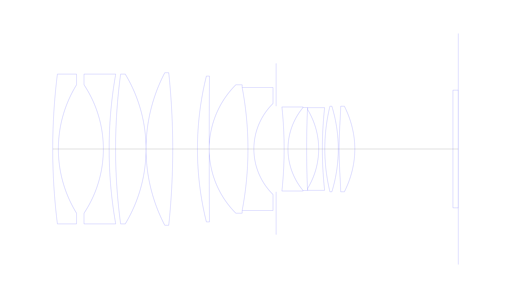
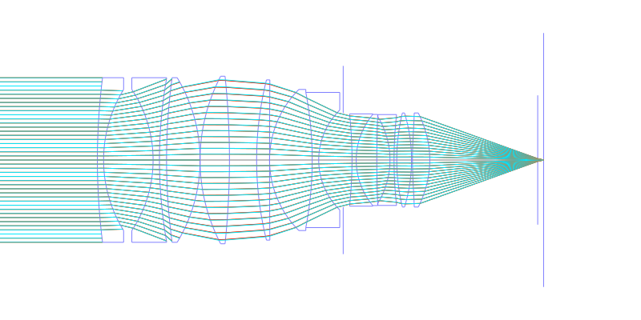
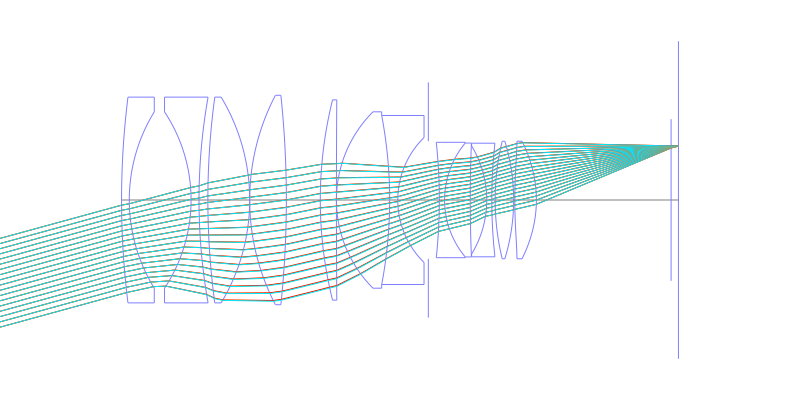
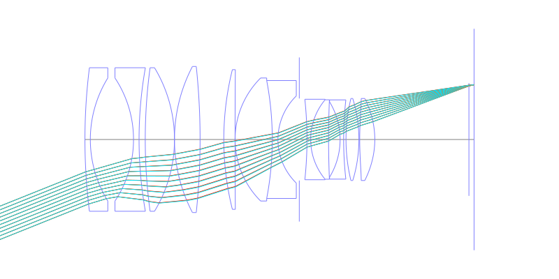
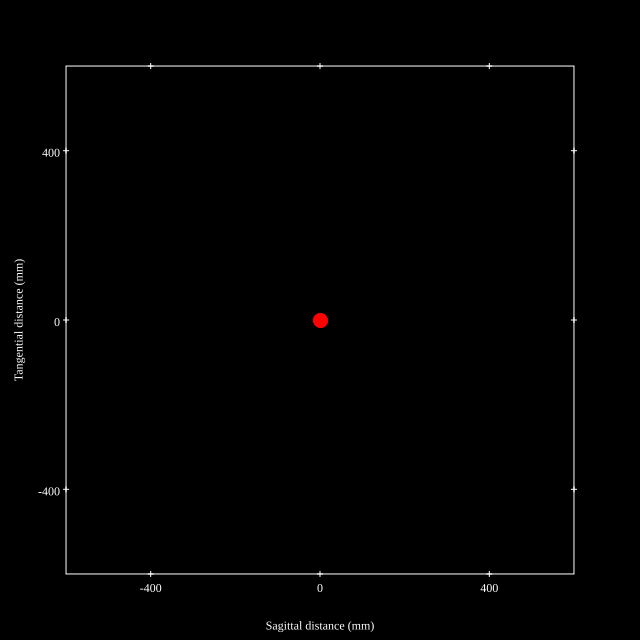
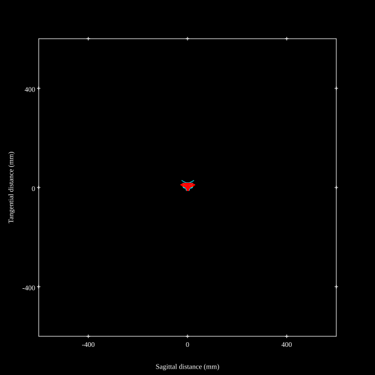
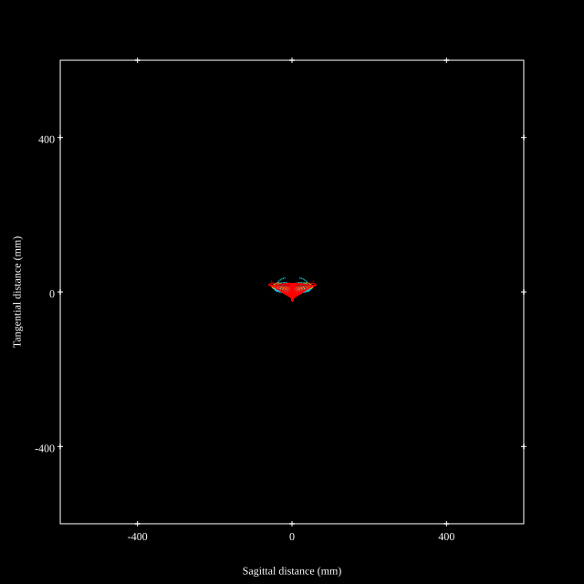
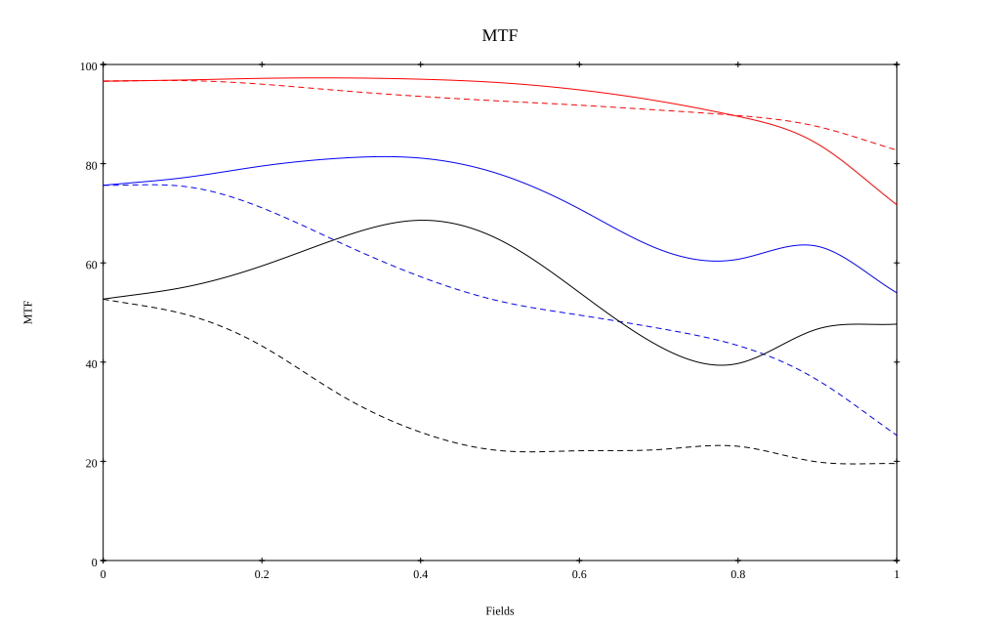
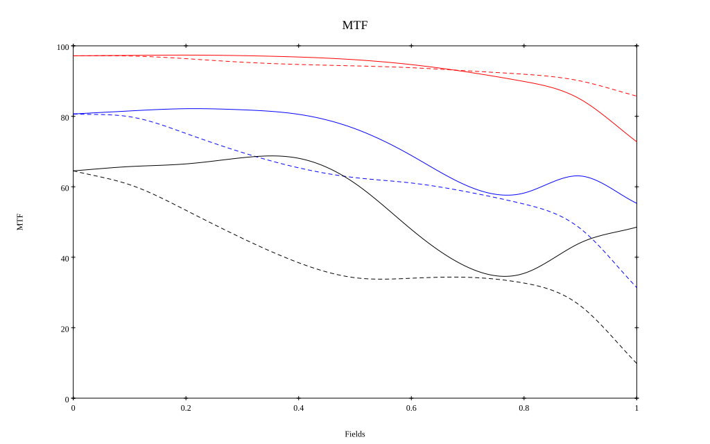

# Zeiss Otus 55mm f1.4 Reverse Engineered by [Zhong Fu](https://zhuanlan.zhihu.com/p/21281774803)
## Surface Data
Note that where glass types are shown the refractive index and abbe number is as per assigned glass type

| ID  | Radius | Thickness | Diameter | nd  | vd  | Glass Make | Glass |
| --- | ---    | ---       | ---      | --- | --- | ---        | ---   |
| 1 | 225.36466834503 | 2.1033312091354 | 56.0 | 1.48749 | 70.24 | Ohara | S-FSL5 |
| 2 | 45.736909912913 | 16.816476607346 | 48.0 |  |  |  |
| 3 | -43.4839710998151 | 2.162275148848 | 48.0 | 1.6134 | 44.27 | Ohara | S-NBM51 |
| 4 | 160.511398683478 | 2.4078320111969 | 56.0 |  |  |  |
| 5 | 208.941209674516 | 11.386852109962 | 56.0 | 1.618 | 63.33 | Ohara | S-PHM52 |
| 6 | -54.306190349513 | 0.0 | 56.0 |  |  |  |
| 7 | 61.5685548331634 | 9.97359385999999 | 57.0 | 1.43875 | 94.95 | Ohara | S-FPL53 |
| 8 | -272.694326590584 | 9.23642559062 | 57.0 |  |  |  |
| 9 | 112.954001341021 | 4.392370735944 | 54.5 | 2.001 | 29.14 | Ohara | S-LAH99 |
| 10 | 3740.84709952516 | 0.0 | 54.5 |  |  |  |
| 11 | 33.9171015242564 | 14.4865453457114 | 48.0 | 1.59522 | 67.74 | Ohara | S-FPM2 |
| 12 | -122.898138652455 | 2.2092009079593 | 46.0 | 1.65412 | 39.68 | Ohara | S-NBH5 |
| 13 | 23.78728047 | 8.31695997266627 | 34.0 |  |  |  |
| 14 | AS | 2.992078158 | 32.0159 |  |  |  |
| 15 | -148.328915311997 | 1.434202797068 | 31.4 | 1.738 | 32.33 | Ohara | S-NBH53V |
| 16 | 24.1902218579498 | 6.98151570199999 | 31.0 | 1.874 | 35.26 | Ohara | S-LAH75 |
| 17 | 374.552470798813 | 4.488117237 | 31.0 |  |  |  |
| 18 | -28.3396604218354 | 1.37780112643031 | 29.4 | 1.673 | 38.26 | Ohara | S-NBH52V |
| 19 | 140.452377398 | 0.91757063512 | 30.9181 |  |  |  |
| 20 | 67.7398806672967 | 5.0262923616856 | 32.0 | 1.497 | 81.55 | Ohara | S-FPL51 |
| 21 | -54.6681021516486 | 0.31583379676462 | 32.0 |  |  |  |
| 22 | 127.953325269898 | 5.87378254218892 | 32.0 | 1.58313 | 59.39 | Ohara | L-BAL42 |
| 23 | -33.15760489 | 36.66500040938 | 32.0 |  |  |  |
| 24 | 0.0 | 2.0 | 44.0 | 1.51633 | 64.14 | Ohara | S-BSL7 |
| 25 | 0.0 | 0.0 | 44.0 |  |  |  |
## Aspherical Data
| ID  | Type | k   | P1 | P2 | P3 | P4 | P5 | P6 |
| --- | --- | --- | --- | --- | --- | --- | --- | --- |
| 22| EVEN | 0.0 | 0.0 | -6.06936532178685E-6 | 4.5567704355776E-9 | -3.19548147113261E-11 | 4.29902435086771E-14 | -5.0E-18 |
| 23| EVEN | 0.0 | 0.0 | 3.39691207913842E-6 | 1.4343503783496E-9 | -1.27723154320818E-11 | 1.37648185236955E-14 | -1.0E-18 |
## Layouts

## Spot Diagrams

## Paraxial Parameters
| parameter | value |
| ---       | ---   |
| effective_focal_length |53.912
| back_focal_length | 0.021
| optical_invariant | 7.503
| object_distance | 1.0E10
| image_distance | 0.021
| power | 0.019
| pp1_H | 66.297
| ppk_H' | -53.891
| ffl_F | 12.385
| fno | 1.441
| enp_dist_P | 50.791
| enp_radius | 18.711
| exp_dist_P' | -75.637
| exp_radius | 26.265
| m | -0
| red | -1.854874778404831E8
| n_obj | 1
| n_img | 1
| img_ht | 21.618
| obj_ang | 21.85
| obj_na | 0
| img_na | -0.328|
## Spot Analysis
| Field | Spot Mean Radius | Spot Max Radius |
| ---   | ---              | ---             |
 | Field(x=0.0, y=0.0) | 5.796 | 15.783|
 | Field(x=0.0, y=0.1) | 5.741 | 16.539|
 | Field(x=0.0, y=0.2) | 5.803 | 16.763|
 | Field(x=0.0, y=0.3) | 6.36 | 21.879|
 | Field(x=0.0, y=0.4) | 7.063 | 28.345|
 | Field(x=0.0, y=0.5) | 7.651 | 34.003|
 | Field(x=0.0, y=0.6) | 8.319 | 34.832|
 | Field(x=0.0, y=0.7) | 9.43 | 37.497|
 | Field(x=0.0, y=0.8) | 10.753 | 39.077|
 | Field(x=0.0, y=0.9) | 13.261 | 50.051|
 | Field(x=0.0, y=1.0) | 18.255 | 63.617|
## Polychromatic Geometric MTF

* 10=red,30=blue,50=black cycles/mm
* Solid lines represent sagittal, dashed lines tangential
* To generate above, MTFs for wavelengths 587.5618(d), 486.1327(F), 656.2725(C) were calculated across 10 fields, and then averaged
## Polychromatic Geometric MTF (Weighted)

* 10=red,30=blue,50=black cycles/mm
* Solid lines represent sagittal, dashed lines tangential
* To generate above, MTFs for wavelengths 587.5618(d) wt(1.0), 656.2725(C) wt(0.475), 546.074(e) wt(0.98), 486.1327(F) wt(0.49), 435.8343(g) wt(0.15) were calculated across 10 fields, and then combined using weighted average
## Resources
* [OpticalBench Compatible Data File, tab delimited](./prescription.txt)
* [Zemax file](./Otus55.zmx)

Report / Zemax file generated using [Beam42](https://github.com/BeamFour/Beam42) on 2026-07-08
