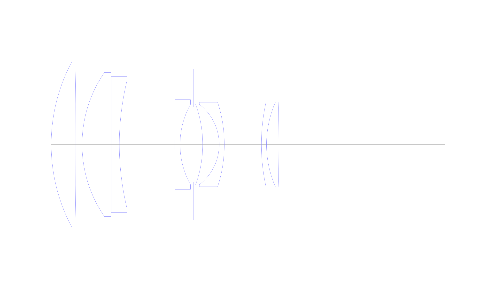
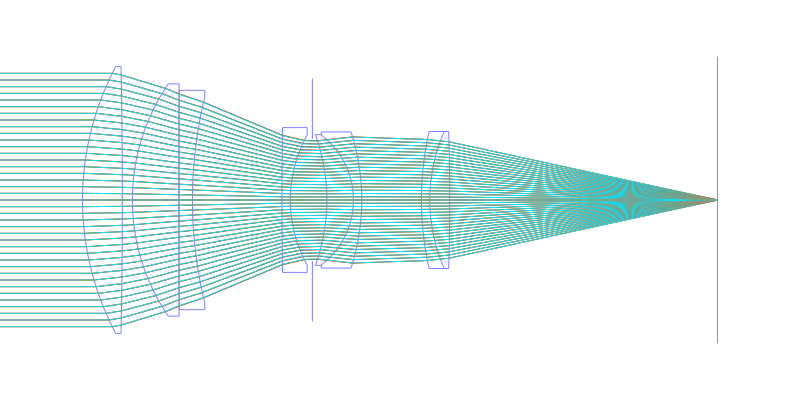
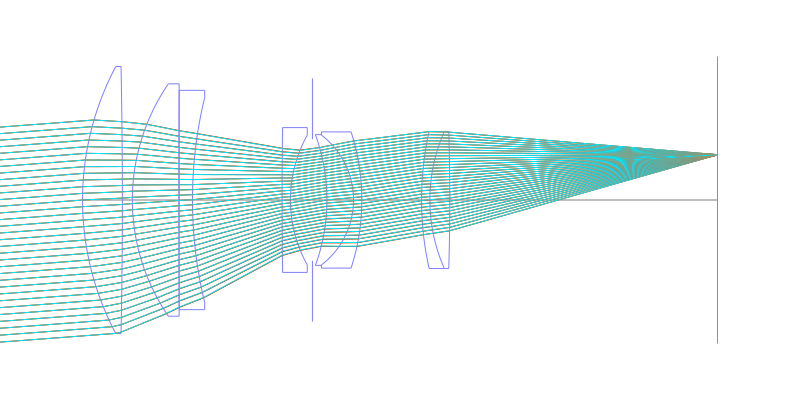
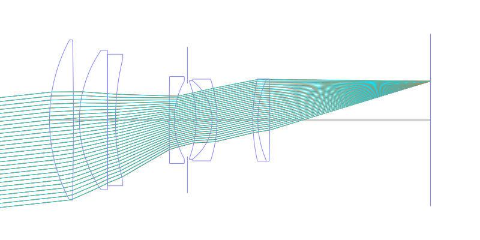
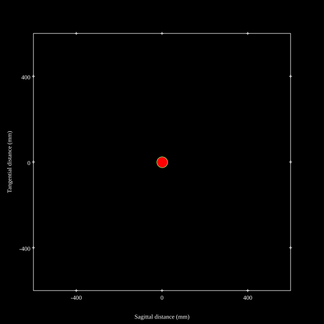
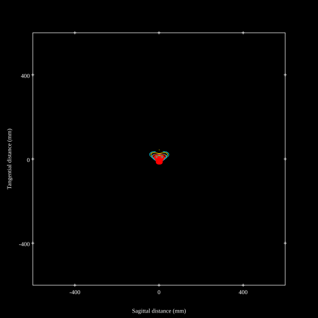
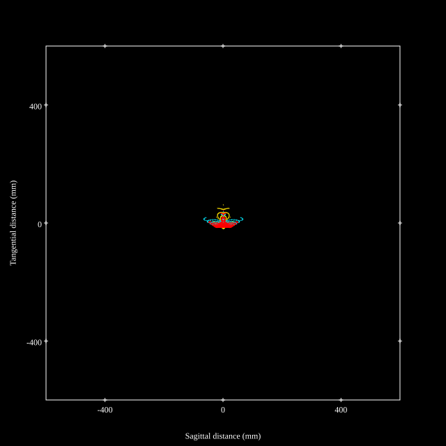
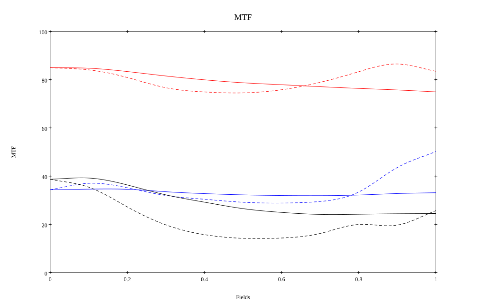
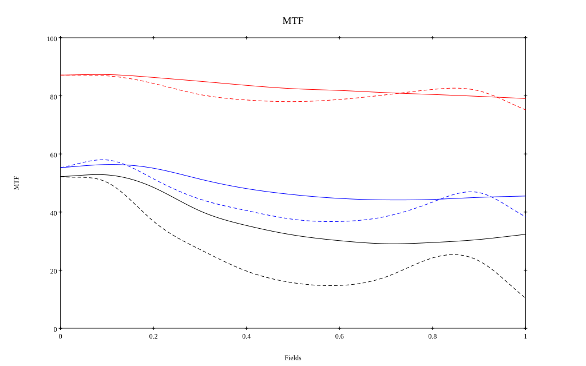

## Surface Data
Note that where glass types are shown the refractive index and abbe number is as per assigned glass type

| ID  | Radius | Thickness | Diameter | nd  | vd  | Glass Make | Glass |
| --- | ---    | ---       | ---      | --- | --- | ---        | ---   |
| 1 | 85.6872 | 11.988 | 80.36 | 1.589 | 61.22 | CORNING | B89-61 |
| 2 | -2002.0536 | 3.006 | 80.36 |  |  |  |
| 3 | 61.839 | 13.986 | 69.94 | 1.497 | 81.61 | Hoya | FCD1 |
| 4 | 5668.4898 | 0.108 | 66.02 |  |  |  |
| 5 | 0.0 | 3.996 | 66.02 | 1.78475 | 25.8 | CORNING | D85-25 |
| 6 | 131.0832 | 26.982 | 61.76 |  |  |  |
| 7 | 1784.2662 | 2.502 | 43.58 | 1.7725 | 49.62 | Schott | N-LAF34 |
| 8 | 40.1706 | 6.628 | 39.08 |  |  |  |
| 9 | AS | 4.37 | 36.604 |  |  |  |
| 10 | -57.2148 | 7.992 | 39.36 | 1.8061 | 40.93 | Ohara | S-LAH53 |
| 11 | -24.606 | 2.502 | 39.08 | 1.7725 | 49.62 | Schott | N-LAF34 |
| 12 | -66.5946 | 17.982 | 41.0 |  |  |  |
| 13 | 94.4082 | 2.502 | 41.26 | 1.72825 | 28.46 | Ohara | S-TIH10 |
| 14 | 51.0804 | 5.994 | 41.26 | 1.7725 | 49.62 | Schott | N-LAF34 |
| 15 | -678.5694 | 80.622 | 41.26 |  |  |  |
## Layouts

## Spot Diagrams

## Paraxial Parameters
| parameter | value |
| ---       | ---   |
| effective_focal_length |180.007
| back_focal_length | 80.547
| optical_invariant | 4.237
| object_distance | 1.0E10
| image_distance | 80.547
| power | 0.006
| pp1_H | 62.889
| ppk_H' | -99.46
| ffl_F | -117.118
| fno | 2.3
| enp_dist_P | 137.878
| enp_radius | 39.134
| exp_dist_P' | -46.599
| exp_radius | 27.625
| m | -0
| red | -5.555330867227542E7
| n_obj | 1
| n_img | 1
| img_ht | 19.491
| obj_ang | 6.18
| obj_na | 0
| img_na | -0.212|
## Spot Analysis
| Field | Spot Mean Radius | Spot Max Radius |
| ---   | ---              | ---             |
 | Field(x=0.0, y=0.0) | 10.635 | 37.501|
 | Field(x=0.0, y=0.1) | 9.495 | 46.794|
 | Field(x=0.0, y=0.2) | 10.327 | 49.302|
 | Field(x=0.0, y=0.3) | 11.877 | 51.22|
 | Field(x=0.0, y=0.4) | 12.87 | 53.857|
 | Field(x=0.0, y=0.5) | 13.281 | 50.742|
 | Field(x=0.0, y=0.6) | 13.402 | 50.012|
 | Field(x=0.0, y=0.7) | 13.346 | 50.746|
 | Field(x=0.0, y=0.8) | 13.193 | 52.118|
 | Field(x=0.0, y=0.9) | 13.855 | 58.485|
 | Field(x=0.0, y=1.0) | 16.775 | 71.873|
## Polychromatic Geometric MTF

* 10,30,50 cycles/mm
* Black lines represent sagittal, blue tangential
* To generate above, MTFs for wavelengths 587.5618(d), 486.1327(F), 656.2725(C) were calculated across 10 fields, and then averaged
## Polychromatic Geometric MTF (Weighted)

* 10,30,50 cycles/mm
* Black lines represent sagittal, blue tangential
* To generate above, MTFs for wavelengths 587.5618(d) wt(1.0), 656.2725(C) wt(0.475), 546.074(e) wt(0.98), 486.1327(F) wt(0.49), 435.8343(g) wt(0.15) were calculated across 10 fields, and then combined using weighted average
## Resources
* [OpticalBench Compatible Data File, tab delimited](./prescription.txt)
* [Zemax file](./US004726669_Example01P.zmx)

Report / Zemax file generated using [Beam42](https://github.com/BeamFour/Beam42) on 2026-04-19
