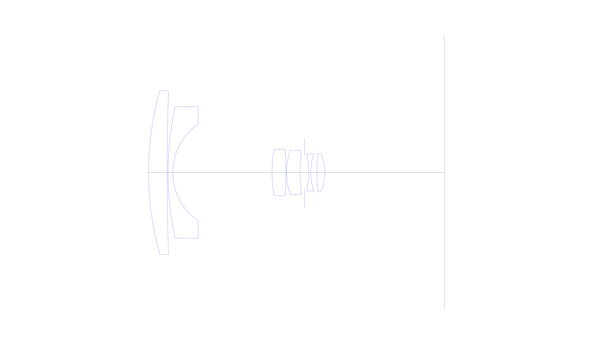
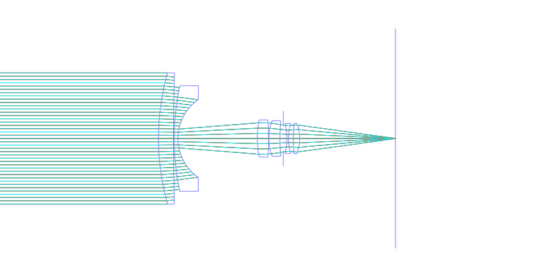
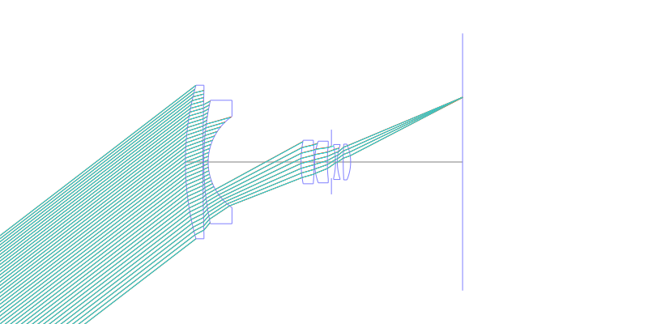
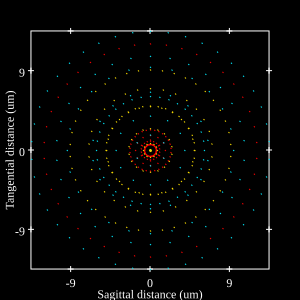
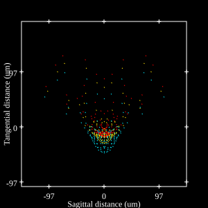
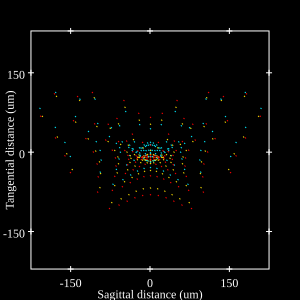

# Angenieux 28mm f3.5 R11
## Patent Information
| Country | Patent Number | Example | Year of Application | Inventors | Organisation | Link |
| ---     | ---           | ---     | ---                 | ---       | ---          | ---  |
|US | US 2696758 | EX 1 | 1950 | Pierre Angenieux | Angenieux | [link](https://patents.google.com/patent/US2696758A/en) |
## Surface Data
Note that where glass types are shown the refractive index and abbe number is as per assigned glass type

| ID  | Radius | Thickness | Diameter | nd  | vd  | Glass Make | Glass |
| --- | ---    | ---       | ---      | --- | --- | ---        | ---   |
| 1 | 95.52 | 5.87 | 51.6 | 1.6751 | 32.3 |  |
| 2 | 805.67 | 0.3 | 48.46 |  |  |  |
| 3 | 98.18 | 1.47 | 41.48 | 1.62041 | 60.32 | Schott | SK16 |
| 4 | 18.66 | 31.21 | 30.64 |  |  |  |
| 5 | 37.99 | 4.4 | 14.62 | 1.62041 | 60.32 | Schott | SK16 |
| 6 | -90.62 | 0.15 | 13.66 |  |  |  |
| 7 | 20.36 | 4.29 | 14.0 | 1.62041 | 60.32 | Schott | SK16 |
| 8 | 55.25 | 1.37 | 11.46 |  |  |  |
| 9 | AS | 1.37 | 10.871 |  |  |  |
| 10 | -23.44 | 0.62 | 10.86 | 1.6287 | 35.3 |  |
| 11 | 18.18 | 1.97 | 11.74 |  |  |  |
| 12 | 90.62 | 2.49 | 10.94 | 1.62041 | 60.32 | Schott | SK16 |
| 13 | -15.14 | 37.62 | 12.0 |  |  |  |
## Layouts

## Spot Diagrams

## Paraxial Parameters
| parameter | value |
| ---       | ---   |
| effective_focal_length |28.277
| back_focal_length | 37.621
| optical_invariant | 3.1
| object_distance | 1.0E10
| image_distance | 37.62
| power | 0.035
| pp1_H | 38.848
| ppk_H' | -9.343
| ffl_F | 10.57
| fno | 3.5
| enp_dist_P | 28.647
| enp_radius | 4.04
| exp_dist_P' | -6.614
| exp_radius | 6.319
| m | 0
| red | -3.5363830243947875E8
| n_obj | 1
| n_img | 1
| img_ht | 21.698
| obj_ang | 37.5
| obj_na | 0
| img_na | -0.141|
## Spot Analysis
| Field | Spot Mean Radius | Spot Max Radius |
| ---   | ---              | ---             |
 | 0.0 | 7.635 | 13.741|
 | 0.7 | 40.505 | 146.169|
 | 1.0 | 83.319 | 224.993|
## Resources
* [OpticalBench Compatible Data File, tab delimited](./US002696758_Example01.txt)
* [Zemax file](./US002696758_Example01.zmx)
