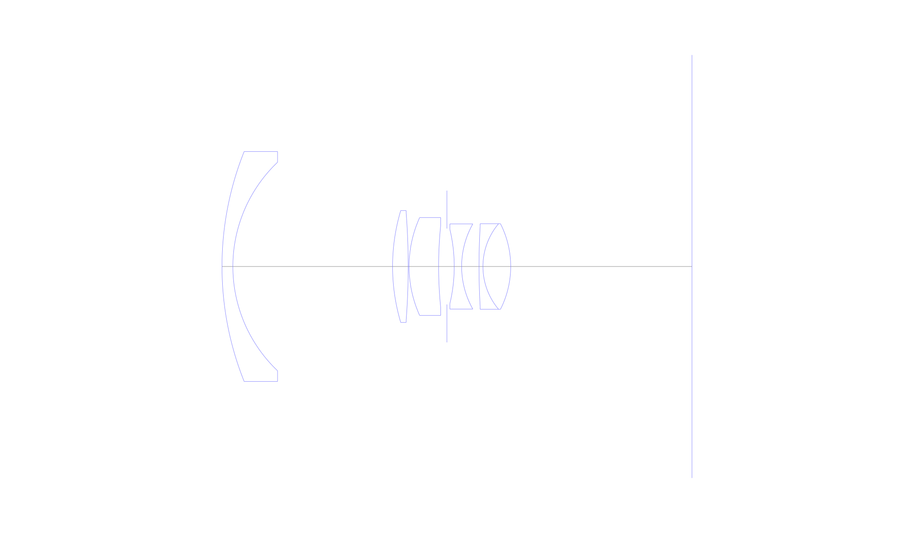
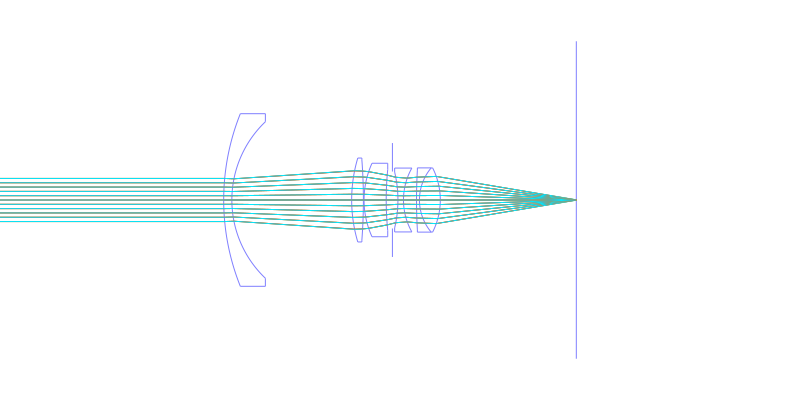
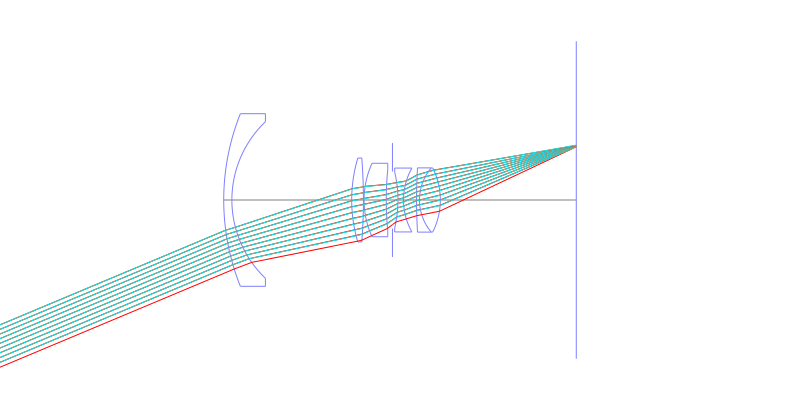
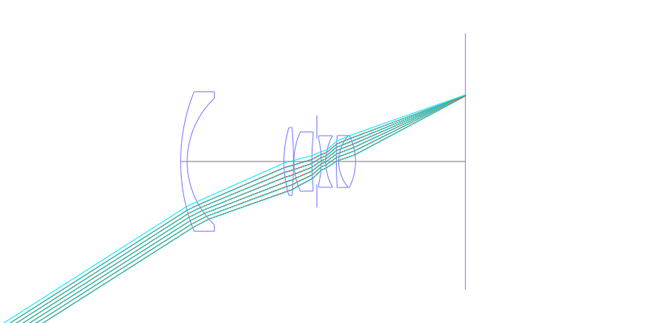
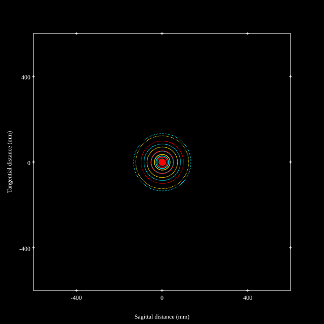
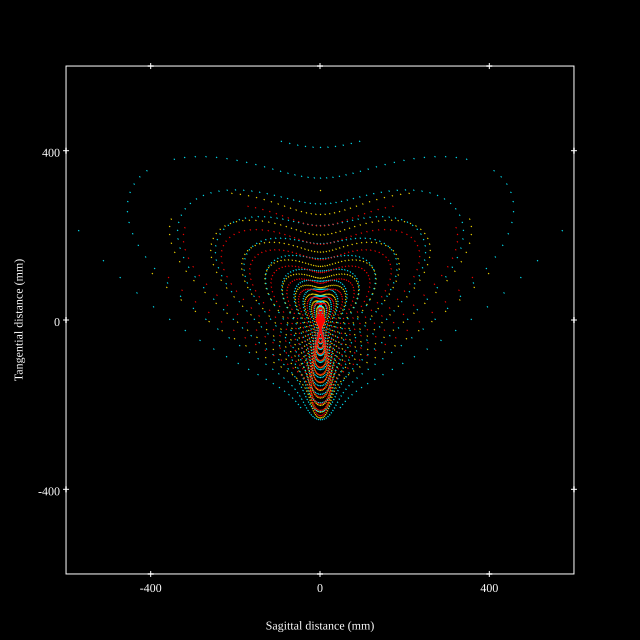
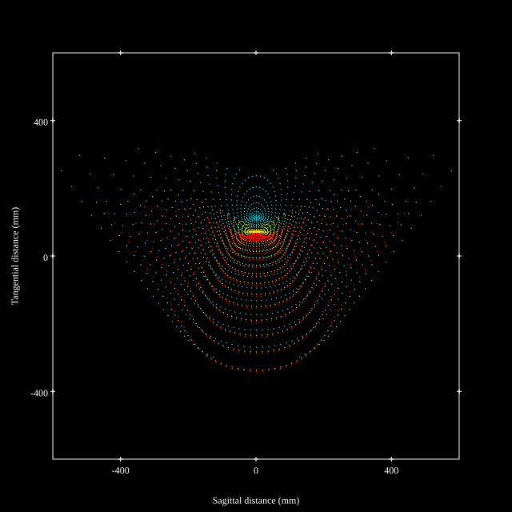
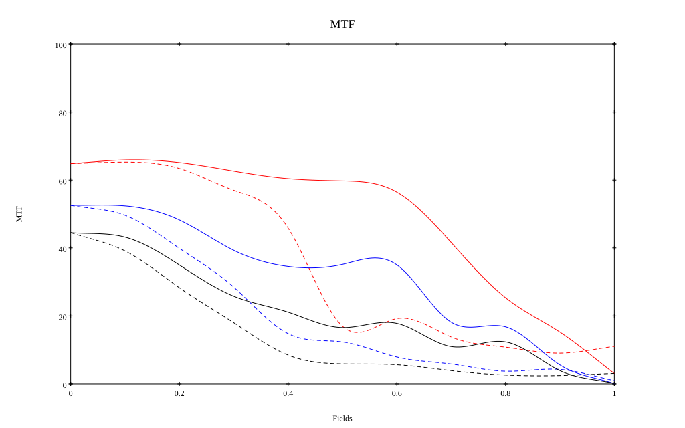
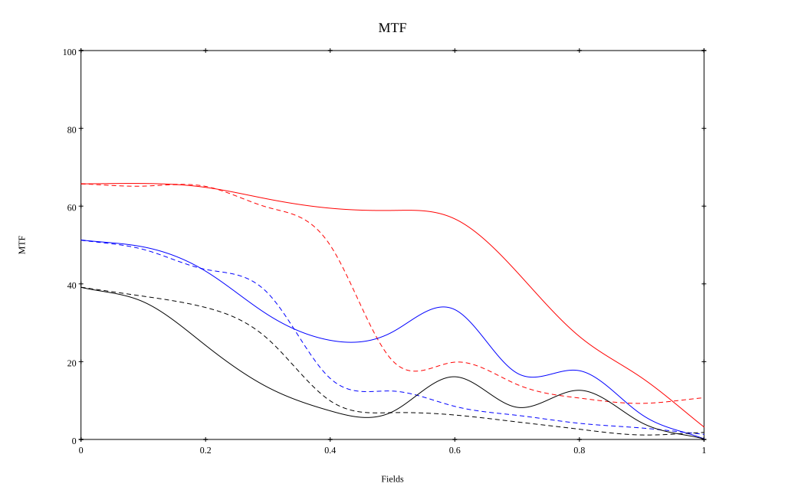

# Angenieux 35mm f2.5 R1
## Patent Information
| Country | Patent Number | Example | Year of Application | Inventors | Organisation | Link |
| ---     | ---           | ---     | ---                 | ---       | ---          | ---  |
|US | US2649022 | 1 | 1950 | Pierre Angenieux | Angenieux | [link](https://patents.google.com/patent/US2649022A/en) |
## Surface Data
Note that where glass types are shown the refractive index and abbe number is as per assigned glass type

| ID  | Radius | Thickness | Diameter | nd  | vd  | Glass Make | Glass |
| --- | ---    | ---       | ---      | --- | --- | ---        | ---   |
| 1 | 63.17 | 2.22 | 46.98 | 1.6145 | 59.8 |  |
| 2 | 29.42 | 32.61 | 42.6 |  |  |  |
| 3 | 40.04 | 3.19 | 22.84 | 1.6243 | 46.8 |  |
| 4 | -144.29 | 0.18 | 21.86 |  |  |  |
| 5 | 24.21 | 6.03 | 20.0 | 1.6226 | 53.0 |  |
| 6 | 83.11 | 1.69 | 16.6 |  |  |  |
| 7 | AS | 1.5 | 15.502 |  |  |  |
| 8 | -32.72 | 1.51 | 15.17 | 1.6141 | 37.0 |  |
| 9 | 17.69 | 3.55 | 17.38 |  |  |  |
| 10 | 141.55 | 0.8 | 16.28 | 1.6287 | 35.3 |  |
| 11 | 13.56 | 5.67 | 17.48 | 1.6391 | 55.8 |  |
| 12 | -19.32 | 37.0 | 17.48 |  |  |  |
## Layouts

## Spot Diagrams

## Paraxial Parameters
| parameter | value |
| ---       | ---   |
| effective_focal_length |35.326
| back_focal_length | 37.071
| optical_invariant | 4.459
| object_distance | 1.0E10
| image_distance | 37.071
| power | 0.028
| pp1_H | 42.353
| ppk_H' | 1.745
| ffl_F | 7.027
| fno | 2.523
| enp_dist_P | 31.128
| enp_radius | 7
| exp_dist_P' | -14.637
| exp_radius | 10.26
| m | -0
| red | -2.83081606908256E8
| n_obj | 1
| n_img | 1
| img_ht | 22.505
| obj_ang | 32.5
| obj_na | 0
| img_na | -0.194|
## Spot Analysis
| Field | Spot Mean Radius | Spot Max Radius |
| ---   | ---              | ---             |
 | Field(x=0.0, y=0.0) | 50.518 | 146.861|
 | Field(x=0.0, y=0.1) | 58.456 | 321.94|
 | Field(x=0.0, y=0.2) | 73.589 | 443.964|
 | Field(x=0.0, y=0.3) | 105.368 | 491.674|
 | Field(x=0.0, y=0.4) | 113.95 | 489.907|
 | Field(x=0.0, y=0.5) | 115.725 | 528.943|
 | Field(x=0.0, y=0.6) | 128.331 | 554.83|
 | Field(x=0.0, y=0.7) | 147.459 | 609.343|
 | Field(x=0.0, y=0.8) | 164.725 | 618.145|
 | Field(x=0.0, y=0.9) | 180.083 | 633.607|
 | Field(x=0.0, y=1.0) | 187.924 | 628.877|
## Polychromatic Geometric MTF

* 10=red,30=blue,50=black cycles/mm
* Solid lines represent sagittal, dashed lines tangential
* To generate above, MTFs for wavelengths 587.5618(d), 486.1327(F), 656.2725(C) were calculated across 10 fields, and then averaged
## Polychromatic Geometric MTF (Weighted)

* 10=red,30=blue,50=black cycles/mm
* Solid lines represent sagittal, dashed lines tangential
* To generate above, MTFs for wavelengths 587.5618(d) wt(1.0), 656.2725(C) wt(0.475), 546.074(e) wt(0.98), 486.1327(F) wt(0.49), 435.8343(g) wt(0.15) were calculated across 10 fields, and then combined using weighted average
## Resources
* [OpticalBench Compatible Data File, tab delimited](./prescription.txt)
* [Zemax file](./US002649022_Example01.zmx)

Report / Zemax file generated using [Beam42](https://github.com/BeamFour/Beam42) on 2026-07-15
