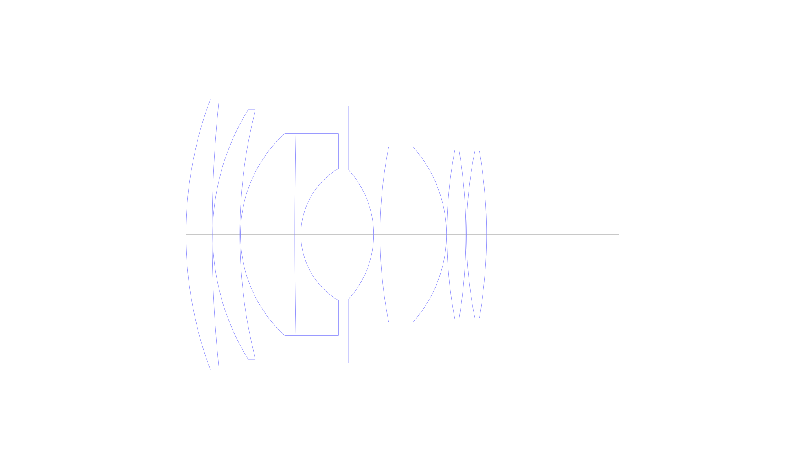
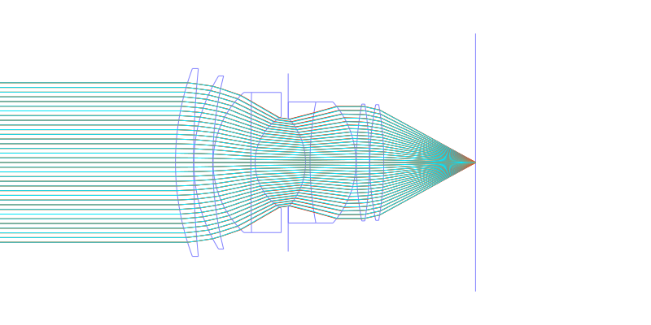
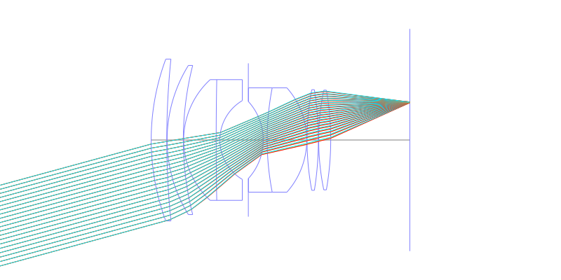
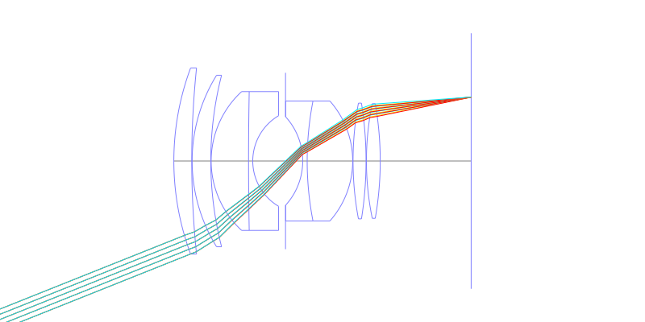
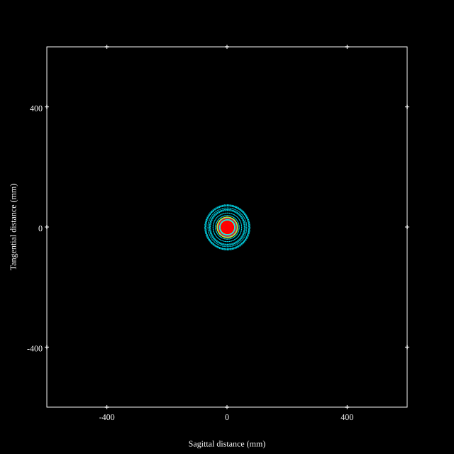
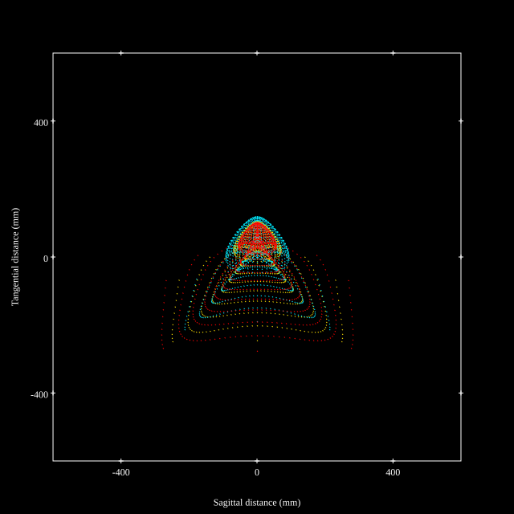
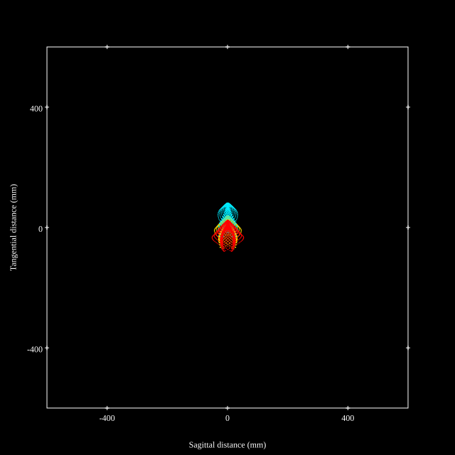
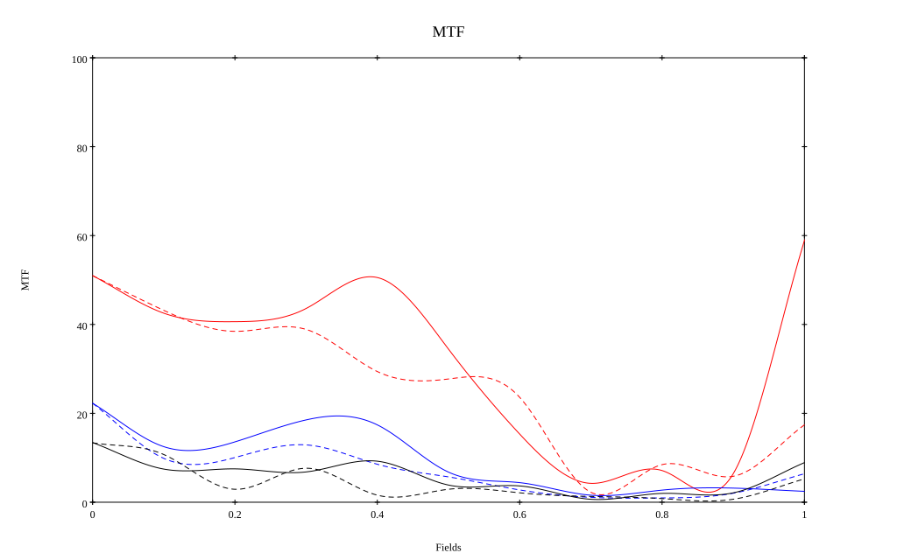
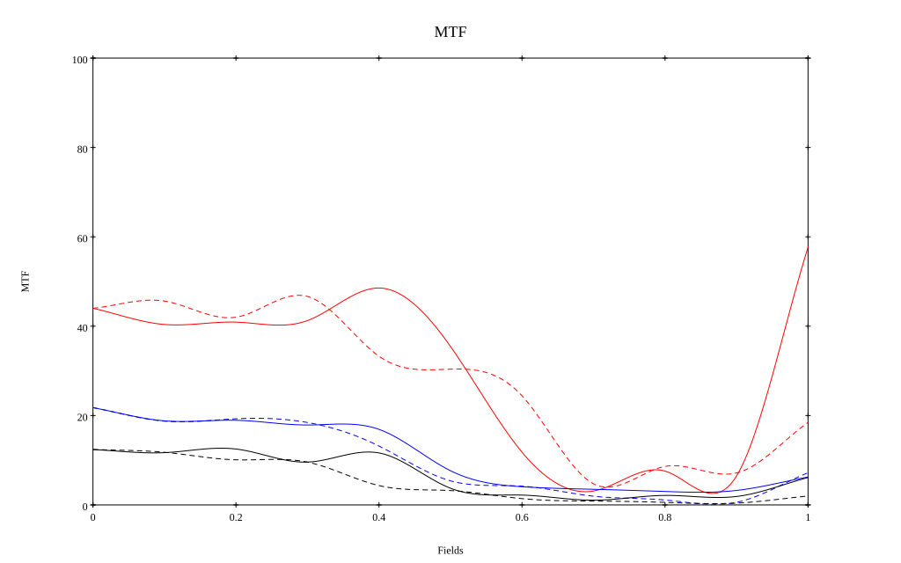

## Surface Data
Note that where glass types are shown the refractive index and abbe number is as per assigned glass type

| ID  | Radius | Thickness | Diameter | nd  | vd  | Glass Make | Glass |
| --- | ---    | ---       | ---      | --- | --- | ---        | ---   |
| 1 | 90.272 | 6.045 | 62.92 | 1.6751 | 32.3 |  |
| 2 | 307.56 | 0.127 | 62.92 |  |  |  |
| 3 | 55.066 | 6.298 | 57.99 | 1.6689 | 46.7 |  |
| 4 | 117.447 | 0.127 | 57.99 |  |  |  |
| 5 | 31.922 | 12.623 | 46.93 | 1.6913 | 53.8 |  |
| 6 | 1238.105 | 1.419 | 46.93 | 1.6751 | 32.3 |  |
| 7 | 17.815 | 11.063 | 30.64 |  |  |  |
| 8 | AS | 5.8 | 29.814 |  |  |  |
| 9 | -22.231 | 1.507 | 29.85 | 1.6992 | 30.2 |  |
| 10 | 106.139 | 15.356 | 40.57 | 1.6204 | 60.2 |  |
| 11 | -30.542 | 0.127 | 40.57 |  |  |  |
| 12 | 106.139 | 4.389 | 39.12 | 1.6913 | 53.8 |  |
| 13 | -123.915 | 0.127 | 39.12 |  |  |  |
| 14 | 96.3 | 4.664 | 38.76 | 1.6913 | 53.8 |  |
| 15 | -111.953 | 30.69 | 38.76 |  |  |  |
## Layouts

## Spot Diagrams

## Paraxial Parameters
| parameter | value |
| ---       | ---   |
| effective_focal_length |54.97
| back_focal_length | 30.787
| optical_invariant | 10.999
| object_distance | 1.0E10
| image_distance | 30.787
| power | 0.018
| pp1_H | 77.431
| ppk_H' | -24.183
| ffl_F | 22.461
| fno | 0.999
| enp_dist_P | 53.038
| enp_radius | 27.5
| exp_dist_P' | -67.939
| exp_radius | 49.439
| m | -0
| red | -1.819185540415856E8
| n_obj | 1
| n_img | 1
| img_ht | 21.986
| obj_ang | 21.8
| obj_na | 0
| img_na | -0.447|
## Spot Analysis
| Field | Spot Mean Radius | Spot Max Radius |
| ---   | ---              | ---             |
 | Field(x=0.0, y=0.0) | 32.546 | 75.117|
 | Field(x=0.0, y=0.1) | 52.264 | 205.992|
 | Field(x=0.0, y=0.2) | 62.134 | 304.951|
 | Field(x=0.0, y=0.3) | 63.758 | 351.906|
 | Field(x=0.0, y=0.4) | 68.421 | 288.882|
 | Field(x=0.0, y=0.5) | 81.332 | 310.995|
 | Field(x=0.0, y=0.6) | 94.52 | 326.24|
 | Field(x=0.0, y=0.7) | 110.12 | 387.202|
 | Field(x=0.0, y=0.8) | 119.762 | 423.034|
 | Field(x=0.0, y=0.9) | 110.222 | 363.73|
 | Field(x=0.0, y=1.0) | 37.001 | 82.459|
## Polychromatic Geometric MTF

* 10=red,30=blue,50=black cycles/mm
* Solid lines represent sagittal, dashed lines tangential
* To generate above, MTFs for wavelengths 587.5618(d), 486.1327(F), 656.2725(C) were calculated across 10 fields, and then averaged
## Polychromatic Geometric MTF (Weighted)

* 10=red,30=blue,50=black cycles/mm
* Solid lines represent sagittal, dashed lines tangential
* To generate above, MTFs for wavelengths 587.5618(d) wt(1.0), 656.2725(C) wt(0.475), 546.074(e) wt(0.98), 486.1327(F) wt(0.49), 435.8343(g) wt(0.15) were calculated across 10 fields, and then combined using weighted average
## Resources
* [OpticalBench Compatible Data File, tab delimited](./prescription.txt)
* [Zemax file](./US002701982_Example01.zmx)

Report / Zemax file generated using [Beam42](https://github.com/BeamFour/Beam42) on 2026-07-15
