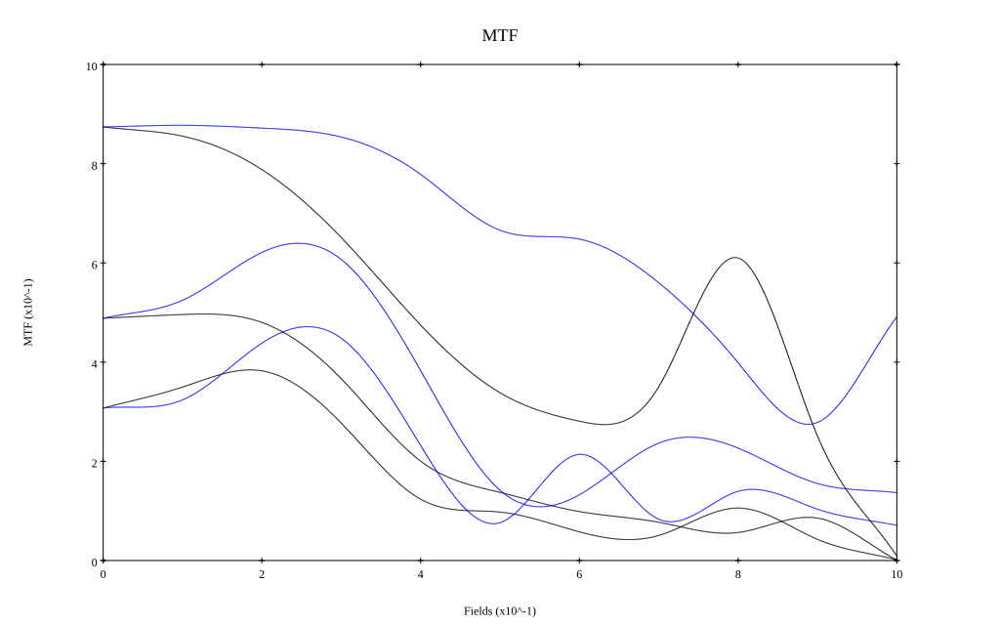
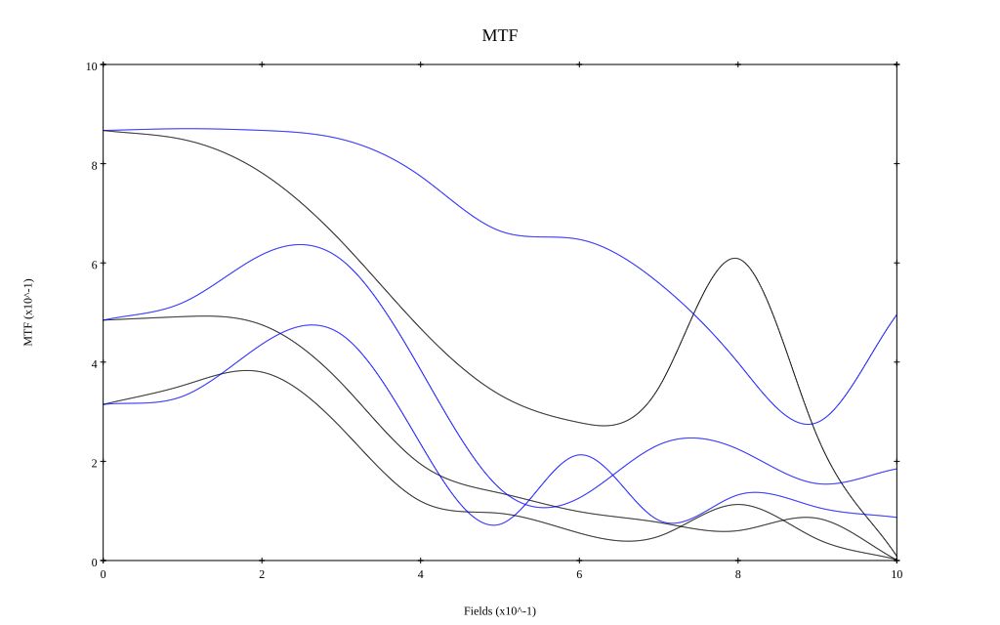

# Canon Serenar 28mm f3.5
## Patent Information
| Country | Patent Number | Example | Year of Application | Inventors | Organisation | Link |
| ---     | ---           | ---     | ---                 | ---       | ---          | ---  |
|US | US2645974 | EX 1 | 1951 | Ito Hiroshi | Canon Inc | [link](https://patents.google.com/patent/US2645974A/en) |
## Surface Data
Note that where glass types are shown the refractive index and abbe number is as per assigned glass type

| ID  | Radius | Thickness | Diameter | nd  | vd  | Glass Make | Glass |
| --- | ---    | ---       | ---      | --- | --- | ---        | ---   |
| 1 | 16.884 | 1.904 | 12.18 | 1.56384 | 60.67 | Ohara | S-BAL41 |
| 2 | 72.66 | 0.14 | 12.18 |  |  |  |
| 3 | 13.216 | 2.744 | 10.26 | 1.62374 | 47.01 | Hikari | J-BAF8 |
| 4 | -84.0 | 0.672 | 10.26 | 1.59551 | 39.24 | Ohara | S-TIM8 |
| 5 | 9.044 | 1.4 | 7.02 |  |  |  |
| 6 | AS | 1.4 | 6.239 |  |  |  |
| 7 | -9.268 | 0.476 | 8.08 | 1.57845 | 41.71 | Hoya | FL4 |
| 8 | 22.344 | 3.472 | 10.96 | 1.62041 | 60.29 | Ohara | S-BSM16 |
| 9 | -11.984 | 0.112 | 10.96 |  |  |  |
| 10 | 0.0 | 2.52 | 16.82 | 1.62041 | 60.29 | Ohara | S-BSM16 |
| 11 | -24.248 | 22.22 | 16.82 |  |  |  |
## Layouts

## Spot Diagrams

## Paraxial Parameters
| parameter | value |
| ---       | ---   |
| effective_focal_length |28.125
| back_focal_length | 22.397
| optical_invariant | 3.083
| object_distance | 1.0E10
| image_distance | 22.397
| power | 0.036
| pp1_H | 8.068
| ppk_H' | -5.727
| ffl_F | -20.057
| fno | 3.5
| enp_dist_P | 6.392
| enp_radius | 4.018
| exp_dist_P' | -7.333
| exp_radius | 4.273
| m | -0
| red | -3.5555708941833186E8
| n_obj | 1
| n_img | 1
| img_ht | 21.581
| obj_ang | 37.5
| obj_na | 0
| img_na | -0.141|
## Spot Analysis
| Field | Spot Mean Radius | Spot Max Radius |
| ---   | ---              | ---             |
 | Field(x=0.0, y=0.0) | 11.597 | 27.743|
 | Field(x=0.0, y=0.1) | 11.954 | 32.21|
 | Field(x=0.0, y=0.2) | 14.05 | 38.035|
 | Field(x=0.0, y=0.3) | 17.634 | 47.221|
 | Field(x=0.0, y=0.4) | 22.615 | 57.929|
 | Field(x=0.0, y=0.5) | 29.118 | 80.149|
 | Field(x=0.0, y=0.6) | 35.84 | 109.957|
 | Field(x=0.0, y=0.7) | 36.809 | 105.114|
 | Field(x=0.0, y=0.8) | 39.765 | 113.279|
 | Field(x=0.0, y=0.9) | 57.705 | 190.223|
 | Field(x=0.0, y=1.0) | 88.224 | 247.19|
## Polychromatic Geometric MTF

* 10,30,50 cycles/mm
* Black lines represent sagittal, blue tangential
* To generate above, MTFs for wavelengths 587.5618(d), 486.1327(F), 656.2725(C) were calculated across 10 fields, and then averaged
## Polychromatic Geometric MTF (Weighted)

* 10,30,50 cycles/mm
* Black lines represent sagittal, blue tangential
* To generate above, MTFs for wavelengths 587.5618(d) wt(1.0), 656.2725(C) wt(0.475), 546.074(e) wt(0.98), 486.1327(F) wt(0.49), 435.8343(g) wt(0.15) were calculated across 10 fields, and then combined using weighted average
## Resources
* [OpticalBench Compatible Data File, tab delimited](./US002645974_Example01.txt)
* [Zemax file](./US002645974_Example01.zmx)
