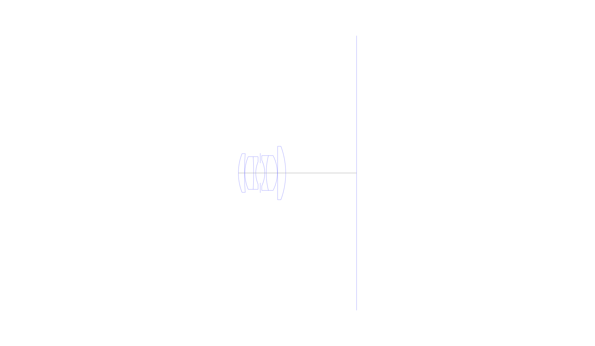
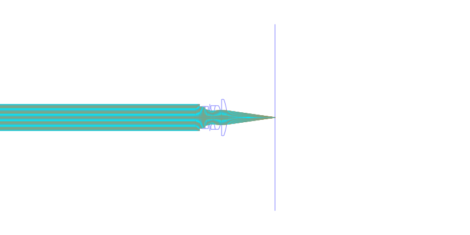
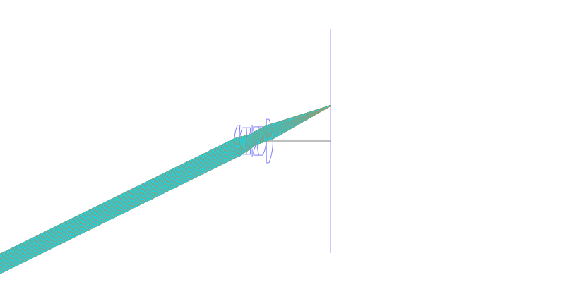
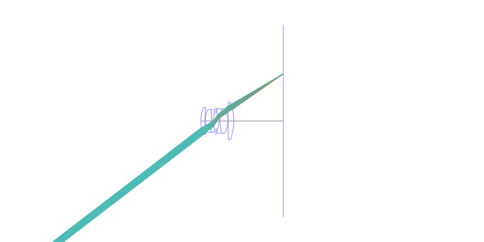
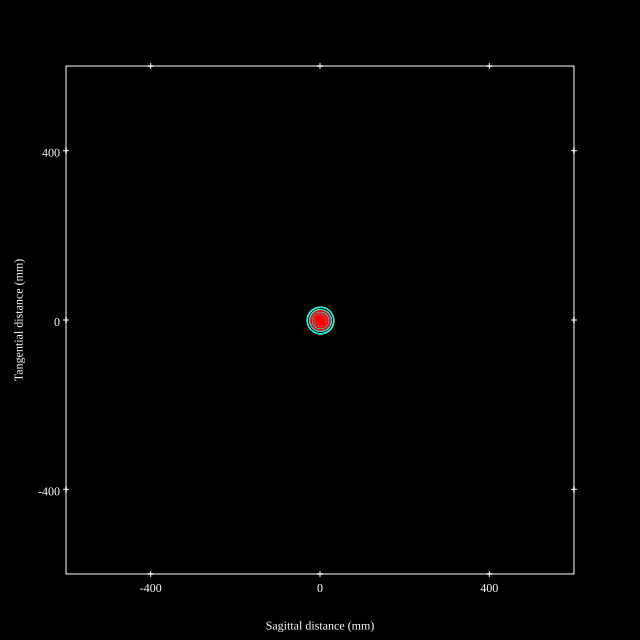
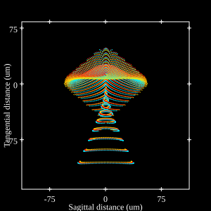
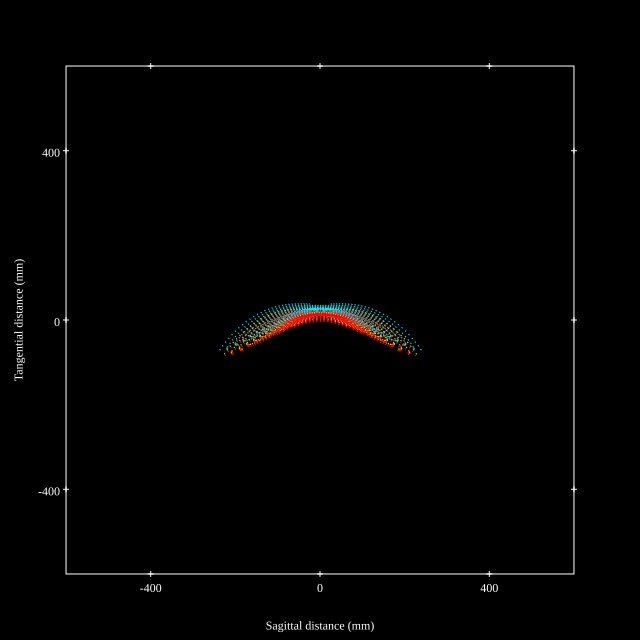

## Surface Data
Note that where glass types are shown the refractive index and abbe number is as per assigned glass type

| ID  | Radius | Thickness | Diameter | nd  | vd  | Glass Make | Glass |
| --- | ---    | ---       | ---      | --- | --- | ---        | ---   |
| 1 | 16.884 | 1.904 | 12.18 | 1.56384 | 60.67 | Ohara | S-BAL41 |
| 2 | 72.66 | 0.14 | 12.18 |  |  |  |
| 3 | 13.216 | 2.744 | 10.26 | 1.62374 | 47.01 | Hikari | J-BAF8 |
| 4 | -84.0 | 0.672 | 10.26 | 1.59551 | 39.24 | Ohara | S-TIM8 |
| 5 | 9.044 | 1.4 | 7.02 |  |  |  |
| 6 | AS | 1.4 | 6.239 |  |  |  |
| 7 | -9.268 | 0.476 | 8.08 | 1.57845 | 41.71 | Hoya | FL4 |
| 8 | 22.344 | 3.472 | 10.96 | 1.62041 | 60.29 | Ohara | S-BSM16 |
| 9 | -11.984 | 0.112 | 10.96 |  |  |  |
| 10 | 0.0 | 2.52 | 16.82 | 1.62041 | 60.29 | Ohara | S-BSM16 |
| 11 | -24.248 | 22.22 | 16.82 |  |  |  |
## Layouts

## Spot Diagrams

## Paraxial Parameters
| parameter | value |
| ---       | ---   |
| effective_focal_length |28.125
| back_focal_length | 22.397
| optical_invariant | 3.083
| object_distance | 1.0E10
| image_distance | 22.22
| power | 0.036
| pp1_H | 8.068
| ppk_H' | 5.727
| ffl_F | -20.057
| fno | 3.5
| enp_dist_P | 6.392
| enp_radius | 4.018
| exp_dist_P' | -7.51
| exp_radius | 4.273
| m | 0.006
| red | -3.555570894183319E8
| n_obj | 1
| n_img | 1
| img_ht | 21.581
| obj_ang | 37.5
| obj_na | 0
| img_na | -0.141|
## Spot Analysis
| Field | Spot Mean Radius | Spot Max Radius |
| ---   | ---              | ---             |
 | 0.0 | 10.207 | 24.375|
 | 0.7 | 36.852 | 112.659|
 | 1.0 | 119.804 | 350.1|
## Resources
* [OpticalBench Compatible Data File, tab delimited](./US002645974_Example01.txt)
* [Zemax file](./US002645974_Example01.zmx)
