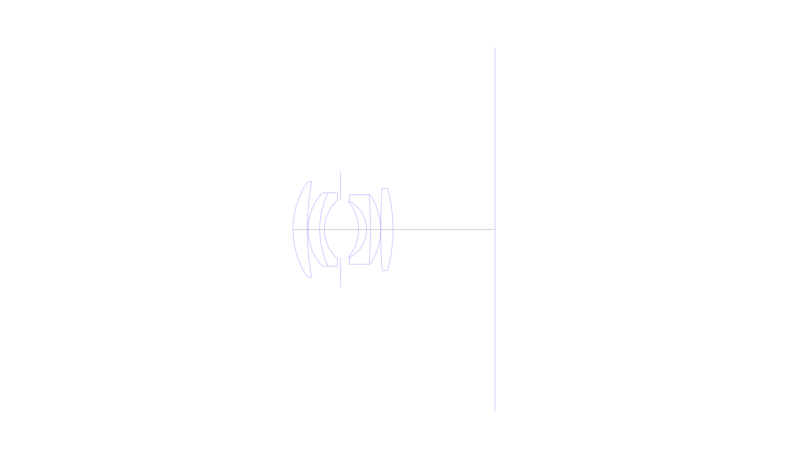
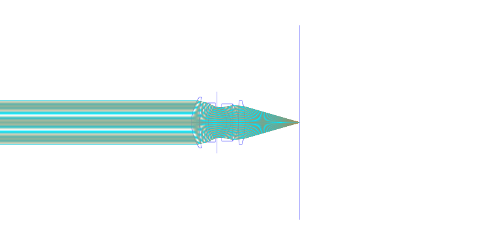
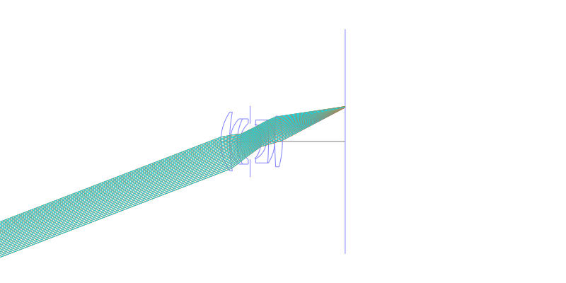
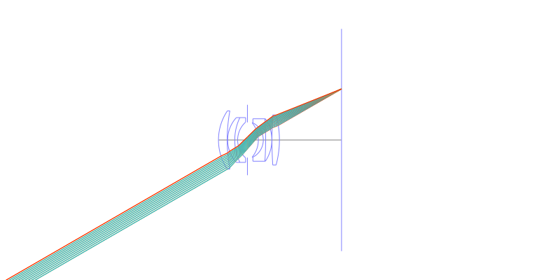
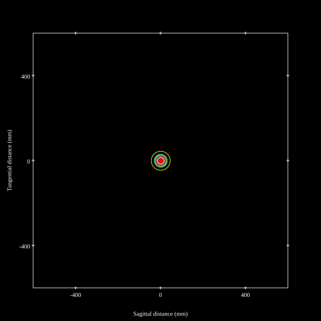
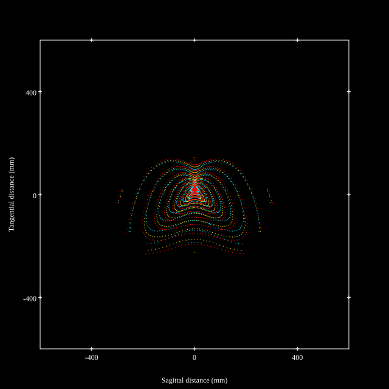
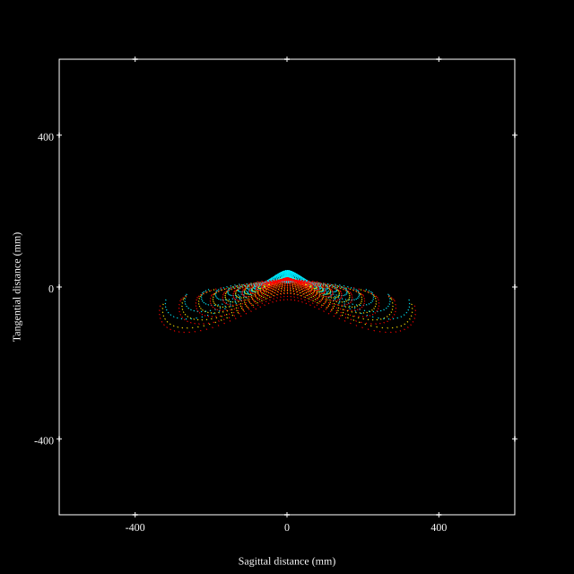
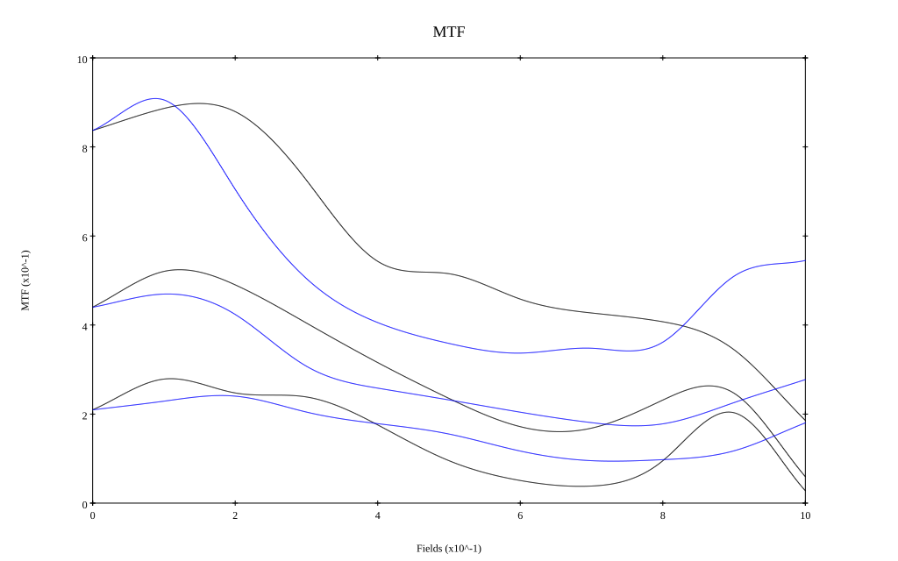
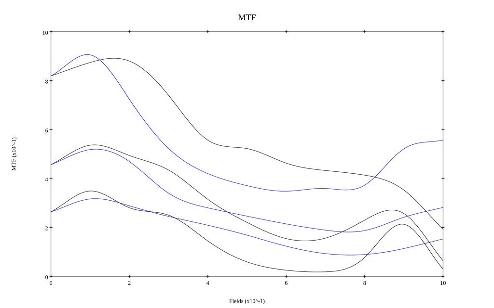

# Canon 35mm f1.8
## Patent Information
| Country | Patent Number | Example | Year of Application | Inventors | Organisation | Link |
| ---     | ---           | ---     | ---                 | ---       | ---          | ---  |
|US | US2854890 | EX 1 | 1956 | Mukai Jiro | Canon Inc | [link](https://patents.google.com/patent/US2854890A/en) |
## Surface Data
Note that where glass types are shown the refractive index and abbe number is as per assigned glass type

| ID  | Radius | Thickness | Diameter | nd  | vd  | Glass Make | Glass |
| --- | ---    | ---       | ---      | --- | --- | ---        | ---   |
| 1 | 20.265 | 3.395 | 22.65 | 1.65844 | 50.88 | Ohara | S-BSM25 |
| 2 | 62.545 | 0.175 | 22.65 |  |  |  |
| 3 | 12.915 | 2.765 | 17.41 | 1.65844 | 50.88 | Ohara | S-BSM25 |
| 4 | 20.055 | 1.12 | 17.41 | 1.69895 | 30.13 | Ohara | S-TIM35 |
| 5 | 9.345 | 3.803 | 13.91 |  |  |  |
| 6 | AS | 4.247 | 13.69 |  |  |  |
| 7 | -10.395 | 1.925 | 13.35 | 1.62041 | 60.29 | Ohara | S-BSM16 |
| 8 | -7.525 | 0.91 | 13.35 | 1.57501 | 41.51 | Ohara | S-TIL27 |
| 9 | -115.465 | 2.415 | 16.49 | 1.6779 | 55.34 | Ohara | S-LAL12 |
| 10 | -14.77 | 0.035 | 16.49 |  |  |  |
| 11 | 148.75 | 2.905 | 19.49 | 1.6935 | 53.21 | Ohara | S-LAL13 |
| 12 | -36.995 | 24.148 | 19.49 |  |  |  |
## Layouts

## Spot Diagrams

## Paraxial Parameters
| parameter | value |
| ---       | ---   |
| effective_focal_length |35.035
| back_focal_length | 24.265
| optical_invariant | 5.612
| object_distance | 1.0E10
| image_distance | 24.265
| power | 0.029
| pp1_H | 16.655
| ppk_H' | -10.77
| ffl_F | -18.379
| fno | 1.802
| enp_dist_P | 12.654
| enp_radius | 9.72
| exp_dist_P' | -15.171
| exp_radius | 10.973
| m | -0
| red | -2.854319836534197E8
| n_obj | 1
| n_img | 1
| img_ht | 20.227
| obj_ang | 30
| obj_na | 0
| img_na | -0.267|
## Spot Analysis
| Field | Spot Mean Radius | Spot Max Radius |
| ---   | ---              | ---             |
 | Field(x=0.0, y=0.0) | 13.848 | 44.491|
 | Field(x=0.0, y=0.1) | 9.85 | 40.833|
 | Field(x=0.0, y=0.2) | 19.18 | 91.712|
 | Field(x=0.0, y=0.3) | 39.723 | 174.261|
 | Field(x=0.0, y=0.4) | 60.396 | 237.254|
 | Field(x=0.0, y=0.5) | 73.037 | 262.971|
 | Field(x=0.0, y=0.6) | 86.923 | 271.314|
 | Field(x=0.0, y=0.7) | 95.169 | 305.139|
 | Field(x=0.0, y=0.8) | 107.712 | 434.312|
 | Field(x=0.0, y=0.9) | 129.121 | 542.278|
 | Field(x=0.0, y=1.0) | 100.289 | 345.266|
## Polychromatic Geometric MTF

* 10=red,30=blue,50=black cycles/mm
* Solid lines represent sagittal, dashed lines tangential
* To generate above, MTFs for wavelengths 587.5618(d), 486.1327(F), 656.2725(C) were calculated across 10 fields, and then averaged
## Polychromatic Geometric MTF (Weighted)

* 10=red,30=blue,50=black cycles/mm
* Solid lines represent sagittal, dashed lines tangential
* To generate above, MTFs for wavelengths 587.5618(d) wt(1.0), 656.2725(C) wt(0.475), 546.074(e) wt(0.98), 486.1327(F) wt(0.49), 435.8343(g) wt(0.15) were calculated across 10 fields, and then combined using weighted average
## Resources
* [OpticalBench Compatible Data File, tab delimited](./prescription.txt)
* [Zemax file](./US002854890_Example01P.zmx)

Report / Zemax file generated using [Beam42](https://github.com/BeamFour/Beam42) on 2026-07-18
