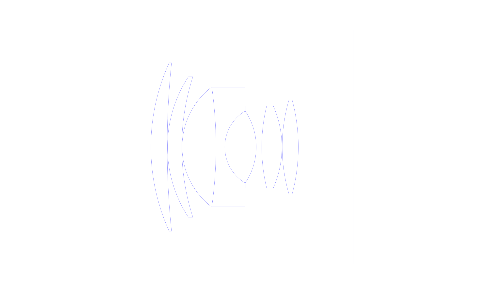
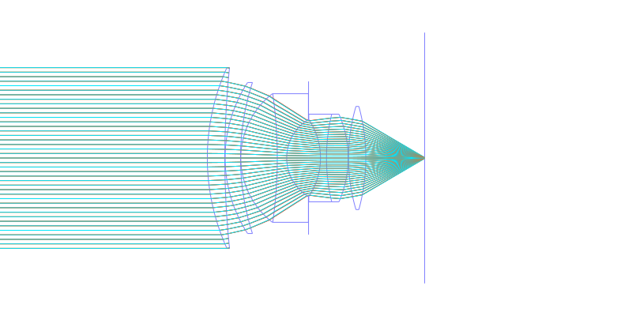
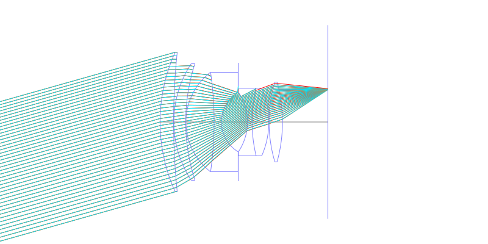
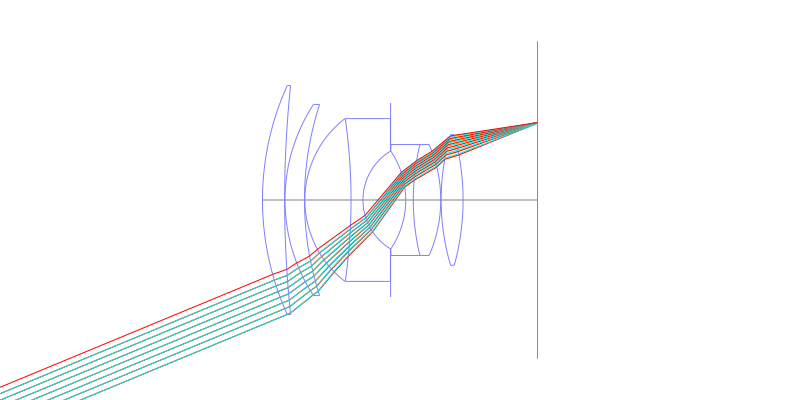
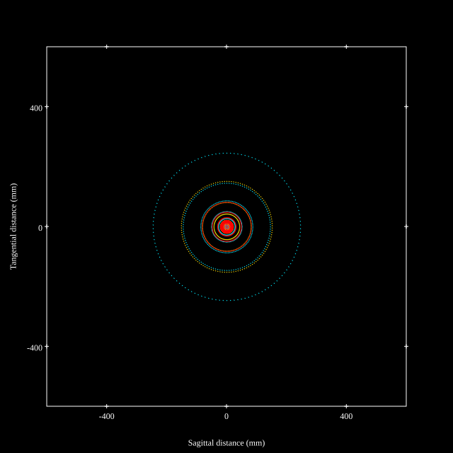
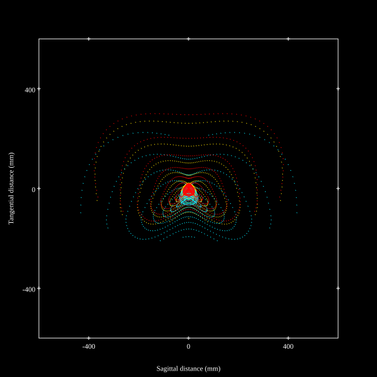
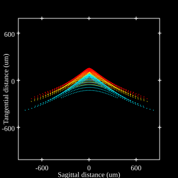
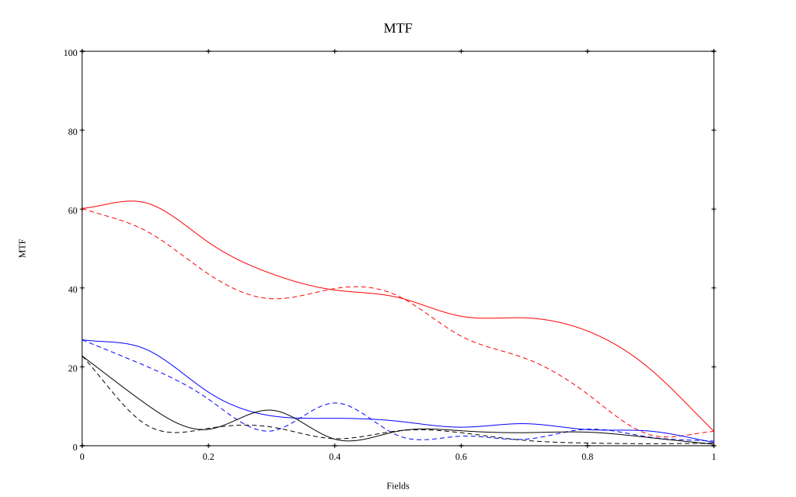
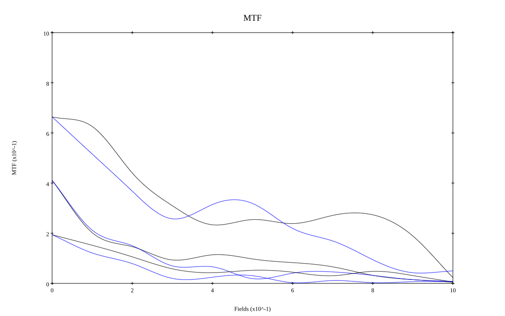

# Canon 50mm f0.95
## Patent Information
| Country | Patent Number | Example | Year of Application | Inventors | Organisation | Link |
| ---     | ---           | ---     | ---                 | ---       | ---          | ---  |
|JP | JP 1964-010178 | EX 1 | 1964 | Ito Hiroshi | Canon Inc | [link](https://www.j-platpat.inpit.go.jp/c1801/PU/JP-S39-010178/12/en) |
## Surface Data
Note that where glass types are shown the refractive index and abbe number is as per assigned glass type

| ID  | Radius | Thickness | Diameter | nd  | vd  | Glass Make | Glass |
| --- | ---    | ---       | ---      | --- | --- | ---        | ---   |
| 1 | 75.3876 | 6.0372 | 62.44 | 1.79952 | 42.23 | Ohara | S-LAH52 |
| 2 | 300.1572 | 0.1032 | 62.44 |  |  |  |
| 3 | 47.6268 | 5.3148 | 52.12 | 1.67003 | 47.2 | Hoya | BAF10 |
| 4 | 84.624 | 0.1032 | 52.12 |  |  |  |
| 5 | 28.0188 | 12.5904 | 44.38 | 1.6935 | 53.21 | Ohara | S-LAL13 |
| 6 | -157.0188 | 3.2508 | 44.38 | 1.7552 | 27.58 | Schott | SF4 |
| 7 | 15.5832 | 7.5336 | 26.63 |  |  |  |
| 8 | AS | 4.128 | 26.44 |  |  |  |
| 9 | -23.8392 | 2.064 | 26.63 | 1.5927 | 35.31 | Ohara | S-FTM16 |
| 10 | 64.4484 | 7.482 | 30.24 | 1.7859 | 44.2 | Ohara | S-LAH51 |
| 11 | -37.5648 | 0.1032 | 30.24 |  |  |  |
| 12 | 62.5908 | 5.9856 | 35.6 | 1.7859 | 44.2 | Ohara | S-LAH51 |
| 13 | -67.2348 | 20.317 | 35.6 |  |  |  |
## Layouts

## Spot Diagrams

## Paraxial Parameters
| parameter | value |
| ---       | ---   |
| effective_focal_length |51.638
| back_focal_length | 20.375
| optical_invariant | 11.258
| object_distance | 1.0E10
| image_distance | 20.375
| power | 0.019
| pp1_H | 41.975
| ppk_H' | -31.264
| ffl_F | -9.663
| fno | 0.95
| enp_dist_P | 54.424
| enp_radius | 27.178
| exp_dist_P' | -21.176
| exp_radius | 21.899
| m | -0
| red | -1.9365435743009177E8
| n_obj | 1
| n_img | 1
| img_ht | 21.389
| obj_ang | 22.5
| obj_na | 0
| img_na | -0.466|
## Spot Analysis
| Field | Spot Mean Radius | Spot Max Radius |
| ---   | ---              | ---             |
 | Field(x=0.0, y=0.0) | 59.652 | 234.97|
 | Field(x=0.0, y=0.1) | 93.926 | 520.236|
 | Field(x=0.0, y=0.2) | 138.85 | 701.69|
 | Field(x=0.0, y=0.3) | 166.874 | 774.952|
 | Field(x=0.0, y=0.4) | 178.24 | 772.833|
 | Field(x=0.0, y=0.5) | 166.715 | 675.356|
 | Field(x=0.0, y=0.6) | 141.875 | 530.553|
 | Field(x=0.0, y=0.7) | 120.704 | 435.888|
 | Field(x=0.0, y=0.8) | 127.348 | 527.442|
 | Field(x=0.0, y=0.9) | 158.908 | 603.457|
 | Field(x=0.0, y=1.0) | 168.149 | 514.335|
## Polychromatic Geometric MTF

* 10,30,50 cycles/mm
* Black lines represent sagittal, blue tangential
* To generate above, MTFs for wavelengths 587.5618(d), 486.1327(F), 656.2725(C) were calculated across 10 fields, and then averaged
## Polychromatic Geometric MTF (Weighted)

* 10,30,50 cycles/mm
* Black lines represent sagittal, blue tangential
* To generate above, MTFs for wavelengths 587.5618(d) wt(1.0), 656.2725(C) wt(0.475), 546.074(e) wt(0.98), 486.1327(F) wt(0.49), 435.8343(g) wt(0.15) were calculated across 10 fields, and then combined using weighted average
## Resources
* [OpticalBench Compatible Data File, tab delimited](./JP1964-010178_Example01.txt)
* [Zemax file](./JP1964-010178_Example01.zmx)
