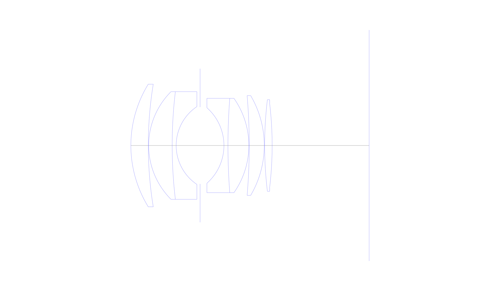
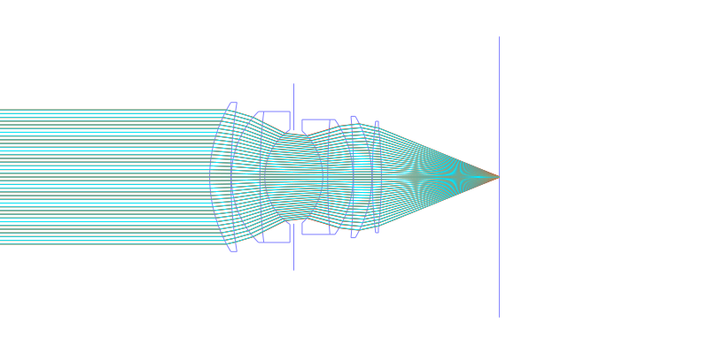
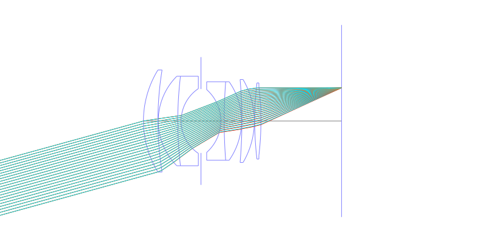
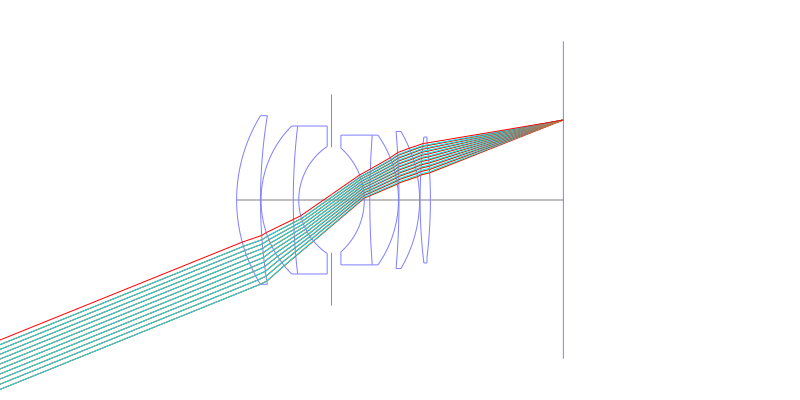
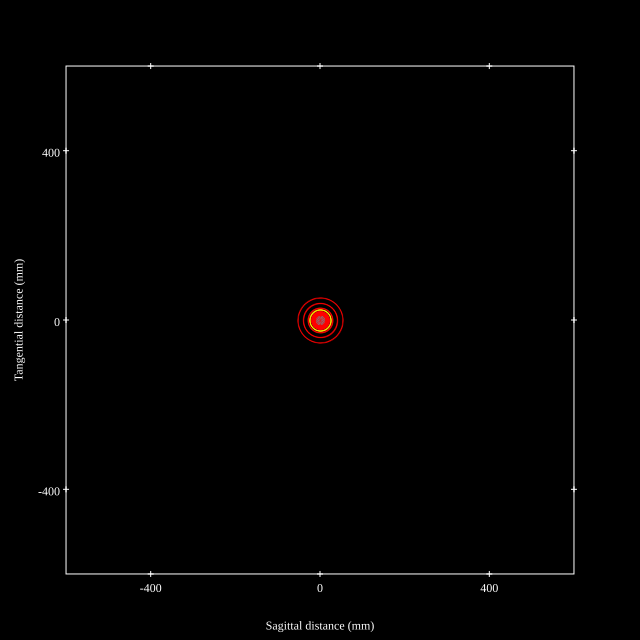
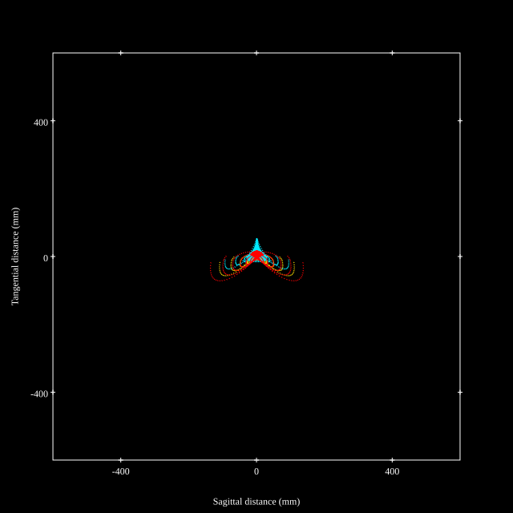
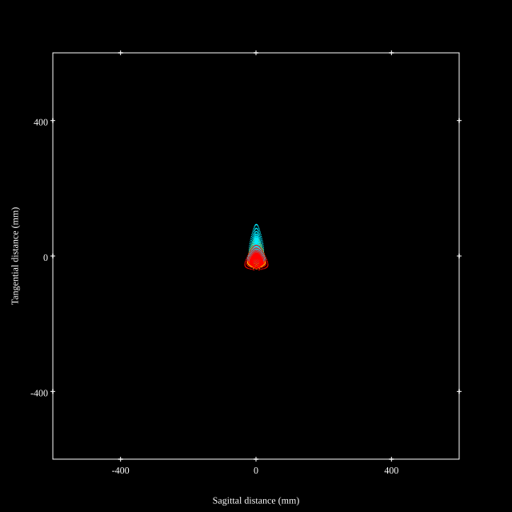
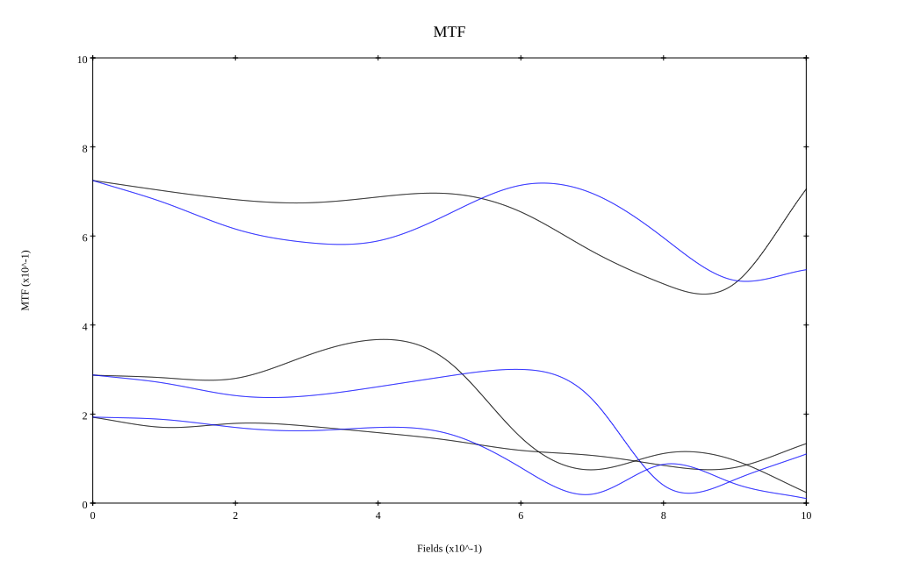
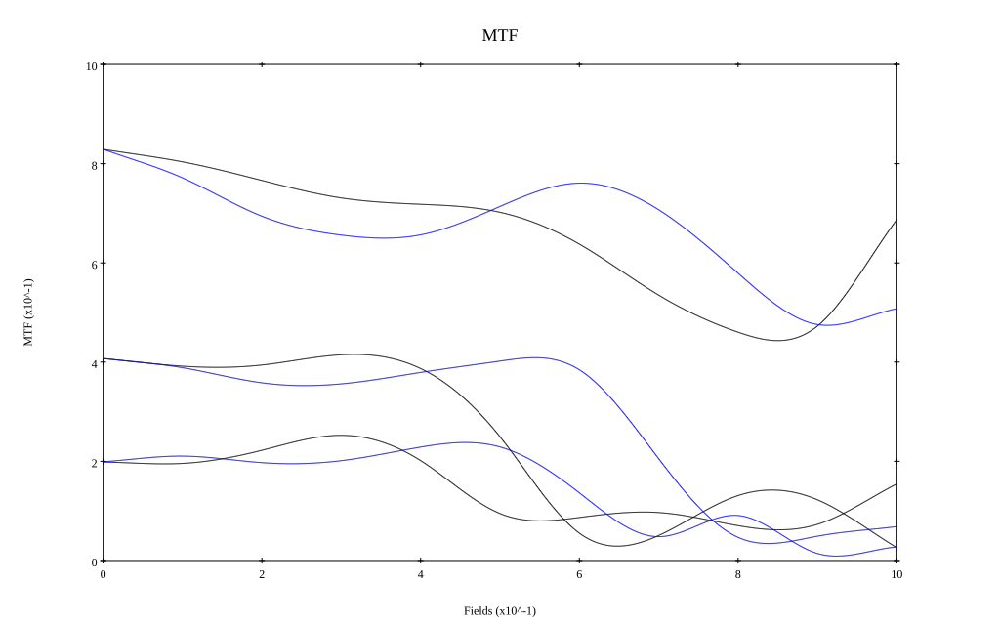

## Surface Data
Note that where glass types are shown the refractive index and abbe number is as per assigned glass type

| ID  | Radius | Thickness | Diameter | nd  | vd  | Glass Make | Glass |
| --- | ---    | ---       | ---      | --- | --- | ---        | ---   |
| 1 | 43.5259 | 6.501 | 45.88 | 1.8061 | 40.7 |  |
| 2 | 142.4533 | 0.149 | 45.88 |  |  |  |
| 3 | 28.4999 | 8.767 | 40.27 | 1.72342 | 38.0 |  |
| 4 | 169.9924 | 1.496 | 40.27 | 1.74 | 28.2 |  |
| 5 | 17.5764 | 8.915 | 29.12 |  |  |  |
| 6 | AS | 8.916 | 28.747 |  |  |  |
| 7 | -18.8524 | 1.496 | 28.24 | 1.7552 | 27.5 |  |
| 8 | 232.4894 | 7.799 | 35.32 | 1.713 | 53.9 |  |
| 9 | -30.7417 | 0.149 | 35.32 |  |  |  |
| 10 | -218.13 | 5.599 | 37.32 | 1.8061 | 40.7 |  |
| 11 | -36.8616 | 0.149 | 37.32 |  |  |  |
| 12 | 144.1237 | 2.8 | 34.27 | 1.6779 | 50.6 |  |
| 13 | -131.9538 | 36.2 | 31.15 |  |  |  |
## Aspherical Data
| ID  | k   | P1  | P2  | P3  | P3 | P5 | P6 | P7 | P8 | P9 | P10 |
| --- | --- | --- | --- | --- | --- | --- | --- | --- | --- | --- | --- |
| 1 | 0.0 | 0.0 | -2.4360631E-7 | 4.054964E-10 | -8.6353099E-13 | 6.9506519E-16 | 0.0 | 0.0 | 0.0 | 0.0 | 0.0 |
## Layouts

## Spot Diagrams

## Paraxial Parameters
| parameter | value |
| ---       | ---   |
| effective_focal_length |54.863
| back_focal_length | 36.32
| optical_invariant | 9.236
| object_distance | 1.0E10
| image_distance | 36.32
| power | 0.018
| pp1_H | 52.137
| ppk_H' | -18.543
| ffl_F | -2.726
| fno | 1.2
| enp_dist_P | 32.265
| enp_radius | 22.86
| exp_dist_P' | -49.581
| exp_radius | 35.842
| m | -0
| red | -1.822728546828516E8
| n_obj | 1
| n_img | 1
| img_ht | 22.166
| obj_ang | 22
| obj_na | 0
| img_na | -0.385|
## Spot Analysis
| Field | Spot Mean Radius | Spot Max Radius |
| ---   | ---              | ---             |
 | Field(x=0.0, y=0.0) | 17.273 | 53.053|
 | Field(x=0.0, y=0.1) | 21.442 | 80.297|
 | Field(x=0.0, y=0.2) | 26.972 | 122.237|
 | Field(x=0.0, y=0.3) | 31.299 | 137.968|
 | Field(x=0.0, y=0.4) | 32.69 | 133.837|
 | Field(x=0.0, y=0.5) | 30.606 | 138.982|
 | Field(x=0.0, y=0.6) | 29.689 | 141.868|
 | Field(x=0.0, y=0.7) | 29.761 | 139.947|
 | Field(x=0.0, y=0.8) | 29.664 | 124.043|
 | Field(x=0.0, y=0.9) | 27.72 | 90.796|
 | Field(x=0.0, y=1.0) | 23.757 | 94.835|
## Polychromatic Geometric MTF

* 10,30,50 cycles/mm
* Black lines represent sagittal, blue tangential
* To generate above, MTFs for wavelengths 587.5618(d), 486.1327(F), 656.2725(C) were calculated across 10 fields, and then averaged
## Polychromatic Geometric MTF (Weighted)

* 10,30,50 cycles/mm
* Black lines represent sagittal, blue tangential
* To generate above, MTFs for wavelengths 587.5618(d) wt(1.0), 656.2725(C) wt(0.475), 546.074(e) wt(0.98), 486.1327(F) wt(0.49), 435.8343(g) wt(0.15) were calculated across 10 fields, and then combined using weighted average
## Resources
* [OpticalBench Compatible Data File, tab delimited](./JP1972-019386_Example01.txt)
* [Zemax file](./JP1972-019386_Example01.zmx)
