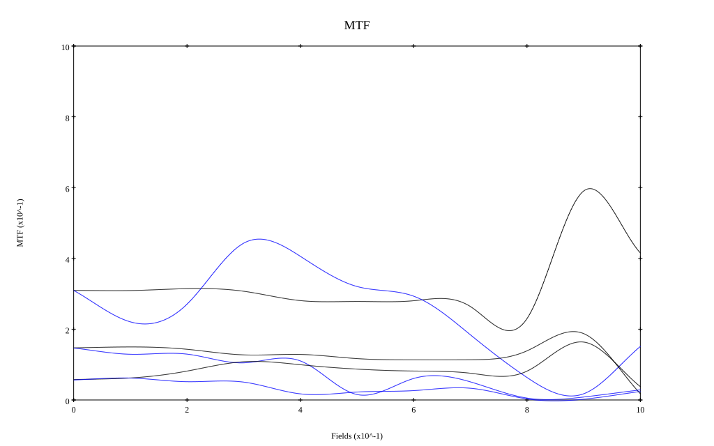

## Surface Data
Note that where glass types are shown the refractive index and abbe number is as per assigned glass type

| ID  | Radius | Thickness | Diameter | nd  | vd  | Glass Make | Glass |
| --- | ---    | ---       | ---      | --- | --- | ---        | ---   |
| 1 | 29.0 | 4.75 | 30.6 | 1.62041 | 60.29 | Ohara | S-BSM16 |
| 2 | 190.0 | 0.25 | 30.6 |  |  |  |
| 3 | 17.85 | 7.25 | 26.16 | 1.6261 | 39.1 |  |
| 4 | -105.0 | 2.2 | 26.16 | 1.74 | 28.3 | Ohara | S-TIH3 |
| 5 | 12.05 | 4.4 | 17.63 |  |  |  |
| 6 | AS | 2.2 | 17.549 |  |  |  |
| 7 | -28.125 | 1.75 | 17.51 | 1.5014 | 56.5 |  |
| 8 | 21.9 | 8.25 | 23.06 | 1.63854 | 55.38 | Ohara | S-BSM18 |
| 9 | -40.0 | 0.15 | 23.06 |  |  |  |
| 10 | 85.0 | 3.5 | 25.0 | 1.63854 | 55.38 | Ohara | S-BSM18 |
| 11 | -62.85 | 22.626 | 25.0 |  |  |  |
## Layouts

## Spot Diagrams

## Paraxial Parameters
| parameter | value |
| ---       | ---   |
| effective_focal_length |44.859
| back_focal_length | 22.819
| optical_invariant | 6.212
| object_distance | 1.0E10
| image_distance | 22.819
| power | 0.022
| pp1_H | 15.696
| ppk_H' | -22.04
| ffl_F | -29.163
| fno | 1.533
| enp_dist_P | 24.542
| enp_radius | 14.634
| exp_dist_P' | -14.458
| exp_radius | 12.224
| m | -0
| red | -2.2292179215701133E8
| n_obj | 1
| n_img | 1
| img_ht | 19.041
| obj_ang | 23
| obj_na | 0
| img_na | -0.31|
## Spot Analysis
| Field | Spot Mean Radius | Spot Max Radius |
| ---   | ---              | ---             |
 | Field(x=0.0, y=0.0) | 70.63 | 112.001|
 | Field(x=0.0, y=0.1) | 68.472 | 128.634|
 | Field(x=0.0, y=0.2) | 64.623 | 132.625|
 | Field(x=0.0, y=0.3) | 62.046 | 147.858|
 | Field(x=0.0, y=0.4) | 69.359 | 266.441|
 | Field(x=0.0, y=0.5) | 89.668 | 414.881|
 | Field(x=0.0, y=0.6) | 113.177 | 546.341|
 | Field(x=0.0, y=0.7) | 101.8 | 418.904|
 | Field(x=0.0, y=0.8) | 80.067 | 250.046|
 | Field(x=0.0, y=0.9) | 58.344 | 161.498|
 | Field(x=0.0, y=1.0) | 49.006 | 134.919|
## Polychromatic Geometric MTF

* 10=red,30=blue,50=black cycles/mm
* Solid lines represent sagittal, dashed lines tangential
* To generate above, MTFs for wavelengths 587.5618(d), 486.1327(F), 656.2725(C) were calculated across 10 fields, and then averaged
## Polychromatic Geometric MTF (Weighted)

* 10=red,30=blue,50=black cycles/mm
* Solid lines represent sagittal, dashed lines tangential
* To generate above, MTFs for wavelengths 587.5618(d) wt(1.0), 656.2725(C) wt(0.475), 546.074(e) wt(0.98), 486.1327(F) wt(0.49), 435.8343(g) wt(0.15) were calculated across 10 fields, and then combined using weighted average
## Resources
* [OpticalBench Compatible Data File, tab delimited](./prescription.txt)
* [Zemax file](./US002681594_Example01.zmx)

Report / Zemax file generated using [Beam42](https://github.com/BeamFour/Beam42) on 2026-07-18
