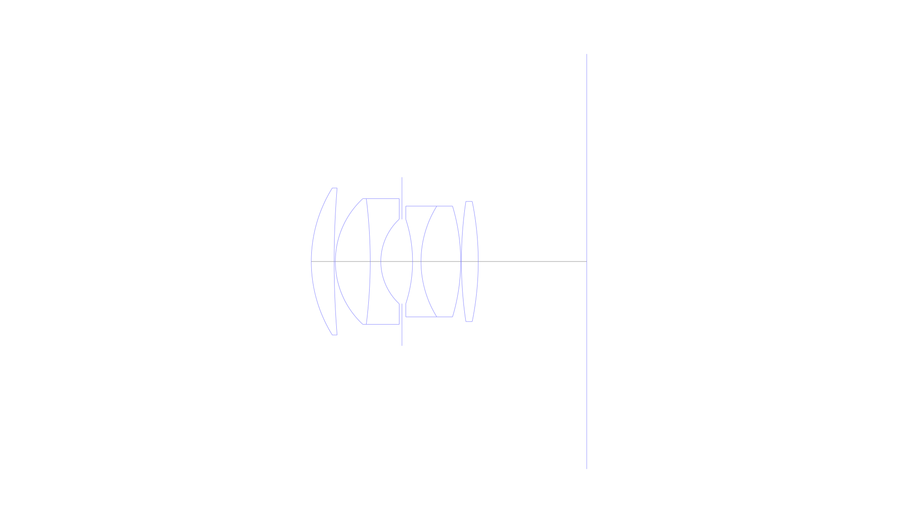
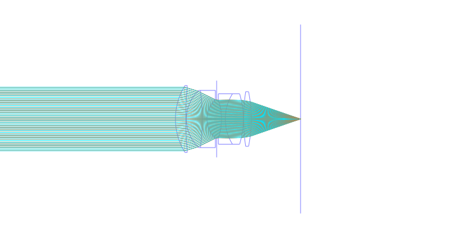
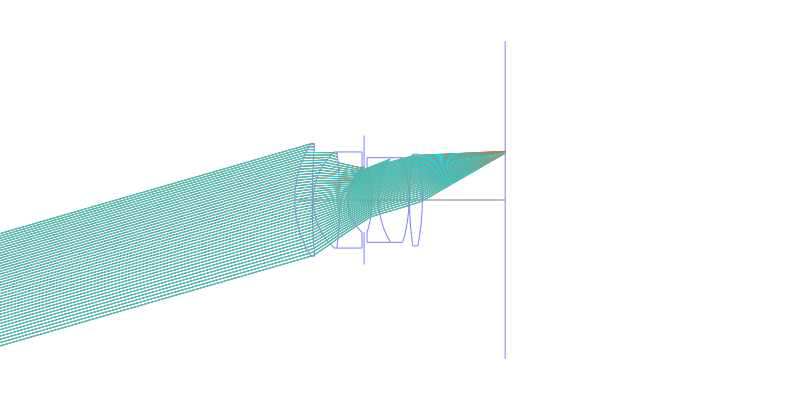
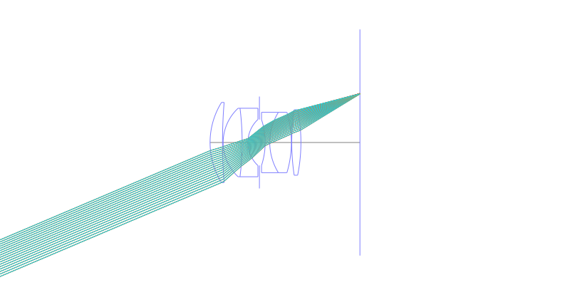
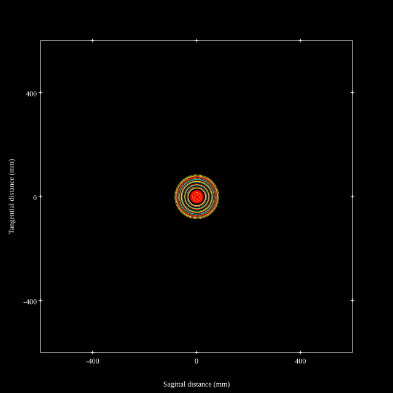
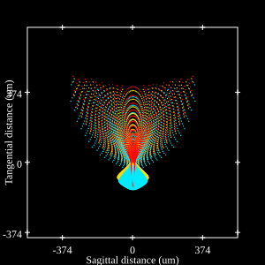
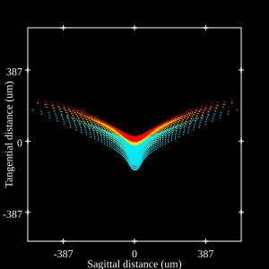
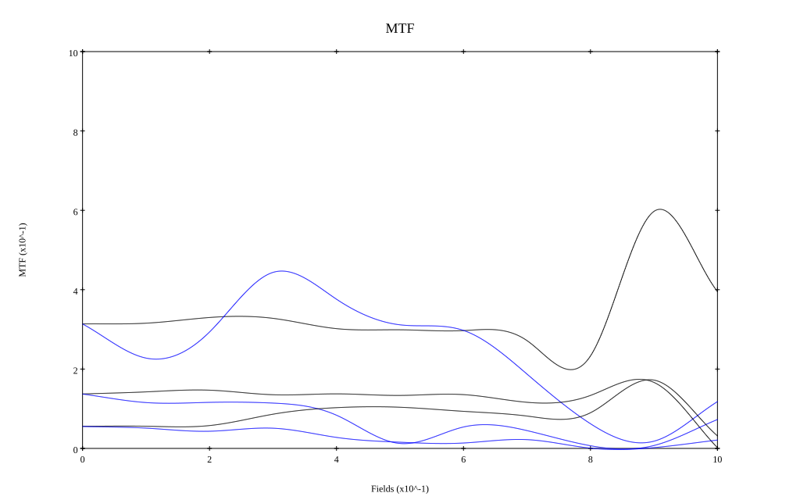

## Surface Data
Note that where glass types are shown the refractive index and abbe number is as per assigned glass type

| ID  | Radius | Thickness | Diameter | nd  | vd  | Glass Make | Glass |
| --- | ---    | ---       | ---      | --- | --- | ---        | ---   |
| 1 | 29.0 | 4.75 | 30.6 | 1.6204 | 60.3 |  |
| 2 | 190.0 | 0.25 | 30.6 |  |  |  |
| 3 | 17.85 | 7.25 | 26.16 | 1.6261 | 39.1 |  |
| 4 | -105.0 | 2.2 | 26.16 | 1.74 | 28.2 |  |
| 5 | 12.05 | 4.4 | 17.63 |  |  |  |
| 6 | AS | 2.2 | 17.549 |  |  |  |
| 7 | -28.125 | 1.75 | 17.51 | 1.5014 | 56.5 |  |
| 8 | 21.9 | 8.25 | 23.06 | 1.6385 | 55.5 |  |
| 9 | -40.0 | 0.15 | 23.06 |  |  |  |
| 10 | 85.0 | 3.5 | 25.0 | 1.6385 | 55.5 |  |
| 11 | -62.85 | 22.54 | 25.0 |  |  |  |
## Layouts

## Spot Diagrams

## Paraxial Parameters
| parameter | value |
| ---       | ---   |
| effective_focal_length |44.863
| back_focal_length | 22.822
| optical_invariant | 5.29
| object_distance | 1.0E10
| image_distance | 22.822
| power | 0.022
| pp1_H | 15.694
| ppk_H' | -22.041
| ffl_F | -29.169
| fno | 1.8
| enp_dist_P | 24.542
| enp_radius | 12.462
| exp_dist_P' | -14.369
| exp_radius | 10.409
| m | -0
| red | -2.2290009240350625E8
| n_obj | 1
| n_img | 1
| img_ht | 19.043
| obj_ang | 23
| obj_na | 0
| img_na | -0.268|
## Spot Analysis
| Field | Spot Mean Radius | Spot Max Radius |
| ---   | ---              | ---             |
 | Field(x=0.0, y=0.0) | 51.246 | 84.142|
 | Field(x=0.0, y=0.1) | 49.793 | 98.015|
 | Field(x=0.0, y=0.2) | 48.471 | 100.542|
 | Field(x=0.0, y=0.3) | 50.374 | 174.304|
 | Field(x=0.0, y=0.4) | 63.901 | 296.249|
 | Field(x=0.0, y=0.5) | 91.763 | 442.903|
 | Field(x=0.0, y=0.6) | 119.276 | 567.963|
 | Field(x=0.0, y=0.7) | 108.624 | 441.375|
 | Field(x=0.0, y=0.8) | 88.124 | 270.688|
 | Field(x=0.0, y=0.9) | 68.221 | 180.566|
 | Field(x=0.0, y=1.0) | 60.22 | 153.784|
## Geometric MTF

* 10,30,50 cycles/mm
* Black lines represent sagittal, blue tangential
## Resources
* [OpticalBench Compatible Data File, tab delimited](./US002681594_Example01.txt)
* [Zemax file](./US002681594_Example01.zmx)
