# Canon EF11-24mm f4L USM
## Patent Information
| Country | Patent Number | Example | Year of Application | Inventors | Organisation | Link |
| ---     | ---           | ---     | ---                 | ---       | ---          | ---  |
|US | US20150146085 | 1 | 2013 | Takahiro Hatada | Canon Inc | [link](https://patents.google.com/patent/US20150146085A1/en) |
## Surface Data
Note that where glass types are shown the refractive index and abbe number is as per assigned glass type

| ID  | Radius | Thickness | Diameter | nd  | vd  | Glass Make | Glass |
| --- | ---    | ---       | ---      | --- | --- | ---        | ---   |
| 1 | 100.402 | 3.1 | 83.99 | 1.7725 | 49.6 | Ohara | S-LAH66 |
| 2 | 32.787 | 10.7 | 62.1 |  |  |  |
| 3 | 42.207 | 3.2 | 59.67 | 1.58443 | 59.4 |  |
| 4 | 20.133 | 10.96 | 49.61 |  |  |  |
| 5 | 100.037 | 2.6 | 46.09 | 1.854 | 40.39 | Ohara | L-LAH85 |
| 6 | 47.753 | 5.77 | 36.38 |  |  |  |
| 7 | 313.541 | 1.3 | 35.84 | 1.59522 | 67.74 | Ohara | S-FPM2 |
| 8 | 24.146 | 7.54 | 30.95 |  |  |  |
| 9 | -76.811 | 1.15 | 30.84 | 1.43875 | 94.96 | Ohara | FPL53 |
| 10 | 64.103 | 0.89 | 30.46 |  |  |  |
| 11 | 39.327 | 6.4 | 30.67 | 1.72047 | 34.71 | Ohara | S-NBH8 |
| 12 | -123.615 | d12 | 29.97 |  |  |  |
| 13 | FS | d13 | 17.72 |  |  |  |
| 14 | AS | d14 | a14 |  |  |  |
| 15 | 20.914 | 1.1 | 20.11 | 2.001 | 29.14 | Ohara | S-LAH99 |
| 16 | 15.6 | 7.47 | 19.38 | 1.57501 | 41.51 | Ohara | S-TIL27 |
| 17 | -34.531 | 2.04 | 19.13 |  |  |  |
| 18 | -26.292 | 0.9 | 18.24 | 1.91082 | 35.25 | Hoya | TAFD35 |
| 19 | 68.346 | 2.28 | 18.57 | 1.80518 | 25.43 | Ohara | S-TIH6 |
| 20 | -87.663 | d20 | 18.72 |  |  |  |
| 21 | FS | 0.0 | 18.98 |  |  |  |
| 22 | 29.727 | 0.95 | 19.07 | 1.883 | 40.77 | Ohara | S-LAH58 |
| 23 | 14.164 | 6.33 | 18.3 | 1.51742 | 52.43 | Ohara | S-NSL36 |
| 24 | -97.092 | 0.95 | 18.4 | 1.83481 | 42.71 | Ohara | S-LAH55 |
| 25 | 117.819 | 0.15 | 18.52 |  |  |  |
| 26 | 22.677 | 6.42 | 19.06 | 1.497 | 81.55 | Ohara | S-FPL51 |
| 27 | -27.253 | 0.2 | 19.64 |  |  |  |
| 28 | -210.616 | 1.1 | 19.59 | 1.883 | 40.77 | Ohara | S-LAH58 |
| 29 | 16.507 | 7.0 | 19.72 | 1.58313 | 59.37 | Ohara | S-BAL42 |
| 30 | -89.025 | d30 | 20.89 |  |  |  |
## Aspherical Data
| ID  | Type | k   | P1 | P2 | P3 | P4 | P5 | P6 | P7 |
| --- | --- | --- | --- | --- | --- | --- | --- | --- | --- |
| 1| EVEN | 0.0 | 0.0 | 5.07039E-6 | -3.66524E-9 | 2.14684E-12 | -1.59746E-16 | -3.49877E-19 | 1.41029E-22 |
| 4| EVEN | -3.08703 | 0.0 | 3.79875E-5 | -6.27286E-8 | 1.2997E-11 | 1.49707E-14 | 0.0 | 0  |
| 6| EVEN | 0.0 | 0.0 | 1.15171E-5 | -2.29358E-9 | 2.08815E-10 | -7.57344E-13 | 1.20672E-15 | 0  |
| 30| EVEN | 0.0 | 0.0 | 1.96961E-5 | 3.33943E-8 | 2.90343E-11 | -2.002E-13 | 7.23046E-15 | 0  |
## Variables
| Variable | 11mm f4.0 | 24mm f4.0 |
| --- | --- | --- |
| Focal length |11.33 |23.28 |
| F-Number |4.12 |4.12 |
| Angle of View |124.72 |85.8 |
| d12 | 26.47 | 0.51 |
| d13 | 9.51 | 3.8 |
| a14 | 13.745 | 18.91 |
| d14 | 1.74 | 1.29 |
| d20 | 3.29 | 3.74 |
| d30 | 39.82 | 65.39 |
# 11mm f4.0
## Layouts
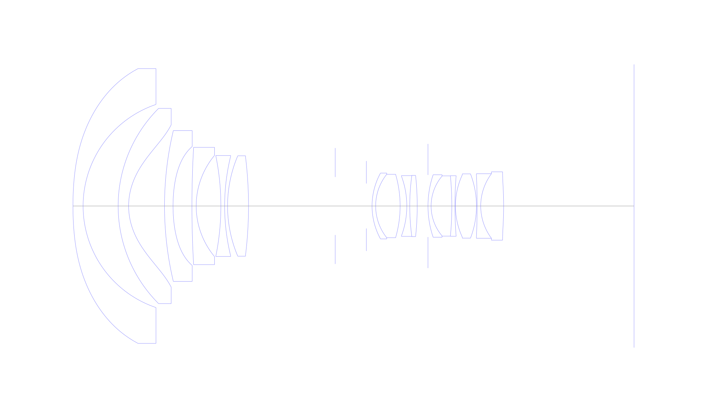
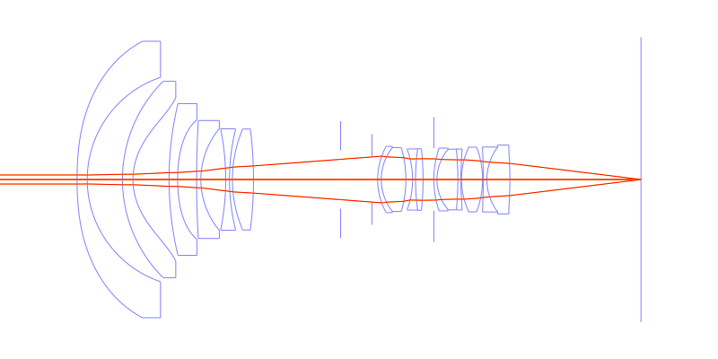
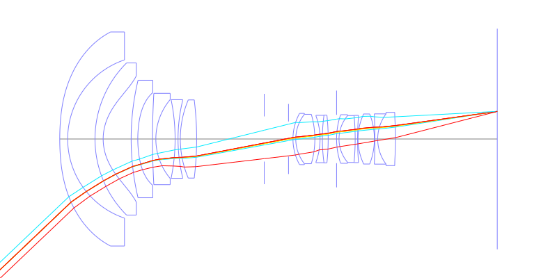
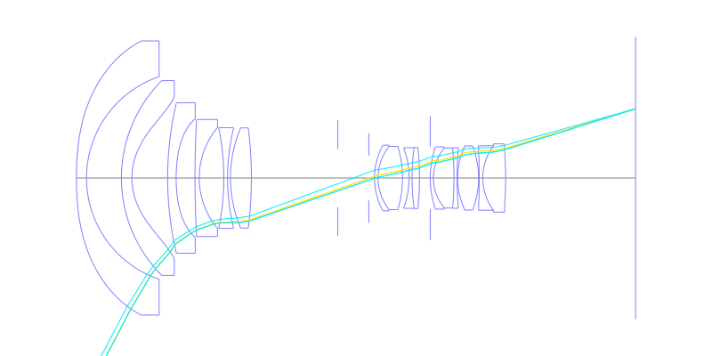
## Spot Diagrams
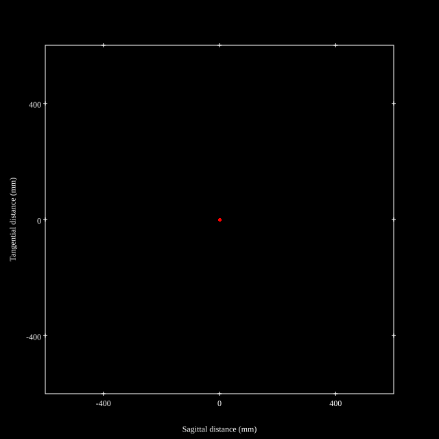
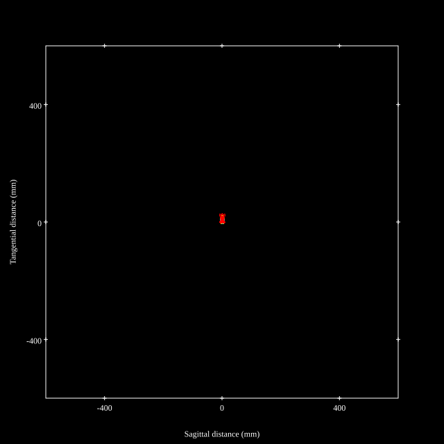
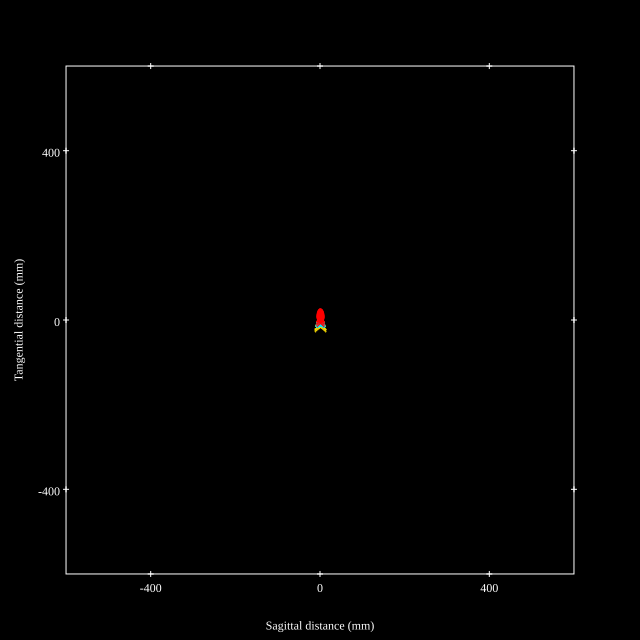
## Paraxial Parameters
| parameter | value |
| ---       | ---   |
| effective_focal_length |11.323
| back_focal_length | 39.882
| optical_invariant | 2.624
| object_distance | 1.0E10
| image_distance | 39.882
| power | 0.088
| pp1_H | 36.286
| ppk_H' | 28.559
| ffl_F | 24.963
| fno | 4.12
| enp_dist_P | 26.612
| enp_radius | 1.374
| exp_dist_P' | -37.794
| exp_radius | 9.434
| m | -0
| red | -8.831617452681688E8
| n_obj | 1
| n_img | 1
| img_ht | 21.622
| obj_ang | 62.36
| obj_na | 0
| img_na | -0.12|
## Spot Analysis
| Field | Spot Mean Radius | Spot Max Radius |
| ---   | ---              | ---             |
 | Field(x=0.0, y=0.0) | 1.674 | 3.444|
 | Field(x=0.0, y=0.1) | 2.133 | 4.664|
 | Field(x=0.0, y=0.2) | 3.028 | 7.116|
 | Field(x=0.0, y=0.3) | 3.882 | 9.982|
 | Field(x=0.0, y=0.4) | 4.285 | 12.557|
 | Field(x=0.0, y=0.5) | 4.267 | 14.385|
 | Field(x=0.0, y=0.6) | 4.667 | 22.07|
 | Field(x=0.0, y=0.7) | 5.612 | 29.673|
 | Field(x=0.0, y=0.8) | 6.57 | 24.475|
 | Field(x=0.0, y=0.9) | 8.077 | 24.433|
 | Field(x=0.0, y=1.0) | 10.706 | 29.296|
## Polychromatic Geometric MTF
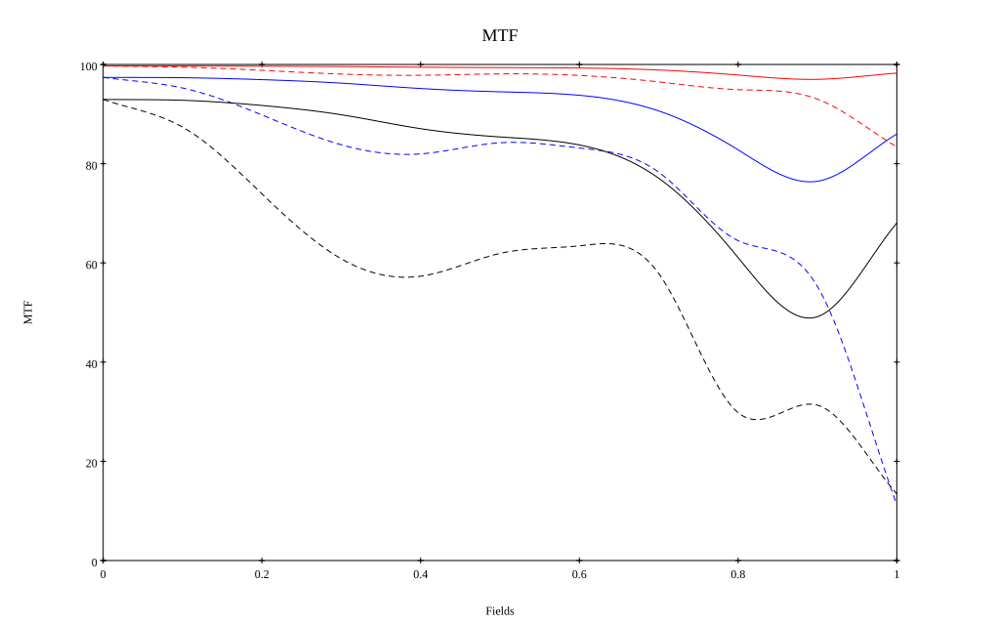
* 10,30,50 cycles/mm
* Black lines represent sagittal, blue tangential
* To generate above, MTFs for wavelengths 587.5618(d), 486.1327(F), 656.2725(C) were calculated across 10 fields, and then averaged
## Polychromatic Geometric MTF (Weighted)
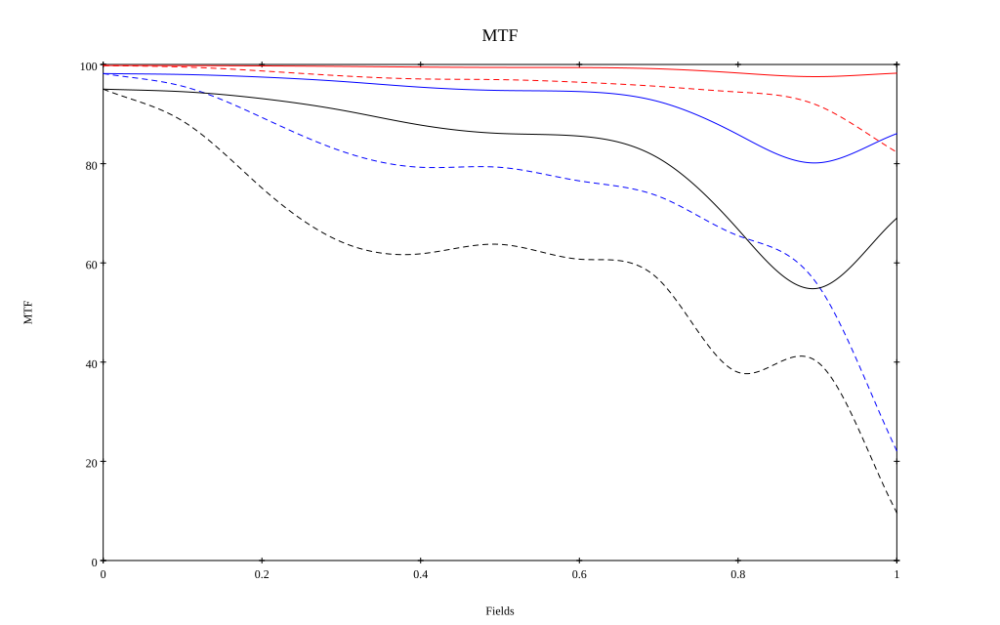
* 10,30,50 cycles/mm
* Black lines represent sagittal, blue tangential
* To generate above, MTFs for wavelengths 587.5618(d) wt(1.0), 656.2725(C) wt(0.475), 546.074(e) wt(0.98), 486.1327(F) wt(0.49), 435.8343(g) wt(0.15) were calculated across 10 fields, and then combined using weighted average
# 24mm f4.0
## Layouts
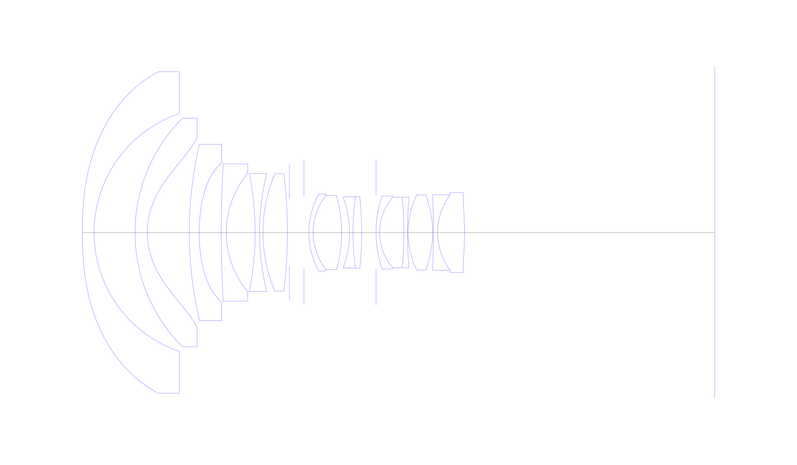
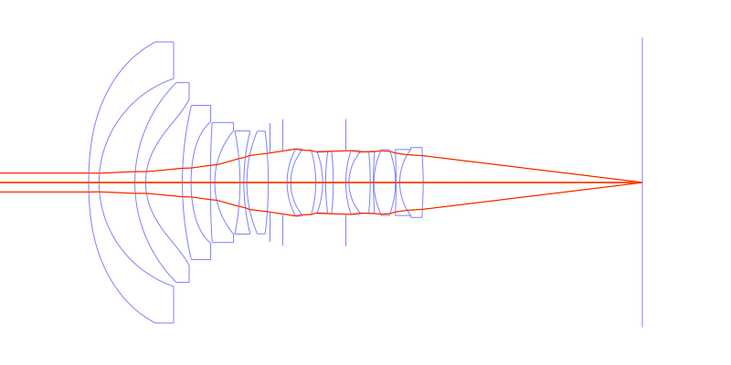
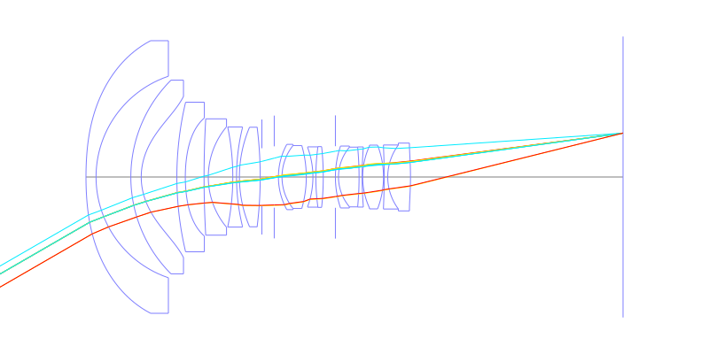
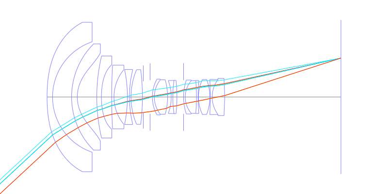
## Spot Diagrams
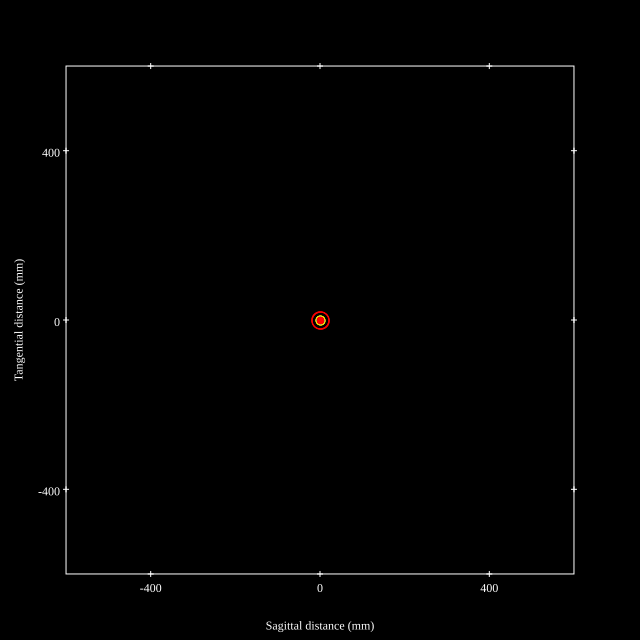
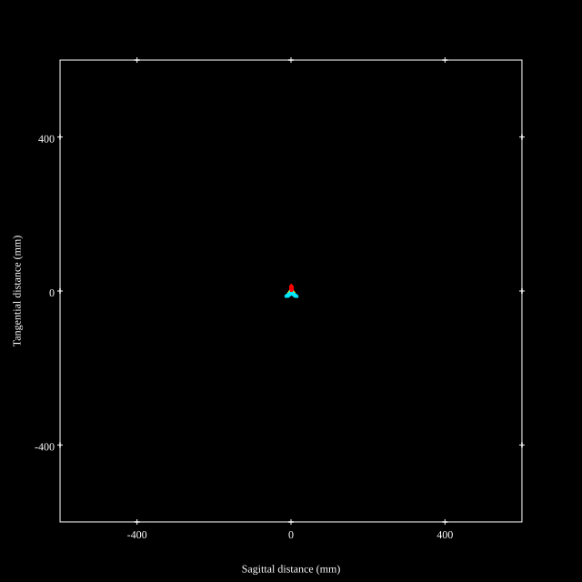
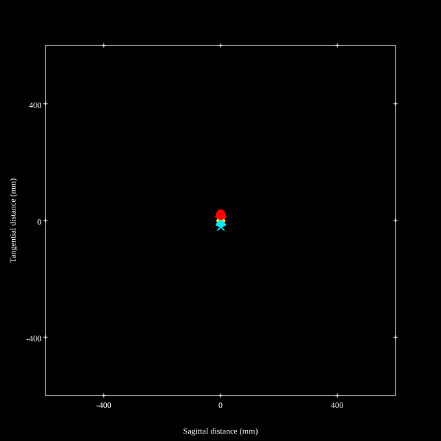
## Paraxial Parameters
| parameter | value |
| ---       | ---   |
| effective_focal_length |23.284
| back_focal_length | 65.46
| optical_invariant | 2.624
| object_distance | 1.0E10
| image_distance | 65.46
| power | 0.043
| pp1_H | 42.683
| ppk_H' | 42.176
| ffl_F | 19.399
| fno | 4.122
| enp_dist_P | 24.639
| enp_radius | 2.824
| exp_dist_P' | -37.932
| exp_radius | 12.55
| m | -0
| red | -4.294767406372099E8
| n_obj | 1
| n_img | 1
| img_ht | 21.637
| obj_ang | 42.9
| obj_na | 0
| img_na | -0.12|
## Spot Analysis
| Field | Spot Mean Radius | Spot Max Radius |
| ---   | ---              | ---             |
 | Field(x=0.0, y=0.0) | 5.255 | 20.107|
 | Field(x=0.0, y=0.1) | 3.851 | 19.364|
 | Field(x=0.0, y=0.2) | 3.743 | 18.003|
 | Field(x=0.0, y=0.3) | 3.915 | 16.206|
 | Field(x=0.0, y=0.4) | 4.248 | 13.857|
 | Field(x=0.0, y=0.5) | 4.715 | 13.882|
 | Field(x=0.0, y=0.6) | 5.31 | 17.75|
 | Field(x=0.0, y=0.7) | 6.262 | 21.701|
 | Field(x=0.0, y=0.8) | 7.984 | 25.765|
 | Field(x=0.0, y=0.9) | 10.901 | 29.839|
 | Field(x=0.0, y=1.0) | 15.206 | 37.577|
## Polychromatic Geometric MTF
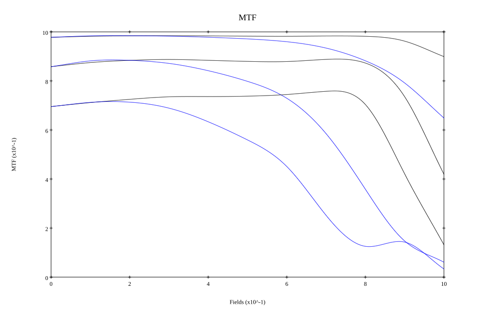
* 10,30,50 cycles/mm
* Black lines represent sagittal, blue tangential
* To generate above, MTFs for wavelengths 587.5618(d), 486.1327(F), 656.2725(C) were calculated across 10 fields, and then averaged
## Polychromatic Geometric MTF (Weighted)
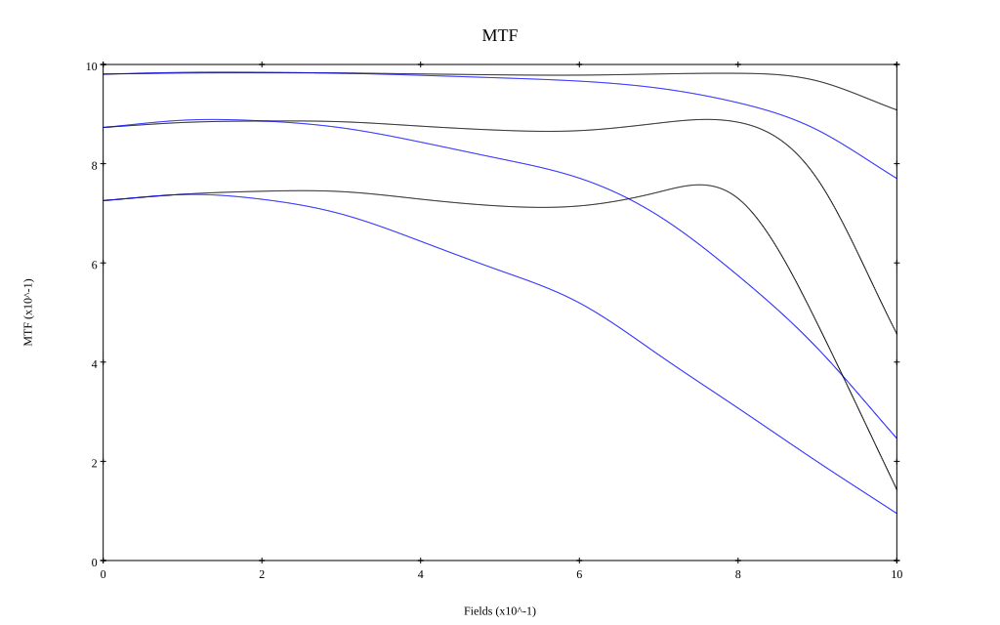
* 10,30,50 cycles/mm
* Black lines represent sagittal, blue tangential
* To generate above, MTFs for wavelengths 587.5618(d) wt(1.0), 656.2725(C) wt(0.475), 546.074(e) wt(0.98), 486.1327(F) wt(0.49), 435.8343(g) wt(0.15) were calculated across 10 fields, and then combined using weighted average
## Resources
* [OpticalBench Compatible Data File, tab delimited](./prescription.txt)
* [Zemax file](./US20150146085_Example01P.zmx)

Report / Zemax file generated using [Beam42](https://github.com/BeamFour/Beam42) on 2026-02-04
