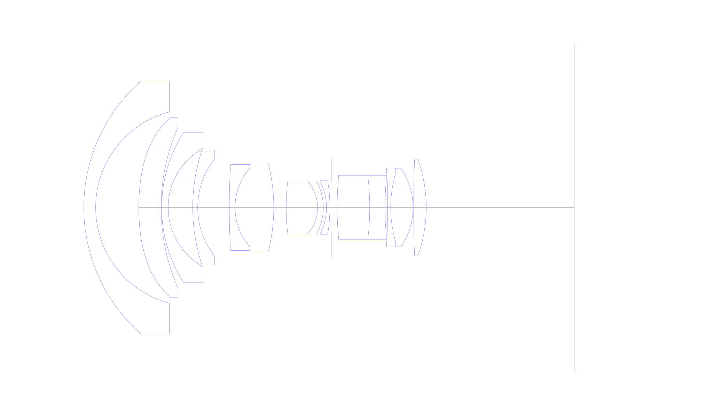
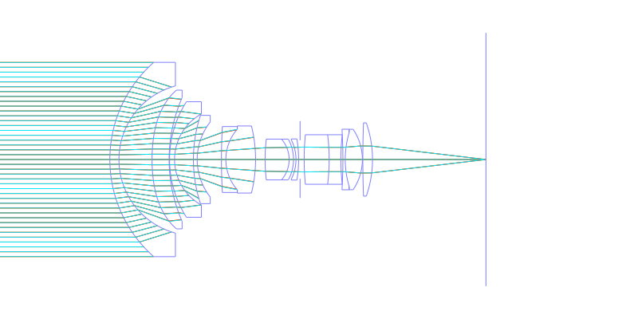
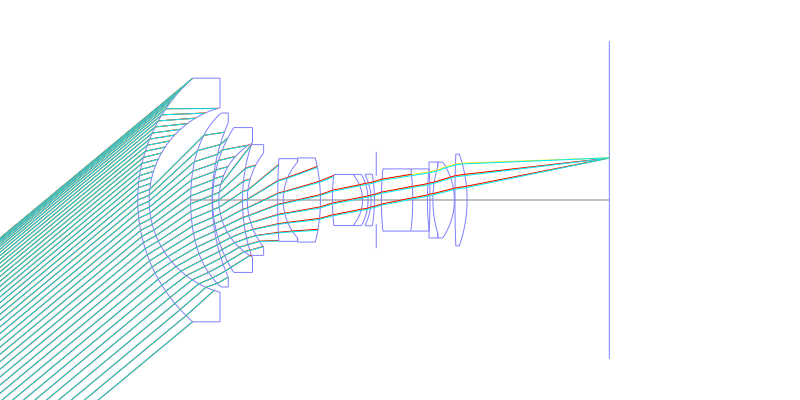
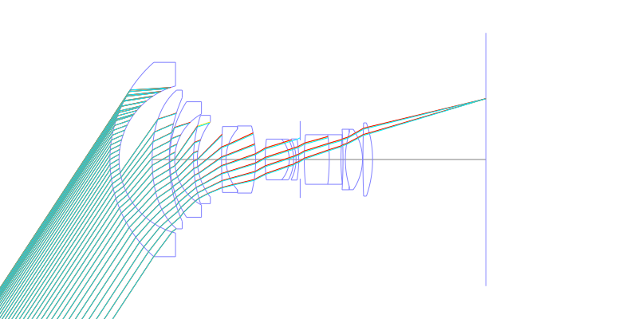
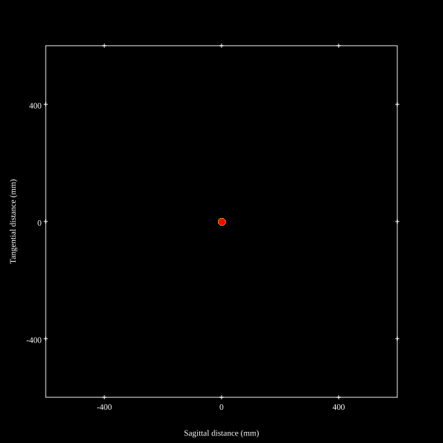
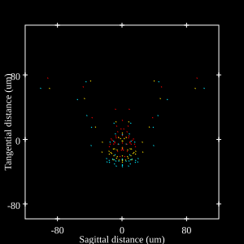
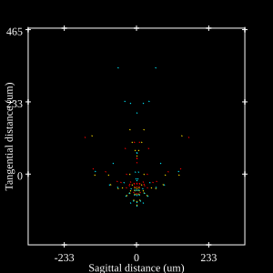
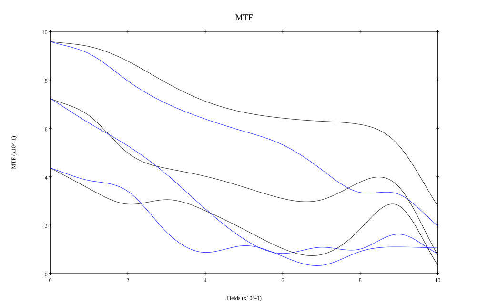

# Canon EF 14mm f/2.8L
## Patent Information
| Country | Patent Number | Example | Year of Application | Inventors | Organisation | Link |
| ---     | ---           | ---     | ---                 | ---       | ---          | ---  |
|JP | JP,05-034592,A(1993) | EX 2 | 1991 | OGAWA HIDEKI | Canon Inc  | [link](https://www.j-platpat.inpit.go.jp/c1801/PU/JP-H05-034592/11/en) |
## Surface Data
Note that where glass types are shown the refractive index and abbe number is as per assigned glass type

| ID  | Radius | Thickness | Diameter | nd  | vd  | Glass Make | Glass |
| --- | ---    | ---       | ---      | --- | --- | ---        | ---   |
| 1 | 44.219 | 3.1 | 66.32 | 1.6968 | 55.46 | Hoya | LAC14 |
| 2 | 25.992 | 11.3 | 50.22 |  |  |  |
| 3 | 58.892 | 5.83 | 47.34 | 1.60311 | 60.6 | Schott | N-SK14 |
| 4 | 52.468 | 0.15 | 42.16 |  |  |  |
| 5 | 36.687 | 1.7 | 39.42 | 1.6968 | 55.46 | Hoya | LAC14 |
| 6 | 17.786 | 6.43 | 31.1 |  |  |  |
| 7 | 48.285 | 1.3 | 30.14 | 1.7725 | 49.6 | Ohara | S-LAH66 |
| 8 | 20.678 | 8.28 | 25.64 |  |  |  |
| 9 | 205.374 | 1.5 | 22.5 | 1.6968 | 55.46 | Hoya | LAC14 |
| 10 | 15.668 | 10.13 | 20.72 | 1.59551 | 39.24 | Ohara | S-TIM8 |
| 11 | -47.65 | 3.25 | 22.9 |  |  |  |
| 12 | 57.504 | 8.21 | 13.92 | 1.56732 | 42.83 | Ohara | PBL26 |
| 13 | -10.599 | 1.5 | 13.92 | 1.7725 | 49.6 | Ohara | S-LAH66 |
| 14 | -14.346 | 0.83 | 13.92 |  |  |  |
| 15 | -14.99 | 0.9 | 13.68 | 1.7725 | 49.6 | Ohara | S-LAH66 |
| 16 | -42.795 | 0.5 | 14.04 |  |  |  |
| 17 | AS | 1.4 | 13.12 |  |  |  |
| 18 | 86.92 | 8.53 | 16.92 | 1.60311 | 60.6 | Schott | N-SK14 |
| 19 | -69.093 | 4.0 | 16.92 | 1.7432 | 49.34 | Ohara | S-LAM60 |
| 20 | 77.455 | 0.69 | 15.44 |  |  |  |
| 21 | -172.305 | 0.8 | 20.66 | 1.92286 | 20.88 | Hoya | E-FDS1 |
| 22 | 32.045 | 5.85 | 18.32 | 1.48749 | 70.24 | Ohara | S-FSL5 |
| 23 | -18.398 | 0.15 | 20.62 |  |  |  |
| 24 | 333.594 | 3.3 | 25.0 | 1.804 | 46.58 | Ohara | S-LAH65V |
| 25 | -37.974 | 38.65 | 25.0 |  |  |  |
## Aspherical Data
| ID  | k   | P1  | P2  | P3  | P3 | P5 | P6 | P7 | P8 | P9 | P10 |
| --- | --- | --- | --- | --- | --- | --- | --- | --- | --- | --- | --- |
| 3 | -1.0 | 0.0 | 9.62849E-6 | 2.04161E-9 | -8.992E-12 | 1.9629E-14 | 0.0 | 0.0 | 0.0 | 0.0 | 0.0 |
## Layouts

## Spot Diagrams

## Paraxial Parameters
| parameter | value |
| ---       | ---   |
| effective_focal_length |14.201
| back_focal_length | 38.724
| optical_invariant | 3.861
| object_distance | 1.0E10
| image_distance | 38.724
| power | 0.07
| pp1_H | 40.382
| ppk_H' | 24.523
| ffl_F | 26.18
| fno | 2.8
| enp_dist_P | 28.913
| enp_radius | 2.536
| exp_dist_P' | -35.001
| exp_radius | 13.178
| m | -0
| red | -7.041598083924489E8
| n_obj | 1
| n_img | 1
| img_ht | 21.619
| obj_ang | 56.7
| obj_na | 0
| img_na | -0.176|
## Spot Analysis
| Field | Spot Mean Radius | Spot Max Radius |
| ---   | ---              | ---             |
 | Field(x=0.0, y=0.0) | 5.985 | 10.943|
 | Field(x=0.0, y=0.1) | 9.155 | 52.689|
 | Field(x=0.0, y=0.2) | 15.384 | 86.154|
 | Field(x=0.0, y=0.3) | 22.938 | 124.892|
 | Field(x=0.0, y=0.4) | 30.676 | 140.963|
 | Field(x=0.0, y=0.5) | 33.776 | 131.399|
 | Field(x=0.0, y=0.6) | 34.121 | 140.479|
 | Field(x=0.0, y=0.7) | 36.477 | 160.396|
 | Field(x=0.0, y=0.8) | 40.793 | 189.891|
 | Field(x=0.0, y=0.9) | 57.156 | 227.995|
 | Field(x=0.0, y=1.0) | 93.982 | 435.894|
## Geometric MTF

* 10,30,50 cycles/mm
* Black lines represent sagittal, blue tangential
## Resources
* [OpticalBench Compatible Data File, tab delimited](./JP1993-034592_Example02.txt)
* [Zemax file](./JP1993-034592_Example02.zmx)
