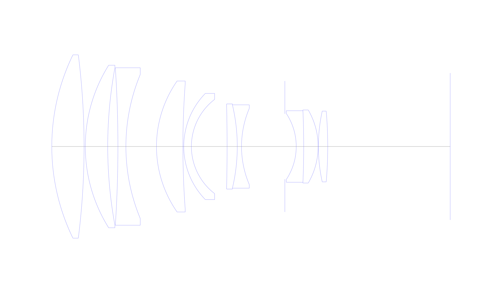
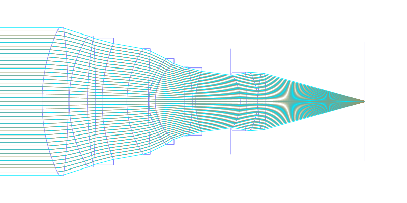
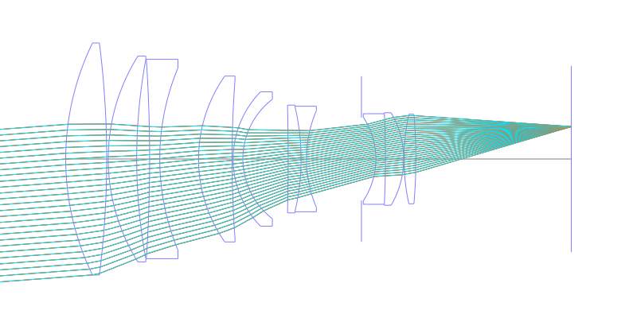
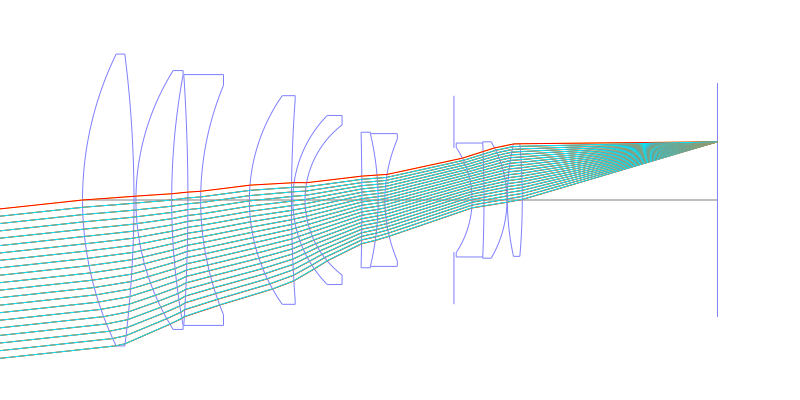
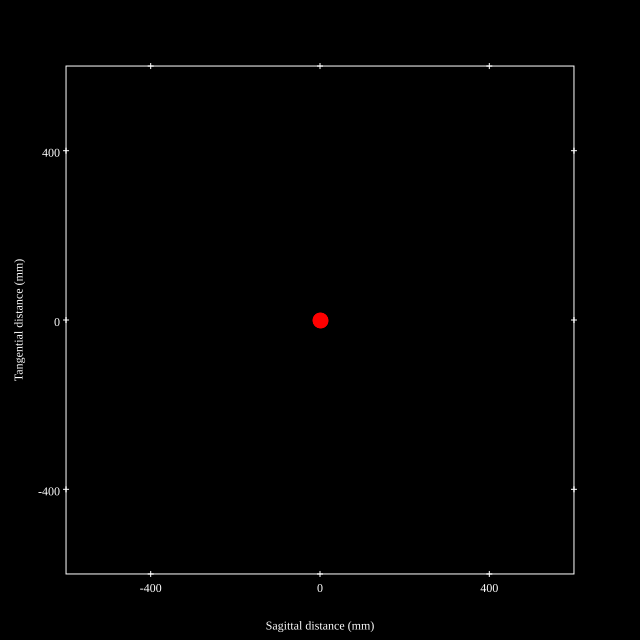
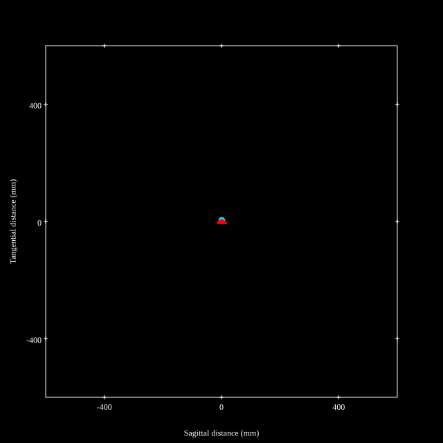
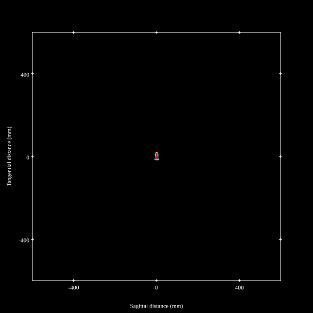
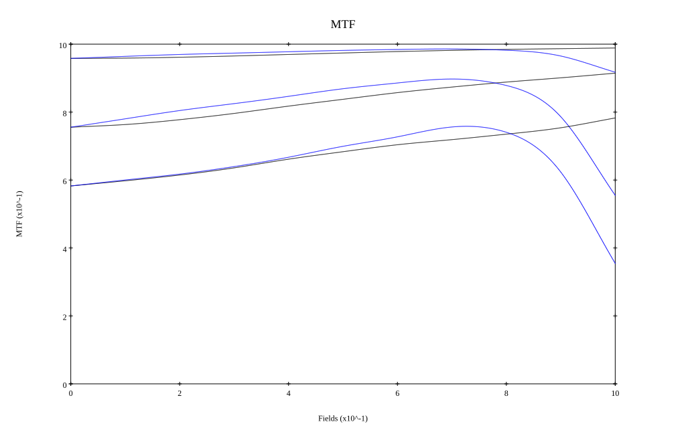
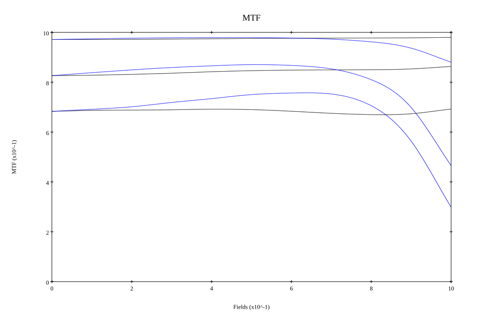

# Canon EF200mm f1.8L USM
## Patent Information
| Country | Patent Number | Example | Year of Application | Inventors | Organisation | Link |
| ---     | ---           | ---     | ---                 | ---       | ---          | ---  |
|JP | JP-H01-102413 | 1 | 1987 | Ogawa Hideki, Takahashi Sadatoshi | Canon Inc | [link](https://www.j-platpat.inpit.go.jp/c1801/PU/JP-H01-102413/11/en) |
## Surface Data
Note that where glass types are shown the refractive index and abbe number is as per assigned glass type

| ID  | Radius | Thickness | Diameter | nd  | vd  | Glass Make | Glass |
| --- | ---    | ---       | ---      | --- | --- | ---        | ---   |
| 1 | 123.12 | 19.0 | 107.81 | 1.497 | 81.61 | Ohara | FPL51 |
| 2 | -430.59 | 0.72 | 107.81 |  |  |  |
| 3 | 89.981 | 13.2 | 95.6 | 1.497 | 81.61 | Ohara | FPL51 |
| 4 | 255.652 | 6.0 | 92.56 |  |  |  |
| 5 | -704.106 | 4.7 | 92.64 | 1.65412 | 39.68 | Ohara | S-NBH5 |
| 6 | 110.405 | 18.0 | 84.7 |  |  |  |
| 7 | 67.274 | 15.55 | 77.05 | 1.497 | 81.61 | Ohara | FPL51 |
| 8 | 502.839 | 0.5 | 73.92 |  |  |  |
| 9 | 44.766 | 4.5 | 62.44 | 1.6968 | 55.53 | Ohara | S-LAL14 |
| 10 | 34.941 | 21.0 | 55.45 |  |  |  |
| 11 | -1069.676 | 6.0 | 50.06 | 1.84666 | 23.88 | Ohara | S-NPH53 |
| 12 | -106.363 | 2.5 | 49.03 | 1.6134 | 43.84 | Ohara | BPM4 |
| 13 | 57.199 | 25.5 | 44.86 |  |  |  |
| 14 | AS | 6.7 | 38.501 |  |  |  |
| 15 | -35.135 | 4.4 | 38.84 | 1.65412 | 39.68 | Ohara | S-NBH5 |
| 16 | -475.931 | 8.49 | 42.08 | 1.6516 | 58.55 | Ohara | S-LAL7 |
| 17 | -42.493 | 0.15 | 42.98 |  |  |  |
| 18 | 96.893 | 5.5 | 41.62 | 1.618 | 63.39 | Ohara | PHM52 |
| 19 | -241.315 | 72.085 | 41.62 |  |  |  |
## Layouts

## Spot Diagrams

## Paraxial Parameters
| parameter | value |
| ---       | ---   |
| effective_focal_length |200.017
| back_focal_length | 72.089
| optical_invariant | 5.793
| object_distance | 1.0E10
| image_distance | 72.089
| power | 0.005
| pp1_H | 165.664
| ppk_H' | -127.927
| ffl_F | -34.352
| fno | 1.86
| enp_dist_P | 379.097
| enp_radius | 53.765
| exp_dist_P' | -24.67
| exp_radius | 26.01
| m | -0
| red | -4.999586866625641E7
| n_obj | 1
| n_img | 1
| img_ht | 21.552
| obj_ang | 6.15
| obj_na | 0
| img_na | -0.26|
## Spot Analysis
| Field | Spot Mean Radius | Spot Max Radius |
| ---   | ---              | ---             |
 | Field(x=0.0, y=0.0) | 5.901 | 16.877|
 | Field(x=0.0, y=0.1) | 5.806 | 19.699|
 | Field(x=0.0, y=0.2) | 5.631 | 20.036|
 | Field(x=0.0, y=0.3) | 5.442 | 19.848|
 | Field(x=0.0, y=0.4) | 5.051 | 19.407|
 | Field(x=0.0, y=0.5) | 4.649 | 18.648|
 | Field(x=0.0, y=0.6) | 4.264 | 17.53|
 | Field(x=0.0, y=0.7) | 4.003 | 16.023|
 | Field(x=0.0, y=0.8) | 4.099 | 14.937|
 | Field(x=0.0, y=0.9) | 4.981 | 18.187|
 | Field(x=0.0, y=1.0) | 6.933 | 21.59|
## Polychromatic Geometric MTF

* 10,30,50 cycles/mm
* Black lines represent sagittal, blue tangential
* To generate above, MTFs for wavelengths 587.5618(d), 486.1327(F), 656.2725(C) were calculated across 10 fields, and then averaged
## Polychromatic Geometric MTF (Weighted)

* 10,30,50 cycles/mm
* Black lines represent sagittal, blue tangential
* To generate above, MTFs for wavelengths 587.5618(d) wt(1.0), 656.2725(C) wt(0.475), 546.074(e) wt(0.98), 486.1327(F) wt(0.49), 435.8343(g) wt(0.15) were calculated across 10 fields, and then combined using weighted average
## Resources
* [OpticalBench Compatible Data File, tab delimited](./prescription.txt)
* [Zemax file](./JP1989-102413_Example01P.zmx)

Report / Zemax file generated using [Beam42](https://github.com/BeamFour/Beam42) on 2026-05-14
