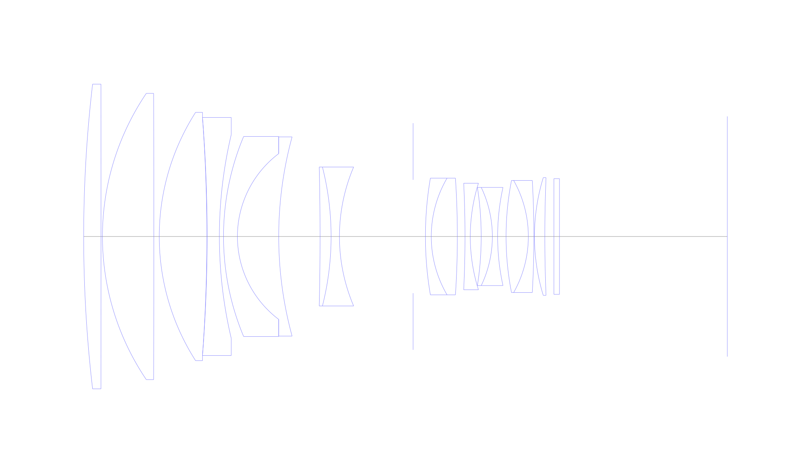
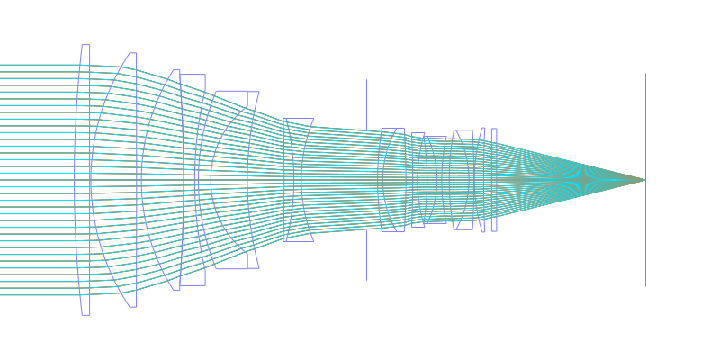
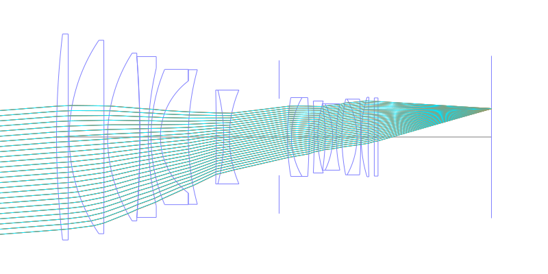
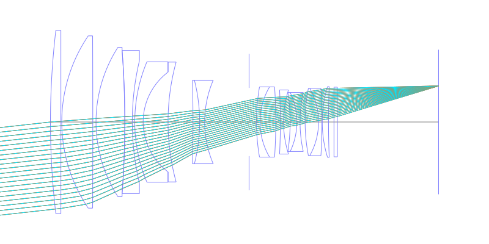
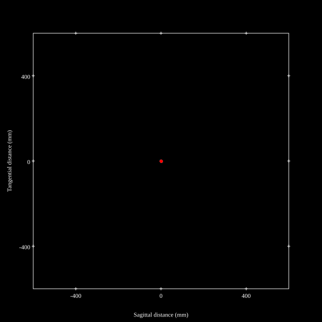
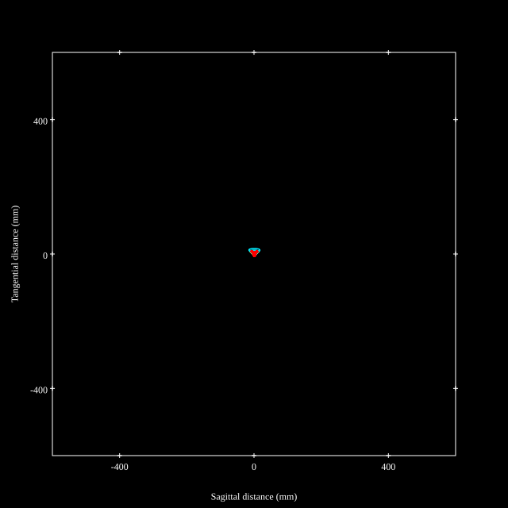
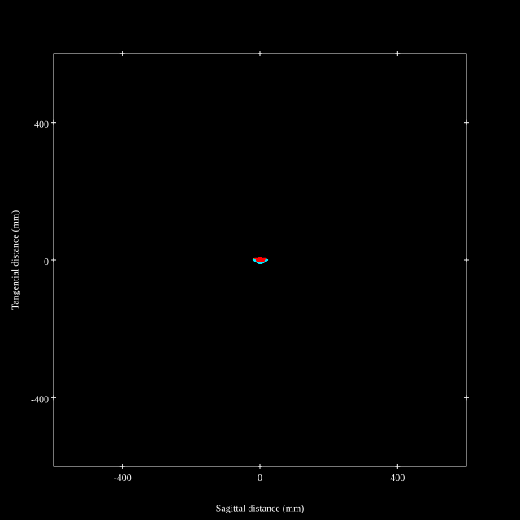
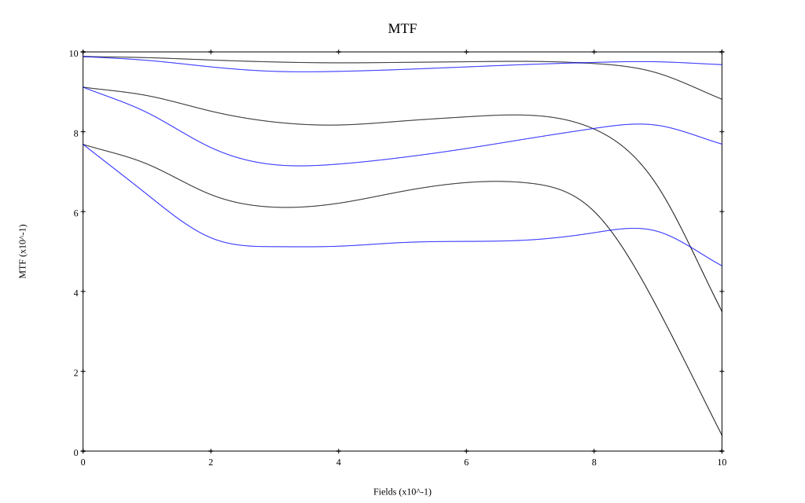
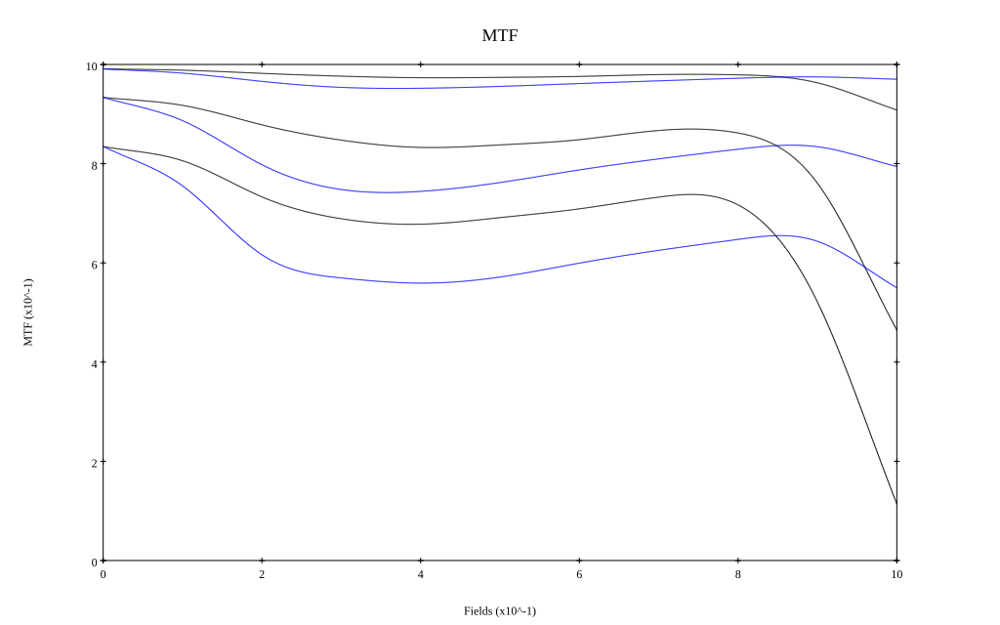

# Canon EF200mm f2L IS USM
## Patent Information
| Country | Patent Number | Example | Year of Application | Inventors | Organisation | Link |
| ---     | ---           | ---     | ---                 | ---       | ---          | ---  |
|JP | JP 2008-145584 | 1 | 2006 | YOKOYAMA TAKAYOSHI | Canon Inc | [link](https://www.j-platpat.inpit.go.jp/c1801/PU/JP-2008-145584/11/en) |
## Surface Data
Note that where glass types are shown the refractive index and abbe number is as per assigned glass type

| ID  | Radius | Thickness | Diameter | nd  | vd  | Glass Make | Glass |
| --- | ---    | ---       | ---      | --- | --- | ---        | ---   |
| 1 | 469.673 | 6.23 | 109.62 | 1.48749 | 70.21 | Ohara | FSL5 |
| 2 | -105940.0 | 0.52 | 109.62 |  |  |  |
| 3 | 91.926 | 18.49 | 102.96 | 1.43384 | 95.26 | Hikari | NICF-A |
| 4 | -15019.281 | 1.94 | 102.96 |  |  |  |
| 5 | 82.868 | 17.12 | 89.3 | 1.497 | 81.55 | Ohara | S-FPL51 |
| 6 | -583.653 | 0.1 | 85.62 |  |  |  |
| 7 | -545.88 | 4.4 | 85.62 | 1.65412 | 39.68 | Ohara | S-NBH5 |
| 8 | 159.373 | 1.49 | 73.3 |  |  |  |
| 9 | 92.975 | 5.0 | 71.96 | 1.6968 | 55.53 | Ohara | S-LAL14 |
| 10 | 37.36 | 14.85 | 59.62 | 1.497 | 81.55 | Ohara | S-FPL51 |
| 11 | 135.809 | 14.87 | 71.62 |  |  |  |
| 12 | -1035.916 | 3.97 | 49.96 | 1.84666 | 23.78 | Ohara | S-TIH53 |
| 13 | -101.579 | 3.0 | 49.96 | 1.7725 | 49.6 | Ohara | S-LAH66 |
| 14 | 63.713 | 26.48 | 49.96 |  |  |  |
| 15 | AS | 4.44 | 40.765 |  |  |  |
| 16 | 124.242 | 2.1 | 41.96 | 1.65412 | 39.68 | Ohara | S-NBH5 |
| 17 | 41.666 | 9.38 | 41.96 | 1.7725 | 49.6 | Ohara | S-LAH66 |
| 18 | -320.108 | 2.75 | 41.96 |  |  |  |
| 19 | -392.917 | 1.9 | 38.3 | 1.6968 | 55.53 | Ohara | S-LAL14 |
| 20 | 63.948 | 3.93 | 38.3 |  |  |  |
| 21 | -114.597 | 4.01 | 35.3 | 1.84666 | 23.78 | Ohara | S-TIH53 |
| 22 | -40.943 | 1.9 | 35.3 | 1.54072 | 47.23 | Ohara | S-TIL2 |
| 23 | 81.99 | 3.03 | 35.3 |  |  |  |
| 24 | 104.809 | 8.01 | 40.3 | 1.72916 | 54.68 | Ohara | S-LAL18 |
| 25 | -41.124 | 2.0 | 40.3 | 1.80518 | 25.43 | Ohara | S-TIH6 |
| 26 | -347.988 | 0.2 | 40.3 |  |  |  |
| 27 | 72.365 | 3.73 | 42.3 | 1.804 | 46.57 | Ohara | S-LAH65 |
| 28 | 518.348 | 3.27 | 42.3 |  |  |  |
| 29 | 0.0 | 2.0 | 41.62 | 1.51633 | 64.14 | Ohara | S-BSL7 |
| 30 | 0.0 | 60.37 | 41.62 |  |  |  |
## Layouts

## Spot Diagrams

## Paraxial Parameters
| parameter | value |
| ---       | ---   |
| effective_focal_length |194.996
| back_focal_length | 60.39
| optical_invariant | 5.275
| object_distance | 1.0E10
| image_distance | 60.39
| power | 0.005
| pp1_H | 132.24
| ppk_H' | -134.605
| ffl_F | -62.756
| fno | 2.05
| enp_dist_P | 276.162
| enp_radius | 47.556
| exp_dist_P' | -51.78
| exp_radius | 27.361
| m | -0
| red | -5.1283209372512065E7
| n_obj | 1
| n_img | 1
| img_ht | 21.631
| obj_ang | 6.33
| obj_na | 0
| img_na | -0.237|
## Spot Analysis
| Field | Spot Mean Radius | Spot Max Radius |
| ---   | ---              | ---             |
 | Field(x=0.0, y=0.0) | 2.952 | 8.331|
 | Field(x=0.0, y=0.1) | 3.412 | 18.455|
 | Field(x=0.0, y=0.2) | 4.653 | 23.436|
 | Field(x=0.0, y=0.3) | 5.583 | 24.487|
 | Field(x=0.0, y=0.4) | 5.87 | 23.288|
 | Field(x=0.0, y=0.5) | 5.592 | 22.9|
 | Field(x=0.0, y=0.6) | 5.207 | 20.216|
 | Field(x=0.0, y=0.7) | 4.799 | 19.014|
 | Field(x=0.0, y=0.8) | 4.615 | 18.166|
 | Field(x=0.0, y=0.9) | 5.333 | 18.582|
 | Field(x=0.0, y=1.0) | 7.673 | 21.021|
## Polychromatic Geometric MTF

* 10,30,50 cycles/mm
* Black lines represent sagittal, blue tangential
* To generate above, MTFs for wavelengths 587.5618(d), 486.1327(F), 656.2725(C) were calculated across 10 fields, and then averaged
## Polychromatic Geometric MTF (Weighted)

* 10,30,50 cycles/mm
* Black lines represent sagittal, blue tangential
* To generate above, MTFs for wavelengths 587.5618(d) wt(1.0), 656.2725(C) wt(0.475), 546.074(e) wt(0.98), 486.1327(F) wt(0.49), 435.8343(g) wt(0.15) were calculated across 10 fields, and then combined using weighted average
## Resources
* [OpticalBench Compatible Data File, tab delimited](./prescription.txt)
* [Zemax file](./JP2008-145584_Example01P.zmx)

Report / Zemax file generated using [Beam42](https://github.com/BeamFour/Beam42) on 2026-05-25
