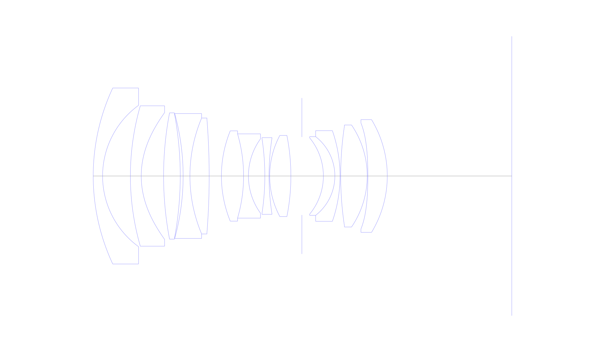
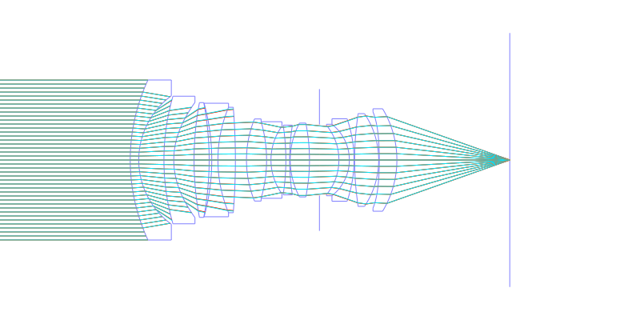
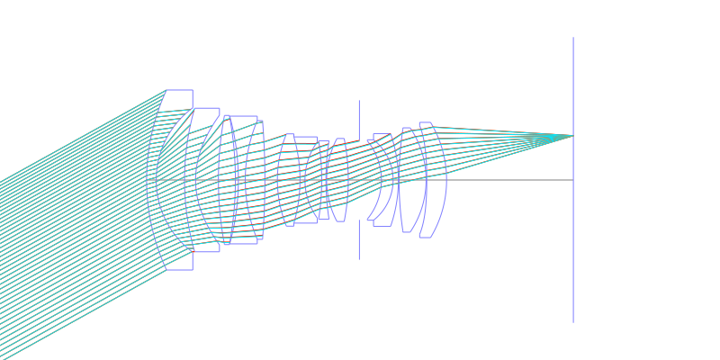
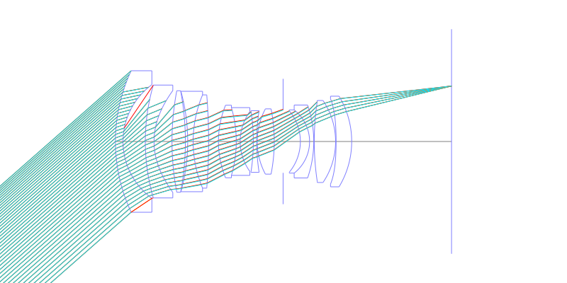
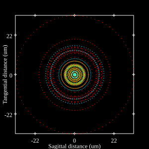
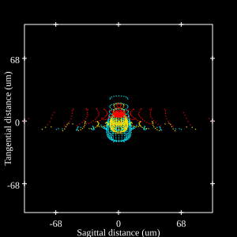
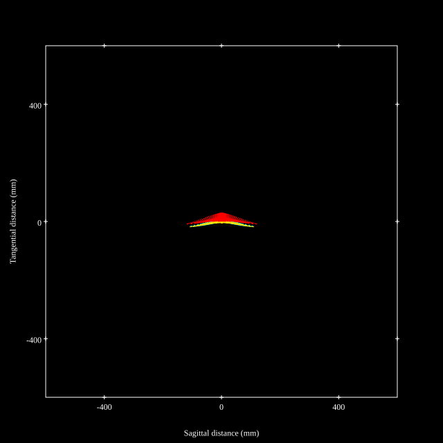

# Canon EF 24mm f1.4L II
## Patent Information
| Country | Patent Number | Example | Year of Application | Inventors | Organisation | Link |
| ---     | ---           | ---     | ---                 | ---       | ---          | ---  |
|US | US20100033848 | EX 3 | 2008 | Takahiro Hatada | Canon Inc | [link](https://patents.google.com/patent/US20100033848A1/en) |
## Surface Data
Note that where glass types are shown the refractive index and abbe number is as per assigned glass type

| ID  | Radius | Thickness | Diameter | nd  | vd  | Glass Make | Glass |
| --- | ---    | ---       | ---      | --- | --- | ---        | ---   |
| 1 | 64.588 | 2.9 | 54.54 | 1.834807 | 42.7 | Ohara | S-LAH55V |
| 2 | 27.134 | 8.59 | 43.79 |  |  |  |
| 3 | 78.633 | 3.35 | 43.49 | 1.583126 | 59.4 | Ohara | S-BAL42 |
| 4 | 26.588 | 6.91 | 39.29 |  |  |  |
| 5 | 104.899 | 5.15 | 39.12 | 1.882997 | 40.8 | Ohara | S-LAH58 |
| 6 | -104.899 | 0.89 | 38.77 |  |  |  |
| 7 | -72.964 | 2.1 | 38.69 | 1.496999 | 81.6 | Ohara | S-FPL51 |
| 8 | 46.394 | 5.95 | 35.93 | 1.834807 | 42.7 | Ohara | S-LAH55V |
| 9 | -224.128 | 3.78 | 35.24 |  |  |  |
| 10 | 37.165 | 6.85 | 27.97 | 1.834 | 37.2 | Ohara | S-LAH60 |
| 11 | -46.716 | 1.5 | 26.11 | 1.60342 | 38.0 | Ohara | S-TIM5 |
| 12 | 19.654 | 5.07 | 23.04 |  |  |  |
| 13 | -76.688 | 1.3 | 23.11 | 1.654115 | 39.7 | Ohara | S-NBH5 |
| 14 | 76.688 | 0.2 | 23.76 |  |  |  |
| 15 | 26.781 | 6.55 | 25.16 | 1.496999 | 81.6 | Ohara | S-FPL51 |
| 16 | -64.437 | 3.4 | 25.15 |  |  |  |
| 17 | AS | 6.64 | 24.16 |  |  |  |
| 18 | -18.579 | 3.55 | 23.65 | 1.48749 | 70.2 | Ohara | S-FSL5 |
| 19 | -15.481 | 1.6 | 24.36 | 1.84666 | 23.8 | Ohara | S-TIH53 |
| 20 | -42.869 | 0.2 | 28.1 |  |  |  |
| 21 | 103.587 | 8.2 | 30.9 | 1.618 | 63.4 | Ohara | S-PHM52 |
| 22 | -28.2 | 0.2 | 31.6 |  |  |  |
| 23 | -116.641 | 6.0 | 32.83 | 1.8515 | 40.8 | Ohara | S-LAH89 |
| 24 | -33.79 | 38.415 | 34.92 |  |  |  |
## Aspherical Data
| ID  | k   | A4  | A6  | A8  | A10 | A12 | A14 | A16 | A18 |
| --- | --- | --- | --- | --- | --- | --- | --- | --- | --- |
| 4 | 0.0 | -5.6034E-6 | -8.8149E-9 | 3.9223E-12 | -2.2756E-14 | 0.0 | 0.0 | 0.0 | 0.0 |
| 23 | 0.0 | -1.1961E-5 | -2.8659E-9 | -7.0647E-12 | -1.3455E-14 | 0.0 | 0.0 | 0.0 | 0.0 |
## Layouts

## Spot Diagrams

## Paraxial Parameters
| parameter | value |
| ---       | ---   |
| effective_focal_length |24.534
| back_focal_length | 38.448
| optical_invariant | 7.458
| object_distance | 1.0E10
| image_distance | 38.415
| power | 0.041
| pp1_H | 47.946
| ppk_H' | -13.914
| ffl_F | 23.412
| fno | 1.45
| enp_dist_P | 30.155
| enp_radius | 8.46
| exp_dist_P' | -50.814
| exp_radius | 30.78
| m | 0.001
| red | -4.075990390757309E8
| n_obj | 1
| n_img | 1
| img_ht | 21.63
| obj_ang | 41.4
| obj_na | 0
| img_na | -0.326|
## Spot Analysis
| Field | Spot Mean Radius | Spot Max Radius |
| ---   | ---              | ---             |
 | 0.0 | 11.722 | 32.907|
 | 0.7 | 22.467 | 115.733|
 | 1.0 | 51.071 | 177.892|
## Resources
* [OpticalBench Compatible Data File, tab delimited](./US20100033848_Example03.txt)
* [Zemax file](./US20100033848_Example03.zmx)
