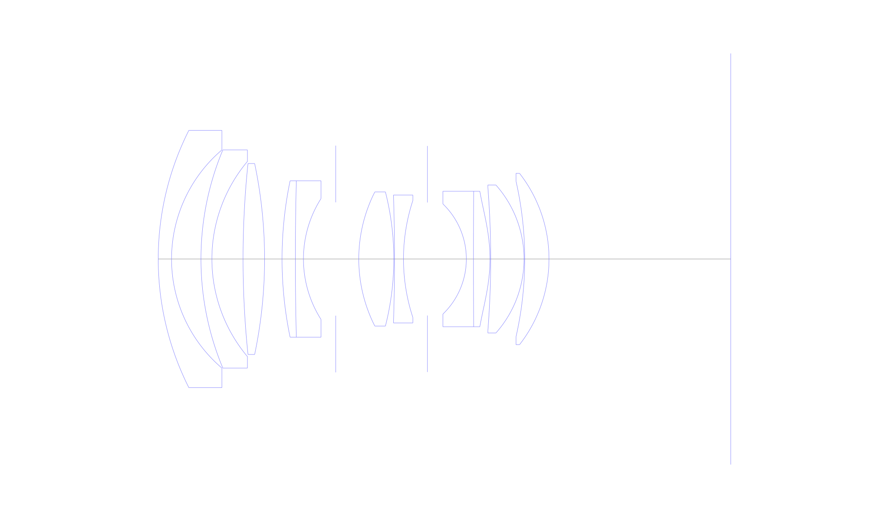
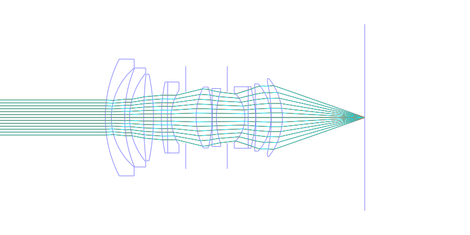
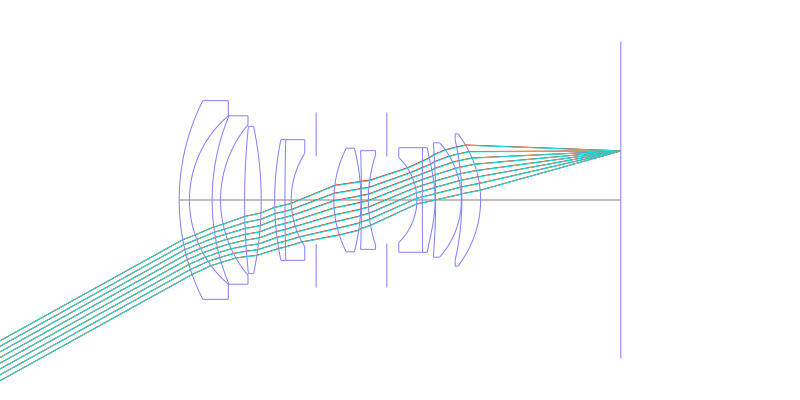
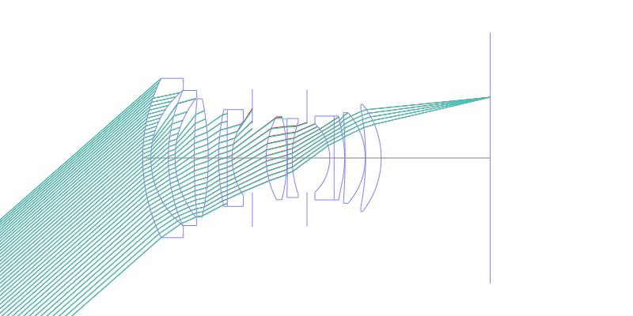
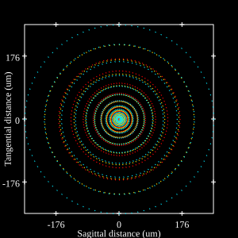
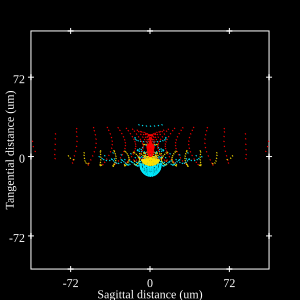
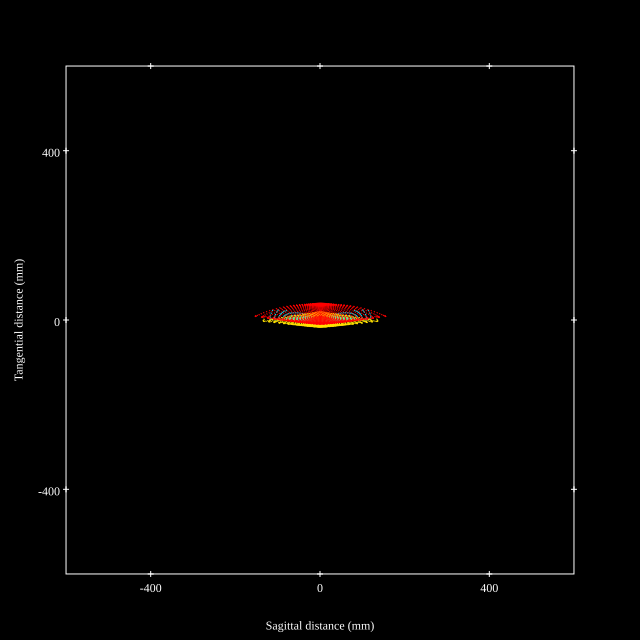

# Canon EF 24mm f1.4L
## Patent Information
| Country | Patent Number | Example | Year of Application | Inventors | Organisation | Link |
| ---     | ---           | ---     | ---                 | ---       | ---          | ---  |
|JP | JP 1999-030743 | EX 5 | 1997 | MITSUSAKA MAKOTO | Canon Inc | [link](https://www.j-platpat.inpit.go.jp/c1801/PU/JP-H11-030743/11/en) |
## Surface Data
Note that where glass types are shown the refractive index and abbe number is as per assigned glass type

| ID  | Radius | Thickness | Diameter | nd  | vd  | Glass Make | Glass |
| --- | ---    | ---       | ---      | --- | --- | ---        | ---   |
| 1 | 60.187 | 2.8 | 54.18 | 1.696797 | 55.5 | Ohara | S-LAL14 |
| 2 | 30.193 | 6.186 | 45.92 |  |  |  |
| 3 | 59.602 | 2.3 | 45.92 | 1.696797 | 55.5 | Ohara | S-LAL14 |
| 4 | 31.983 | 6.552 | 41.1 |  |  |  |
| 5 | 194.761 | 4.528 | 40.2 | 1.6779 | 55.3 | Ohara | S-LAL12 |
| 6 | -97.779 | 3.676 | 40.2 |  |  |  |
| 7 | 80.907 | 2.8 | 32.92 | 1.84666 | 23.8 | Ohara | S-TIH53 |
| 8 | 662.22 | 1.7 | 32.92 | 1.496999 | 81.6 | Ohara | S-FPL51 |
| 9 | 23.755 | 6.8 | 25.44 |  |  |  |
| 10 | FS | 4.835 | 23.87 |  |  |  |
| 11 | 31.225 | 7.371 | 28.26 | 1.804 | 46.6 | Ohara | S-LAH65V |
| 12 | -57.233 | 0.15 | 28.26 |  |  |  |
| 13 | -409.276 | 1.886 | 26.92 | 1.717362 | 29.5 | Ohara | S-TIH1 |
| 14 | 39.492 | 5.035 | 24.62 |  |  |  |
| 15 | AS | 8.181 | 23.798 |  |  |  |
| 16 | -16.104 | 1.5 | 23.2 | 1.805181 | 25.4 | Ohara | S-TIH6 |
| 17 | 2532.956 | 3.473 | 28.52 | 1.834807 | 42.7 | Ohara | S-LAH55V |
| 18 | -34.039 | 0.15 | 28.52 |  |  |  |
| 19 | -190.746 | 7.008 | 30.08 | 1.618 | 63.4 | Ohara | S-PHM52 |
| 20 | -23.481 | 0.15 | 31.17 |  |  |  |
| 21 | -74.015 | 5.104 | 32.66 | 1.772499 | 49.6 | Ohara | S-LAH66 |
| 22 | -29.342 | 38.23 | 36.1 |  |  |  |
## Aspherical Data
| ID  | k   | A4  | A6  | A8  | A10 | A12 | A14 | A16 | A18 |
| --- | --- | --- | --- | --- | --- | --- | --- | --- | --- |
| 18 | 0.0 | 2.07636E-5 | 2.60845E-8 | -2.63823E-11 | -1.46943E-13 | 2.10282E-16 | 0.0 | 0.0 | 0.0 |
## Layouts

## Spot Diagrams

## Paraxial Parameters
| parameter | value |
| ---       | ---   |
| effective_focal_length |24.598
| back_focal_length | 38.282
| optical_invariant | 7.465
| object_distance | 1.0E10
| image_distance | 38.23
| power | 0.041
| pp1_H | 49.286
| ppk_H' | -13.684
| ffl_F | 24.688
| fno | 1.45
| enp_dist_P | 31.168
| enp_radius | 8.482
| exp_dist_P' | -55.097
| exp_radius | 32.2
| m | 0.002
| red | -4.0653076156971645E8
| n_obj | 1
| n_img | 1
| img_ht | 21.648
| obj_ang | 41.35
| obj_na | 0
| img_na | -0.326|
## Spot Analysis
| Field | Spot Mean Radius | Spot Max Radius |
| ---   | ---              | ---             |
 | 0.0 | 14.649 | 37.742|
 | 0.7 | 22.463 | 107.408|
 | 1.0 | 58.801 | 193.647|
## Resources
* [OpticalBench Compatible Data File, tab delimited](./JP1999-030743_Example05.txt)
* [Zemax file](./JP1999-030743_Example05.zmx)
