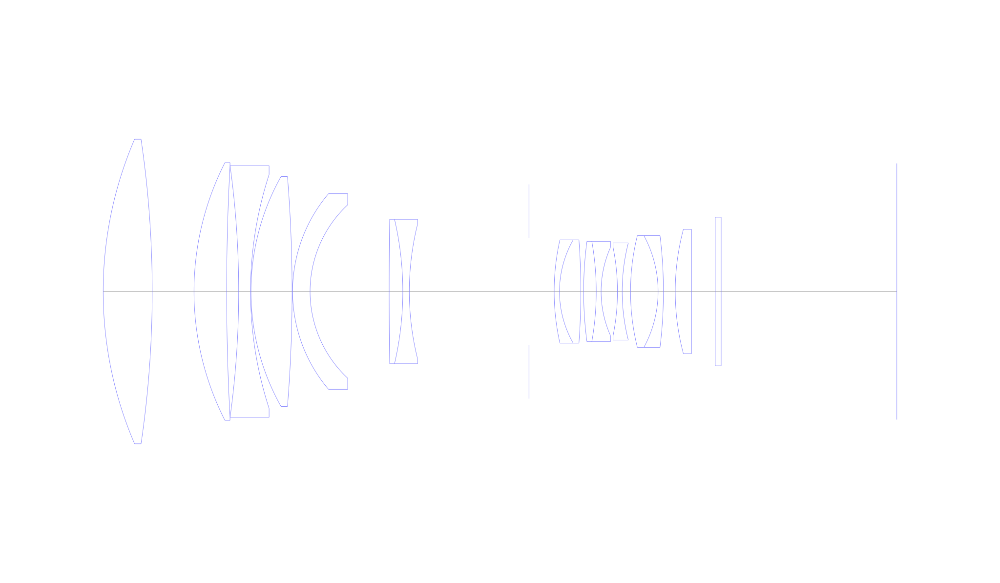
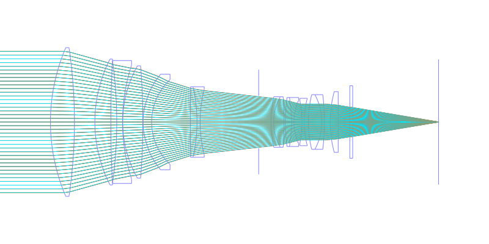
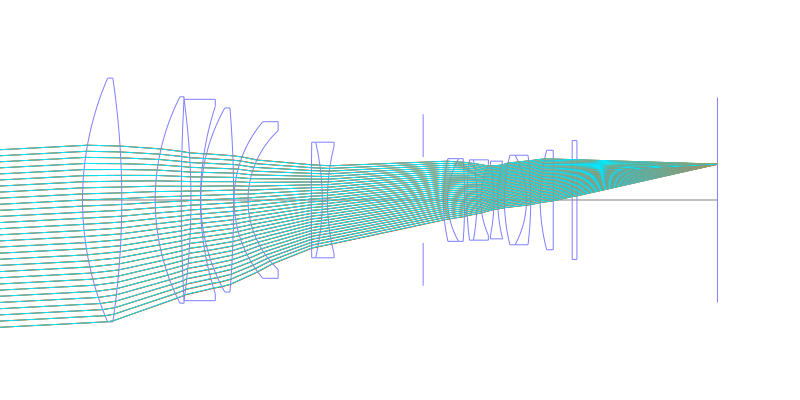
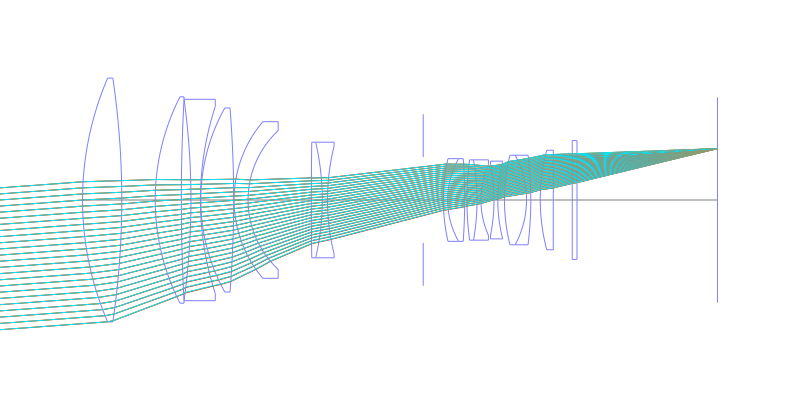
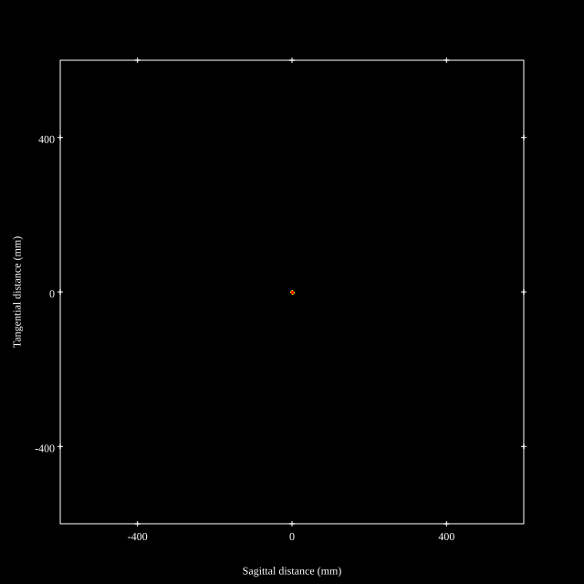
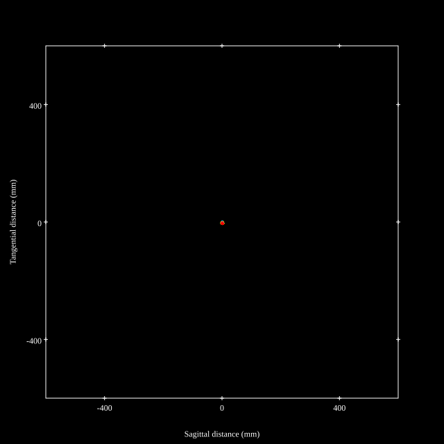
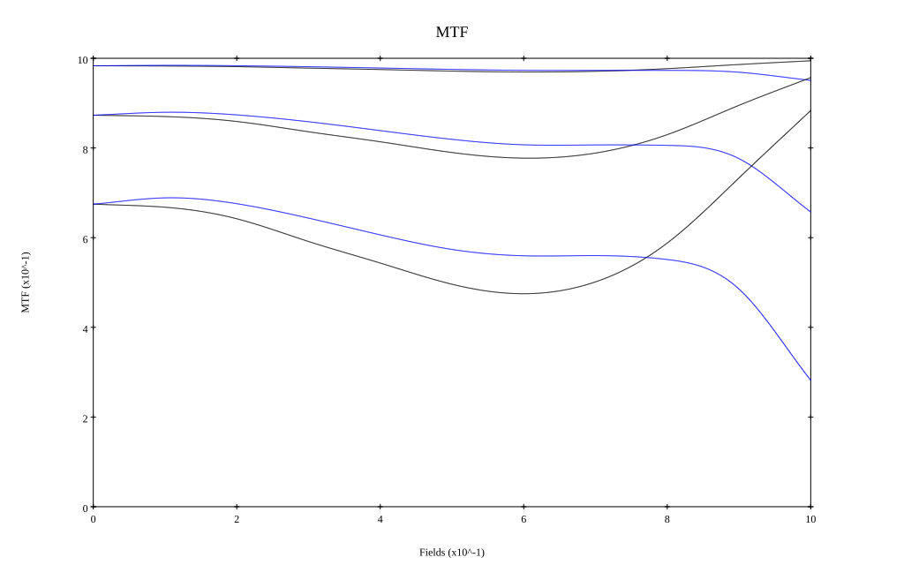
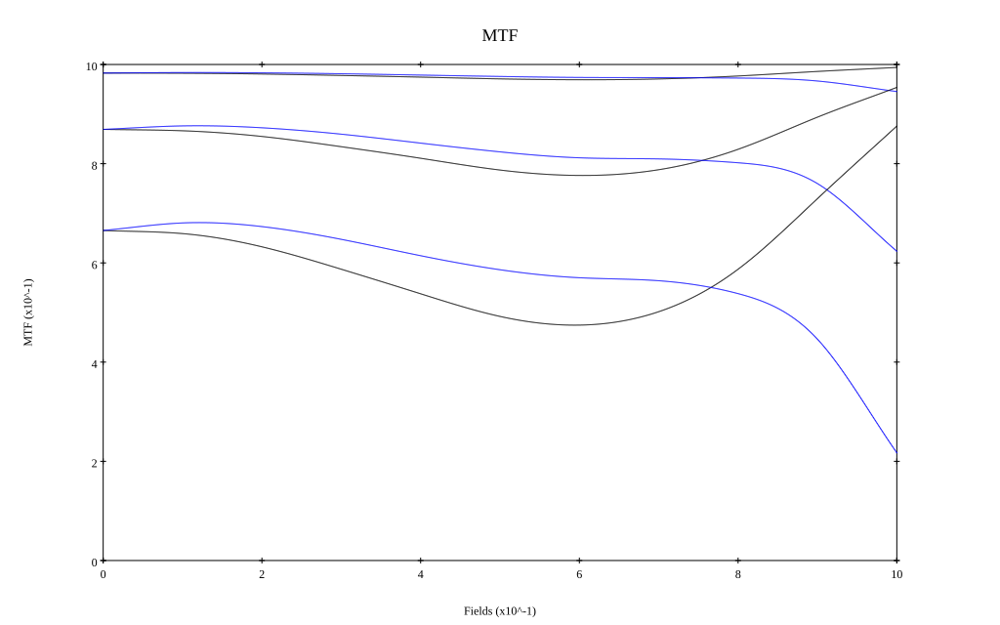

# Canon EF300mm f2.8L IS USM
## Patent Information
| Country | Patent Number | Example | Year of Application | Inventors | Organisation | Link |
| ---     | ---           | ---     | ---                 | ---       | ---          | ---  |
|US | US6115188 | 1 | 1998 |     Akihiro Nishio,Hideki Ogawa,Makoto Misaka | CANON KABUSHIKI KAISHA | [link](https://patents.google.com/patent/US6115188A/en) |
## Surface Data
Note that where glass types are shown the refractive index and abbe number is as per assigned glass type

| ID  | Radius | Thickness | Diameter | nd  | vd  | Glass Make | Glass |
| --- | ---    | ---       | ---      | --- | --- | ---        | ---   |
| 1 | 130.154 | 16.56 | 102.9 | 1.497 | 81.55 | Ohara | S-FPL51 |
| 2 | -352.589 | 14.11 | 102.9 |  |  |  |
| 3 | 96.004 | 11.02 | 87.1 | 1.497 | 81.55 | Ohara | S-FPL51 |
| 4 | 793.095 | 4.07 | 85.0 |  |  |  |
| 5 | -311.697 | 4.0 | 85.0 | 1.78582 | 44.05 | Schott | N-LAF33 |
| 6 | 127.604 | 0.15 | 79.0 |  |  |  |
| 7 | 79.467 | 13.88 | 77.7 | 1.43384 | 95.26 | Hikari | NICF-A |
| 8 | -483.755 | 0.17 | 77.7 |  |  |  |
| 9 | 51.083 | 5.9 | 66.1 | 1.48749 | 70.24 | Ohara | S-FSL5 |
| 10 | 40.134 | 26.71 | 58.6 |  |  |  |
| 11 | 1686.885 | 4.61 | 48.8 | 1.80518 | 25.43 | Ohara | S-TIH6 |
| 12 | -107.66 | 2.2 | 48.8 | 1.83481 | 42.71 | Ohara | S-LAH55 |
| 13 | 94.265 | 40.4 | 45.5 |  |  |  |
| 14 | AS | 8.51 | 36.204 |  |  |  |
| 15 | 79.49 | 1.8 | 34.9 | 1.84666 | 23.88 | Ohara | S-NPH53 |
| 16 | 35.239 | 7.2 | 34.9 | 1.71999 | 50.25 | Ohara | LAL10 |
| 17 | -238.114 | 0.95 | 34.9 |  |  |  |
| 18 | 129.72 | 4.25 | 33.9 | 1.84666 | 23.88 | Ohara | S-NPH53 |
| 19 | -97.425 | 1.65 | 33.9 | 1.60311 | 60.64 | Ohara | S-BSM14 |
| 20 | 36.658 | 5.52 | 29.8 |  |  |  |
| 21 | -76.051 | 1.6 | 29.8 | 1.7725 | 49.6 | Ohara | S-LAH66 |
| 22 | 66.247 | 2.82 | 32.8 |  |  |  |
| 23 | 78.646 | 9.3 | 37.8 | 1.71999 | 50.25 | Ohara | LAL10 |
| 24 | -39.586 | 1.8 | 37.8 | 1.834 | 37.16 | Ohara | S-LAH60 |
| 25 | -155.699 | 4.0 | 37.8 |  |  |  |
| 26 | 81.751 | 5.5 | 42.0 | 1.6968 | 55.53 | Ohara | S-LAL14 |
| 27 | 0.0 | 8.0 | 42.0 |  |  |  |
| 28 | 0.0 | 2.0 | 50.2 | 1.51633 | 64.14 | Ohara | S-BSL7 |
| 29 | 0.0 | 59.29 | 50.2 |  |  |  |
## Layouts

## Spot Diagrams

## Paraxial Parameters
| parameter | value |
| ---       | ---   |
| effective_focal_length |293.583
| back_focal_length | 59.302
| optical_invariant | 3.717
| object_distance | 1.0E10
| image_distance | 59.302
| power | 0.003
| pp1_H | 22.316
| ppk_H' | -234.281
| ffl_F | -271.268
| fno | 2.9
| enp_dist_P | 443.697
| enp_radius | 50.621
| exp_dist_P' | -61.24
| exp_radius | 20.786
| m | -0
| red | -3.406190932941637E7
| n_obj | 1
| n_img | 1
| img_ht | 21.559
| obj_ang | 4.2
| obj_na | 0
| img_na | -0.17|
## Spot Analysis
| Field | Spot Mean Radius | Spot Max Radius |
| ---   | ---              | ---             |
 | Field(x=0.0, y=0.0) | 1.032 | 2.662|
 | Field(x=0.0, y=0.1) | 1.038 | 3.152|
 | Field(x=0.0, y=0.2) | 1.212 | 3.63|
 | Field(x=0.0, y=0.3) | 1.515 | 4.031|
 | Field(x=0.0, y=0.4) | 1.894 | 4.949|
 | Field(x=0.0, y=0.5) | 2.28 | 5.436|
 | Field(x=0.0, y=0.6) | 2.587 | 5.871|
 | Field(x=0.0, y=0.7) | 2.734 | 6.932|
 | Field(x=0.0, y=0.8) | 2.772 | 7.429|
 | Field(x=0.0, y=0.9) | 3.011 | 7.274|
 | Field(x=0.0, y=1.0) | 4.11 | 7.787|
## Polychromatic Geometric MTF

* 10,30,50 cycles/mm
* Black lines represent sagittal, blue tangential
* To generate above, MTFs for wavelengths 587.5618(d), 486.1327(F), 656.2725(C) were calculated across 10 fields, and then averaged
## Polychromatic Geometric MTF (Weighted)

* 10,30,50 cycles/mm
* Black lines represent sagittal, blue tangential
* To generate above, MTFs for wavelengths 587.5618(d) wt(1.0), 656.2725(C) wt(0.475), 546.074(e) wt(0.98), 486.1327(F) wt(0.49), 435.8343(g) wt(0.15) were calculated across 10 fields, and then combined using weighted average
## Resources
* [OpticalBench Compatible Data File, tab delimited](./prescription.txt)
* [Zemax file](./US006115188_Example01P.zmx)

Report / Zemax file generated using [Beam42](https://github.com/BeamFour/Beam42) on 2026-04-06
