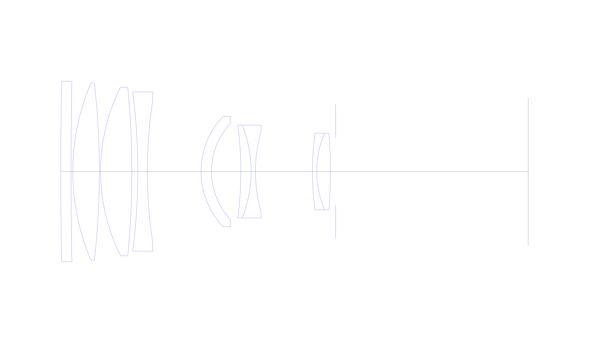
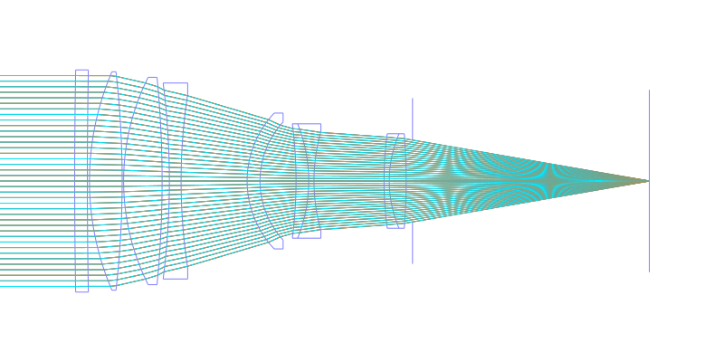
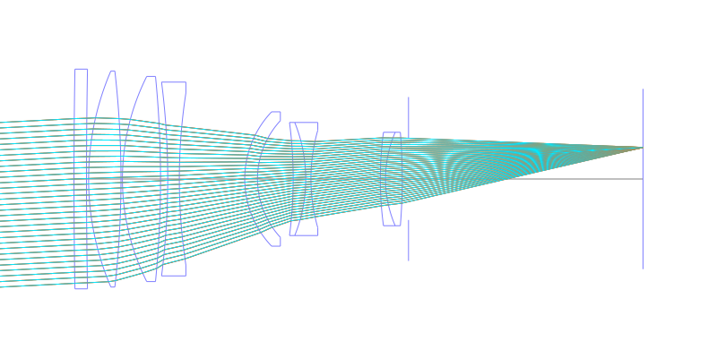
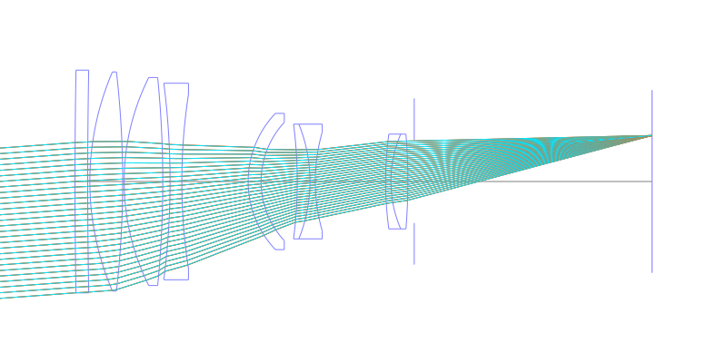
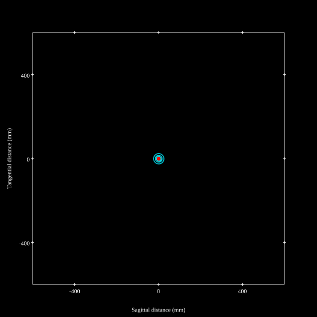
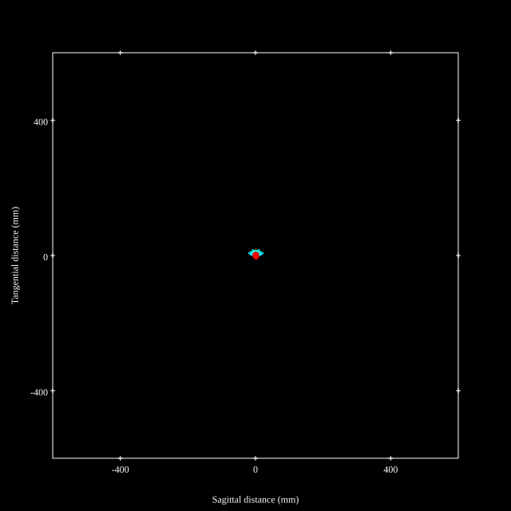
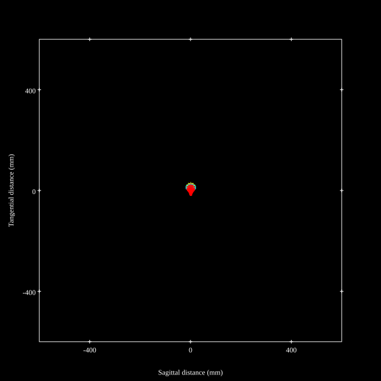
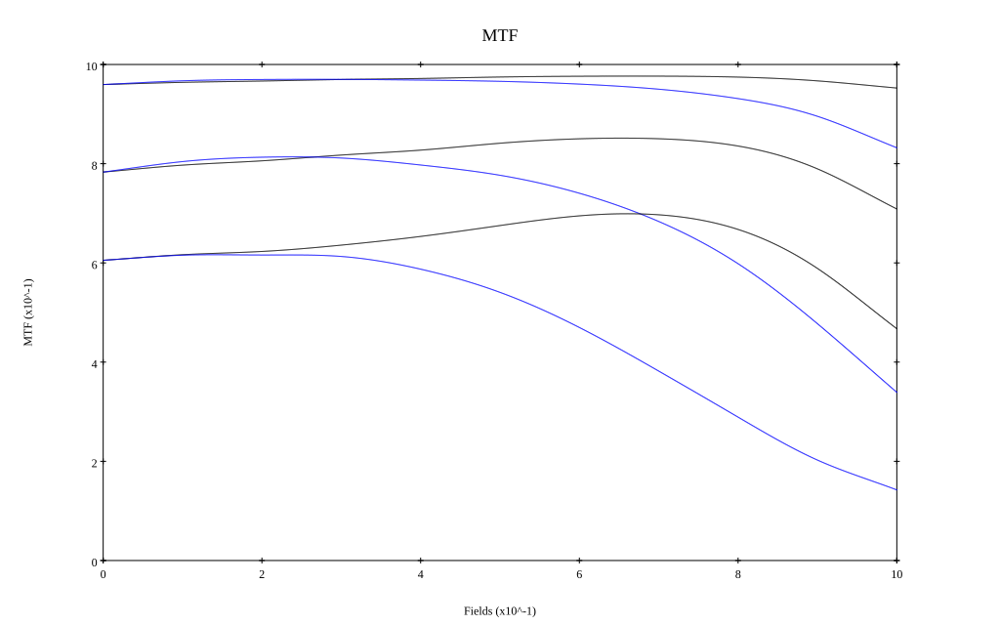
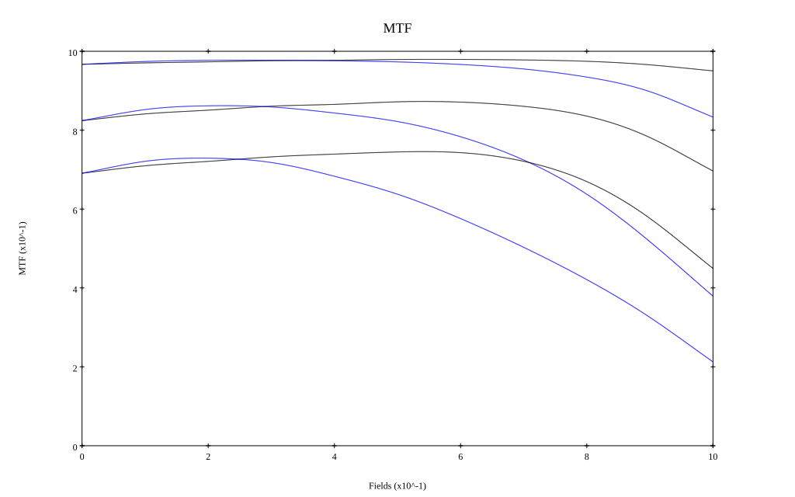

## Surface Data
Note that where glass types are shown the refractive index and abbe number is as per assigned glass type

| ID  | Radius | Thickness | Diameter | nd  | vd  | Glass Make | Glass |
| --- | ---    | ---       | ---      | --- | --- | ---        | ---   |
| 1 | 3000.0 | 6.0 | 105.29 | 1.51633 | 64.15 | Ohara | BSL7 |
| 2 | 3000.0 | 1.0 | 105.29 |  |  |  |
| 3 | 131.223 | 15.5 | 103.54 | 1.43384 | 95.26 | Hikari | NICF-A |
| 4 | -456.958 | 0.69 | 103.54 |  |  |  |
| 5 | 109.758 | 18.23 | 98.3 | 1.497 | 81.55 | Ohara | S-FPL51 |
| 6 | -503.471 | 3.45 | 98.3 |  |  |  |
| 7 | -366.505 | 5.55 | 92.88 | 1.72047 | 34.71 | Ohara | S-NBH8 |
| 8 | 272.539 | 31.3 | 82.38 |  |  |  |
| 9 | 46.737 | 6.1 | 64.38 | 1.58913 | 61.15 | Ohara | L-BAL35 |
| 10 | 41.176 | 17.08 | 55.92 |  |  |  |
| 11 | -209.801 | 6.0 | 54.2 | 1.80518 | 25.43 | Ohara | S-TIH6 |
| 12 | -72.597 | 2.5 | 54.2 | 1.6134 | 43.84 | Ohara | BPM4 |
| 13 | 84.88 | 33.2 | 46.77 |  |  |  |
| 14 | 166.488 | 2.5 | 44.78 | 1.713 | 53.85 | Ohara | LAL8 |
| 15 | 56.556 | 8.0 | 44.78 | 1.618 | 63.39 | Ohara | PHM52 |
| 16 | -276.571 | 3.0 | 44.78 |  |  |  |
| 17 | AS | 112.23 | 39.273 |  |  |  |
## Layouts

## Spot Diagrams

## Paraxial Parameters
| parameter | value |
| ---       | ---   |
| effective_focal_length |293.472
| back_focal_length | 112.222
| optical_invariant | 3.715
| object_distance | 1.0E10
| image_distance | 112.222
| power | 0.003
| pp1_H | -36.663
| ppk_H' | -181.25
| ffl_F | -330.136
| fno | 2.901
| enp_dist_P | 437.324
| enp_radius | 50.589
| exp_dist_P' | -0.008
| exp_radius | 19.345
| m | -0
| red | -3.40747647080962E7
| n_obj | 1
| n_img | 1
| img_ht | 21.551
| obj_ang | 4.2
| obj_na | 0
| img_na | -0.17|
## Spot Analysis
| Field | Spot Mean Radius | Spot Max Radius |
| ---   | ---              | ---             |
 | Field(x=0.0, y=0.0) | 7.321 | 26.389|
 | Field(x=0.0, y=0.1) | 5.997 | 27.572|
 | Field(x=0.0, y=0.2) | 5.638 | 26.567|
 | Field(x=0.0, y=0.3) | 5.543 | 25.66|
 | Field(x=0.0, y=0.4) | 5.519 | 24.991|
 | Field(x=0.0, y=0.5) | 5.383 | 25.344|
 | Field(x=0.0, y=0.6) | 5.533 | 24.427|
 | Field(x=0.0, y=0.7) | 6.064 | 23.856|
 | Field(x=0.0, y=0.8) | 7.095 | 23.197|
 | Field(x=0.0, y=0.9) | 8.658 | 27.785|
 | Field(x=0.0, y=1.0) | 10.859 | 33.603|
## Polychromatic Geometric MTF

* 10,30,50 cycles/mm
* Black lines represent sagittal, blue tangential
* To generate above, MTFs for wavelengths 587.5618(d), 486.1327(F), 656.2725(C) were calculated across 10 fields, and then averaged
## Polychromatic Geometric MTF (Weighted)

* 10,30,50 cycles/mm
* Black lines represent sagittal, blue tangential
* To generate above, MTFs for wavelengths 587.5618(d) wt(1.0), 656.2725(C) wt(0.475), 546.074(e) wt(0.98), 486.1327(F) wt(0.49), 435.8343(g) wt(0.15) were calculated across 10 fields, and then combined using weighted average
## Resources
* [OpticalBench Compatible Data File, tab delimited](./prescription.txt)
* [Zemax file](./US006288845_Example01P.zmx)

Report / Zemax file generated using [Beam42](https://github.com/BeamFour/Beam42) on 2026-04-04
