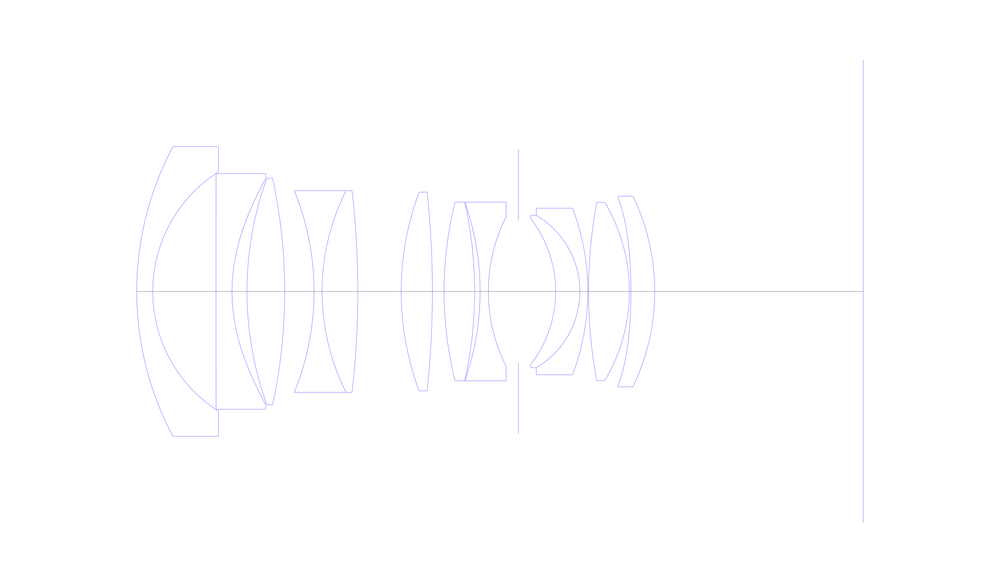
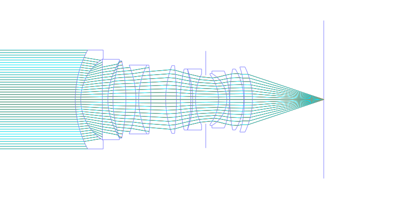
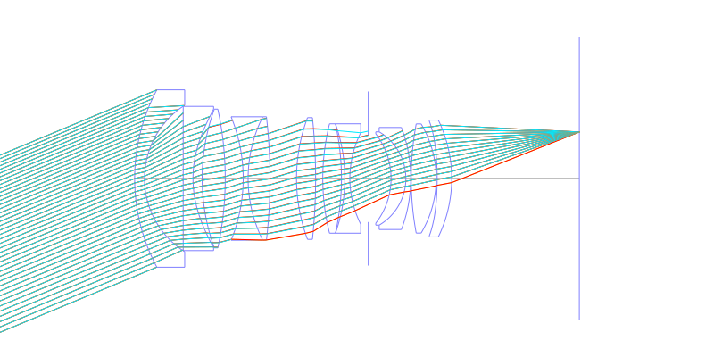
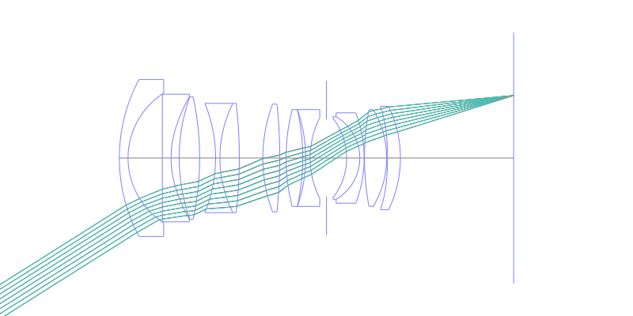
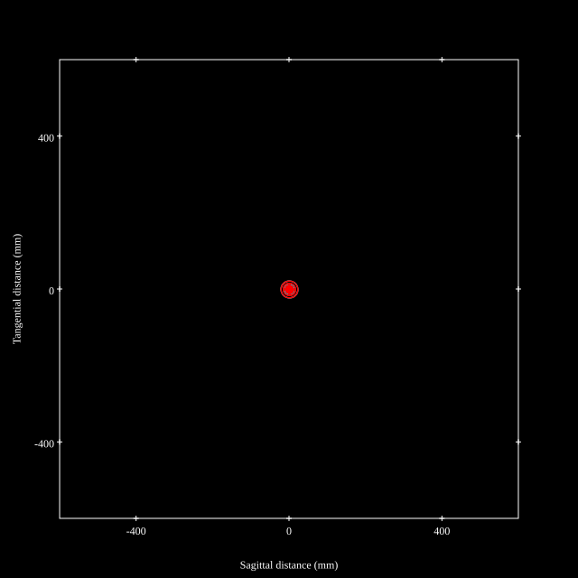
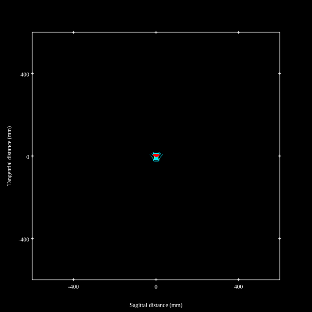
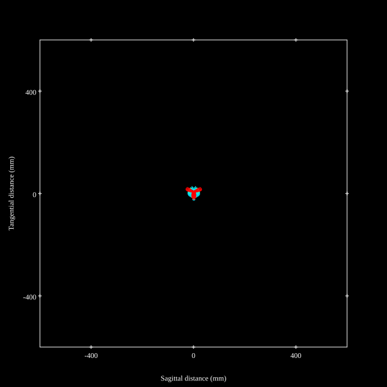
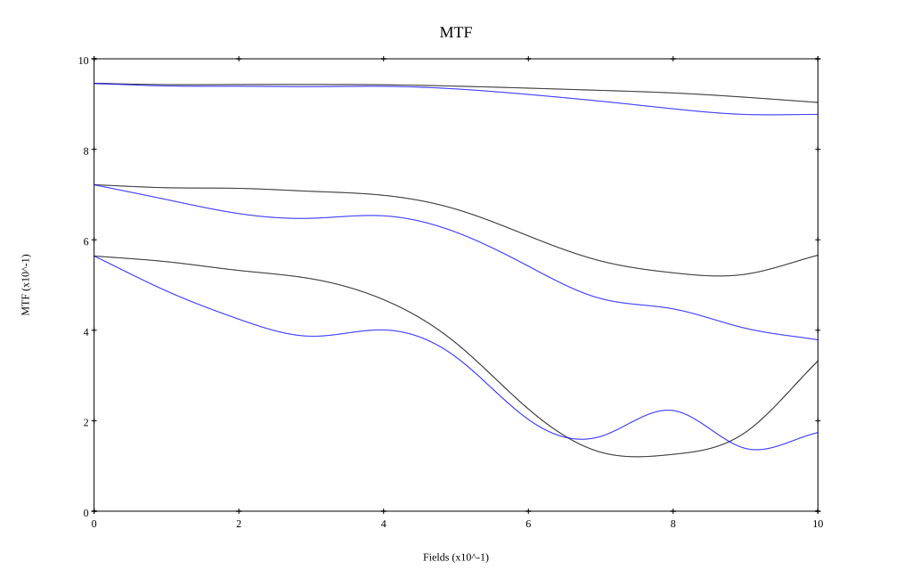
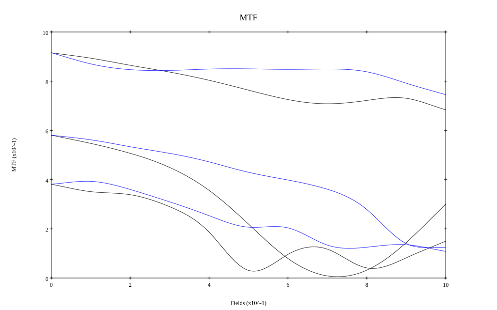

# Canon EF 35mm f1.4L USM II
## Patent Information
| Country | Patent Number | Example | Year of Application | Inventors | Organisation | Link |
| ---     | ---           | ---     | ---                 | ---       | ---          | ---  |
|JP | JP 2015-200845 | EX 1 | 2014 | MIZUMA AKIRA | Canon Inc | [link](https://patentscope.wipo.int/search/en/detail.jsf?docId=JP273791941) |
## Surface Data
Note that where glass types are shown the refractive index and abbe number is as per assigned glass type

| ID  | Radius | Thickness | Diameter | nd  | vd  | Glass Make | Glass |
| --- | ---    | ---       | ---      | --- | --- | ---        | ---   |
| 1 | 73.355 | 3.5 | 53.96 | 1.58313 | 59.37 | Ohara | S-BAL42 |
| 2 | 27.7 | 11.46 | 44.58 |  |  |  |
| 3 | -307.49 | 1.85 | 44.24 | 1.48749 | 70.24 | Ohara | S-FSL5 |
| 4 | 52.694 | 5.39 | 42.28 |  |  |  |
| 5 | -260.875 | 4.01 | 42.28 | 1.90366 | 31.34 | Ohara | S-LAH95 |
| 6 | -73.913 | 3.89 | 42.28 |  |  |  |
| 7 | -41.457 | 1.85 | 41.96 | 1.60342 | 38.03 | Ohara | S-TIM5 |
| 8 | 110.769 | 0.2 | 43.16 |  |  |  |
| 9 | 74.88 | 6.93 | 44.14 | 1.91082 | 35.25 | Hoya | TAFD35 |
| 10 | -112.546 | 0.2 | 44.14 |  |  |  |
| 11 | 90.943 | 10.39 | 41.84 | 1.59522 | 67.74 | Ohara | S-FPM2 |
| 12 | -38.225 | 1.7 | 41.84 | 1.738 | 32.26 | Ohara | S-NBH53 |
| 13 | -81.837 | 8.46 | 40.42 |  |  |  |
| 14 | 47.083 | 5.24 | 36.94 | 1.91082 | 35.25 | Hoya | TAFD35 |
| 15 | -1364.203 | 1.4 | 36.94 |  |  |  |
| 16 | 196.395 | 4.08 | 33.66 | 1.59522 | 67.74 | Ohara | S-FPM2 |
| 17 | -75.554 | 1.0 | 33.66 | 1.54493 | 25.3 |  |
| 18 | -51.514 | 1.55 | 33.66 | 1.69895 | 30.13 | Ohara | S-TIM35 |
| 19 | 29.651 | 5.83 | 27.92 |  |  |  |
| 20 | AS | 6.96 | 26.611 |  |  |  |
| 21 | -22.117 | 4.42 | 26.82 | 1.497 | 81.55 | Ohara | S-FPL51 |
| 22 | -16.399 | 1.5 | 27.92 | 1.738 | 32.26 | Ohara | S-NBH53 |
| 23 | -52.708 | 0.13 | 30.66 |  |  |  |
| 24 | 123.246 | 7.39 | 32.98 | 1.59522 | 67.74 | Ohara | S-FPM2 |
| 25 | -31.376 | 0.14 | 32.98 |  |  |  |
| 26 | -103.187 | 4.35 | 35.56 | 1.854 | 40.39 | Ohara | L-LAH85 |
| 27 | -38.56 | 38.99 | 35.56 |  |  |  |
## Aspherical Data
| ID  | k   | P1  | P2  | P3  | P3 | P5 | P6 | P7 | P8 | P9 | P10 |
| --- | --- | --- | --- | --- | --- | --- | --- | --- | --- | --- | --- |
| 2 | 0.0 | 0.0 | -8.44469E-7 | -1.40474E-9 | -1.12523E-12 | 9.45006E-16 | -3.55532E-18 | 0.0 | 0.0 | 0.0 | 0.0 |
| 26 | 0.0 | 0.0 | -6.94362E-6 | -1.20811E-9 | 8.28446E-13 | -2.15964E-14 | 2.93999E-17 | 0.0 | 0.0 | 0.0 | 0.0 |
## Layouts

## Spot Diagrams

## Paraxial Parameters
| parameter | value |
| ---       | ---   |
| effective_focal_length |34.293
| back_focal_length | 38.988
| optical_invariant | 7.464
| object_distance | 1.0E10
| image_distance | 38.988
| power | 0.029
| pp1_H | 58.033
| ppk_H' | 4.695
| ffl_F | 23.74
| fno | 1.449
| enp_dist_P | 38.935
| enp_radius | 11.83
| exp_dist_P' | -38.406
| exp_radius | 26.698
| m | -0
| red | -2.916045321947517E8
| n_obj | 1
| n_img | 1
| img_ht | 21.637
| obj_ang | 32.25
| obj_na | 0
| img_na | -0.326|
## Spot Analysis
| Field | Spot Mean Radius | Spot Max Radius |
| ---   | ---              | ---             |
 | Field(x=0.0, y=0.0) | 7.486 | 25.491|
 | Field(x=0.0, y=0.1) | 8.02 | 28.864|
 | Field(x=0.0, y=0.2) | 7.62 | 30.691|
 | Field(x=0.0, y=0.3) | 7.335 | 38.263|
 | Field(x=0.0, y=0.4) | 7.402 | 48.14|
 | Field(x=0.0, y=0.5) | 7.608 | 44.639|
 | Field(x=0.0, y=0.6) | 8.114 | 39.026|
 | Field(x=0.0, y=0.7) | 8.722 | 31.186|
 | Field(x=0.0, y=0.8) | 9.487 | 27.368|
 | Field(x=0.0, y=0.9) | 10.191 | 29.913|
 | Field(x=0.0, y=1.0) | 10.574 | 35.834|
## Polychromatic Geometric MTF

* 10,30,50 cycles/mm
* Black lines represent sagittal, blue tangential
* To generate above, MTFs for wavelengths 587.5618(d), 486.1327(F), 656.2725(C) were calculated across 10 fields, and then averaged
## Polychromatic Geometric MTF (Weighted)

* 10,30,50 cycles/mm
* Black lines represent sagittal, blue tangential
* To generate above, MTFs for wavelengths 587.5618(d) wt(1.0), 656.2725(C) wt(0.475), 546.074(e) wt(0.98), 486.1327(F) wt(0.49), 435.8343(g) wt(0.15) were calculated across 10 fields, and then combined using weighted average
## Resources
* [OpticalBench Compatible Data File, tab delimited](./JP2015-200845_Example01.txt)
* [Zemax file](./JP2015-200845_Example01.zmx)

This report / Zemax file generated using [Beam42](https://github.com/BeamFour/Beam42) on 2026-01-19
