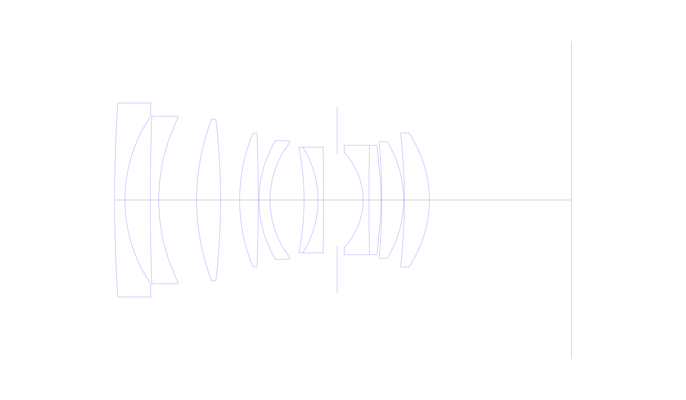
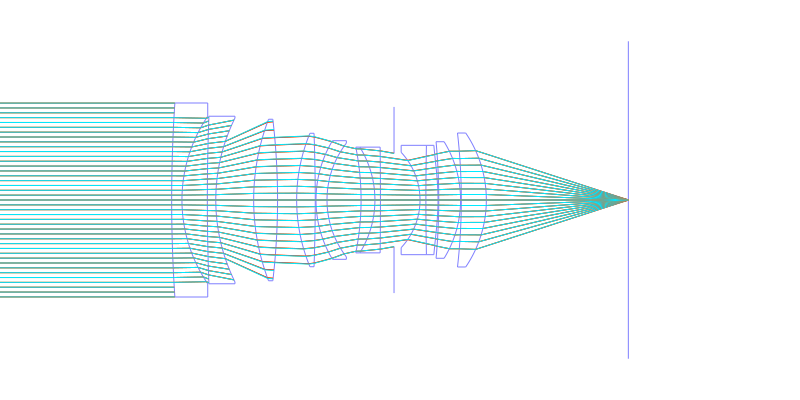
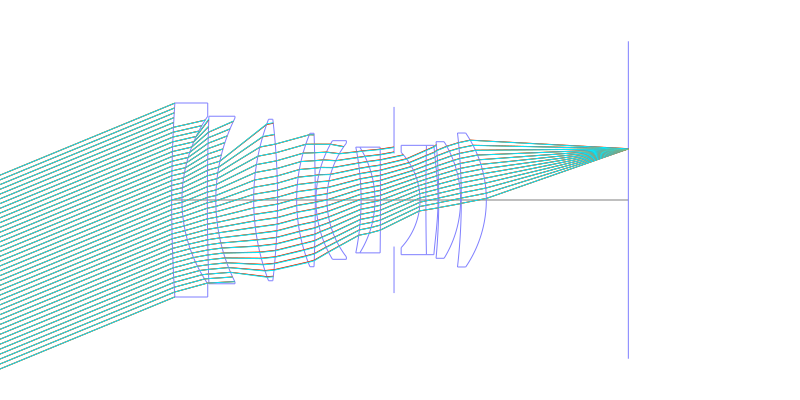
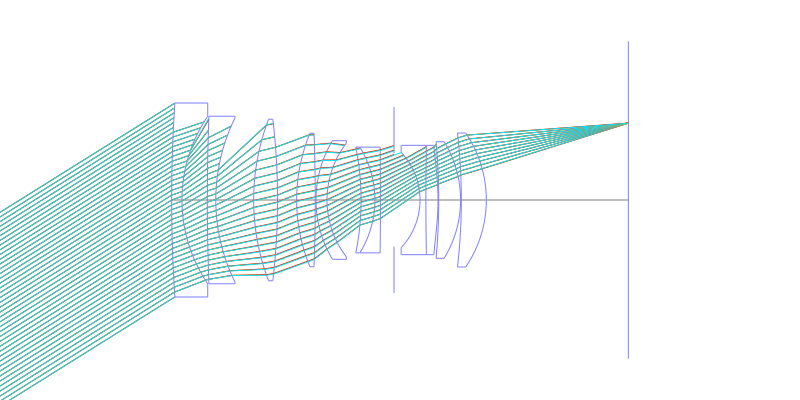
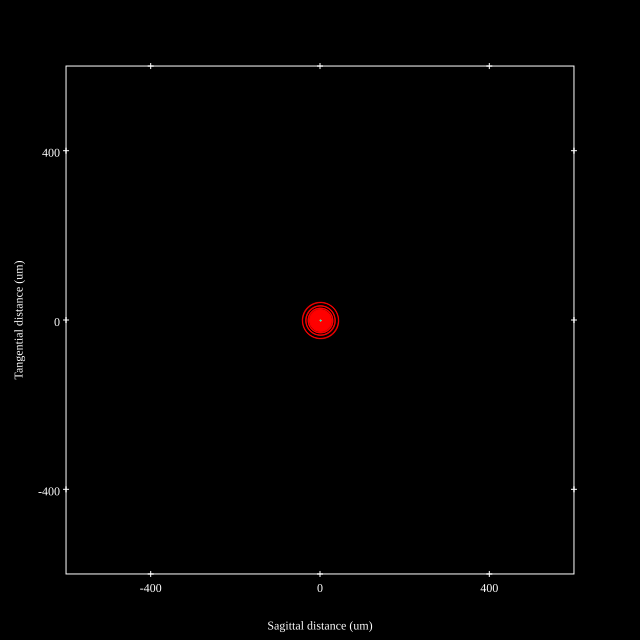
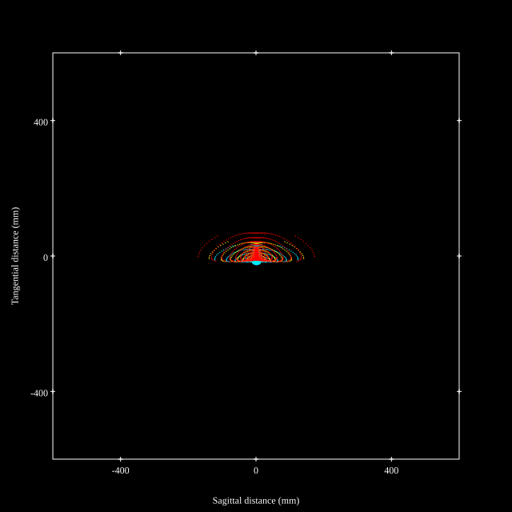
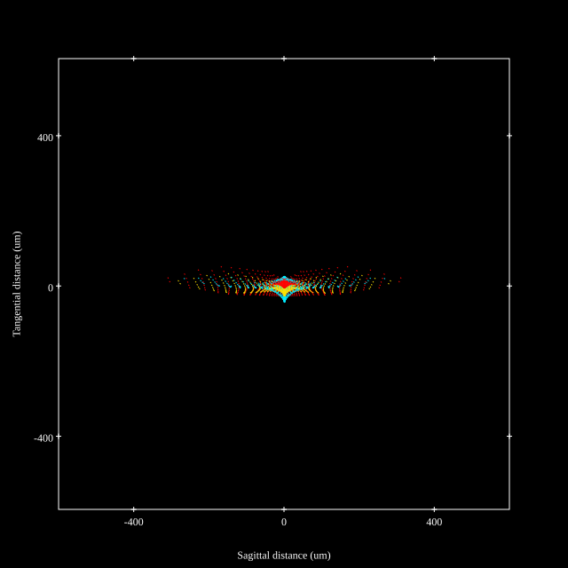
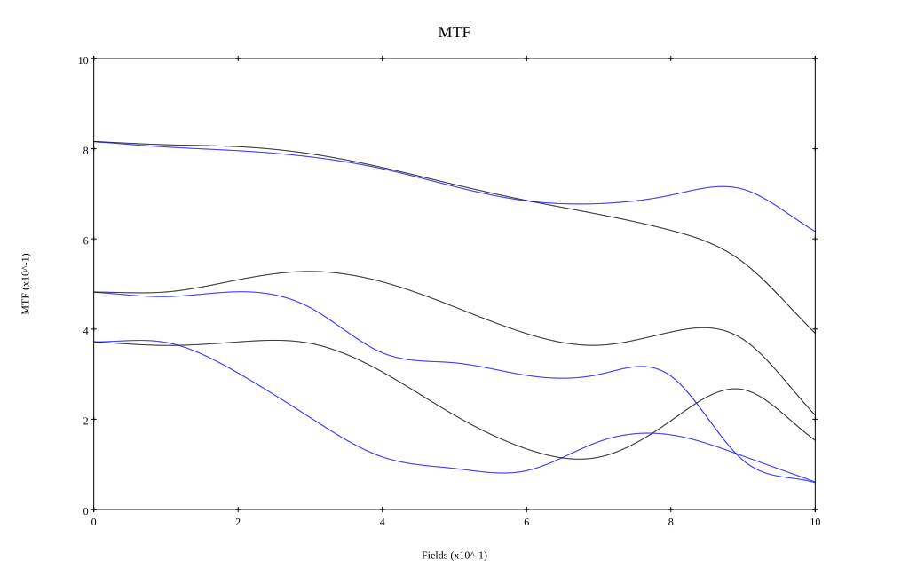
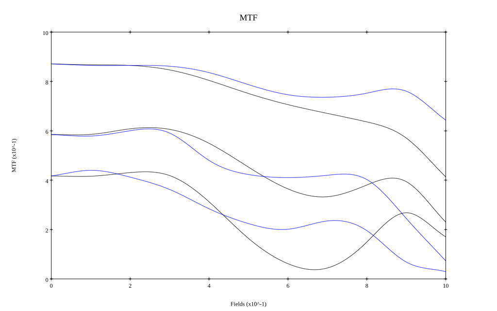

# Canon EF 35mm f1.4L USM
## Patent Information
| Country | Patent Number | Example | Year of Application | Inventors | Organisation | Link |
| ---     | ---           | ---     | ---                 | ---       | ---          | ---  |
|JP | JP 1999-211978 | EX 1 | 1998 | MURATA YASUNORI, MITSUSAKA MAKOTO | Canon Inc | [link](https://www.j-platpat.inpit.go.jp/c1801/PU/JP-H11-211978/11/en) |
## Surface Data
Note that where glass types are shown the refractive index and abbe number is as per assigned glass type

| ID  | Radius | Thickness | Diameter | nd  | vd  | Glass Make | Glass |
| --- | ---    | ---       | ---      | --- | --- | ---        | ---   |
| 1 | 400.0 | 2.8 | 52.8 | 1.58313 | 59.39 | Ohara | L-BAL42 |
| 2 | 40.544 | 6.91 | 45.6 |  |  |  |
| 3 | 606.181 | 2.3 | 45.6 | 1.58313 | 59.39 | Ohara | L-BAL42 |
| 4 | 50.282 | 10.31 | 44.62 |  |  |  |
| 5 | 61.687 | 6.5 | 43.96 | 1.713 | 53.83 | Schott | N-LAK8 |
| 6 | -188.04 | 5.2 | 43.96 |  |  |  |
| 7 | 47.477 | 5.06 | 36.32 | 1.713 | 53.83 | Schott | N-LAK8 |
| 8 | -490.98 | 0.2 | 36.32 |  |  |  |
| 9 | 31.299 | 3.0 | 32.28 | 1.51633 | 64.14 | Ohara | S-BSL7 |
| 10 | 25.382 | 9.27 | 30.96 |  |  |  |
| 11 | -72.82 | 3.77 | 28.78 | 1.83481 | 42.71 | Ohara | S-LAH55 |
| 12 | -27.213 | 1.5 | 28.78 | 1.6398 | 34.47 | Ohara | S-TIM27 |
| 13 | -1242.161 | 3.7 | 28.78 |  |  |  |
| 14 | AS | 7.07 | 25.335 |  |  |  |
| 15 | -18.961 | 1.6 | 25.94 | 1.80518 | 25.43 | Ohara | S-TIH6 |
| 16 | 759.56 | 3.3 | 29.76 | 1.83481 | 42.71 | Ohara | S-LAH55 |
| 17 | -65.346 | 0.2 | 29.76 |  |  |  |
| 18 | -172.7 | 5.94 | 31.72 | 1.7725 | 49.6 | Ohara | S-LAH66 |
| 19 | -30.321 | 0.2 | 31.72 |  |  |  |
| 20 | -160.598 | 6.81 | 36.46 | 1.7725 | 49.6 | Ohara | S-LAH66 |
| 21 | -32.418 | 38.624 | 36.46 |  |  |  |
## Aspherical Data
| ID  | k   | P1  | P2  | P3  | P3 | P5 | P6 | P7 | P8 | P9 | P10 |
| --- | --- | --- | --- | --- | --- | --- | --- | --- | --- | --- | --- |
| 17 | 2.39046 | 0.0 | 1.36838E-5 | 3.28097E-10 | -1.1445E-11 | 0.0 | 0.0 | 0.0 | 0.0 | 0.0 | 0.0 |
## Layouts

## Spot Diagrams

## Paraxial Parameters
| parameter | value |
| ---       | ---   |
| effective_focal_length |34.295
| back_focal_length | 38.653
| optical_invariant | 7.39
| object_distance | 1.0E10
| image_distance | 38.653
| power | 0.029
| pp1_H | 54.974
| ppk_H' | 4.358
| ffl_F | 20.679
| fno | 1.45
| enp_dist_P | 35.683
| enp_radius | 11.826
| exp_dist_P' | -39.704
| exp_radius | 27.03
| m | -0
| red | -2.915897523072698E8
| n_obj | 1
| n_img | 1
| img_ht | 21.43
| obj_ang | 32
| obj_na | 0
| img_na | -0.326|
## Spot Analysis
| Field | Spot Mean Radius | Spot Max Radius |
| ---   | ---              | ---             |
 | Field(x=0.0, y=0.0) | 13.453 | 37.256|
 | Field(x=0.0, y=0.1) | 15.155 | 54.731|
 | Field(x=0.0, y=0.2) | 15.158 | 64.547|
 | Field(x=0.0, y=0.3) | 16.199 | 79.799|
 | Field(x=0.0, y=0.4) | 18.72 | 79.658|
 | Field(x=0.0, y=0.5) | 23.937 | 129.38|
 | Field(x=0.0, y=0.6) | 28.934 | 153.633|
 | Field(x=0.0, y=0.7) | 34.386 | 171.521|
 | Field(x=0.0, y=0.8) | 38.59 | 179.889|
 | Field(x=0.0, y=0.9) | 41.711 | 181.918|
 | Field(x=0.0, y=1.0) | 45.244 | 173.882|
## Polychromatic Geometric MTF

* 10,30,50 cycles/mm
* Black lines represent sagittal, blue tangential
* To generate above, MTFs for wavelengths 587.5618(d), 486.1327(F), 656.2725(C) were calculated across 10 fields, and then averaged
## Polychromatic Geometric MTF (Weighted)

* 10,30,50 cycles/mm
* Black lines represent sagittal, blue tangential
* To generate above, MTFs for wavelengths 587.5618(d) wt(1.0), 656.2725(C) wt(0.475), 546.074(e) wt(0.98), 486.1327(F) wt(0.49), 435.8343(g) wt(0.15) were calculated across 10 fields, and then combined using weighted average
## Resources
* [OpticalBench Compatible Data File, tab delimited](./JP1999-211978_Example01.txt)
* [Zemax file](./JP1999-211978_Example01.zmx)
