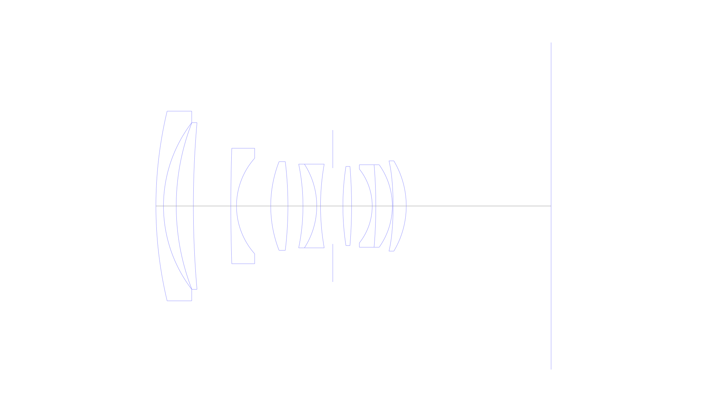
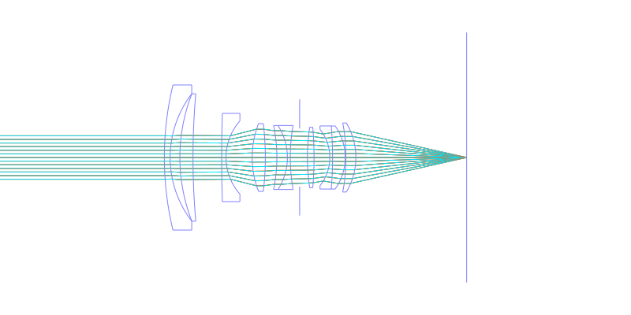
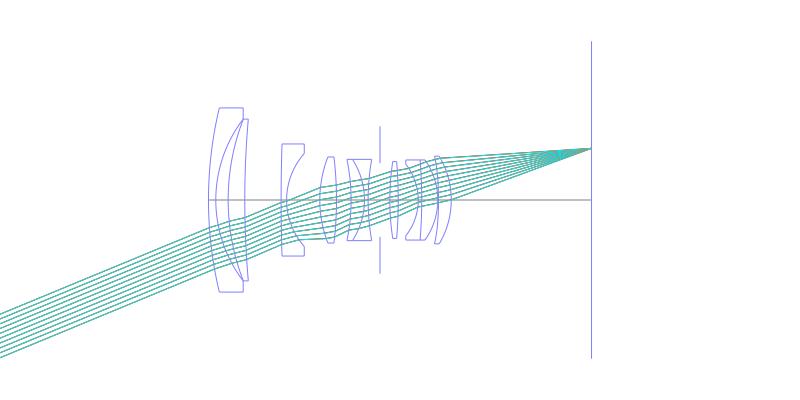
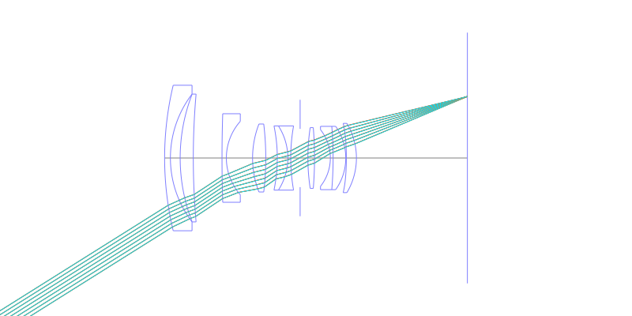
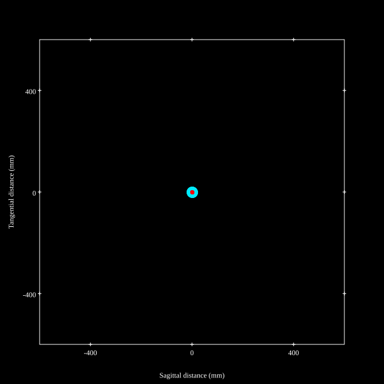
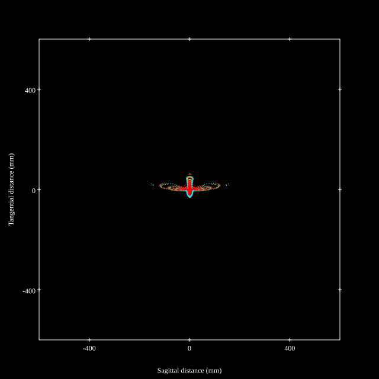
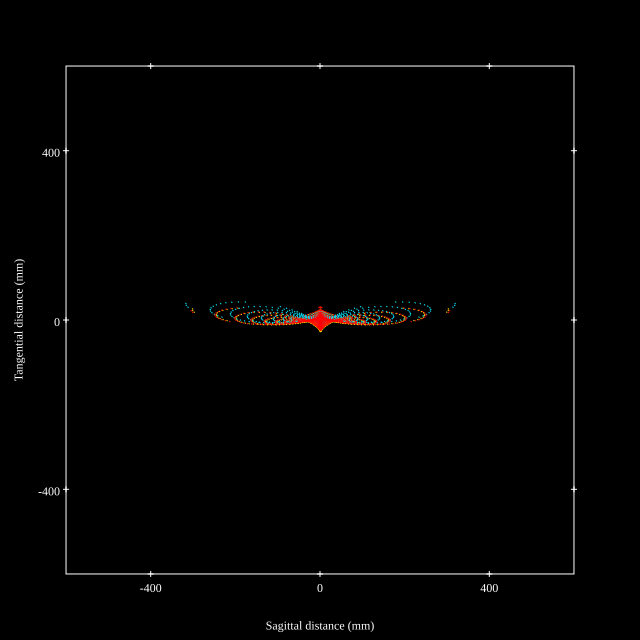
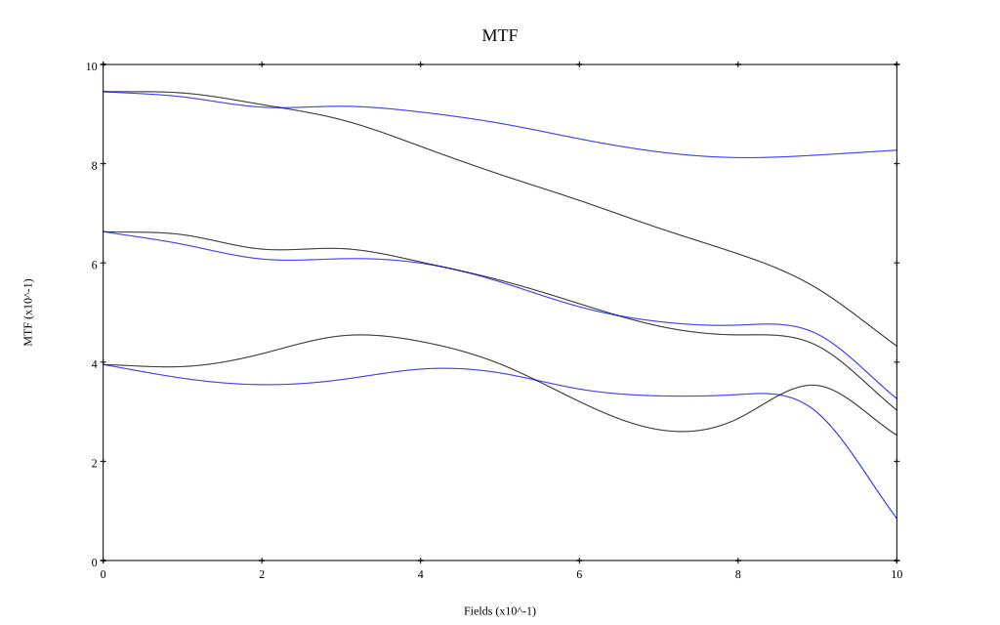
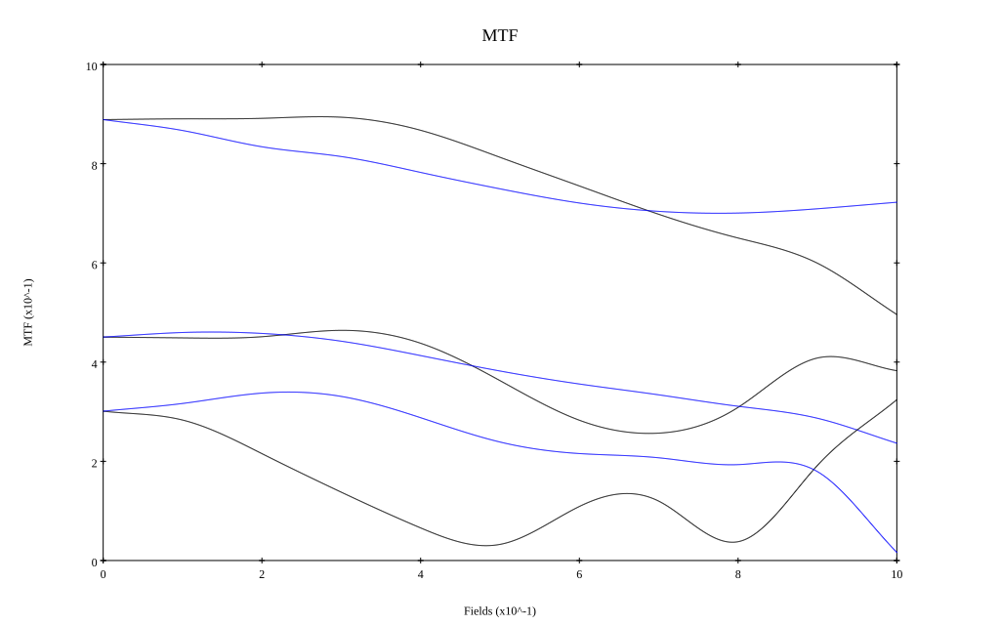

## Surface Data
Note that where glass types are shown the refractive index and abbe number is as per assigned glass type

| ID  | Radius | Thickness | Diameter | nd  | vd  | Glass Make | Glass |
| --- | ---    | ---       | ---      | --- | --- | ---        | ---   |
| 1 | 107.841 | 2.0 | 50.22 | 1.48749 | 70.2 |  |
| 2 | 36.325 | 3.37 | 44.12 |  |  |  |
| 3 | 60.9 | 4.53 | 44.12 | 1.7725 | 49.6 |  |
| 4 | 253.393 | 9.91 | 44.12 |  |  |  |
| 5 | 478.362 | 1.5 | 30.56 | 1.58144 | 40.8 |  |
| 6 | 19.063 | 9.05 | 25.32 |  |  |  |
| 7 | 32.422 | 4.55 | 23.46 | 1.883 | 40.8 |  |
| 8 | -98.623 | 3.98 | 23.46 |  |  |  |
| 9 | -54.46 | 3.64 | 22.16 | 1.883 | 40.8 |  |
| 10 | -20.463 | 1.0 | 22.16 | 1.61293 | 37.0 |  |
| 11 | 63.422 | 3.24 | 22.16 |  |  |  |
| 12 | AS | 2.68 | 20.101 |  |  |  |
| 13 | 69.18 | 2.29 | 20.96 | 1.6968 | 55.5 |  |
| 14 | -128.073 | 5.46 | 20.96 |  |  |  |
| 15 | -15.746 | 0.95 | 19.54 | 1.738 | 32.3 |  |
| 16 | -131.434 | 4.37 | 21.84 | 1.59522 | 67.7 |  |
| 17 | -18.862 | 0.2 | 21.84 |  |  |  |
| 18 | -91.82 | 3.48 | 23.9 | 1.58313 | 59.4 |  |
| 19 | -23.365 | 38.3 | 23.9 |  |  |  |
## Aspherical Data
| ID  | k   | P1  | P2  | P3  | P3 | P5 | P6 | P7 | P8 | P9 | P10 |
| --- | --- | --- | --- | --- | --- | --- | --- | --- | --- | --- | --- |
| 18 | 0.0 | 0.0 | -1.49529E-5 | 4.91763E-9 | -4.11063E-11 | 0.0 | 0.0 | 0.0 | 0.0 | 0.0 | 0.0 |
## Layouts

## Spot Diagrams

## Paraxial Parameters
| parameter | value |
| ---       | ---   |
| effective_focal_length |34.501
| back_focal_length | 38.301
| optical_invariant | 5.275
| object_distance | 1.0E10
| image_distance | 38.301
| power | 0.029
| pp1_H | 49.522
| ppk_H' | 3.799
| ffl_F | 15.02
| fno | 2.051
| enp_dist_P | 33.571
| enp_radius | 8.41
| exp_dist_P' | -25.867
| exp_radius | 15.641
| m | -0
| red | -2.898424847581541E8
| n_obj | 1
| n_img | 1
| img_ht | 21.643
| obj_ang | 32.1
| obj_na | 0
| img_na | -0.237|
## Spot Analysis
| Field | Spot Mean Radius | Spot Max Radius |
| ---   | ---              | ---             |
 | Field(x=0.0, y=0.0) | 9.441 | 20.679|
 | Field(x=0.0, y=0.1) | 10.193 | 31.317|
 | Field(x=0.0, y=0.2) | 11.607 | 46.205|
 | Field(x=0.0, y=0.3) | 11.948 | 47.686|
 | Field(x=0.0, y=0.4) | 13.558 | 61.389|
 | Field(x=0.0, y=0.5) | 16.806 | 88.867|
 | Field(x=0.0, y=0.6) | 21.923 | 121.568|
 | Field(x=0.0, y=0.7) | 28.866 | 157.177|
 | Field(x=0.0, y=0.8) | 37.434 | 201.772|
 | Field(x=0.0, y=0.9) | 49.557 | 252.416|
 | Field(x=0.0, y=1.0) | 64.033 | 307.37|
## Polychromatic Geometric MTF

* 10,30,50 cycles/mm
* Black lines represent sagittal, blue tangential
* To generate above, MTFs for wavelengths 587.5618(d), 486.1327(F), 656.2725(C) were calculated across 10 fields, and then averaged
## Polychromatic Geometric MTF (Weighted)

* 10,30,50 cycles/mm
* Black lines represent sagittal, blue tangential
* To generate above, MTFs for wavelengths 587.5618(d) wt(1.0), 656.2725(C) wt(0.475), 546.074(e) wt(0.98), 486.1327(F) wt(0.49), 435.8343(g) wt(0.15) were calculated across 10 fields, and then combined using weighted average
## Resources
* [OpticalBench Compatible Data File, tab delimited](./US20150205081_Example01P.txt)
* [Zemax file](./US20150205081_Example01P.zmx)

This report / Zemax file generated using [Beam42](https://github.com/BeamFour/Beam42) on 2026-01-19
