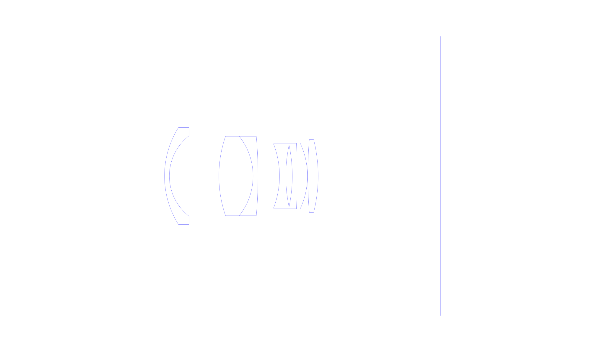
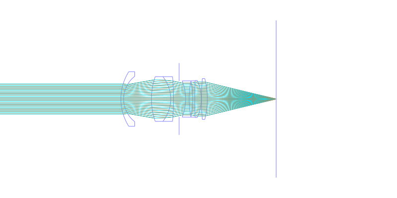
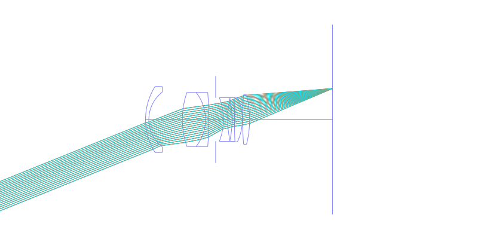
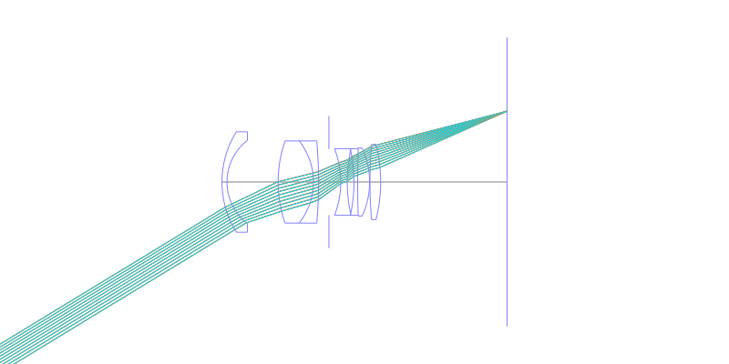
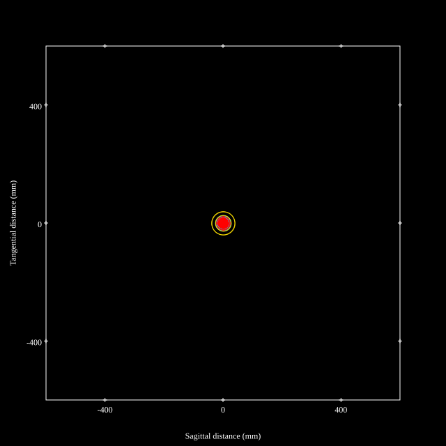
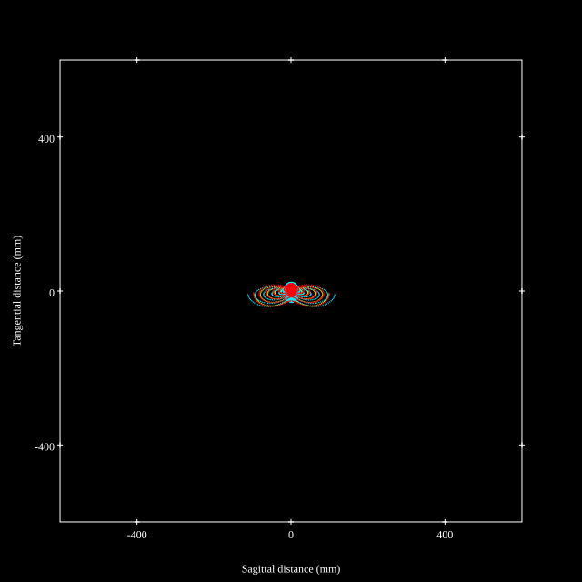
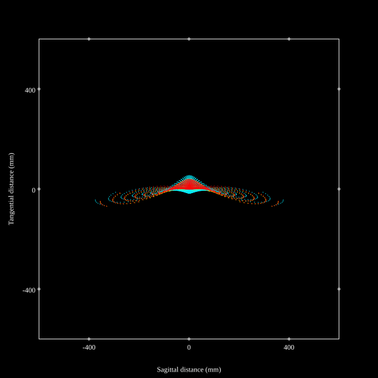
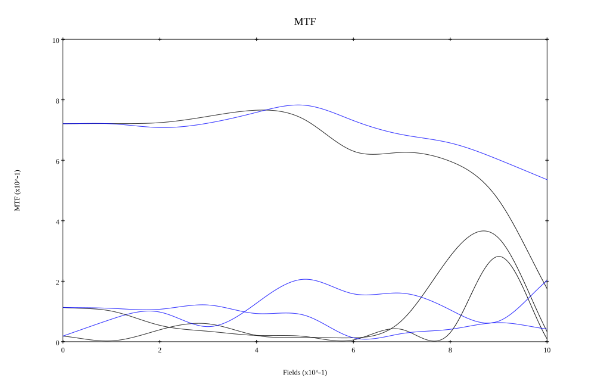
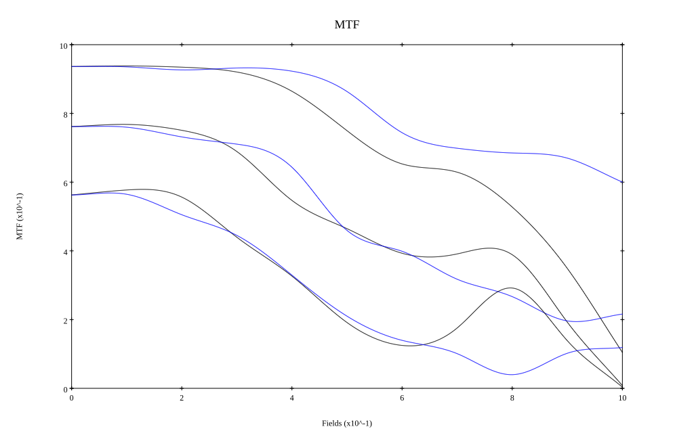

## Surface Data
Note that where glass types are shown the refractive index and abbe number is as per assigned glass type

| ID  | Radius | Thickness | Diameter | nd  | vd  | Glass Make | Glass |
| --- | ---    | ---       | ---      | --- | --- | ---        | ---   |
| 1 | 28.25 | 1.5 | 30.03 | 1.58913 | 61.2 |  |
| 2 | 15.79 | 15.28 | 24.94 |  |  |  |
| 3 | 37.84 | 10.54 | 24.58 | 1.8061 | 40.9 |  |
| 4 | -19.77 | 1.53 | 24.58 | 1.64769 | 33.8 |  |
| 5 | -142.05 | 3.09 | 24.58 |  |  |  |
| 6 | AS | 3.54 | 19.759 |  |  |  |
| 7 | -27.54 | 1.94 | 19.93 | 1.6727 | 32.1 |  |
| 8 | 45.81 | 2.0 | 19.05 |  |  |  |
| 9 | -46.16 | 1.1 | 19.05 | 1.78472 | 25.7 |  |
| 10 | 276.83 | 3.58 | 19.93 | 1.7725 | 49.6 |  |
| 11 | -24.15 | 0.1 | 20.35 |  |  |  |
| 12 | 134.67 | 3.2 | 22.51 | 1.7725 | 49.6 |  |
| 13 | -46.19 | 37.83 | 22.51 |  |  |  |
## Layouts

## Spot Diagrams

## Paraxial Parameters
| parameter | value |
| ---       | ---   |
| effective_focal_length |35.508
| back_focal_length | 37.828
| optical_invariant | 5.407
| object_distance | 1.0E10
| image_distance | 37.828
| power | 0.028
| pp1_H | 33.988
| ppk_H' | 2.32
| ffl_F | -1.52
| fno | 2
| enp_dist_P | 21.091
| enp_radius | 8.875
| exp_dist_P' | -17.934
| exp_radius | 13.937
| m | -0
| red | -2.8162798071719176E8
| n_obj | 1
| n_img | 1
| img_ht | 21.632
| obj_ang | 31.35
| obj_na | 0
| img_na | -0.242|
## Spot Analysis
| Field | Spot Mean Radius | Spot Max Radius |
| ---   | ---              | ---             |
 | Field(x=0.0, y=0.0) | 17.224 | 39.247|
 | Field(x=0.0, y=0.1) | 17.353 | 46.273|
 | Field(x=0.0, y=0.2) | 17.832 | 56.419|
 | Field(x=0.0, y=0.3) | 16.663 | 42.618|
 | Field(x=0.0, y=0.4) | 15.303 | 27.224|
 | Field(x=0.0, y=0.5) | 15.411 | 33.542|
 | Field(x=0.0, y=0.6) | 19.753 | 66.845|
 | Field(x=0.0, y=0.7) | 28.559 | 112.942|
 | Field(x=0.0, y=0.8) | 43.041 | 175.956|
 | Field(x=0.0, y=0.9) | 67.093 | 261.72|
 | Field(x=0.0, y=1.0) | 99.019 | 378.232|
## Polychromatic Geometric MTF

* 10,30,50 cycles/mm
* Black lines represent sagittal, blue tangential
* To generate above, MTFs for wavelengths 587.5618(d), 486.1327(F), 656.2725(C) were calculated across 10 fields, and then averaged
## Polychromatic Geometric MTF (Weighted)

* 10,30,50 cycles/mm
* Black lines represent sagittal, blue tangential
* To generate above, MTFs for wavelengths 587.5618(d) wt(1.0), 656.2725(C) wt(0.475), 546.074(e) wt(0.98), 486.1327(F) wt(0.49), 435.8343(g) wt(0.15) were calculated across 10 fields, and then combined using weighted average
## Resources
* [OpticalBench Compatible Data File, tab delimited](./JP1992-015611_Example01P.txt)
* [Zemax file](./JP1992-015611_Example01P.zmx)
