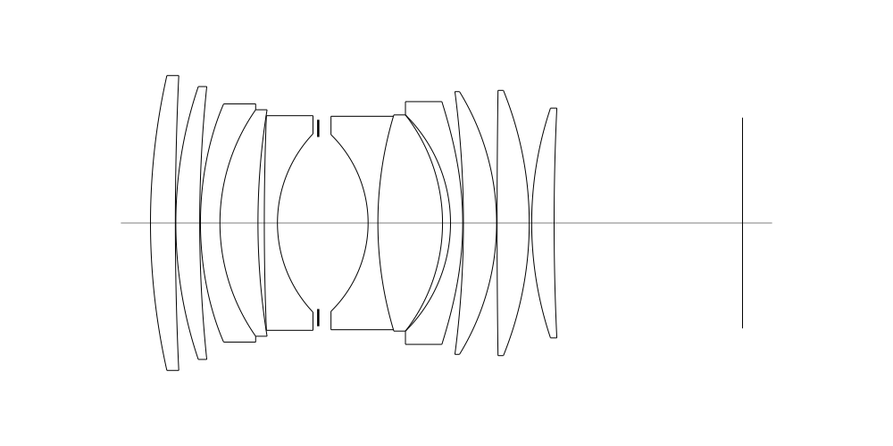
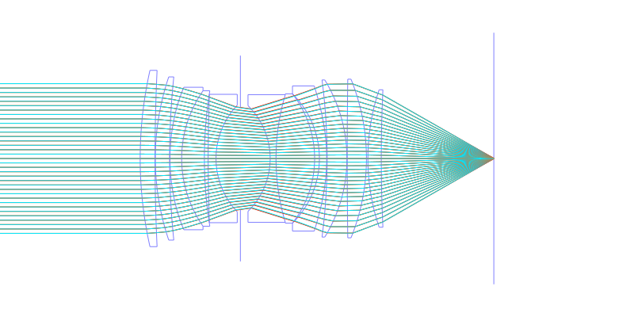
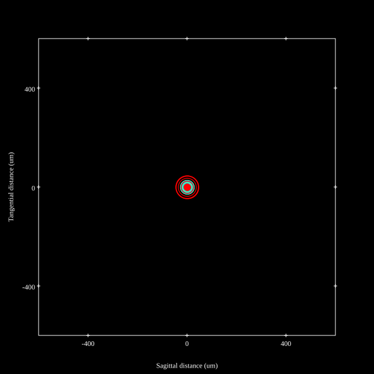
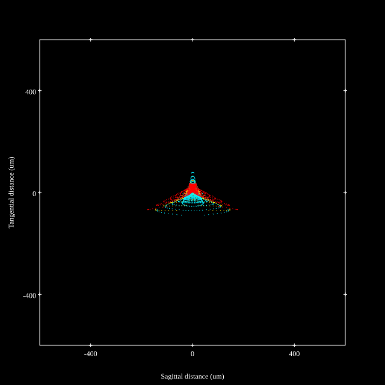
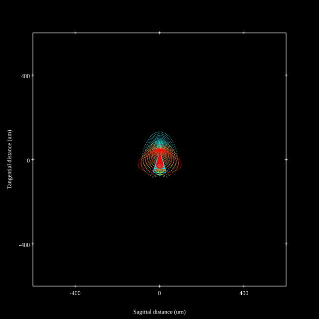
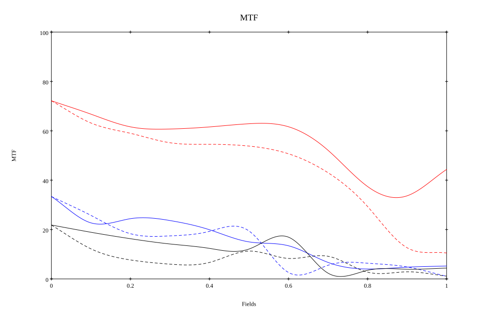
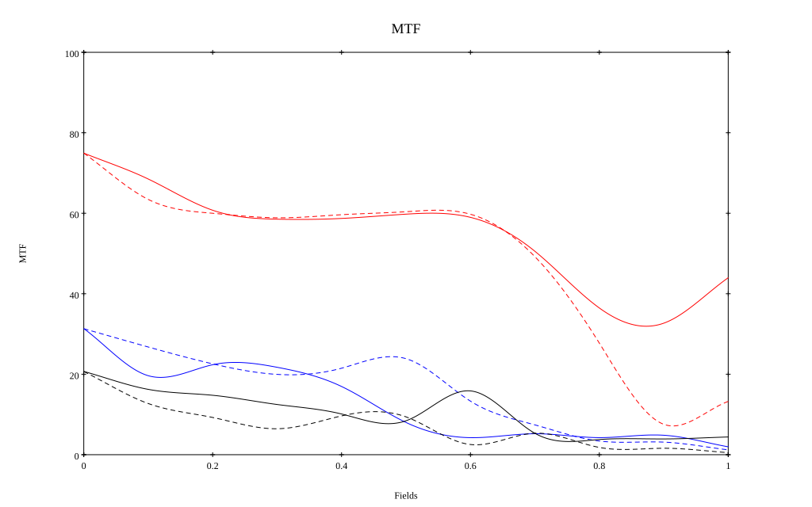

# Canon EF 50mm f/1.0L USM
## Patent Information
| Country | Patent Number | Example | Year of Application | Inventors | Organisation | Link |
| ---     | ---           | ---     | ---                 | ---       | ---          | ---  |
|US | US4717245 | EX 2 | 1985 | Sadatoshi Takahashi | Canon Inc | [link](https://patents.google.com/patent/US4717245A/en) |
## Surface Data
Note that where glass types are shown the refractive index and abbe number is as per assigned glass type

| ID  | Radius | Thickness | Diameter | nd  | vd  | Glass Make | Glass |
| --- | ---    | ---       | ---      | --- | --- | ---        | ---   |
| 1 | 138.055 | 5.101 | 60.55 | 1.60311 | 60.6 | Schott | N-SK14 |
| 2 | 652.512 | 0.099 | 60.55 |  |  |  |
| 3 | 87.469 | 4.898 | 56.04 | 1.6968 | 55.46 | Hoya | LAC14 |
| 4 | 271.835 | 0.151 | 56.04 |  |  |  |
| 5 | 67.95325 | 3.999 | 48.93 | 1.51742 | 52.2 | Hikari | J-KF6 |
| 6 | 40.57 | 7.8 | 46.51 | 1.883 | 40.81 | Hoya | TAFD30 |
| 7 | 145.746 | 1.3 | 46.51 |  |  |  |
| 8 | 568.62 | 2.699 | 44.08 | 1.51742 | 52.2 | Hikari | J-KF6 |
| 9 | 26.655 | 8.367 | 36.63 |  |  |  |
| 10 | AS | 10.229 | 35.333 |  |  |  |
| 11 | -25.418 | 2.007 | 36.28 | 1.84666 | 23.78 | Hoya | FDS90 |
| 12 | 76.965 | 13.26 | 43.84 | 1.883 | 40.81 | Hoya | TAFD30 |
| 13 | -36.192 | 1.638 | 44.398 |  |  |  |
| 14 | -31.273 | 2.501 | 44.398 | 1.80518 | 25.36 | Schott | N-SF6 |
| 15 | -67.6041 | 0.151 | 49.85 |  |  |  |
| 16 | -208.993 | 6.802 | 53.96 | 1.883 | 40.81 | Hoya | TAFD30 |
| 17 | -51.62 | 0.099 | 53.96 |  |  |  |
| 18 | 1947.956 | 6.599 | 54.48 | 1.883 | 40.81 | Hoya | TAFD30 |
| 19 | -72.602 | 0.499 | 54.48 |  |  |  |
| 20 | 74.043 | 4.602 | 47.2 | 1.55963 | 61.17 | Ohara | BAL50 |
| 21 | 499.996 | 38.65 | 47.2 |  |  |  |
## Aspherical Data
| ID  | Type | k   | P1 | P2 | P3 | P4 | P5 |
| --- | --- | --- | --- | --- | --- | --- | --- |
| 5| EVEN | -1.0 | 0.0 | 4.638E-7 | 1.284E-9 | -1.638E-12 | 1.636E-15 |
| 15| EVEN | -1.0 | 0.0 | 2.39E-7 | 2.218E-9 | -3.207E-12 | 1.925E-15 |
## Layouts

## Spot Diagrams

## Paraxial Parameters
| parameter | value |
| ---       | ---   |
| effective_focal_length |51.992
| back_focal_length | 38.707
| optical_invariant | 10.823
| object_distance | 1.0E10
| image_distance | 38.707
| power | 0.019
| pp1_H | 79.535
| ppk_H' | -13.286
| ffl_F | 27.543
| fno | 1
| enp_dist_P | 36.309
| enp_radius | 26
| exp_dist_P' | -269.606
| exp_radius | 154.206
| m | -0
| red | -1.923364232511164E8
| n_obj | 1
| n_img | 1
| img_ht | 21.642
| obj_ang | 22.6
| obj_na | 0
| img_na | -0.5|
## Spot Analysis
| Field | Spot Mean Radius (µm) | Spot Max Radius (µm) |
| ---   | ---              | ---             |
 | Field(x=0.0, y=0.0) | 20.083 | 59.783|
 | Field(x=0.0, y=0.1) | 24.576 | 100.412|
 | Field(x=0.0, y=0.2) | 29.001 | 125.573|
 | Field(x=0.0, y=0.3) | 29.31 | 135.116|
 | Field(x=0.0, y=0.4) | 29.726 | 146.823|
 | Field(x=0.0, y=0.5) | 30.464 | 153.163|
 | Field(x=0.0, y=0.6) | 32.679 | 172.341|
 | Field(x=0.0, y=0.7) | 38.292 | 189.076|
 | Field(x=0.0, y=0.8) | 45.413 | 188.203|
 | Field(x=0.0, y=0.9) | 50.528 | 169.56|
 | Field(x=0.0, y=1.0) | 48.103 | 132.279|
## Polychromatic Geometric MTF

* 10=red,30=blue,50=black cycles/mm
* Solid lines represent sagittal, dashed lines tangential
* To generate above, MTFs for wavelengths 587.5618(d), 486.1327(F), 656.2725(C) were calculated across 10 fields, and then averaged
## Polychromatic Geometric MTF (Weighted)

* 10=red,30=blue,50=black cycles/mm
* Solid lines represent sagittal, dashed lines tangential
* To generate above, MTFs for wavelengths 587.5618(d) wt(1.0), 656.2725(C) wt(0.475), 546.074(e) wt(0.98), 486.1327(F) wt(0.49), 435.8343(g) wt(0.15) were calculated across 10 fields, and then combined using weighted average
## Resources
* [OpticalBench Compatible Data File, tab delimited](./prescription.txt)
* [Zemax file](./US004717245_Example02a.zmx)

Generated from `US004717245_Example02a.txt`, status **TODO**

Report / Zemax file generated using [Beam42](https://github.com/BeamFour/Beam42) on 2026-10-02
