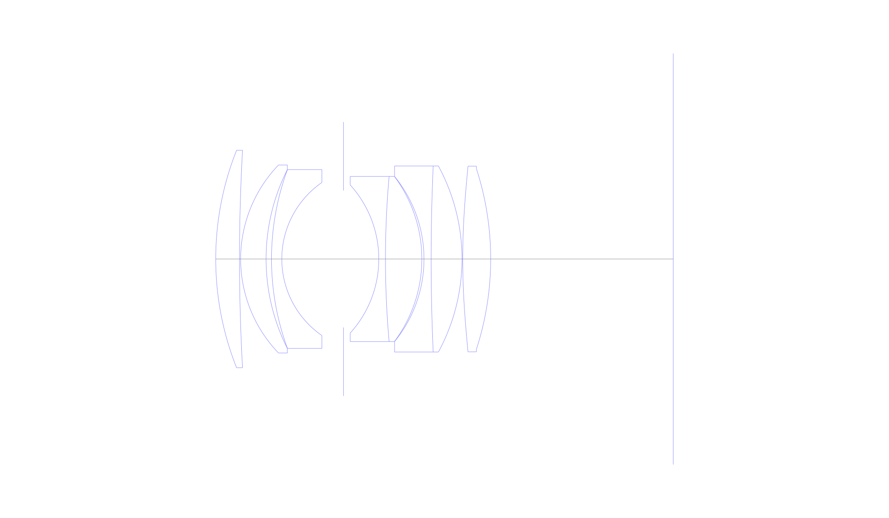
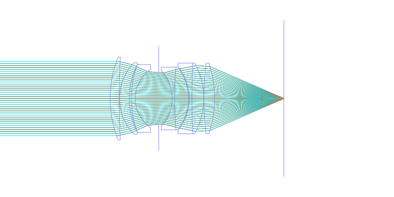
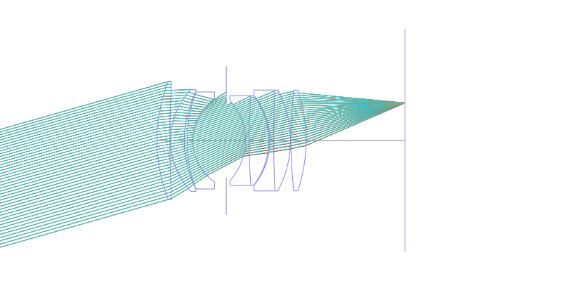
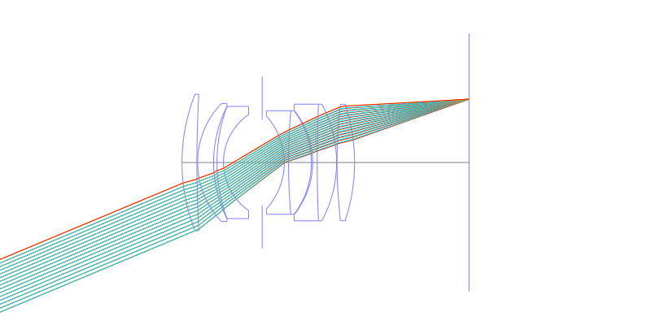
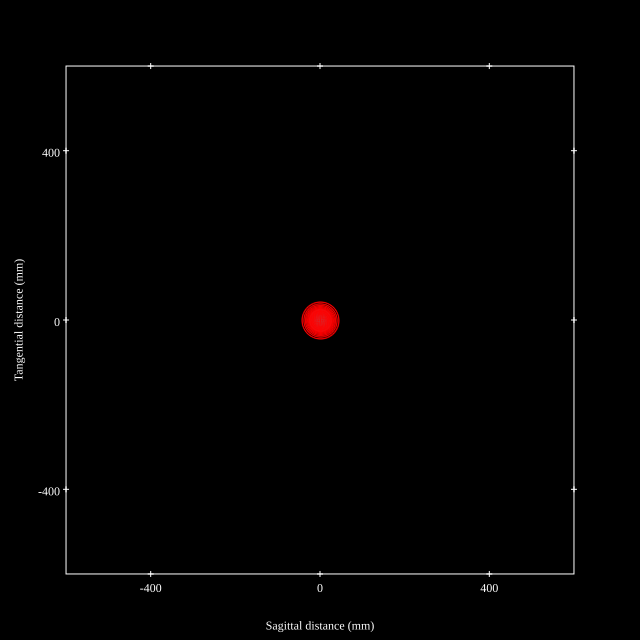
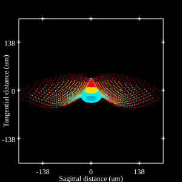
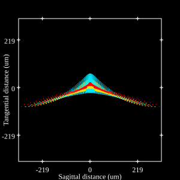
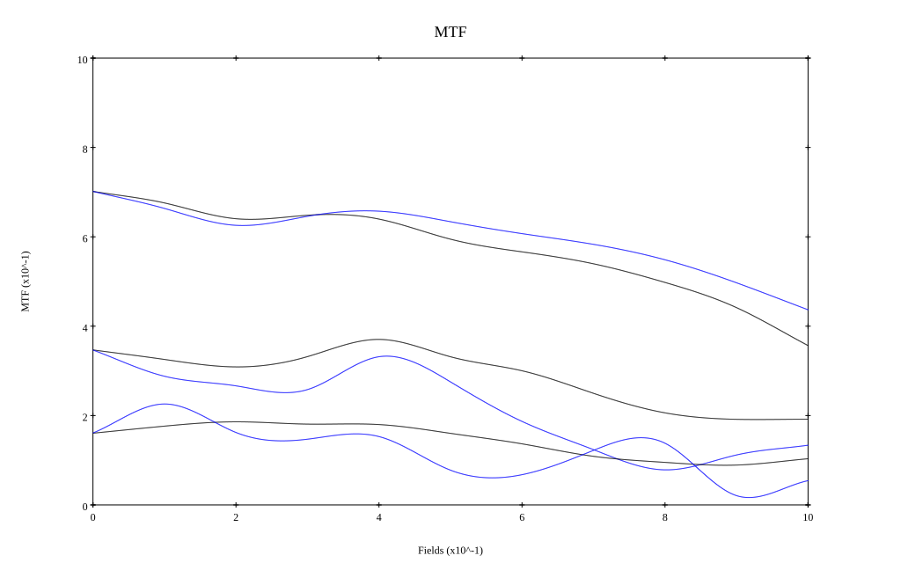
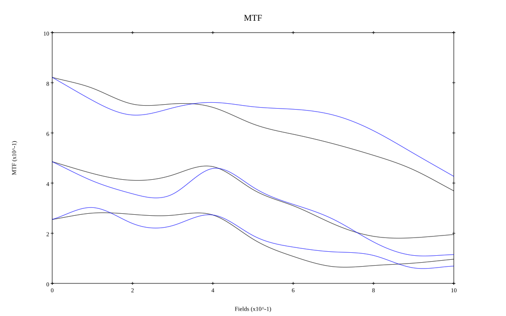

# Canon EF 50mm f1.2L
## Patent Information
| Country | Patent Number | Example | Year of Application | Inventors | Organisation | Link |
| ---     | ---           | ---     | ---                 | ---       | ---          | ---  |
|JP | JP2007-333790 | EX 1 | 2006 | Makoto Mitsusaka | Canon Inc | [link](https://patents.google.com/patent/JP2007333790A/en) |
## Surface Data
Note that where glass types are shown the refractive index and abbe number is as per assigned glass type

| ID  | Radius | Thickness | Diameter | nd  | vd  | Glass Make | Glass |
| --- | ---    | ---       | ---      | --- | --- | ---        | ---   |
| 1 | 61.844 | 4.99 | 45.72 | 1.7725 | 49.6 | Ohara | S-LAH66 |
| 2 | 411.251 | 0.24 | 45.72 |  |  |  |
| 3 | 28.537 | 5.34 | 39.52 | 1.83481 | 42.71 | Ohara | S-LAH55 |
| 4 | 41.757 | 1.14 | 37.58 |  |  |  |
| 5 | 54.433 | 2.16 | 37.58 | 1.6398 | 34.47 | Ohara | S-TIM27 |
| 6 | 19.579 | 12.95 | 32.18 |  |  |  |
| 7 | AS | 7.41 | 28.778 |  |  |  |
| 8 | -23.181 | 1.4 | 31.12 | 1.72825 | 28.46 | Ohara | S-TIH10 |
| 9 | 196.367 | 7.64 | 34.7 | 1.883 | 40.77 | Ohara | S-LAH58 |
| 10 | -29.011 | 0.45 | 34.7 |  |  |  |
| 11 | -27.438 | 1.5 | 34.7 | 1.69895 | 30.13 | Ohara | S-TIM35 |
| 12 | 442.408 | 6.48 | 39.08 | 1.83481 | 42.71 | Ohara | S-LAH55 |
| 13 | -41.024 | 0.15 | 39.08 |  |  |  |
| 14 | 146.157 | 5.87 | 39.02 | 1.804 | 46.57 | Ohara | S-LAH65 |
| 15 | -61.524 | 38.28 | 38.02 |  |  |  |
## Aspherical Data
| ID  | k   | P1  | P2  | P3  | P3 | P5 | P6 | P7 | P8 | P9 | P10 |
| --- | --- | --- | --- | --- | --- | --- | --- | --- | --- | --- | --- |
| 14 | 0.0 | 0.0 | -1.44531E-6 | 2.5016E-10 | -1.46123E-13 | 0.0 | 0.0 | 0.0 | 0.0 | 0.0 | 0.0 |
## Layouts

## Spot Diagrams

## Paraxial Parameters
| parameter | value |
| ---       | ---   |
| effective_focal_length |51.695
| back_focal_length | 38.334
| optical_invariant | 8.65
| object_distance | 1.0E10
| image_distance | 38.334
| power | 0.019
| pp1_H | 56.371
| ppk_H' | -13.361
| ffl_F | 4.676
| fno | 1.25
| enp_dist_P | 33.851
| enp_radius | 20.678
| exp_dist_P' | -53.211
| exp_radius | 36.639
| m | -0
| red | -1.9344260638951924E8
| n_obj | 1
| n_img | 1
| img_ht | 21.624
| obj_ang | 22.7
| obj_na | 0
| img_na | -0.371|
## Spot Analysis
| Field | Spot Mean Radius | Spot Max Radius |
| ---   | ---              | ---             |
 | Field(x=0.0, y=0.0) | 18.407 | 43.461|
 | Field(x=0.0, y=0.1) | 21.796 | 84.044|
 | Field(x=0.0, y=0.2) | 29.974 | 143.746|
 | Field(x=0.0, y=0.3) | 29.493 | 145.793|
 | Field(x=0.0, y=0.4) | 29.446 | 138.338|
 | Field(x=0.0, y=0.5) | 32.854 | 137.321|
 | Field(x=0.0, y=0.6) | 38.439 | 181.987|
 | Field(x=0.0, y=0.7) | 46.602 | 227.279|
 | Field(x=0.0, y=0.8) | 55.033 | 275.413|
 | Field(x=0.0, y=0.9) | 66.226 | 323.159|
 | Field(x=0.0, y=1.0) | 76.105 | 348.314|
## Polychromatic Geometric MTF

* 10,30,50 cycles/mm
* Black lines represent sagittal, blue tangential
* To generate above, MTFs for wavelengths 587.5618(d), 486.1327(F), 656.2725(C) were calculated across 10 fields, and then averaged
## Polychromatic Geometric MTF (Weighted)

* 10,30,50 cycles/mm
* Black lines represent sagittal, blue tangential
* To generate above, MTFs for wavelengths 587.5618(d) wt(1.0), 656.2725(C) wt(0.475), 546.074(e) wt(0.98), 486.1327(F) wt(0.49), 435.8343(g) wt(0.15) were calculated across 10 fields, and then combined using weighted average
## Resources
* [OpticalBench Compatible Data File, tab delimited](./JP2007-333790_Example01.txt)
* [Zemax file](./JP2007-333790_Example01.zmx)
