# Canon EF70-200mm f2.8L IS II USM
## Patent Information
| Country | Patent Number | Example | Year of Application | Inventors | Organisation | Link |
| ---     | ---           | ---     | ---                 | ---       | ---          | ---  |
|US | US20090296231 | 2 | 2008 | Takashi Shirasuna | Canon Inc | [link](https://patents.google.com/patent/US20090296231A1/en) |
## Surface Data
Note that where glass types are shown the refractive index and abbe number is as per assigned glass type

| ID  | Radius | Thickness | Diameter | nd  | vd  | Glass Make | Glass |
| --- | ---    | ---       | ---      | --- | --- | ---        | ---   |
| 1 | 314.575 | 2.8 | 73.78 | 1.7495 | 35.28 | Ohara | S-LAM7 |
| 2 | 117.542 | 0.96 | 71.26 |  |  |  |
| 3 | 141.139 | 8.36 | 71.26 | 1.497 | 81.55 | Ohara | S-FPL51 |
| 4 | -300.657 | 0.15 | 71.74 |  |  |  |
| 5 | 75.124 | 6.81 | 66.96 | 1.497 | 81.55 | Ohara | S-FPL51 |
| 6 | 218.609 | d6 | 66.96 |  |  |  |
| 7 | 51.382 | 2.3 | 54.5 | 1.80518 | 25.43 | Ohara | S-TIH6 |
| 8 | 43.18 | 1.43 | 51.08 |  |  |  |
| 9 | 50.611 | 8.6 | 50.56 | 1.497 | 81.55 | Ohara | S-FPL51 |
| 10 | 33115.608 | d10 | 50.56 |  |  |  |
| 11 | -1003.993 | 1.4 | 35.04 | 1.804 | 46.57 | Ohara | S-LAH65 |
| 12 | 34.333 | 5.79 | 32.54 |  |  |  |
| 13 | -81.909 | 1.4 | 32.54 | 1.497 | 81.55 | Ohara | S-FPL51 |
| 14 | 36.914 | 5.39 | 33.18 | 1.84666 | 23.88 | Ohara | S-NPH53 |
| 15 | 341.176 | 2.84 | 33.18 |  |  |  |
| 16 | -57.998 | 1.4 | 34.86 | 1.6968 | 55.53 | Ohara | S-LAL14 |
| 17 | 3742.48 | d17 | 34.86 |  |  |  |
| 18 | 169.934 | 4.88 | 35.72 | 1.6779 | 55.34 | Ohara | S-LAL12 |
| 19 | -93.961 | 0.15 | 35.72 |  |  |  |
| 20 | 594.797 | 6.28 | 35.2 | 1.43384 | 95.26 | Hikari | NICF-A |
| 21 | -45.332 | 0.09 | 35.2 |  |  |  |
| 22 | -44.317 | 1.6 | 35.2 | 1.801 | 34.97 | Ohara | S-LAM66 |
| 23 | -93.196 | d23 | 35.3 |  |  |  |
| 24 | AS | 0.4 | 35.319 |  |  |  |
| 25 | 52.86 | 3.55 | 36.56 | 1.804 | 46.57 | Ohara | S-LAH65 |
| 26 | 160.464 | 0.2 | 36.56 |  |  |  |
| 27 | 51.23 | 3.52 | 34.48 | 1.7725 | 49.6 | Ohara | S-LAH66 |
| 28 | 82.622 | 1.7 | 33.16 |  |  |  |
| 29 | 4742.17 | 1.6 | 33.16 | 1.74 | 28.3 | Ohara | S-TIH3 |
| 30 | 37.278 | 7.58 | 33.16 | 1.497 | 81.55 | Ohara | S-FPL51 |
| 31 | -114.057 | 3.2 | 33.16 |  |  |  |
| 32 | 205.849 | 3.65 | 30.1 | 1.80518 | 25.43 | Ohara | S-TIH6 |
| 33 | -72.004 | 1.4 | 30.1 | 1.58313 | 59.37 | Ohara | S-BAL42 |
| 34 | 33.673 | 4.87 | 29.03 |  |  |  |
| 35 | -69.3 | 1.4 | 29.03 | 1.744 | 44.79 | Ohara | S-LAM2 |
| 36 | 1788.356 | 3.46 | 30.1 |  |  |  |
| 37 | 181.747 | 3.83 | 33.5 | 1.804 | 46.57 | Ohara | S-LAH65 |
| 38 | -82.196 | 3.16 | 33.5 |  |  |  |
| 39 | 265.558 | 8.91 | 36.34 | 1.48749 | 70.24 | Ohara | S-FSL5 |
| 40 | -27.996 | 2.0 | 33.82 | 1.834 | 37.16 | Ohara | S-LAH60 |
| 41 | -193.24 | 5.0 | 36.0 |  |  |  |
| 42 | 81.384 | 3.31 | 39.6 | 1.834 | 37.16 | Ohara | S-LAH60 |
| 43 | 307.388 | d43 | 39.6 |  |  |  |
## Variables
| Variable | 70mm f2.8 | 200mm f2.8 |
| --- | --- | --- |
| Focal length |72.14 |193.97 |
| F-Number |2.9 |2.9 |
| Angle of View |33.4 |12.7 |
| d6 | 10.68 | 33.38 |
| d10 | 1.58 | 17.34 |
| d17 | 28.81 | 1.08 |
| d23 | 18.32 | 7.59 |
| d43 | 53.95 | 54.08 |
# 70mm f2.8
## Layouts
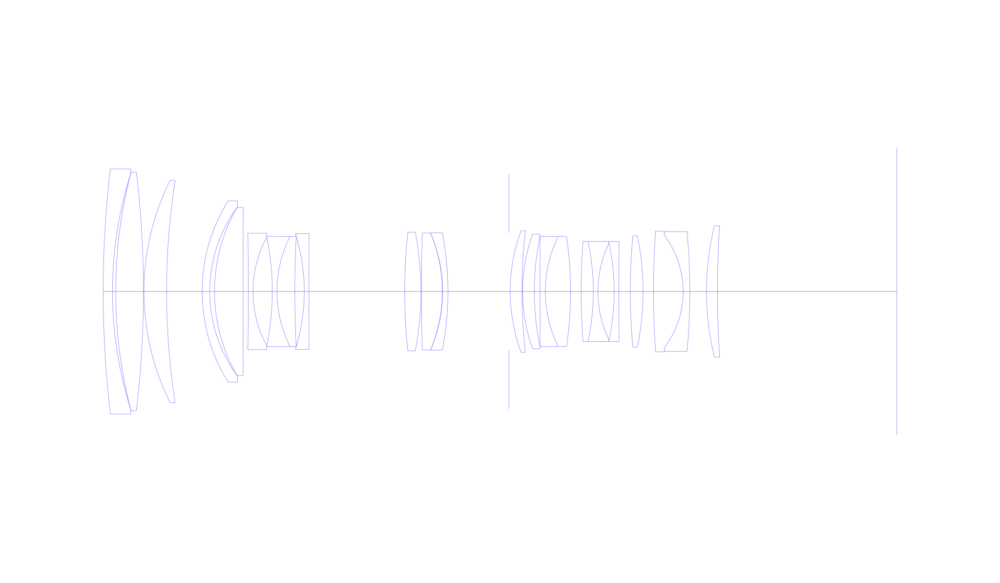
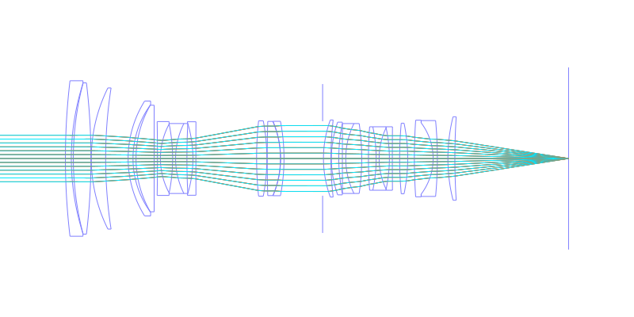
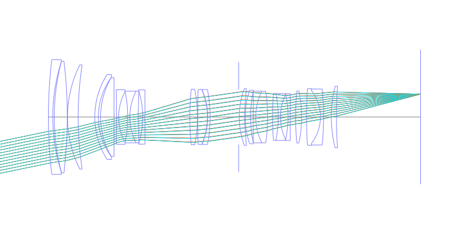
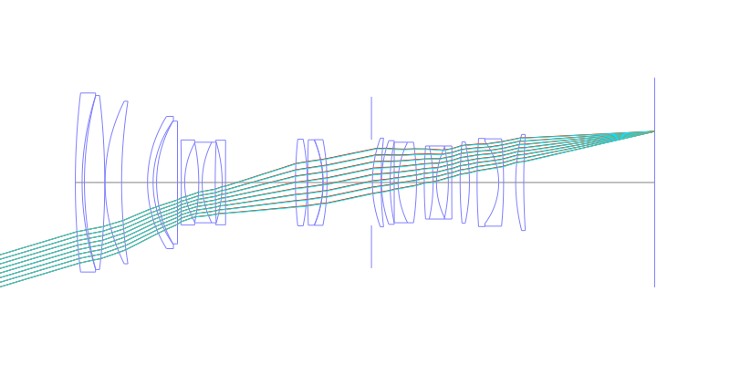
## Spot Diagrams
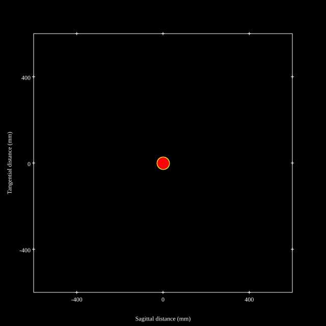
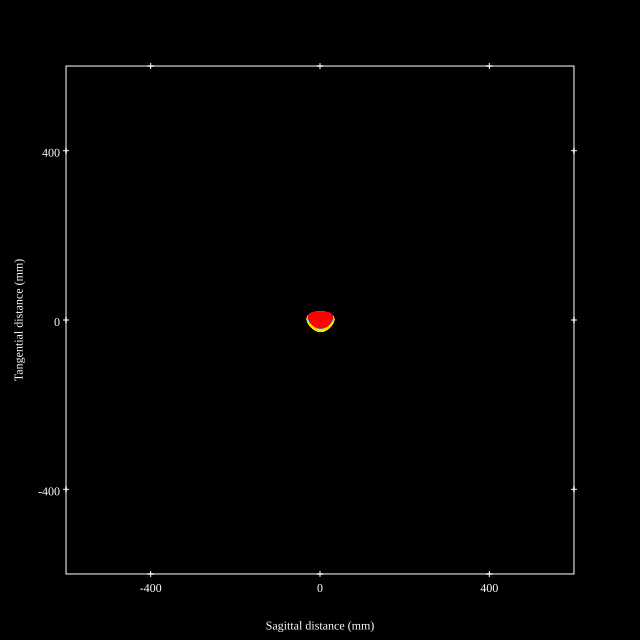
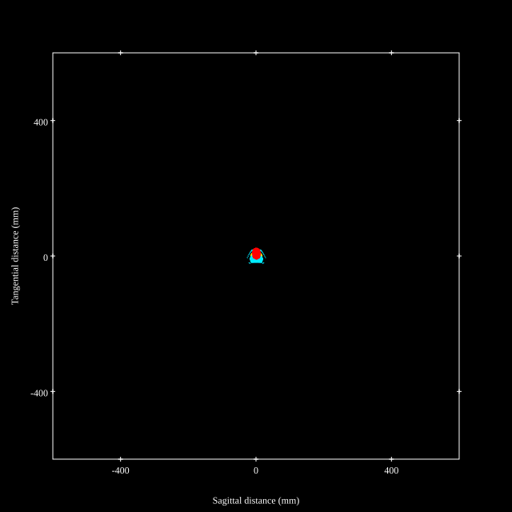
## Paraxial Parameters
| parameter | value |
| ---       | ---   |
| effective_focal_length |72.141
| back_focal_length | 54.057
| optical_invariant | 3.732
| object_distance | 1.0E10
| image_distance | 54.057
| power | 0.014
| pp1_H | 123.779
| ppk_H' | -18.085
| ffl_F | 51.637
| fno | 2.9
| enp_dist_P | 98.496
| enp_radius | 12.44
| exp_dist_P' | -56.903
| exp_radius | 19.152
| m | -0
| red | -1.3861661802606493E8
| n_obj | 1
| n_img | 1
| img_ht | 21.643
| obj_ang | 16.7
| obj_na | 0
| img_na | -0.17|
## Spot Analysis
| Field | Spot Mean Radius | Spot Max Radius |
| ---   | ---              | ---             |
 | Field(x=0.0, y=0.0) | 3.922 | 7.994|
 | Field(x=0.0, y=0.1) | 4.146 | 14.55|
 | Field(x=0.0, y=0.2) | 4.534 | 15.131|
 | Field(x=0.0, y=0.3) | 5.039 | 16.064|
 | Field(x=0.0, y=0.4) | 5.693 | 15.855|
 | Field(x=0.0, y=0.5) | 6.448 | 19.547|
 | Field(x=0.0, y=0.6) | 7.316 | 27.56|
 | Field(x=0.0, y=0.7) | 8.988 | 35.913|
 | Field(x=0.0, y=0.8) | 9.648 | 32.311|
 | Field(x=0.0, y=0.9) | 12.64 | 38.379|
 | Field(x=0.0, y=1.0) | 19.013 | 52.774|
## Polychromatic Geometric MTF
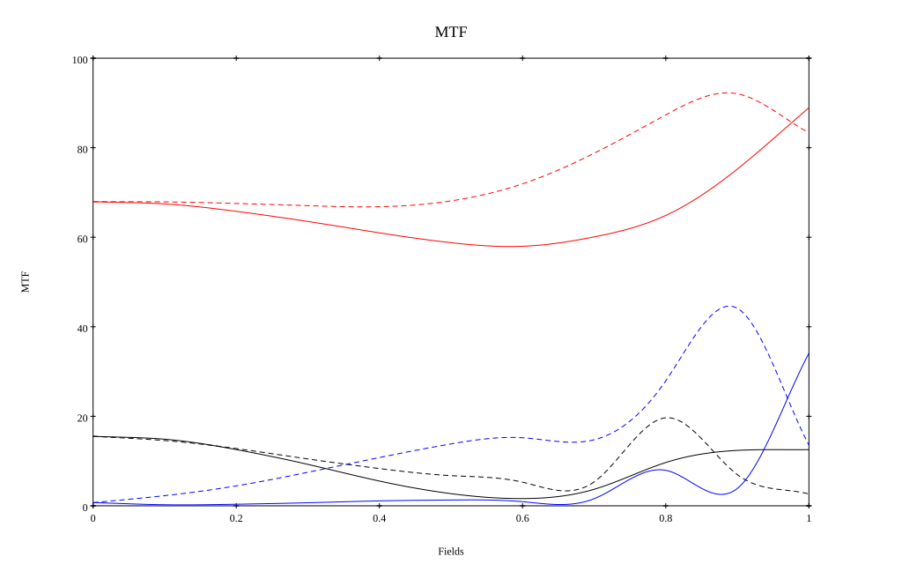
* 10=red,30=blue,50=black cycles/mm
* Solid lines represent sagittal, dashed lines tangential
* To generate above, MTFs for wavelengths 587.5618(d), 486.1327(F), 656.2725(C) were calculated across 10 fields, and then averaged
## Polychromatic Geometric MTF (Weighted)
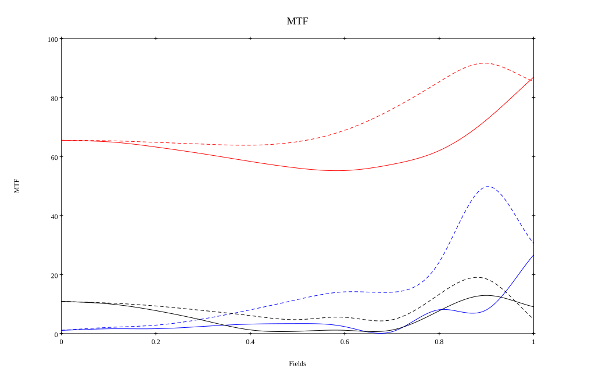
* 10=red,30=blue,50=black cycles/mm
* Solid lines represent sagittal, dashed lines tangential
* To generate above, MTFs for wavelengths 587.5618(d) wt(1.0), 656.2725(C) wt(0.475), 546.074(e) wt(0.98), 486.1327(F) wt(0.49), 435.8343(g) wt(0.15) were calculated across 10 fields, and then combined using weighted average
# 200mm f2.8
## Layouts
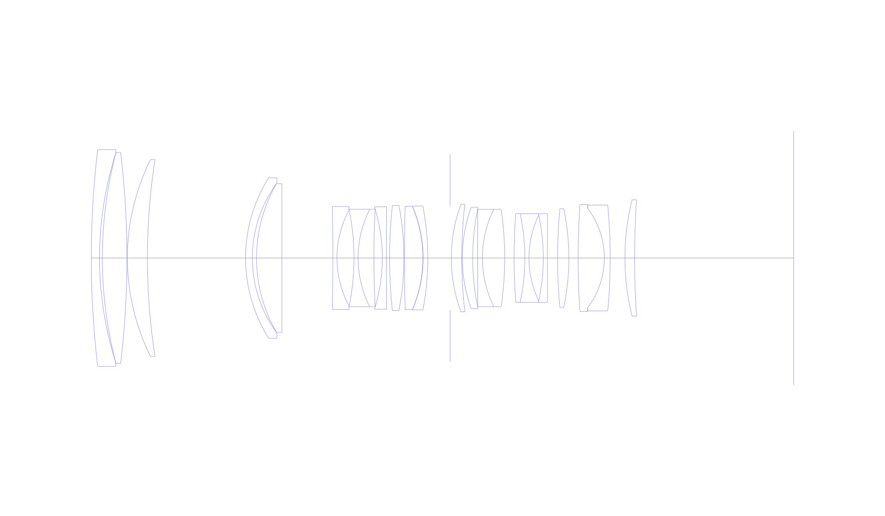
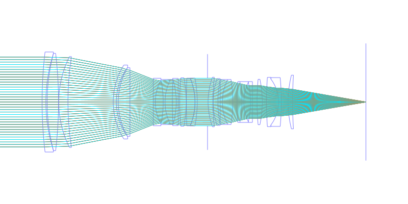
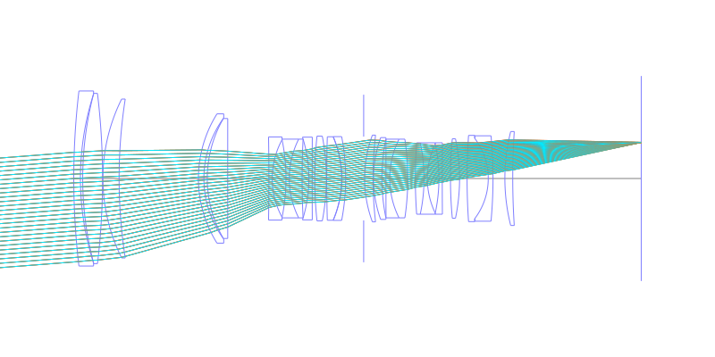
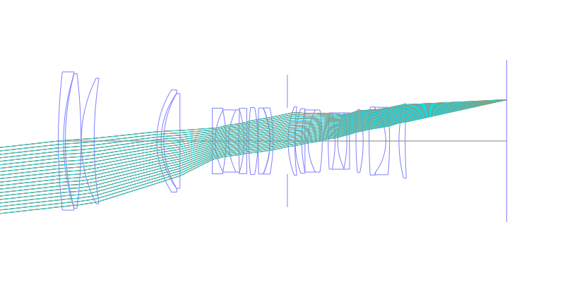
## Spot Diagrams
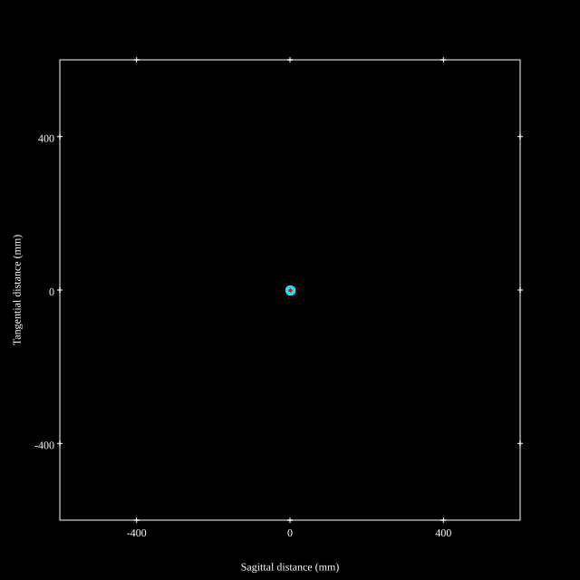
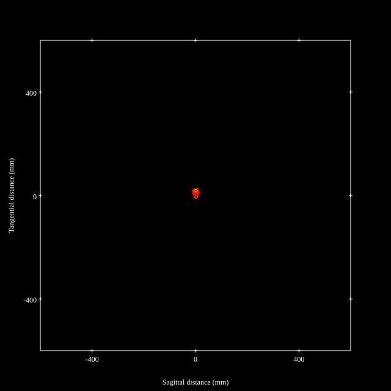
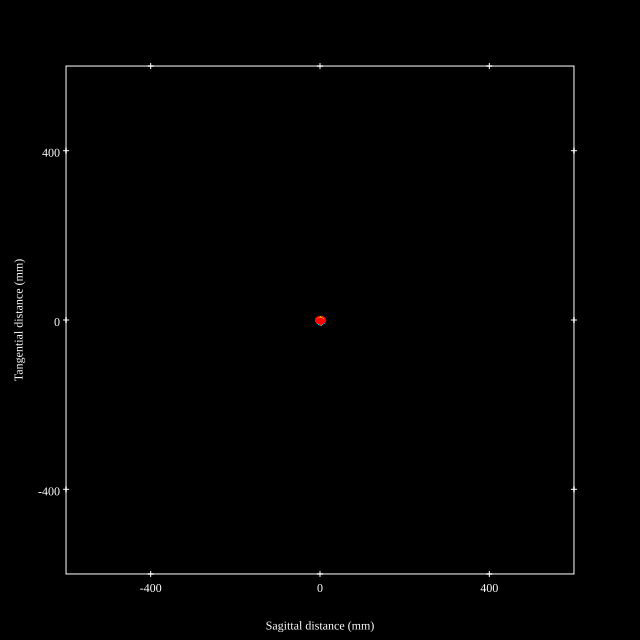
## Paraxial Parameters
| parameter | value |
| ---       | ---   |
| effective_focal_length |193.984
| back_focal_length | 54.067
| optical_invariant | 3.722
| object_distance | 1.0E10
| image_distance | 54.067
| power | 0.005
| pp1_H | 103.173
| ppk_H' | -139.917
| ffl_F | -90.81
| fno | 2.9
| enp_dist_P | 247.963
| enp_radius | 33.447
| exp_dist_P' | -57.023
| exp_radius | 19.152
| m | -0
| red | -5.155072210750394E7
| n_obj | 1
| n_img | 1
| img_ht | 21.587
| obj_ang | 6.35
| obj_na | 0
| img_na | -0.17|
## Spot Analysis
| Field | Spot Mean Radius | Spot Max Radius |
| ---   | ---              | ---             |
 | Field(x=0.0, y=0.0) | 3.167 | 8.056|
 | Field(x=0.0, y=0.1) | 3.177 | 8.641|
 | Field(x=0.0, y=0.2) | 3.477 | 11.974|
 | Field(x=0.0, y=0.3) | 4.402 | 19.833|
 | Field(x=0.0, y=0.4) | 5.347 | 25.643|
 | Field(x=0.0, y=0.5) | 6.194 | 29.881|
 | Field(x=0.0, y=0.6) | 6.448 | 30.323|
 | Field(x=0.0, y=0.7) | 6.235 | 28.451|
 | Field(x=0.0, y=0.8) | 5.731 | 24.773|
 | Field(x=0.0, y=0.9) | 5.363 | 19.329|
 | Field(x=0.0, y=1.0) | 6.056 | 13.155|
## Polychromatic Geometric MTF
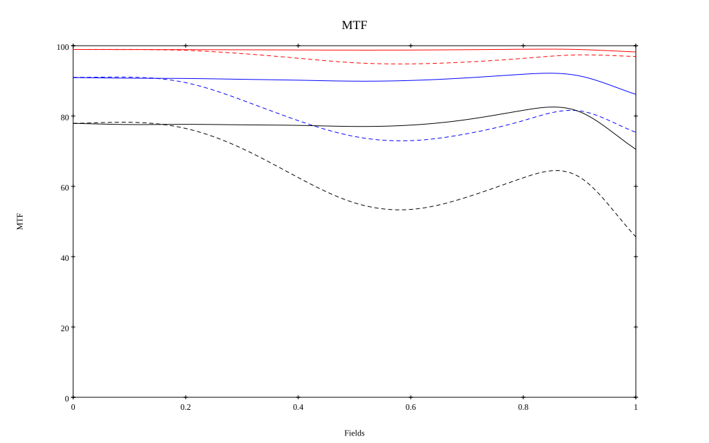
* 10=red,30=blue,50=black cycles/mm
* Solid lines represent sagittal, dashed lines tangential
* To generate above, MTFs for wavelengths 587.5618(d), 486.1327(F), 656.2725(C) were calculated across 10 fields, and then averaged
## Polychromatic Geometric MTF (Weighted)
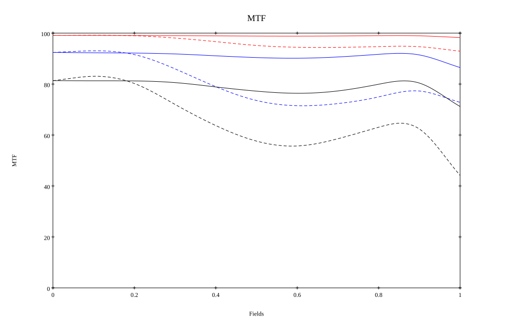
* 10=red,30=blue,50=black cycles/mm
* Solid lines represent sagittal, dashed lines tangential
* To generate above, MTFs for wavelengths 587.5618(d) wt(1.0), 656.2725(C) wt(0.475), 546.074(e) wt(0.98), 486.1327(F) wt(0.49), 435.8343(g) wt(0.15) were calculated across 10 fields, and then combined using weighted average
## Resources
* [OpticalBench Compatible Data File, tab delimited](./prescription.txt)
* [Zemax file](./US20090296231_Example02P.zmx)

Report / Zemax file generated using [Beam42](https://github.com/BeamFour/Beam42) on 2026-07-09
