# Canon EF70-200mm f2.8L USM
## Surface Data
Note that where glass types are shown the refractive index and abbe number is as per assigned glass type

| ID  | Radius | Thickness | Diameter | nd  | vd  | Glass Make | Glass |
| --- | ---    | ---       | ---      | --- | --- | ---        | ---   |
| 1 | 311.919 | 2.8 | 73.05 | 1.7495 | 35.04 | Hoya | E-LAF7 |
| 2 | 118.63 | 0.42 | 73.05 |  |  |  |
| 3 | 128.135 | 8.68 | 70.95 | 1.497 | 81.61 | Ohara | FPL51 |
| 4 | -263.474 | 0.1 | 70.95 |  |  |  |
| 5 | 79.501 | 5.72 | 64.91 | 1.497 | 81.61 | Ohara | FPL51 |
| 6 | 203.191 | d6 | 64.91 |  |  |  |
| 7 | 54.391 | 2.2 | 56.29 | 1.84666 | 23.78 | Ohara | S-TIH53 |
| 8 | 45.859 | 1.13 | 52.45 |  |  |  |
| 9 | 51.927 | 8.55 | 54.0 | 1.48749 | 70.24 | Ohara | S-FSL5 |
| 10 | 5099.296 | d10 | 54.0 |  |  |  |
| 11 | -488.6 | 1.4 | 37.31 | 1.80401 | 46.59 | SUMITA | K-LaSFn6 |
| 12 | 35.39 | 5.88 | 32.79 |  |  |  |
| 13 | -78.125 | 1.4 | 32.79 | 1.48749 | 70.24 | Ohara | S-FSL5 |
| 14 | 38.137 | 4.97 | 37.31 | 1.84666 | 23.88 | Ohara | S-NPH53 |
| 15 | 417.478 | 2.65 | 33.51 |  |  |  |
| 16 | -66.802 | 1.4 | 33.51 | 1.72916 | 54.1 | Ohara | S-LAL19 |
| 17 | -3362.971 | d17 | 37.31 |  |  |  |
| 18 | 247.12 | 3.49 | 38.28 | 1.6968 | 55.53 | Ohara | S-LAL14 |
| 19 | -99.902 | 0.15 | 38.28 |  |  |  |
| 20 | -189.999 | 4.77 | 38.28 | 1.497 | 81.61 | Ohara | FPL51 |
| 21 | -40.553 | 1.45 | 38.28 | 1.834 | 37.21 | Ohara | S-LAH60V |
| 22 | -76.277 | d22 | 39.65 |  |  |  |
| 23 | 58.421 | 3.53 | 39.41 | 1.80401 | 46.59 | SUMITA | K-LaSFn6 |
| 24 | 133.262 | 3.0 | 39.41 |  |  |  |
| 25 | AS | 0.24 | 35.863 |  |  |  |
| 26 | 34.132 | 6.35 | 36.61 | 1.497 | 81.61 | Ohara | FPL51 |
| 27 | 2256.763 | 3.72 | 36.2 | 1.62004 | 36.26 | Ohara | S-TIM2 |
| 28 | 31.519 | 6.49 | 32.23 |  |  |  |
| 29 | FS | 21.68 | 29.84 |  |  |  |
| 30 | 132.947 | 5.9 | 39.36 | 1.51742 | 52.43 | Ohara | S-NSL36 |
| 31 | -77.546 | 13.94 | 39.36 |  |  |  |
| 32 | -39.485 | 1.8 | 38.57 | 1.834 | 37.21 | Ohara | S-LAH60V |
| 33 | -95.683 | 0.15 | 40.53 |  |  |  |
| 34 | 147.644 | 3.62 | 42.0 | 1.7432 | 49.34 | Ohara | S-LAM60 |
| 35 | -205.762 | d35 | 42.0 |  |  |  |
## Variables
| Variable | 70mm f2.8 | 200mm f2.8 |
| --- | --- | --- |
| Focal length |72.1 |194.01 |
| F-Number |2.923 |2.923 |
| Angle of View |33.4 |12.72 |
| d6 | 8.78 | 32.85 |
| d10 | 1.64 | 17.23 |
| d17 | 30.32 | 1.32 |
| d22 | 14.7 | 4.05 |
| d35 | 52.37 | 52.5 |
# 70mm f2.8
## Layouts
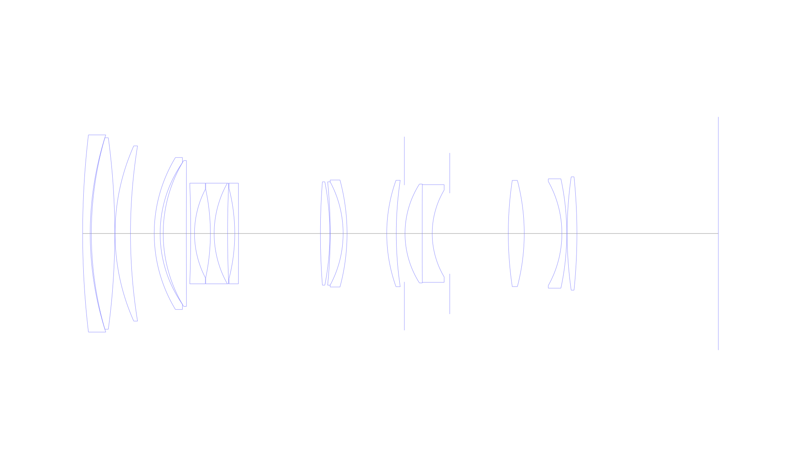
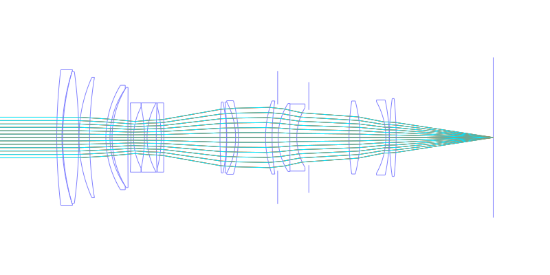
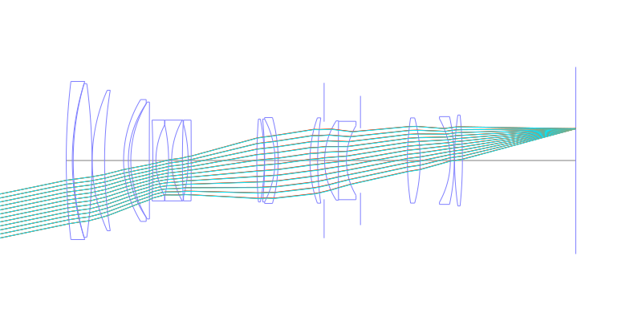
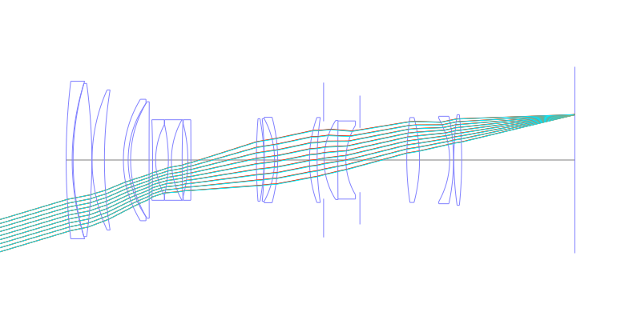
## Spot Diagrams
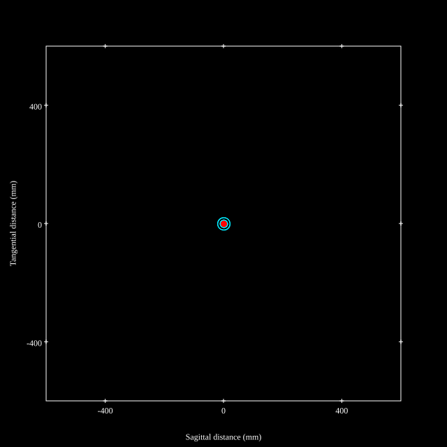
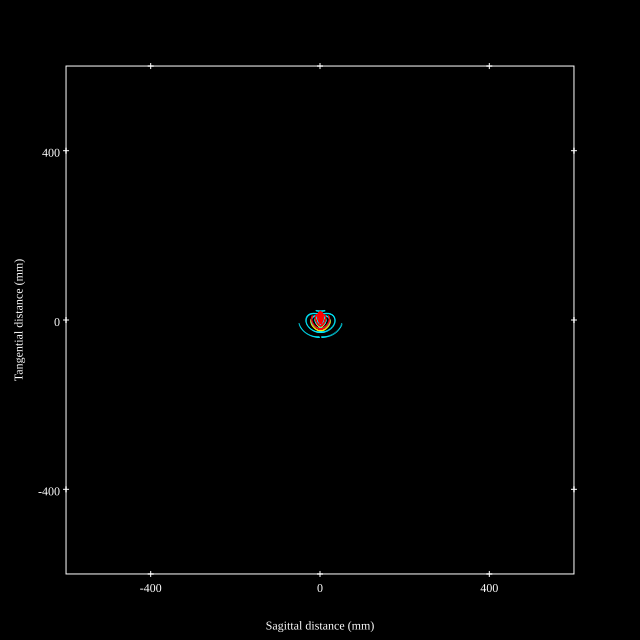
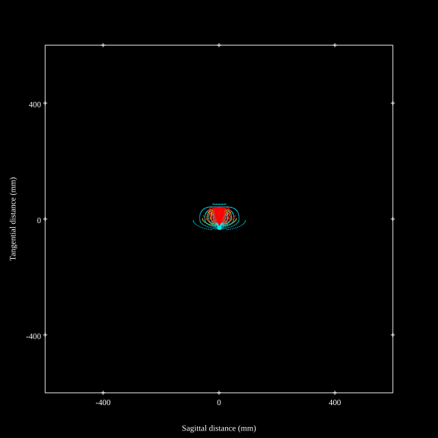
## Paraxial Parameters
| parameter | value |
| ---       | ---   |
| effective_focal_length |72.09
| back_focal_length | 52.503
| optical_invariant | 3.701
| object_distance | 1.0E10
| image_distance | 52.503
| power | 0.014
| pp1_H | 120.185
| ppk_H' | -19.588
| ffl_F | 48.094
| fno | 2.922
| enp_dist_P | 91.949
| enp_radius | 12.335
| exp_dist_P' | -65.871
| exp_radius | 20.277
| m | -0
| red | -1.38714689010189E8
| n_obj | 1
| n_img | 1
| img_ht | 21.628
| obj_ang | 16.7
| obj_na | 0
| img_na | -0.169|
## Spot Analysis
| Field | Spot Mean Radius | Spot Max Radius |
| ---   | ---              | ---             |
 | Field(x=0.0, y=0.0) | 5.64 | 20.91|
 | Field(x=0.0, y=0.1) | 6.612 | 32.23|
 | Field(x=0.0, y=0.2) | 6.689 | 32.585|
 | Field(x=0.0, y=0.3) | 7.14 | 33.658|
 | Field(x=0.0, y=0.4) | 8.905 | 46.774|
 | Field(x=0.0, y=0.5) | 9.561 | 45.35|
 | Field(x=0.0, y=0.6) | 10.535 | 46.215|
 | Field(x=0.0, y=0.7) | 11.704 | 50.963|
 | Field(x=0.0, y=0.8) | 13.41 | 60.238|
 | Field(x=0.0, y=0.9) | 17.913 | 72.734|
 | Field(x=0.0, y=1.0) | 25.268 | 90.3|
## Polychromatic Geometric MTF
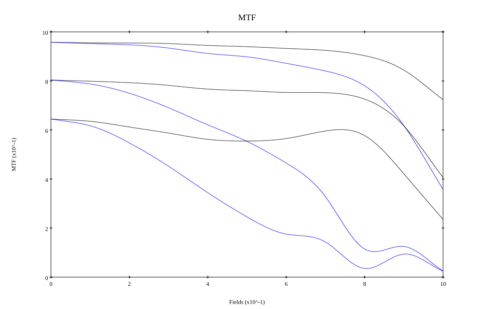
* 10,30,50 cycles/mm
* Black lines represent sagittal, blue tangential
* To generate above, MTFs for wavelengths 587.5618(d), 486.1327(F), 656.2725(C) were calculated across 10 fields, and then averaged
## Polychromatic Geometric MTF (Weighted)
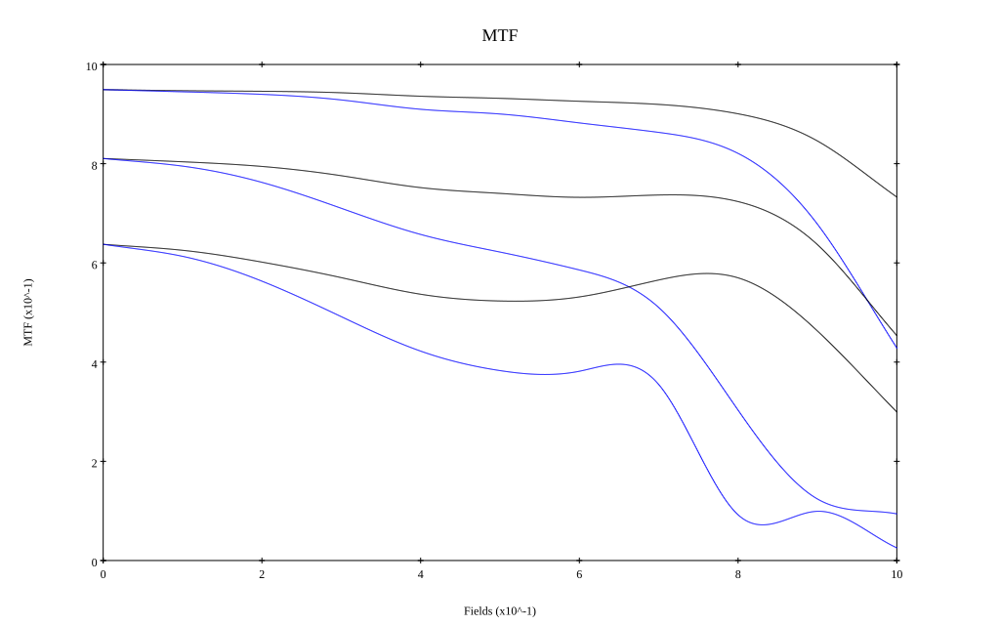
* 10,30,50 cycles/mm
* Black lines represent sagittal, blue tangential
* To generate above, MTFs for wavelengths 587.5618(d) wt(1.0), 656.2725(C) wt(0.475), 546.074(e) wt(0.98), 486.1327(F) wt(0.49), 435.8343(g) wt(0.15) were calculated across 10 fields, and then combined using weighted average
# 200mm f2.8
## Layouts
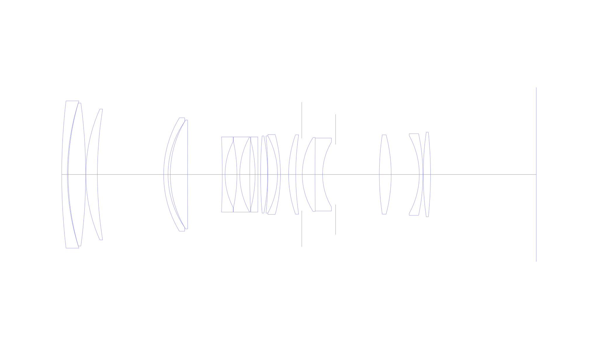
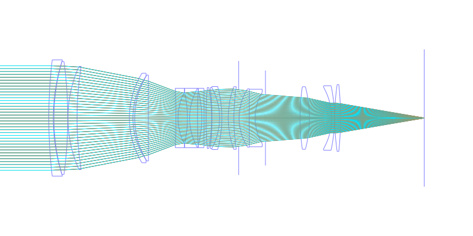
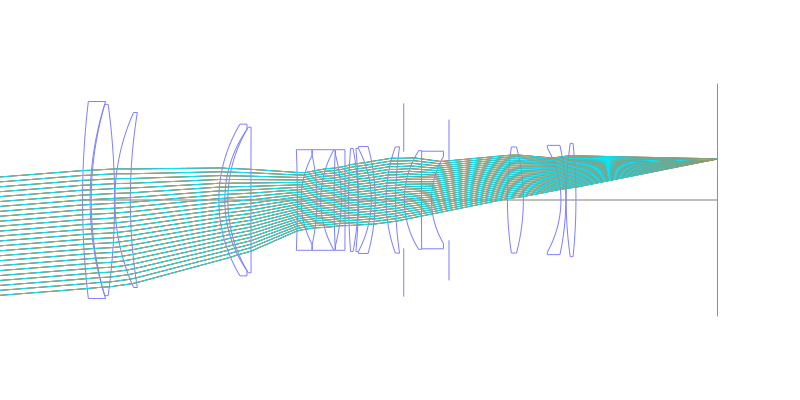
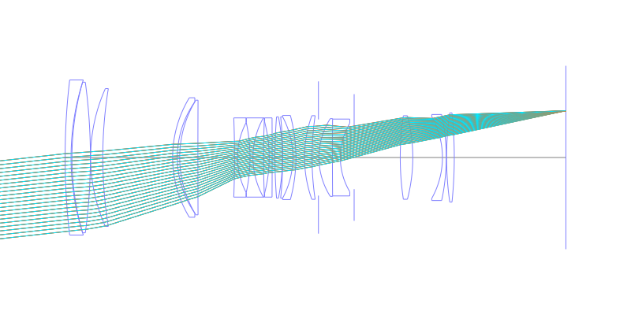
## Spot Diagrams
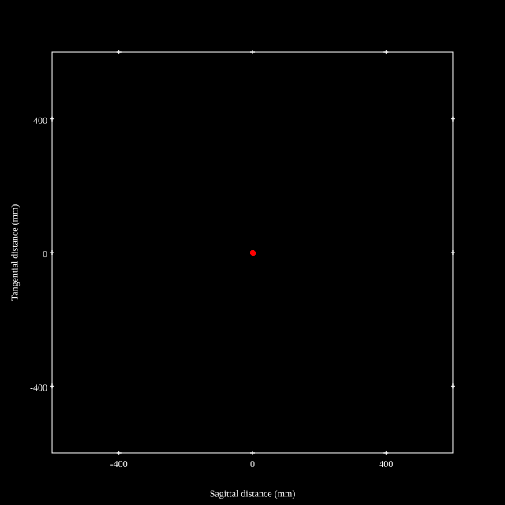
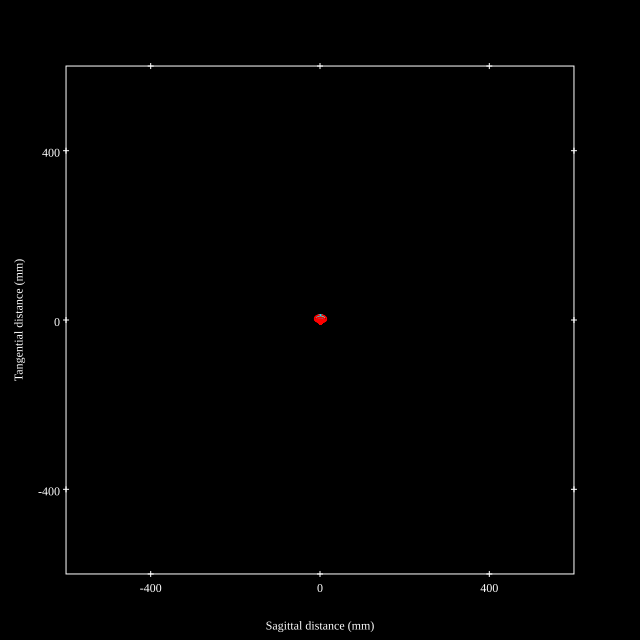
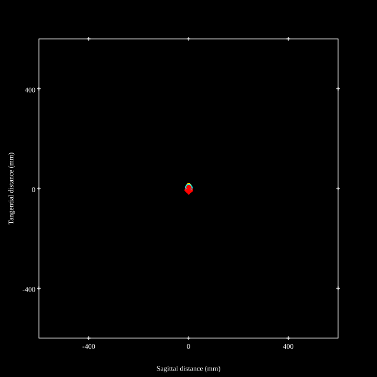
## Paraxial Parameters
| parameter | value |
| ---       | ---   |
| effective_focal_length |194.006
| back_focal_length | 52.486
| optical_invariant | 3.701
| object_distance | 1.0E10
| image_distance | 52.486
| power | 0.005
| pp1_H | 109.658
| ppk_H' | -141.519
| ffl_F | -84.348
| fno | 2.922
| enp_dist_P | 233.301
| enp_radius | 33.201
| exp_dist_P' | -66.017
| exp_radius | 20.278
| m | -0
| red | -5.154486159871997E7
| n_obj | 1
| n_img | 1
| img_ht | 21.624
| obj_ang | 6.36
| obj_na | 0
| img_na | -0.169|
## Spot Analysis
| Field | Spot Mean Radius | Spot Max Radius |
| ---   | ---              | ---             |
 | Field(x=0.0, y=0.0) | 3.279 | 6.102|
 | Field(x=0.0, y=0.1) | 3.304 | 8.905|
 | Field(x=0.0, y=0.2) | 3.292 | 10.633|
 | Field(x=0.0, y=0.3) | 3.45 | 12.276|
 | Field(x=0.0, y=0.4) | 3.683 | 13.357|
 | Field(x=0.0, y=0.5) | 3.995 | 14.149|
 | Field(x=0.0, y=0.6) | 4.412 | 14.64|
 | Field(x=0.0, y=0.7) | 5.051 | 14.781|
 | Field(x=0.0, y=0.8) | 6.112 | 15.632|
 | Field(x=0.0, y=0.9) | 7.775 | 17.104|
 | Field(x=0.0, y=1.0) | 10.286 | 21.619|
## Polychromatic Geometric MTF
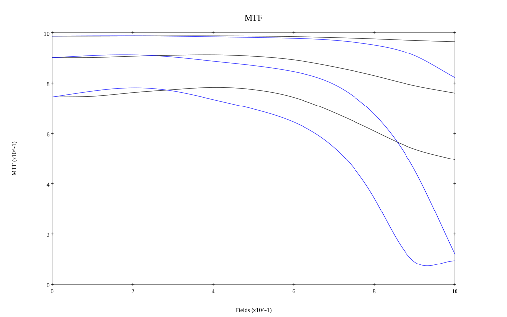
* 10,30,50 cycles/mm
* Black lines represent sagittal, blue tangential
* To generate above, MTFs for wavelengths 587.5618(d), 486.1327(F), 656.2725(C) were calculated across 10 fields, and then averaged
## Polychromatic Geometric MTF (Weighted)
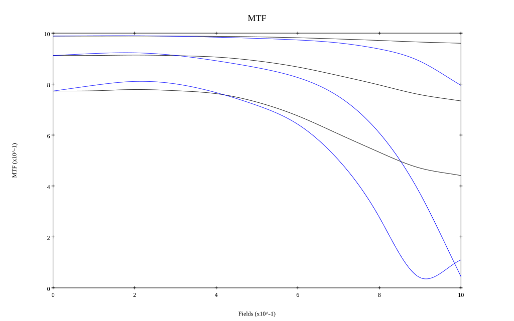
* 10,30,50 cycles/mm
* Black lines represent sagittal, blue tangential
* To generate above, MTFs for wavelengths 587.5618(d) wt(1.0), 656.2725(C) wt(0.475), 546.074(e) wt(0.98), 486.1327(F) wt(0.49), 435.8343(g) wt(0.15) were calculated across 10 fields, and then combined using weighted average
## Resources
* [OpticalBench Compatible Data File, tab delimited](./prescription.txt)
* [Zemax file](./US005537259_Example01P.zmx)

Report / Zemax file generated using [Beam42](https://github.com/BeamFour/Beam42) on 2026-06-02
