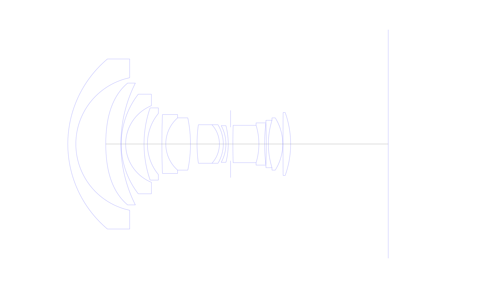
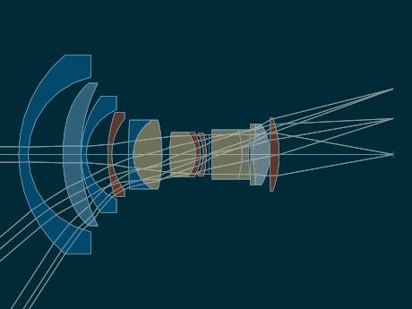
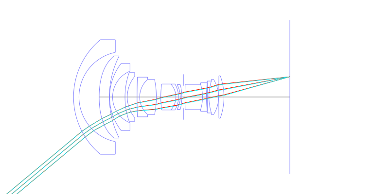
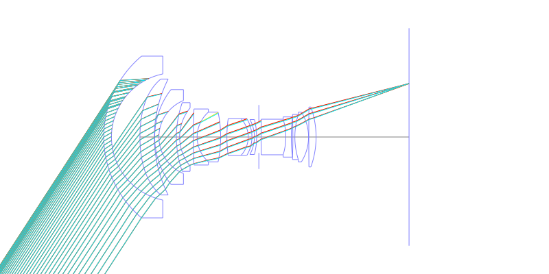
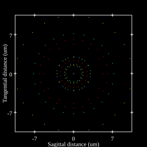
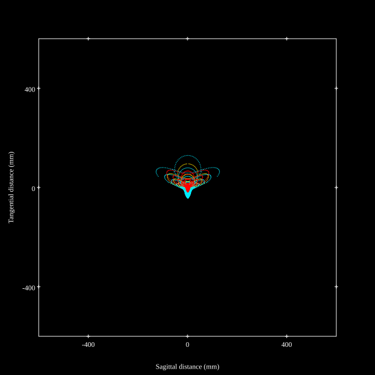
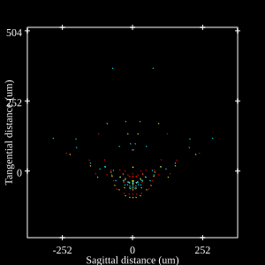
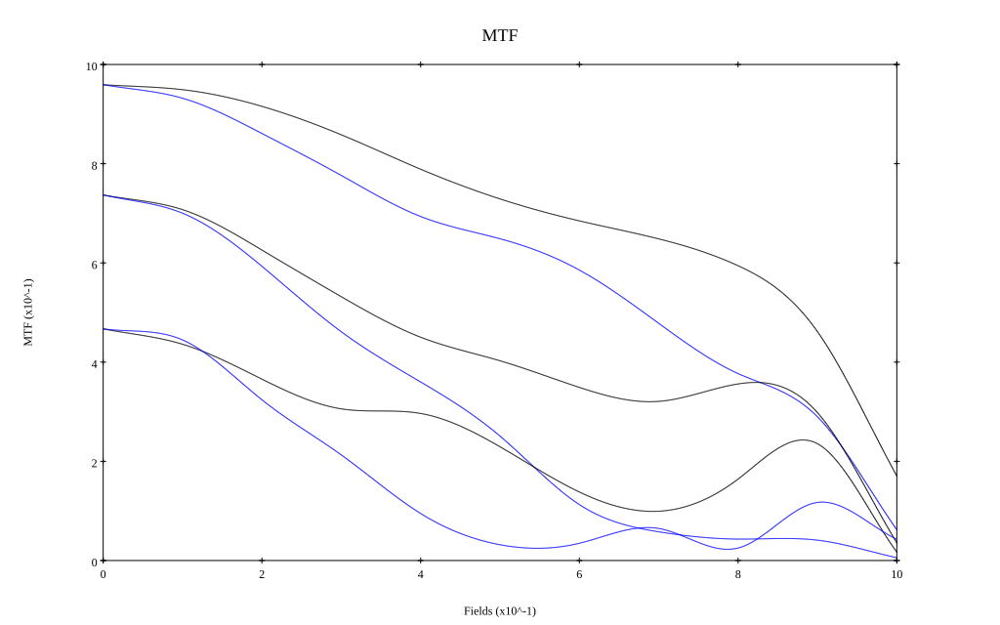

# Canon FD 14mm f/2.8L Aspherical
## Patent Information
| Country | Patent Number | Example | Year of Application | Inventors | Organisation | Link |
| ---     | ---           | ---     | ---                 | ---       | ---          | ---  |
|JP | JP-S57-064716 | EX 1 | 1980 | Keiji Ikemori | Canon Inc  | [link](https://www.j-platpat.inpit.go.jp/c1801/PU/JP-S57-064716/11/en) |
## Surface Data
Note that where glass types are shown the refractive index and abbe number is as per assigned glass type

| ID  | Radius | Thickness | Diameter | nd  | vd  | Glass Make | Glass |
| --- | ---    | ---       | ---      | --- | --- | ---        | ---   |
| 1 | 41.986 | 3.038 | 64.26 | 1.6968 | 55.46 | Hoya | LAC14 |
| 2 | 25.606 | 11.298 | 50.12 |  |  |  |
| 3 | 57.47 | 5.712 | 46.06 | 1.60311 | 60.6 | Schott | N-SK14 |
| 4 | 51.142 | 0.14 | 46.06 |  |  |  |
| 5 | 30.772 | 1.666 | 37.66 | 1.6968 | 55.46 | Hoya | LAC14 |
| 6 | 15.652 | 6.944 | 28.98 |  |  |  |
| 7 | 41.594 | 1.274 | 27.3 | 1.7725 | 49.6 | Ohara | S-LAH66 |
| 8 | 18.158 | 5.474 | 23.1 |  |  |  |
| 9 | 298.62 | 1.47 | 22.26 | 1.6968 | 55.46 | Hoya | LAC14 |
| 10 | 13.16 | 9.324 | 19.74 | 1.59551 | 39.24 | Ohara | S-TIM8 |
| 11 | -48.706 | 2.478 | 19.74 |  |  |  |
| 12 | 52.094 | 8.456 | 14.56 | 1.54814 | 45.82 | Hoya | E-FEL1 |
| 13 | -10.78 | 1.47 | 14.56 | 1.7725 | 49.6 | Ohara | S-LAH66 |
| 14 | -14.154 | 0.98 | 14.56 |  |  |  |
| 15 | -14.378 | 0.882 | 13.86 | 1.7725 | 49.6 | Ohara | S-LAH66 |
| 16 | -28.154 | 0.882 | 13.86 |  |  |  |
| 17 | AS | 0.882 | 12.706 |  |  |  |
| 18 | 275.044 | 9.814 | 14.14 | 1.6668 | 33.05 | Ohara | PBM39 |
| 19 | -24.178 | 2.17 | 14.14 | 1.62004 | 36.3 | Hoya | E-F2 |
| 20 | 65.198 | 0.63 | 15.96 |  |  |  |
| 21 | -230.58 | 0.784 | 15.96 | 1.92286 | 20.88 | Hoya | E-FDS1 |
| 22 | 29.918 | 5.432 | 17.92 | 1.48749 | 70.24 | Ohara | S-FSL5 |
| 23 | -18.606 | 0.098 | 19.74 |  |  |  |
| 24 | 1429.106 | 2.884 | 23.8 | 1.804 | 46.58 | Ohara | S-LAH65V |
| 25 | -35.294 | 36.875 | 23.8 |  |  |  |
## Aspherical Data
| ID  | k   | P1  | P2  | P3  | P3 | P5 | P6 | P7 | P8 | P9 | P10 |
| --- | --- | --- | --- | --- | --- | --- | --- | --- | --- | --- | --- |
| 3 | 0.0 | 0.0 | 1.02E-5 | 3.22E-9 | -1.22E-11 | 2.54E-14 | 0.0 | 0.0 | 0.0 | 0.0 | 0.0 |
## Layouts

## Spot Diagrams

## Paraxial Parameters
| parameter | value |
| ---       | ---   |
| effective_focal_length |13.995
| back_focal_length | 36.972
| optical_invariant | 3.848
| object_distance | 1.0E10
| image_distance | 36.972
| power | 0.071
| pp1_H | 39.542
| ppk_H' | 22.977
| ffl_F | 25.547
| fno | 2.8
| enp_dist_P | 28.507
| enp_radius | 2.499
| exp_dist_P' | -29.104
| exp_radius | 11.817
| m | -0
| red | -7.145602584040213E8
| n_obj | 1
| n_img | 1
| img_ht | 21.55
| obj_ang | 57
| obj_na | 0
| img_na | -0.176|
## Spot Analysis
| Field | Spot Mean Radius | Spot Max Radius |
| ---   | ---              | ---             |
 | Field(x=0.0, y=0.0) | 5.8 | 11.998|
 | Field(x=0.0, y=0.1) | 7.772 | 46.433|
 | Field(x=0.0, y=0.2) | 11.975 | 73.822|
 | Field(x=0.0, y=0.3) | 18.422 | 103.006|
 | Field(x=0.0, y=0.4) | 24.295 | 107.536|
 | Field(x=0.0, y=0.5) | 26.507 | 109.974|
 | Field(x=0.0, y=0.6) | 28.932 | 120.182|
 | Field(x=0.0, y=0.7) | 34.653 | 144.899|
 | Field(x=0.0, y=0.8) | 46.262 | 214.743|
 | Field(x=0.0, y=0.9) | 75.88 | 288.802|
 | Field(x=0.0, y=1.0) | 104.57 | 398.519|
## Geometric MTF

* 10,30,50 cycles/mm
* Black lines represent sagittal, blue tangential
## Resources
* [OpticalBench Compatible Data File, tab delimited](./JP1982-064716_Example01.txt)
* [Zemax file](./JP1982-064716_Example01.zmx)
