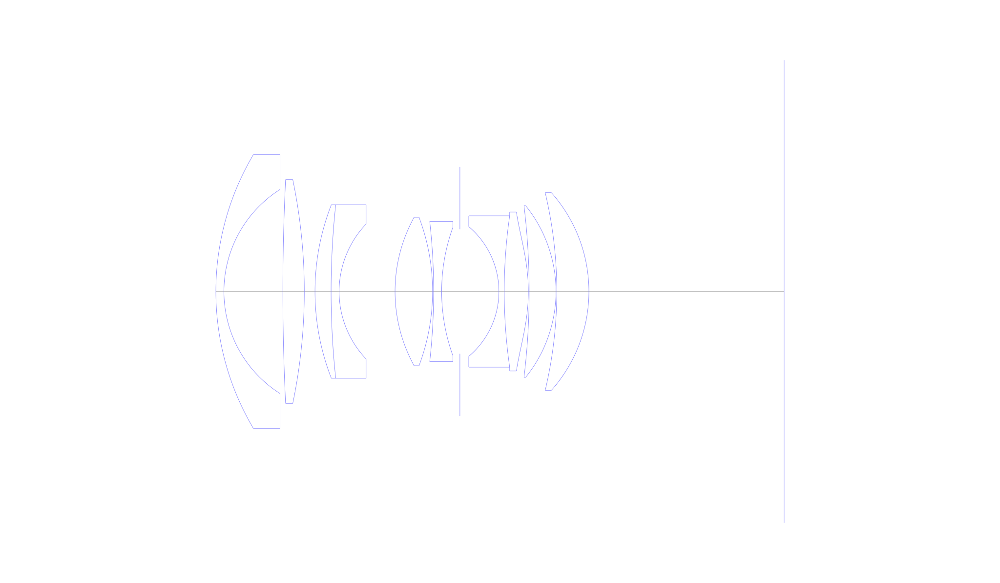
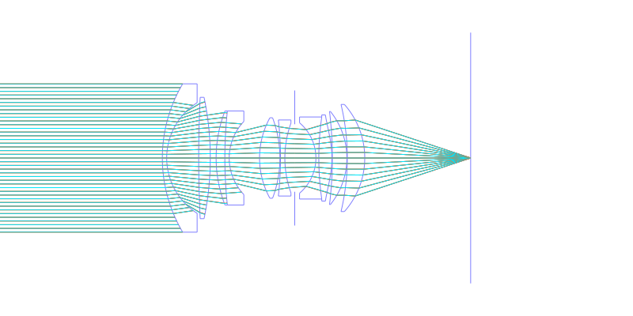
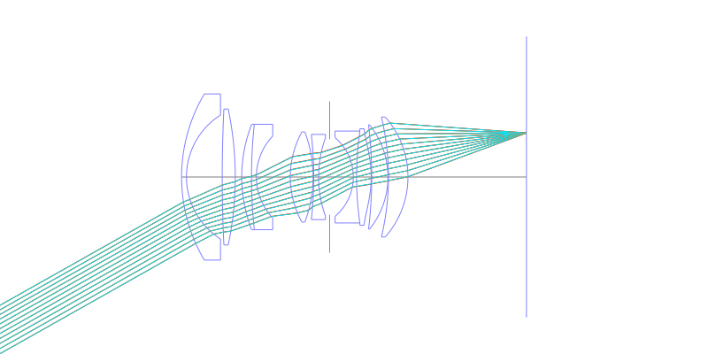
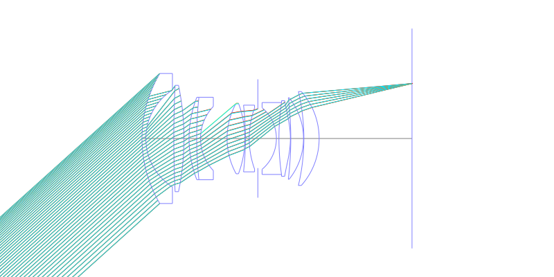
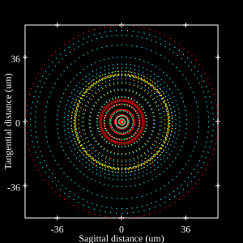
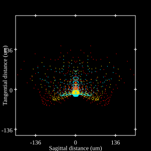
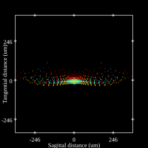

# Canon FD 24mm f/1.4 S.S.C. Aspherical
## Patent Information
| Country | Patent Number | Example | Year of Application | Inventors | Organisation | Link |
| ---     | ---           | ---     | ---                 | ---       | ---          | ---  |
|US | US3992085 | EX 1 | 1972 | Kikuo Momiyama | Canon Inc  | [link](https://patents.google.com/patent/US3992085A/en) |
## Surface Data
Note that where glass types are shown the refractive index and abbe number is as per assigned glass type

| ID  | Radius | Thickness | Diameter | nd  | vd  | Glass Make | Glass |
| --- | ---    | ---       | ---      | --- | --- | ---        | ---   |
| 1 | 50.193 | 1.5 | 51.1 | 1.58913 | 61.2 | Ohara | S-BAL35 |
| 2 | 22.569 | 11.0 | 38.1 |  |  |  |
| 3 | 428.24 | 4.0 | 41.8 | 1.58913 | 61.2 | Ohara | S-BAL35 |
| 4 | -102.53 | 2.0 | 41.8 |  |  |  |
| 5 | 44.584 | 3.0 | 32.42 | 1.805181 | 25.4 | Ohara | S-TIH6 |
| 6 | 152.276 | 1.5 | 32.42 | 1.58913 | 61.2 | Ohara | S-BAL35 |
| 7 | 18.288 | 10.437 | 25.2 |  |  |  |
| 8 | 28.795 | 7.0 | 27.72 | 1.713 | 53.94 | Hoya | LAC8 |
| 9 | -39.264 | 0.2 | 27.72 |  |  |  |
| 10 | -117.87 | 1.5 | 26.2 | 1.5892 | 41.08 | Ohara | PBL22 |
| 11 | 35.37 | 3.403 | 24.0 |  |  |  |
| 12 | AS | 7.278 | 23.264 |  |  |  |
| 13 | -15.854 | 1.0 | 24.22 | 1.805181 | 25.4 | Ohara | S-TIH6 |
| 14 | 99.094 | 4.5 | 28.26 | 1.7725 | 49.63 | Hoya | TAF1 |
| 15 | -33.487 | 0.15 | 29.68 |  |  |  |
| 16 | -133.553 | 5.0 | 32.08 | 1.7725 | 49.63 | Hoya | TAF1 |
| 17 | -25.53 | 0.15 | 32.08 |  |  |  |
| 18 | -79.919 | 6.0 | 36.9 | 1.7725 | 49.63 | Hoya | TAF1 |
| 19 | -27.816 | 36.43 | 36.9 |  |  |  |
## Aspherical Data
| ID  | k   | A4  | A6  | A8  | A10 | A12 | A14 | A16 | A18 |
| --- | --- | --- | --- | --- | --- | --- | --- | --- | --- |
| 15 | 0.0 | 2.0647E-5 | 3.6845E-8 | -8.0225E-11 | 5.2622E-14 | 0.0 | 0.0 | 0.0 | 0.0 |
## Layouts

## Spot Diagrams

## Paraxial Parameters
| parameter | value |
| ---       | ---   |
| effective_focal_length |24.499
| back_focal_length | 36.498
| optical_invariant | 7.878
| object_distance | 1.0E10
| image_distance | 36.43
| power | 0.041
| pp1_H | 44.859
| ppk_H' | -11.999
| ffl_F | 20.36
| fno | 1.4
| enp_dist_P | 27.349
| enp_radius | 8.75
| exp_dist_P' | -49.379
| exp_radius | 30.67
| m | 0.003
| red | -4.081802775823107E8
| n_obj | 1
| n_img | 1
| img_ht | 22.059
| obj_ang | 42
| obj_na | 0
| img_na | -0.336|
## Spot Analysis
| Field | Spot Mean Radius | Spot Max Radius |
| ---   | ---              | ---             |
 | 0.0 | 20.331 | 79.994|
 | 0.7 | 44.85 | 203.922|
 | 1.0 | 111.149 | 369.406|
## Resources
* [OpticalBench Compatible Data File, tab delimited](./US003992085_Example01.txt)
* [Zemax file](./US003992085_Example01.zmx)
