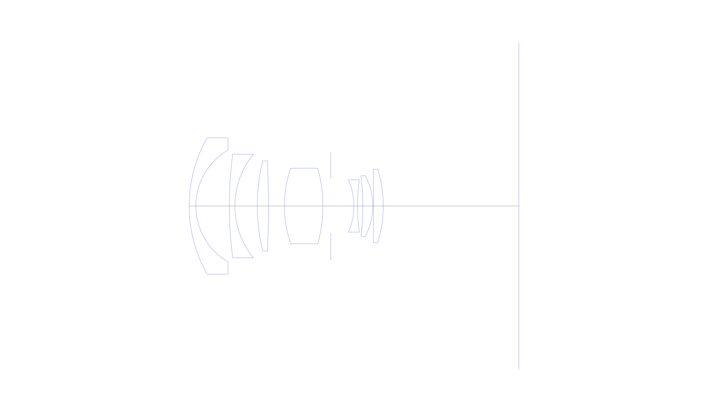
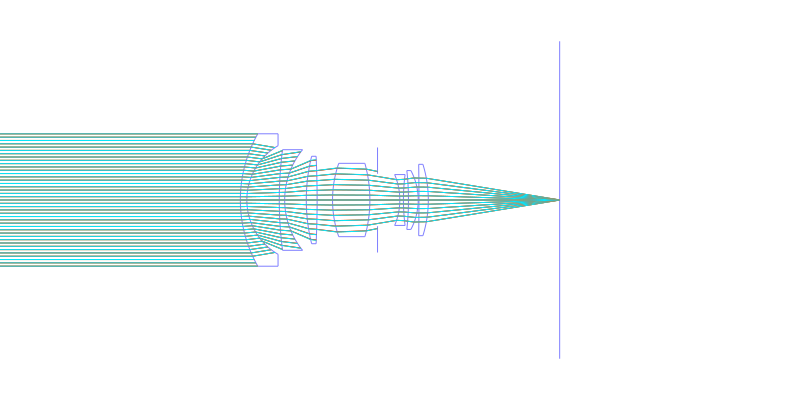
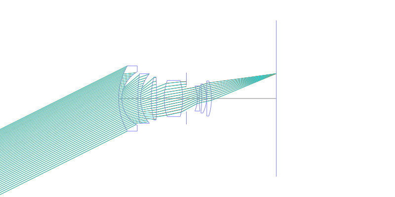
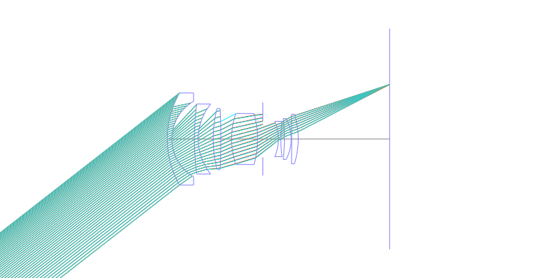
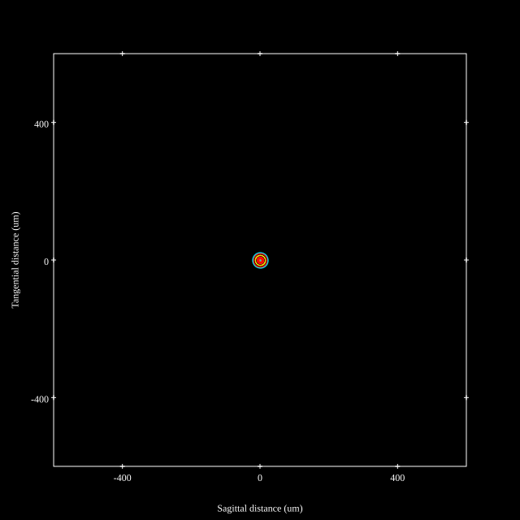
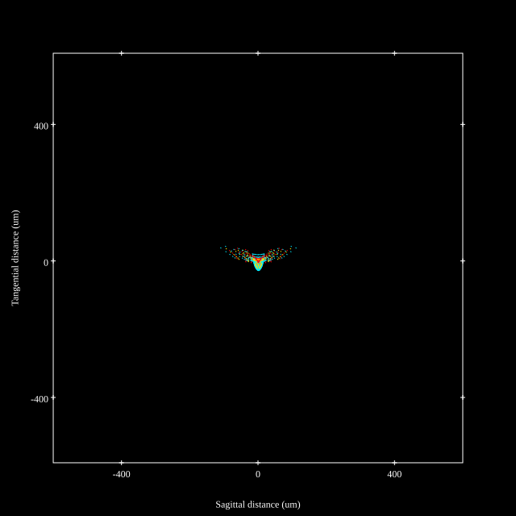
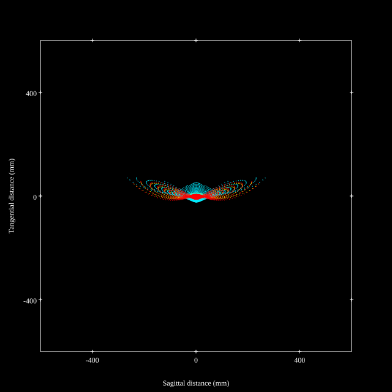
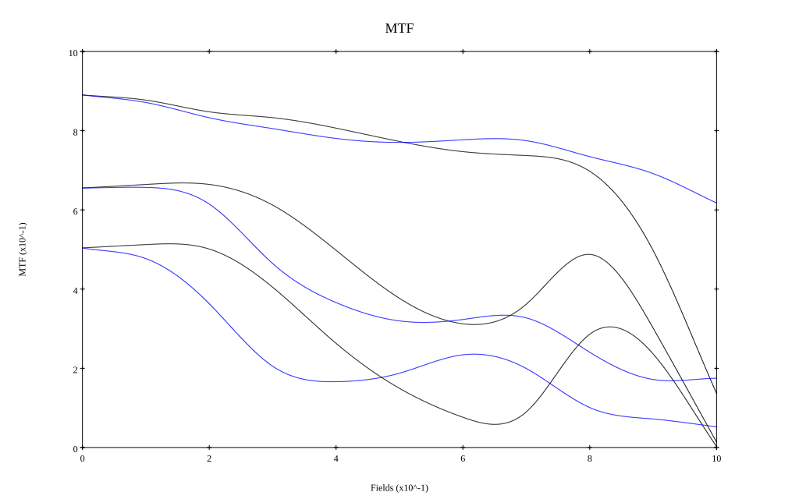
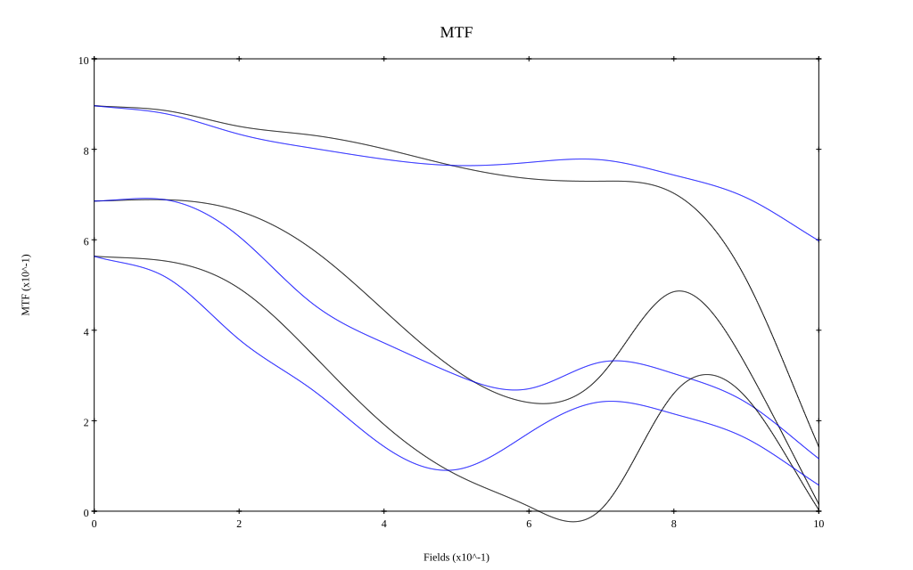

# Canon FD 28mm f2.8
## Patent Information
| Country | Patent Number | Example | Year of Application | Inventors | Organisation | Link |
| ---     | ---           | ---     | ---                 | ---       | ---          | ---  |
|US | US4046459 | EX 2 | 1974 | Naoto Kawamura | Canon Inc  | [link](https://patents.google.com/patent/US4046459A/en) |
## Surface Data
Note that where glass types are shown the refractive index and abbe number is as per assigned glass type

| ID  | Radius | Thickness | Diameter | nd  | vd  | Glass Make | Glass |
| --- | ---    | ---       | ---      | --- | --- | ---        | ---   |
| 1 | 36.5792 | 1.7696 | 36.04 | 1.61117 | 55.92 | Schott | SK8 |
| 2 | 17.1052 | 8.8256 | 29.56 |  |  |  |
| 3 | 105.3416 | 1.4728 | 27.38 | 1.60729 | 49.19 | Ohara | BAM5 |
| 4 | 21.7196 | 5.88 | 27.38 |  |  |  |
| 5 | 49.3332 | 2.9484 | 23.8 | 1.72342 | 38.03 | Hikari | J-BASF8 |
| 6 | -257.1884 | 4.2 | 23.8 |  |  |  |
| 7 | 30.352 | 10.1556 | 19.96 | 1.60311 | 60.7 | Ohara | BSM14 |
| 8 | -37.3408 | 2.086 | 19.96 |  |  |  |
| 9 | AS | 6.062 | 14.294 |  |  |  |
| 10 | -17.822 | 0.9828 | 13.84 | 1.74077 | 27.79 | Ohara | S-TIH13 |
| 11 | 52.8556 | 1.3748 | 13.84 |  |  |  |
| 12 | -71.764 | 2.6516 | 16.02 | 1.6935 | 53.21 | Ohara | S-LAL13 |
| 13 | -17.1136 | 0.196 | 16.02 |  |  |  |
| 14 | -751.156 | 2.5536 | 19.42 | 1.6935 | 53.21 | Ohara | S-LAL13 |
| 15 | -32.8608 | 35.75 | 19.42 |  |  |  |
## Layouts

## Spot Diagrams

## Paraxial Parameters
| parameter | value |
| ---       | ---   |
| effective_focal_length |27.998
| back_focal_length | 35.858
| optical_invariant | 3.906
| object_distance | 1.0E10
| image_distance | 35.858
| power | 0.036
| pp1_H | 33.033
| ppk_H' | 7.86
| ffl_F | 5.035
| fno | 2.8
| enp_dist_P | 19.84
| enp_radius | 5
| exp_dist_P' | -16.979
| exp_radius | 9.455
| m | -0
| red | -3.5717342078430504E8
| n_obj | 1
| n_img | 1
| img_ht | 21.874
| obj_ang | 38
| obj_na | 0
| img_na | -0.176|
## Spot Analysis
| Field | Spot Mean Radius | Spot Max Radius |
| ---   | ---              | ---             |
 | Field(x=0.0, y=0.0) | 9.003 | 27.135|
 | Field(x=0.0, y=0.1) | 11.73 | 53.008|
 | Field(x=0.0, y=0.2) | 16.777 | 74.442|
 | Field(x=0.0, y=0.3) | 16.856 | 72.035|
 | Field(x=0.0, y=0.4) | 17.102 | 78.311|
 | Field(x=0.0, y=0.5) | 17.368 | 88.937|
 | Field(x=0.0, y=0.6) | 18.404 | 104.537|
 | Field(x=0.0, y=0.7) | 22.158 | 126.785|
 | Field(x=0.0, y=0.8) | 28.68 | 138.423|
 | Field(x=0.0, y=0.9) | 42.478 | 197.178|
 | Field(x=0.0, y=1.0) | 69.578 | 275.174|
## Polychromatic Geometric MTF

* 10,30,50 cycles/mm
* Black lines represent sagittal, blue tangential
* To generate above, MTFs for wavelengths 587.5618(d), 486.1327(F), 656.2725(C) were calculated across 10 fields, and then averaged
## Polychromatic Geometric MTF (Weighted)

* 10,30,50 cycles/mm
* Black lines represent sagittal, blue tangential
* To generate above, MTFs for wavelengths 587.5618(d) wt(1.0), 656.2725(C) wt(0.475), 546.074(e) wt(0.98), 486.1327(F) wt(0.49), 435.8343(g) wt(0.15) were calculated across 10 fields, and then combined using weighted average
## Resources
* [OpticalBench Compatible Data File, tab delimited](./US004046459_Example02.txt)
* [Zemax file](./US004046459_Example02.zmx)
