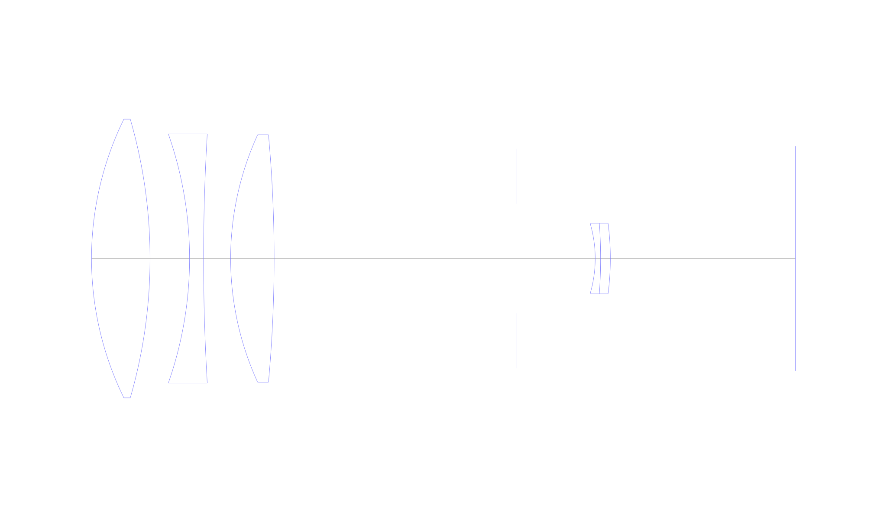
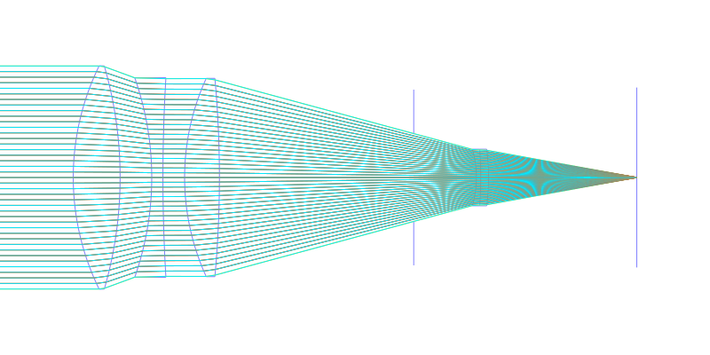
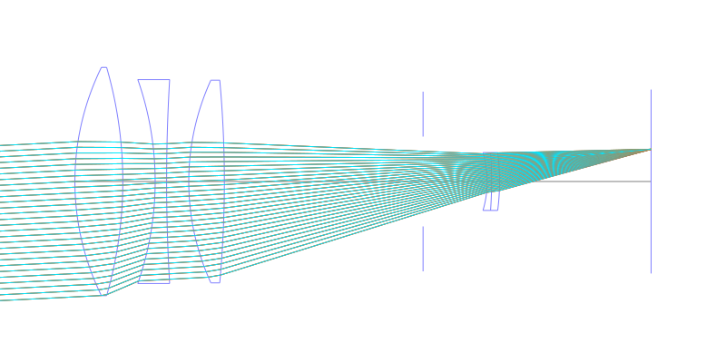
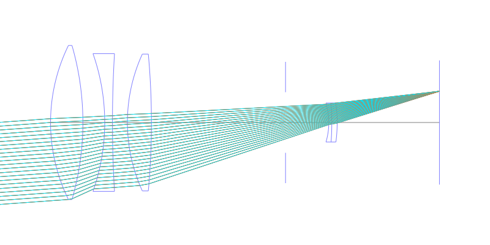
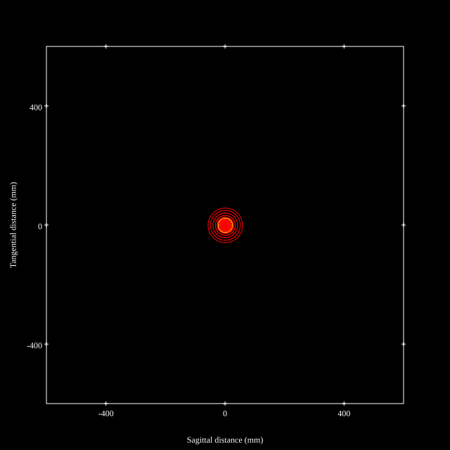
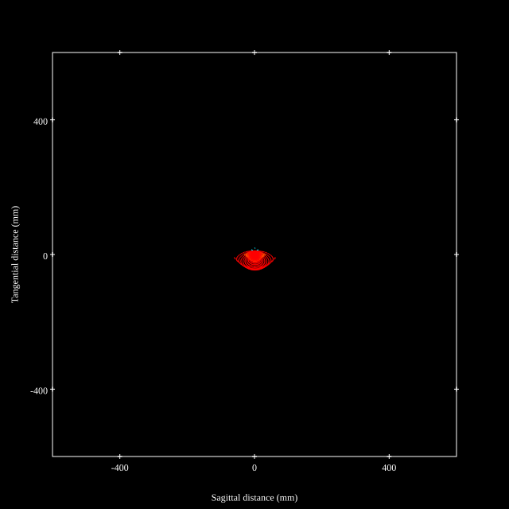
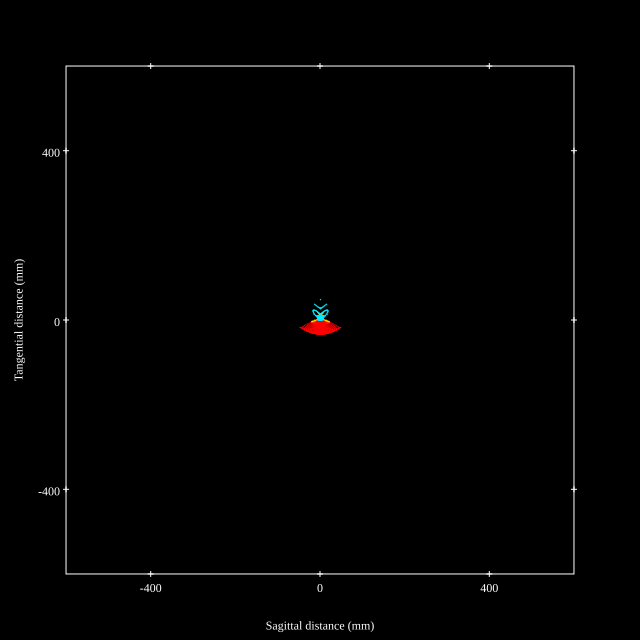
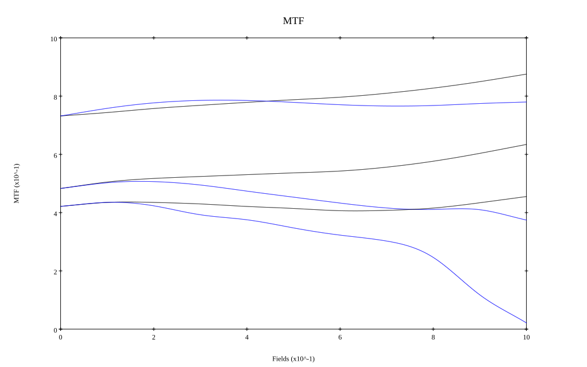
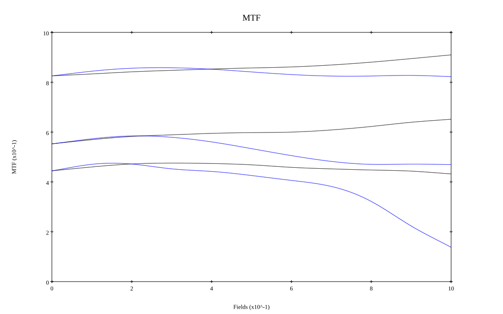

## Patent Information
| Country | Patent Number | Example | Year of Application | Inventors | Organisation | Link |
| ---     | ---           | ---     | ---                 | ---       | ---          | ---  |
|US | US3868174 | 1 | 1972 | Hideo Yakota | Canon Inc | [link](https://patents.google.com/patent/US3868174A/en) |
## Surface Data
Note that where glass types are shown the refractive index and abbe number is as per assigned glass type

| ID  | Radius | Thickness | Diameter | nd  | vd  | Glass Make | Glass |
| --- | ---    | ---       | ---      | --- | --- | ---        | ---   |
| 1 | 121.758 | 22.4934 | 107.2 | 1.43384 | 95.26 | Hikari | NICF-A |
| 2 | -192.786 | 15.1896 | 107.2 |  |  |  |
| 3 | -144.6156 | 5.3787 | 95.81 | 1.7859 | 44.2 | Ohara | S-LAH51 |
| 4 | 808.3908 | 10.404 | 95.81 |  |  |  |
| 5 | 114.2982 | 16.7088 | 95.21 | 1.48749 | 70.24 | Ohara | S-FSL5 |
| 6 | -524.3616 | 93.3017 | 95.21 |  |  |  |
| 7 | AS | 30.1 | 42.188 |  |  |  |
| 8 | -47.8584 | 2.0808 | 27.18 | 1.51633 | 64.14 | Ohara | S-BSL7 |
| 9 | -189.3528 | 3.7452 | 27.18 | 1.72151 | 29.23 | Ohara | S-TIH18 |
| 10 | -104.4663 | 71.15 | 27.18 |  |  |  |
## Layouts

## Spot Diagrams

## Paraxial Parameters
| parameter | value |
| ---       | ---   |
| effective_focal_length |300.023
| back_focal_length | 71.23
| optical_invariant | 3.858
| object_distance | 1.0E10
| image_distance | 71.23
| power | 0.003
| pp1_H | -207.001
| ppk_H' | -228.794
| ffl_F | -507.024
| fno | 2.801
| enp_dist_P | 371.922
| enp_radius | 53.562
| exp_dist_P' | -31.102
| exp_radius | 18.283
| m | -0
| red | -3.333072994080984E7
| n_obj | 1
| n_img | 1
| img_ht | 21.611
| obj_ang | 4.12
| obj_na | 0
| img_na | -0.176|
## Spot Analysis
| Field | Spot Mean Radius | Spot Max Radius |
| ---   | ---              | ---             |
 | Field(x=0.0, y=0.0) | 19.112 | 58.008|
 | Field(x=0.0, y=0.1) | 18.318 | 63.413|
 | Field(x=0.0, y=0.2) | 17.538 | 63.347|
 | Field(x=0.0, y=0.3) | 17.231 | 63.491|
 | Field(x=0.0, y=0.4) | 17.133 | 63.418|
 | Field(x=0.0, y=0.5) | 16.931 | 63.016|
 | Field(x=0.0, y=0.6) | 16.719 | 62.395|
 | Field(x=0.0, y=0.7) | 16.326 | 60.892|
 | Field(x=0.0, y=0.8) | 15.751 | 58.591|
 | Field(x=0.0, y=0.9) | 14.779 | 55.293|
 | Field(x=0.0, y=1.0) | 13.96 | 50.773|
## Polychromatic Geometric MTF

* 10,30,50 cycles/mm
* Black lines represent sagittal, blue tangential
* To generate above, MTFs for wavelengths 587.5618(d), 486.1327(F), 656.2725(C) were calculated across 10 fields, and then averaged
## Polychromatic Geometric MTF (Weighted)

* 10,30,50 cycles/mm
* Black lines represent sagittal, blue tangential
* To generate above, MTFs for wavelengths 587.5618(d) wt(1.0), 656.2725(C) wt(0.475), 546.074(e) wt(0.98), 486.1327(F) wt(0.49), 435.8343(g) wt(0.15) were calculated across 10 fields, and then combined using weighted average
## Resources
* [OpticalBench Compatible Data File, tab delimited](./prescription.txt)
* [Zemax file](./US003868174_Example01P.zmx)

Report / Zemax file generated using [Beam42](https://github.com/BeamFour/Beam42) on 2026-03-19
