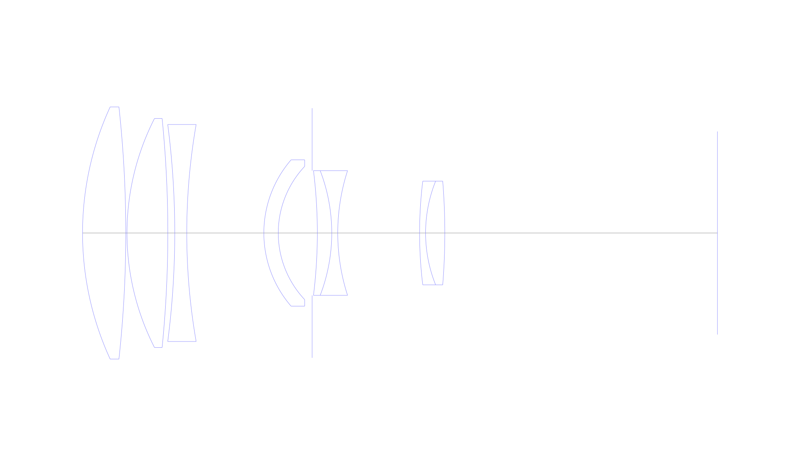
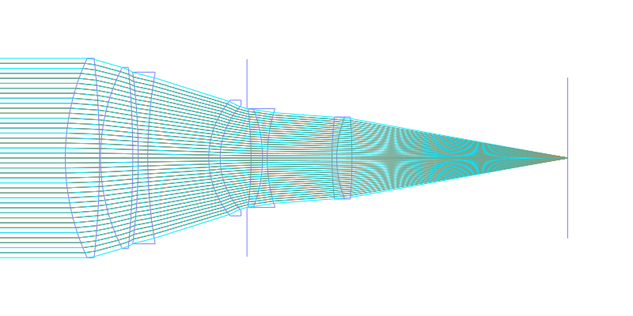
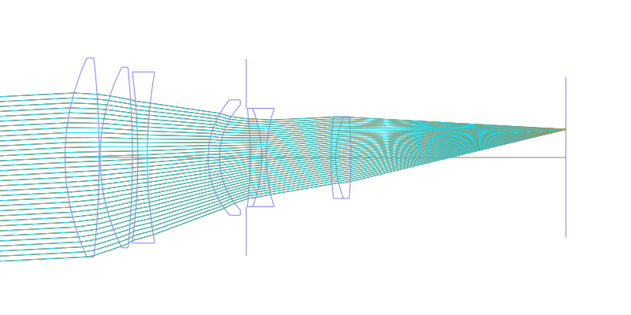
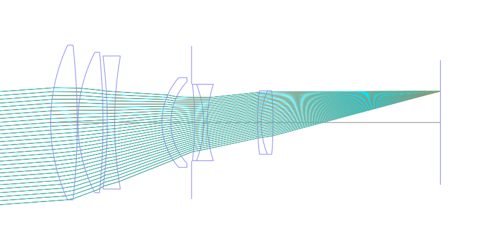
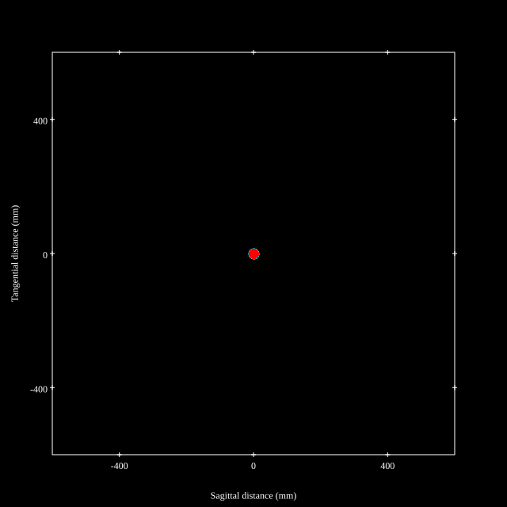
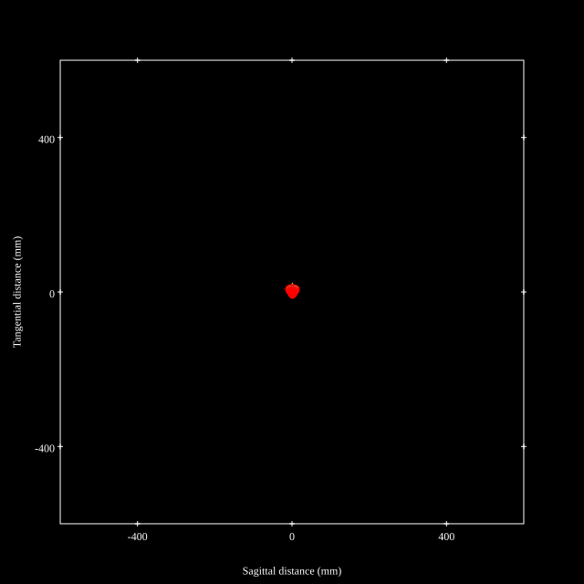
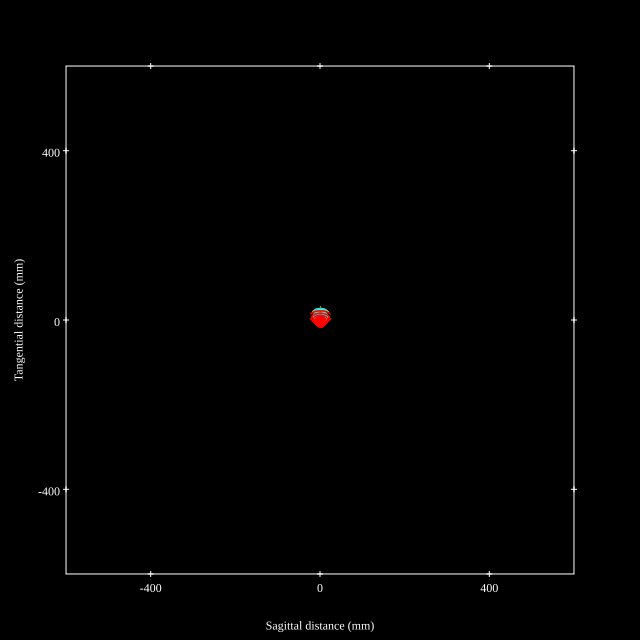
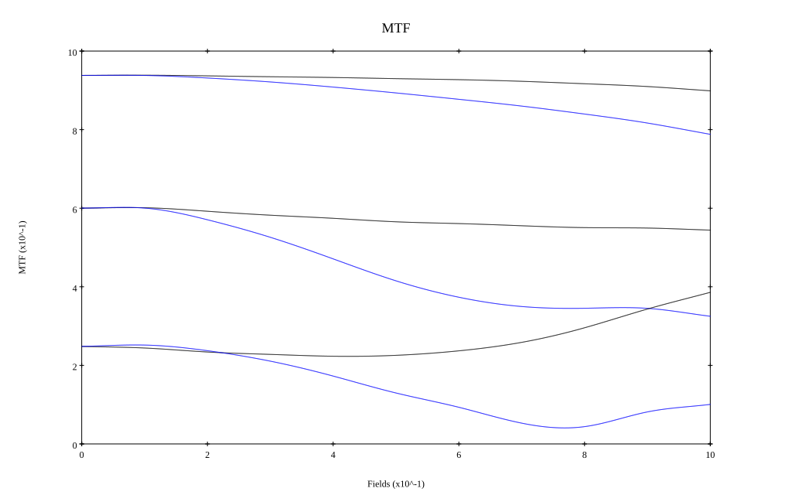
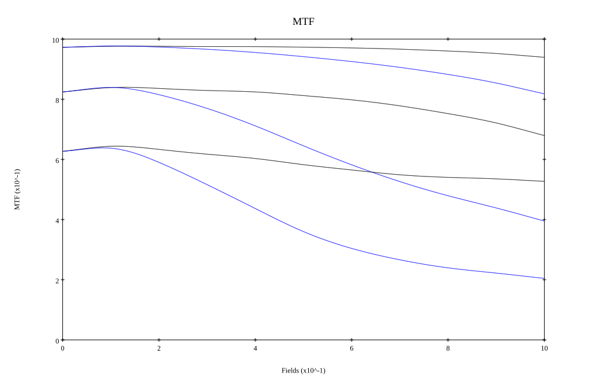

# Canon New FD 300mm f2.8L
## Patent Information
| Country | Patent Number | Example | Year of Application | Inventors | Organisation | Link |
| ---     | ---           | ---     | ---                 | ---       | ---          | ---  |
|US | US4348084 | 4 | 1979 | Nozomu Kitagishi, Kazuo Fujibayashi | Canon Inc | [link](https://patents.google.com/patent/US4348084A/en) |
## Surface Data
Note that where glass types are shown the refractive index and abbe number is as per assigned glass type

| ID  | Radius | Thickness | Diameter | nd  | vd  | Glass Make | Glass |
| --- | ---    | ---       | ---      | --- | --- | ---        | ---   |
| 1 | 128.457 | 18.369 | 107.25 | 1.497 | 81.61 | Ohara | FPL51 |
| 2 | -495.336 | 0.51 | 107.25 |  |  |  |
| 3 | 107.397 | 17.349 | 97.44 | 1.43384 | 95.26 | Hikari | NICF-A |
| 4 | -489.807 | 2.94 | 97.44 |  |  |  |
| 5 | -358.803 | 5.1 | 92.31 | 1.72047 | 34.61 | Schott | KZFS8 |
| 6 | 269.067 | 32.745 | 92.31 |  |  |  |
| 7 | 47.634 | 6.123 | 62.22 | 1.58913 | 61.14 | Ohara | S-BAL35 |
| 8 | 41.397 | 14.386 | 56.67 |  |  |  |
| 9 | AS | 2.21 | 53.091 |  |  |  |
| 10 | -215.49 | 6.123 | 53.04 | 1.80518 | 25.43 | Ohara | S-TIH6 |
| 11 | -74.019 | 2.55 | 53.04 | 1.6134 | 43.84 | Ohara | BPM4 |
| 12 | 86.451 | 34.764 | 53.04 |  |  |  |
| 13 | 181.689 | 2.55 | 44.12 | 1.6968 | 55.53 | Ohara | LAL14 |
| 14 | 59.304 | 8.163 | 44.12 | 1.618 | 63.39 | Ohara | PHM52 |
| 15 | -272.862 | 115.811 | 44.12 |  |  |  |
## Layouts

## Spot Diagrams

## Paraxial Parameters
| parameter | value |
| ---       | ---   |
| effective_focal_length |300.059
| back_focal_length | 115.848
| optical_invariant | 3.859
| object_distance | 1.0E10
| image_distance | 115.848
| power | 0.003
| pp1_H | -42.326
| ppk_H' | -184.211
| ffl_F | -342.385
| fno | 2.801
| enp_dist_P | 169.412
| enp_radius | 53.568
| exp_dist_P' | -60.034
| exp_radius | 31.406
| m | -0
| red | -3.332676001627925E7
| n_obj | 1
| n_img | 1
| img_ht | 21.614
| obj_ang | 4.12
| obj_na | 0
| img_na | -0.176|
## Spot Analysis
| Field | Spot Mean Radius | Spot Max Radius |
| ---   | ---              | ---             |
 | Field(x=0.0, y=0.0) | 6.124 | 19.323|
 | Field(x=0.0, y=0.1) | 5.245 | 19.319|
 | Field(x=0.0, y=0.2) | 5.315 | 18.544|
 | Field(x=0.0, y=0.3) | 5.601 | 17.476|
 | Field(x=0.0, y=0.4) | 6.02 | 16.033|
 | Field(x=0.0, y=0.5) | 6.532 | 17.35|
 | Field(x=0.0, y=0.6) | 7.154 | 20.634|
 | Field(x=0.0, y=0.7) | 7.89 | 23.861|
 | Field(x=0.0, y=0.8) | 8.774 | 27.044|
 | Field(x=0.0, y=0.9) | 9.695 | 29.886|
 | Field(x=0.0, y=1.0) | 10.875 | 32.053|
## Polychromatic Geometric MTF

* 10,30,50 cycles/mm
* Black lines represent sagittal, blue tangential
* To generate above, MTFs for wavelengths 587.5618(d), 486.1327(F), 656.2725(C) were calculated across 10 fields, and then averaged
## Polychromatic Geometric MTF (Weighted)

* 10,30,50 cycles/mm
* Black lines represent sagittal, blue tangential
* To generate above, MTFs for wavelengths 587.5618(d) wt(1.0), 656.2725(C) wt(0.475), 546.074(e) wt(0.98), 486.1327(F) wt(0.49), 435.8343(g) wt(0.15) were calculated across 10 fields, and then combined using weighted average
## Resources
* [OpticalBench Compatible Data File, tab delimited](./prescription.txt)
* [Zemax file](./JP1981-159613_Example01P.zmx)

Report / Zemax file generated using [Beam42](https://github.com/BeamFour/Beam42) on 2026-03-20
