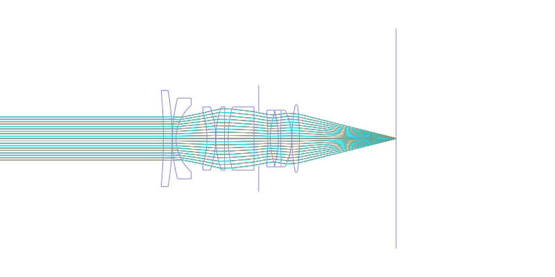
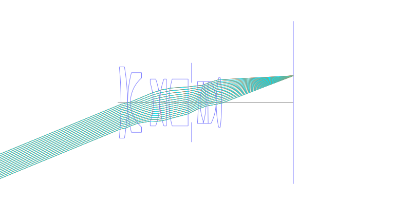
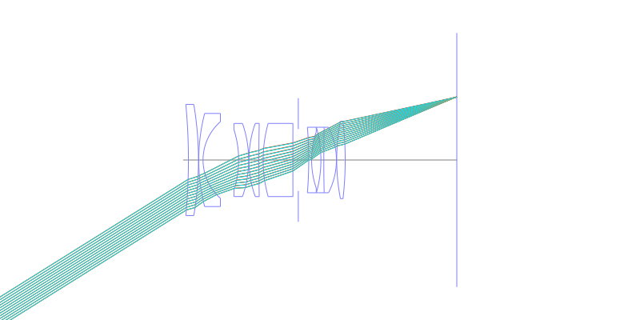
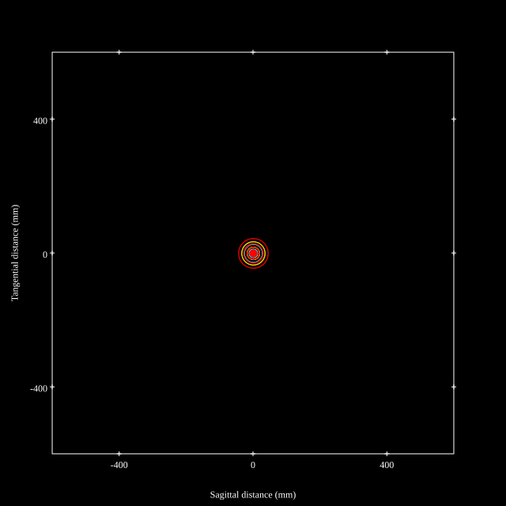
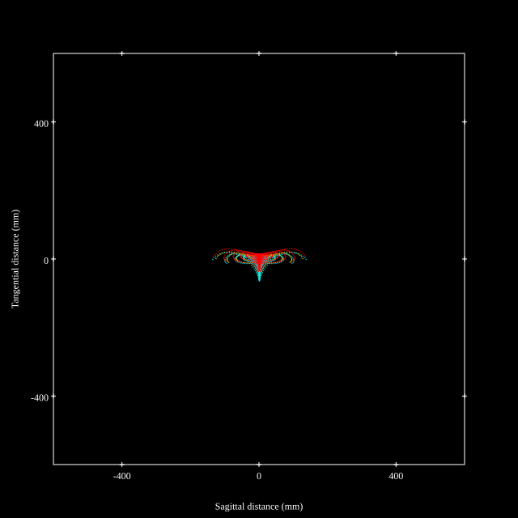
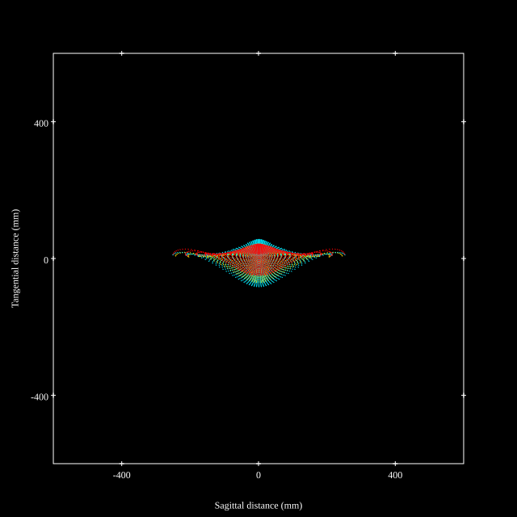
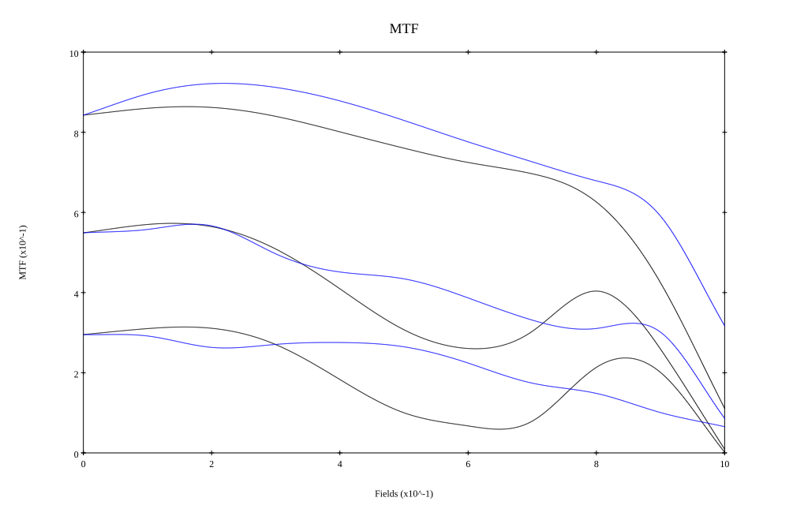
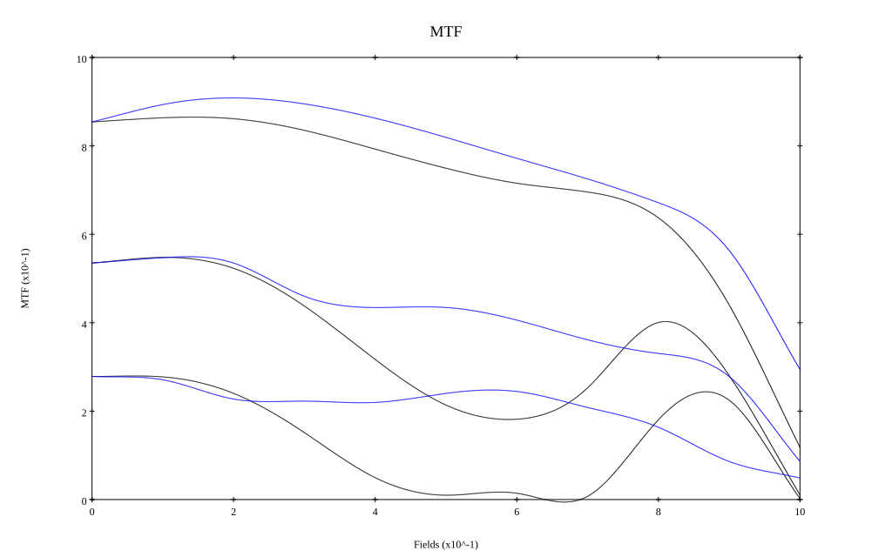

# Canon FD 35mm f2
## Patent Information
| Country | Patent Number | Example | Year of Application | Inventors | Organisation | Link |
| ---     | ---           | ---     | ---                 | ---       | ---          | ---  |
|US | US3748022 | EX 1 | 1972 | A Tajima | Canon Inc  | [link](https://patents.google.com/patent/US3748022A/en) |
## Surface Data
Note that where glass types are shown the refractive index and abbe number is as per assigned glass type

| ID  | Radius | Thickness | Diameter | nd  | vd  | Glass Make | Glass |
| --- | ---    | ---       | ---      | --- | --- | ---        | ---   |
| 1 | -202.16 | 3.4125 | 37.82 | 1.697 | 48.52 | Ohara | S-LAM59 |
| 2 | -113.085 | 0.098 | 37.82 |  |  |  |
| 3 | 63.56 | 1.463 | 31.67 | 1.51633 | 64.14 | Ohara | S-BSL7 |
| 4 | 17.304 | 12.117 | 26.04 |  |  |  |
| 5 | -34.122 | 3.402 | 20.72 | 1.70154 | 41.24 | Ohara | S-BAH27 |
| 6 | -37.87 | 0.1015 | 24.87 |  |  |  |
| 7 | 37.52 | 3.36 | 24.89 | 1.7 | 48.08 | Ohara | S-LAM51 |
| 8 | 554.05 | 1.4665 | 24.89 |  |  |  |
| 9 | 46.655 | 10.115 | 24.89 | 1.77314 | 49.57 | Schott | LAFN28 |
| 10 | 4343.5 | 1.8435 | 24.89 |  |  |  |
| 11 | AS | 3.55 | 21.035 |  |  |  |
| 12 | -135.695 | 0.9765 | 22.29 | 1.76182 | 26.52 | Ohara | S-TIH14 |
| 13 | 29.939 | 3.1675 | 19.24 |  |  |  |
| 14 | -40.95 | 0.98 | 22.29 | 1.80518 | 25.43 | Ohara | S-TIH6 |
| 15 | 488.6 | 4.291 | 22.29 | 1.77314 | 49.57 | Schott | LAFN28 |
| 16 | -24.462 | 0.1015 | 22.29 |  |  |  |
| 17 | 68.95 | 2.8945 | 26.3 | 1.8061 | 40.93 | Ohara | S-LAH53 |
| 18 | -114.73 | 37.96 | 26.3 |  |  |  |
## Layouts

## Spot Diagrams

## Paraxial Parameters
| parameter | value |
| ---       | ---   |
| effective_focal_length |35.036
| back_focal_length | 38.014
| optical_invariant | 5.467
| object_distance | 1.0E10
| image_distance | 38.014
| power | 0.029
| pp1_H | 34.886
| ppk_H' | 2.978
| ffl_F | -0.15
| fno | 2.002
| enp_dist_P | 21.541
| enp_radius | 8.75
| exp_dist_P' | -18.522
| exp_radius | 14.132
| m | -0
| red | -2.8541874756380194E8
| n_obj | 1
| n_img | 1
| img_ht | 21.893
| obj_ang | 32
| obj_na | 0
| img_na | -0.242|
## Spot Analysis
| Field | Spot Mean Radius | Spot Max Radius |
| ---   | ---              | ---             |
 | Field(x=0.0, y=0.0) | 14.048 | 44.211|
 | Field(x=0.0, y=0.1) | 10.989 | 48.491|
 | Field(x=0.0, y=0.2) | 10.861 | 54.977|
 | Field(x=0.0, y=0.3) | 12.429 | 64.236|
 | Field(x=0.0, y=0.4) | 15.124 | 77.037|
 | Field(x=0.0, y=0.5) | 18.48 | 93.193|
 | Field(x=0.0, y=0.6) | 22.86 | 112.774|
 | Field(x=0.0, y=0.7) | 28.623 | 136.222|
 | Field(x=0.0, y=0.8) | 37.355 | 164.783|
 | Field(x=0.0, y=0.9) | 53.053 | 201.312|
 | Field(x=0.0, y=1.0) | 80.59 | 251.741|
## Polychromatic Geometric MTF

* 10,30,50 cycles/mm
* Black lines represent sagittal, blue tangential
* To generate above, MTFs for wavelengths 587.5618(d), 486.1327(F), 656.2725(C) were calculated across 10 fields, and then averaged
## Polychromatic Geometric MTF (Weighted)

* 10,30,50 cycles/mm
* Black lines represent sagittal, blue tangential
* To generate above, MTFs for wavelengths 587.5618(d) wt(1.0), 656.2725(C) wt(0.475), 546.074(e) wt(0.98), 486.1327(F) wt(0.49), 435.8343(g) wt(0.15) were calculated across 10 fields, and then combined using weighted average
## Resources
* [OpticalBench Compatible Data File, tab delimited](./US003748022_Example01P.txt)
* [Zemax file](./US003748022_Example01P.zmx)
