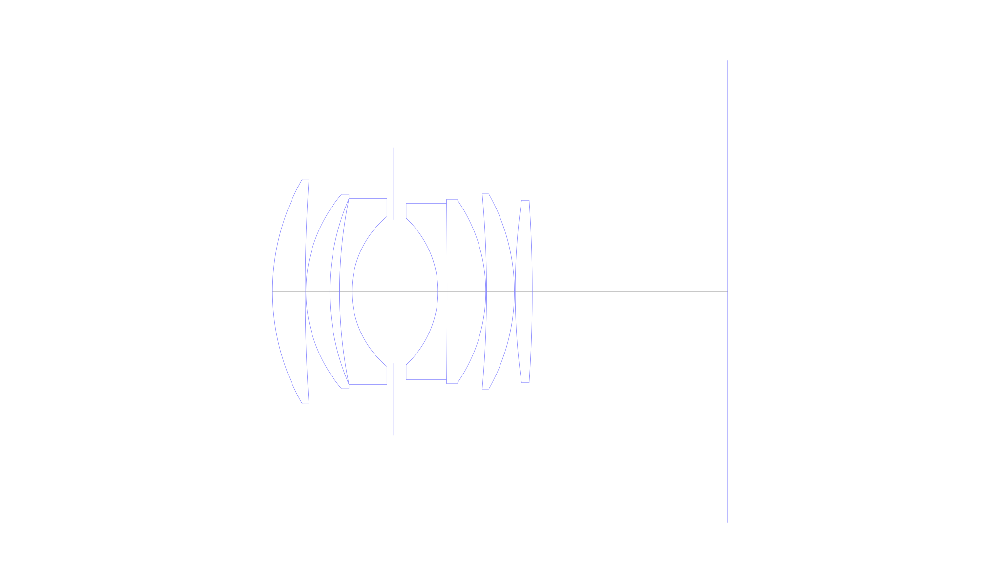
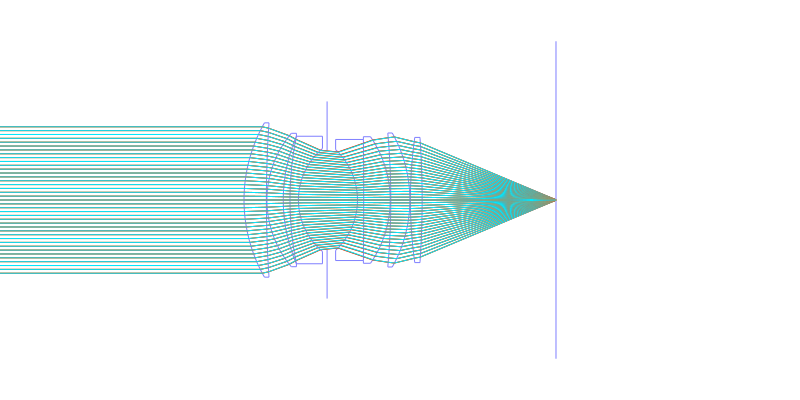
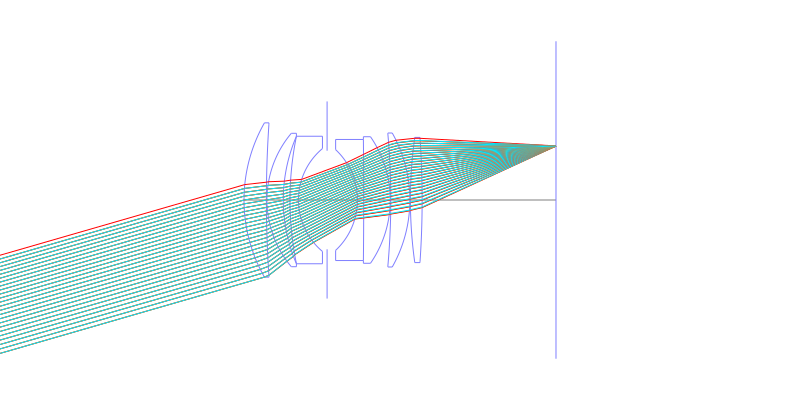
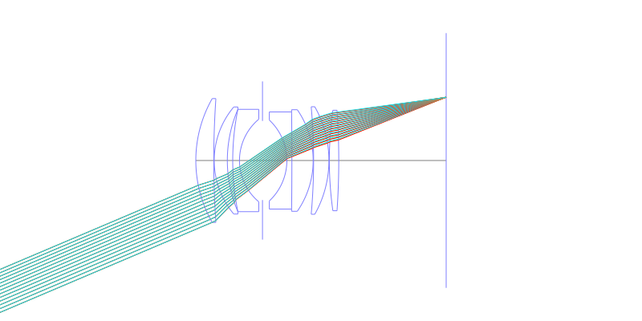
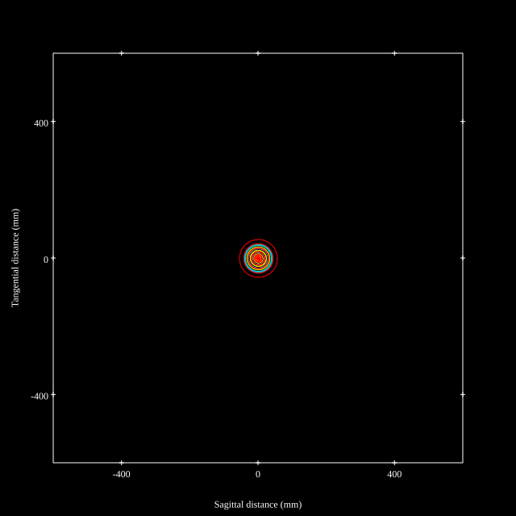
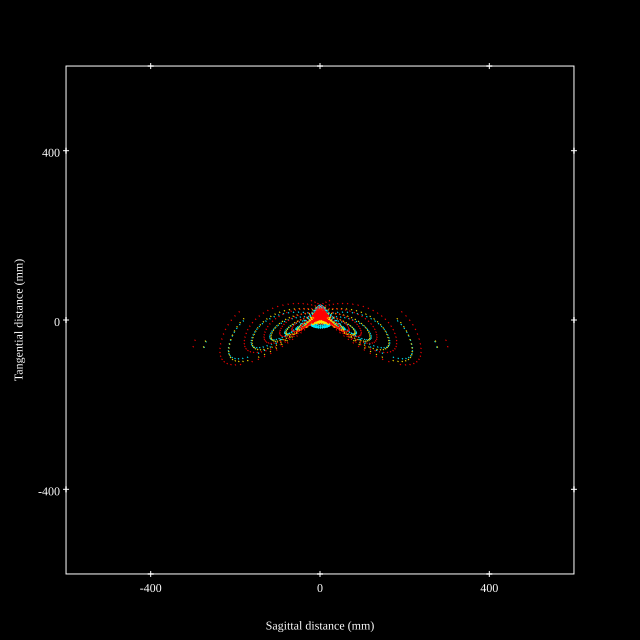
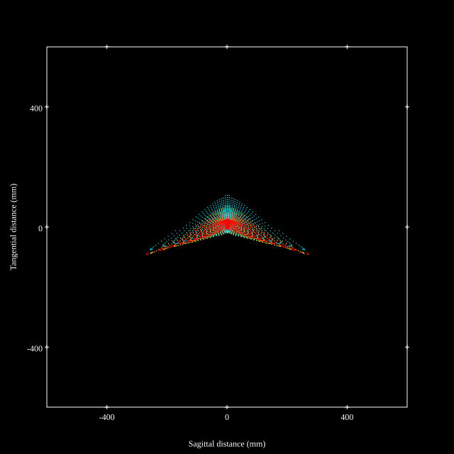
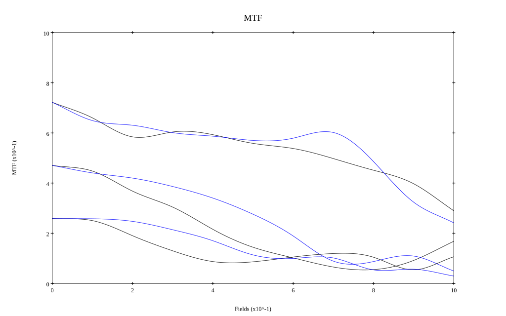

## Surface Data
Note that where glass types are shown the refractive index and abbe number is as per assigned glass type

| ID  | Radius | Thickness | Diameter | nd  | vd  | Glass Make | Glass |
| --- | ---    | ---       | ---      | --- | --- | ---        | ---   |
| 1 | 42.43447 | 6.087825 | 42.0 | 1.788 | 47.37 | Ohara | S-LAH64 |
| 2 | 307.45141 | 0.149916 | 41.28605 |  |  |  |
| 3 | 28.16411 | 4.450083 | 36.30571 | 1.788 | 47.37 | Ohara | S-LAH64 |
| 4 | 43.91147 | 1.827326 | 34.70895 |  |  |  |
| 5 | 86.82557 | 2.295621 | 34.70344 | 1.6668 | 33.05 | Ohara | PBM39 |
| 6 | 18.26348 | 7.8 | 28.00318 |  |  |  |
| 7 | AS | 8.2678 | 26.827 |  |  |  |
| 8 | -18.76217 | 1.696472 | 27.4 | 1.80518 | 25.44 | Ohara | PBH6 |
| 9 | -1615.76459 | 7.22018 | 32.95199 | 1.7725 | 49.6 | Ohara | S-LAH66 |
| 10 | -30.25727 | 0.149916 | 34.44358 |  |  |  |
| 11 | -203.47772 | 5.18936 | 36.13882 | 1.863 | 41.5 |  |
| 12 | -37.09519 | 0.149916 | 36.46859 |  |  |  |
| 13 | 122.29074 | 3.193571 | 34.06874 | 1.7725 | 49.6 | Ohara | S-LAH66 |
| 14 | -245.4104 | 36.430759 | 33.6 |  |  |  |
## Layouts

## Spot Diagrams

## Paraxial Parameters
| parameter | value |
| ---       | ---   |
| effective_focal_length |51.519
| back_focal_length | 36.459
| optical_invariant | 8.854
| object_distance | 1.0E10
| image_distance | 36.459
| power | 0.019
| pp1_H | 46.198
| ppk_H' | -15.06
| ffl_F | -5.321
| fno | 1.235
| enp_dist_P | 27.89
| enp_radius | 20.858
| exp_dist_P' | -43.431
| exp_radius | 32.355
| m | -0
| red | -1.9410451043875647E8
| n_obj | 1
| n_img | 1
| img_ht | 21.868
| obj_ang | 23
| obj_na | 0
| img_na | -0.375|
## Spot Analysis
| Field | Spot Mean Radius | Spot Max Radius |
| ---   | ---              | ---             |
 | Field(x=0.0, y=0.0) | 19.814 | 55.289|
 | Field(x=0.0, y=0.1) | 25.519 | 78.241|
 | Field(x=0.0, y=0.2) | 39.624 | 140.245|
 | Field(x=0.0, y=0.3) | 41.758 | 151.269|
 | Field(x=0.0, y=0.4) | 44.207 | 148.595|
 | Field(x=0.0, y=0.5) | 50.012 | 186.828|
 | Field(x=0.0, y=0.6) | 54.783 | 255.474|
 | Field(x=0.0, y=0.7) | 60.644 | 307.007|
 | Field(x=0.0, y=0.8) | 69.101 | 339.693|
 | Field(x=0.0, y=0.9) | 76.941 | 333.709|
 | Field(x=0.0, y=1.0) | 79.689 | 283.405|
## Geometric MTF

* 10,30,50 cycles/mm
* Black lines represent sagittal, blue tangential
## Resources
* [OpticalBench Compatible Data File, tab delimited](./US004364643_Example03MC.txt)
* [Zemax file](./US004364643_Example03MC.zmx)
