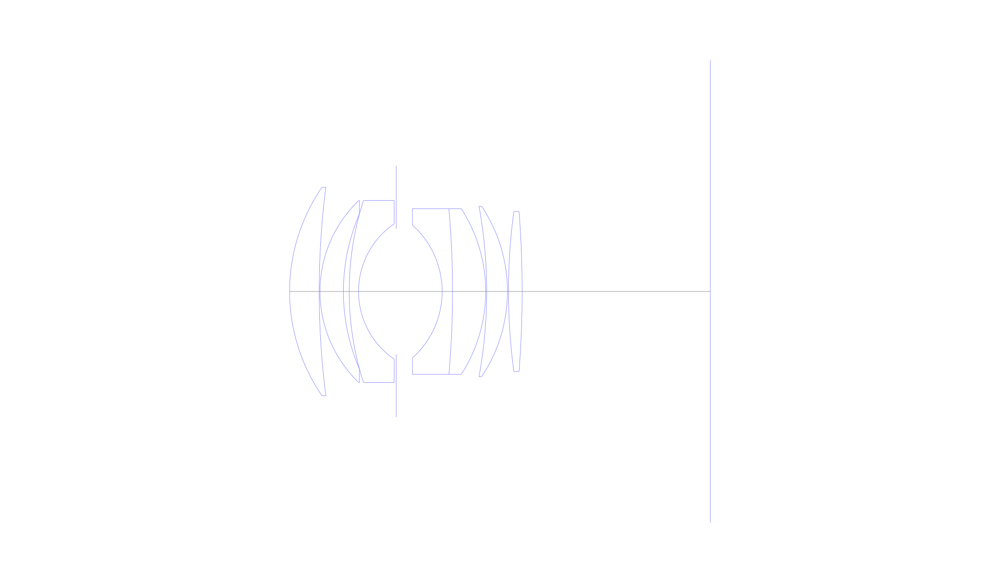
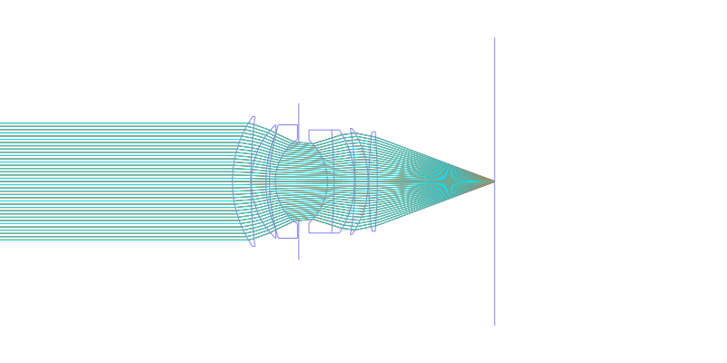
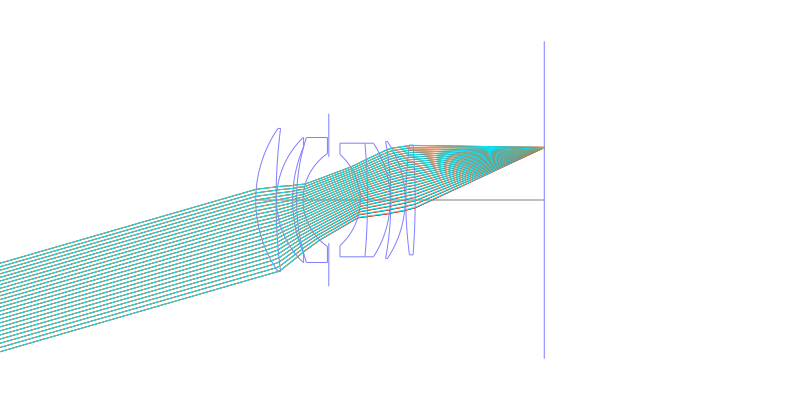
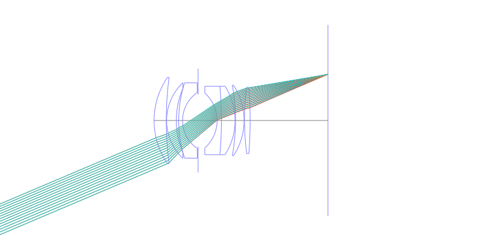
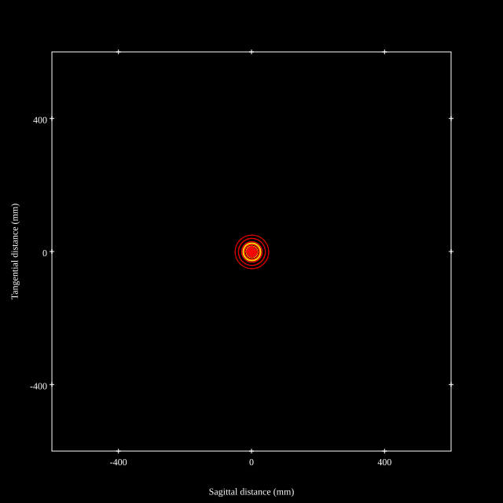
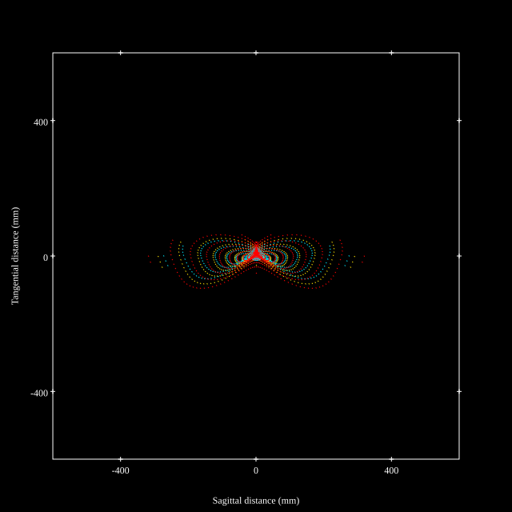
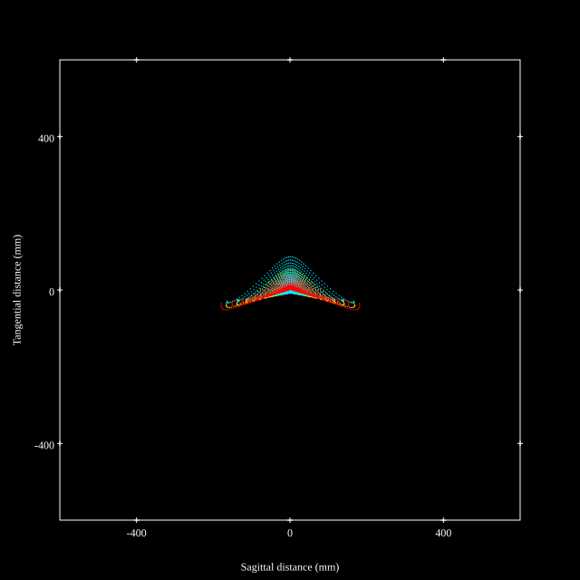
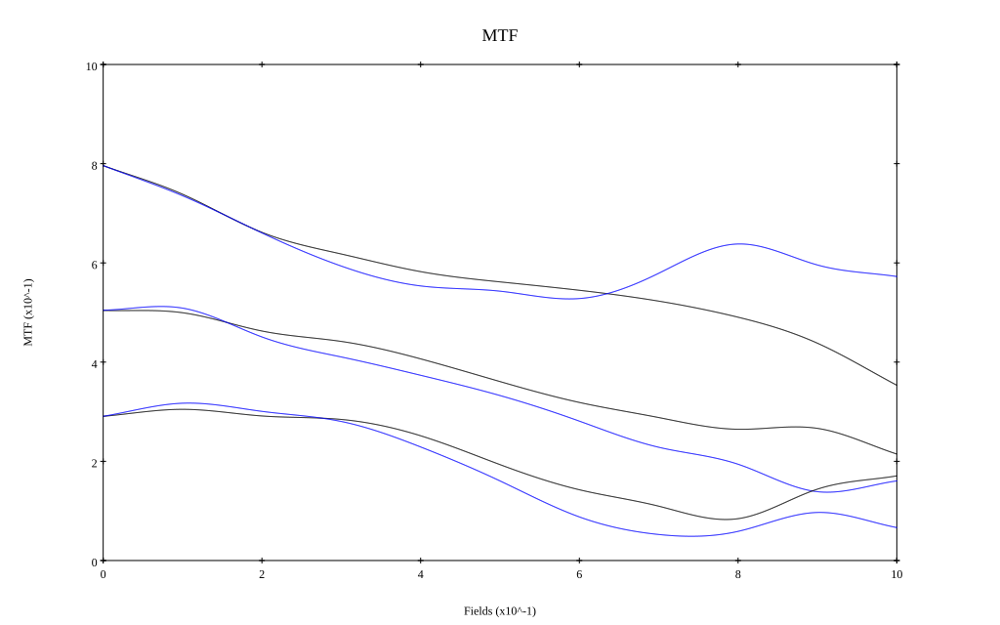
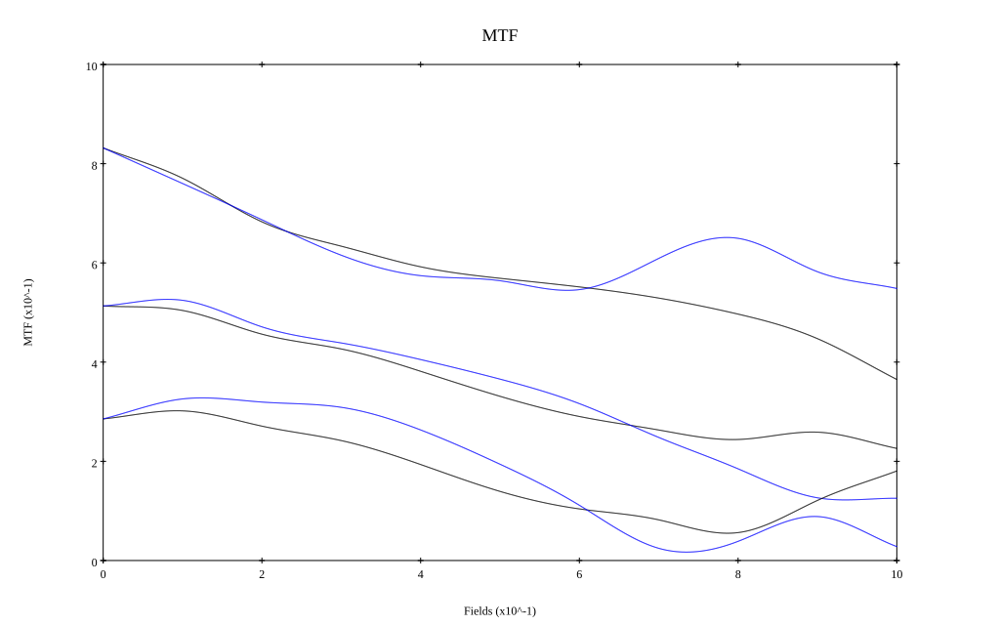

## Surface Data
Note that where glass types are shown the refractive index and abbe number is as per assigned glass type

| ID  | Radius | Thickness | Diameter | nd  | vd  | Glass Make | Glass |
| --- | ---    | ---       | ---      | --- | --- | ---        | ---   |
| 1 | 34.3705 | 5.525 | 38.96 | 1.7725 | 49.6 | Ohara | S-LAH66 |
| 2 | 153.5085 | 0.1455 | 38.96 |  |  |  |
| 3 | 23.574 | 4.37 | 34.0 | 1.6935 | 53.21 | Ohara | S-LAL13 |
| 4 | 36.529 | 1.081 | 28.94 |  |  |  |
| 5 | 55.6315 | 1.744 | 34.0 | 1.64769 | 33.79 | Ohara | S-TIM22 |
| 6 | 15.334 | 7.0205 | 25.27 |  |  |  |
| 7 | AS | 8.585 | 23.46 |  |  |  |
| 8 | -16.636 | 1.938 | 24.8 | 1.7552 | 27.51 | Ohara | S-TIH4 |
| 9 | -175.325 | 6.1825 | 30.92 | 1.7725 | 49.6 | Ohara | S-LAH66 |
| 10 | -28.526 | 0.194 | 30.92 |  |  |  |
| 11 | -88.505 | 3.8705 | 31.84 | 1.7725 | 49.6 | Ohara | S-LAH66 |
| 12 | -28.6785 | 0.194 | 31.84 |  |  |  |
| 13 | 112.5865 | 2.5445 | 29.88 | 1.7725 | 49.6 | Ohara | S-LAH66 |
| 14 | -192.7245 | 35.135 | 29.88 |  |  |  |
## Layouts

## Spot Diagrams

## Paraxial Parameters
| parameter | value |
| ---       | ---   |
| effective_focal_length |50.001
| back_focal_length | 35.195
| optical_invariant | 7.452
| object_distance | 1.0E10
| image_distance | 35.195
| power | 0.02
| pp1_H | 41.698
| ppk_H' | -14.806
| ffl_F | -8.303
| fno | 1.424
| enp_dist_P | 24.398
| enp_radius | 17.556
| exp_dist_P' | -41.198
| exp_radius | 26.843
| m | -0
| red | -1.9999714320349154E8
| n_obj | 1
| n_img | 1
| img_ht | 21.224
| obj_ang | 23
| obj_na | 0
| img_na | -0.331|
## Spot Analysis
| Field | Spot Mean Radius | Spot Max Radius |
| ---   | ---              | ---             |
 | Field(x=0.0, y=0.0) | 15.566 | 50.445|
 | Field(x=0.0, y=0.1) | 23.485 | 98.679|
 | Field(x=0.0, y=0.2) | 40.926 | 198.166|
 | Field(x=0.0, y=0.3) | 50.019 | 206.901|
 | Field(x=0.0, y=0.4) | 48.818 | 211.45|
 | Field(x=0.0, y=0.5) | 52.96 | 228.296|
 | Field(x=0.0, y=0.6) | 57.571 | 270.579|
 | Field(x=0.0, y=0.7) | 63.674 | 318.603|
 | Field(x=0.0, y=0.8) | 73.408 | 321.556|
 | Field(x=0.0, y=0.9) | 67.566 | 280.419|
 | Field(x=0.0, y=1.0) | 53.052 | 185.236|
## Polychromatic Geometric MTF

* 10,30,50 cycles/mm
* Black lines represent sagittal, blue tangential
* To generate above, MTFs for wavelengths 587.5618(d), 486.1327(F), 656.2725(C) were calculated across 10 fields, and then averaged
## Polychromatic Geometric MTF (Weighted)

* 10,30,50 cycles/mm
* Black lines represent sagittal, blue tangential
* To generate above, MTFs for wavelengths 587.5618(d) wt(1.0), 656.2725(C) wt(0.475), 546.074(e) wt(0.98), 486.1327(F) wt(0.49), 435.8343(g) wt(0.15) were calculated across 10 fields, and then combined using weighted average
## Resources
* [OpticalBench Compatible Data File, tab delimited](./prescription.txt)
* [Zemax file](./US004247171_Example03.zmx)

Report / Zemax file generated using [Beam42](https://github.com/BeamFour/Beam42) on 2026-06-01
