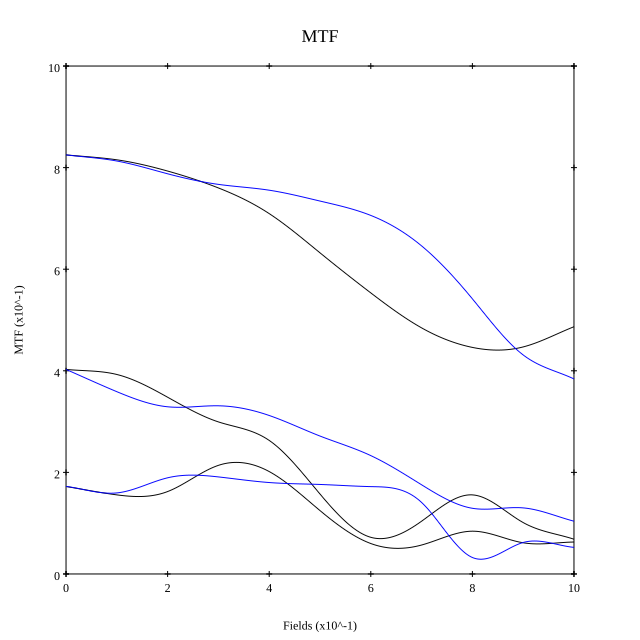
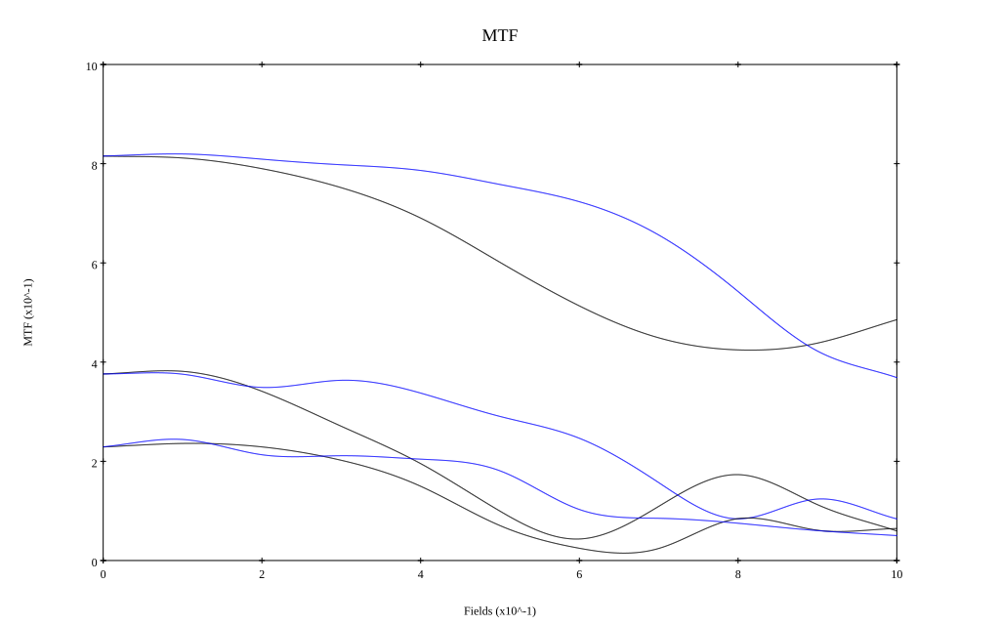

# Canon New FD 50mm f1.2L
## Patent Information
| Country | Patent Number | Example | Year of Application | Inventors | Organisation | Link |
| ---     | ---           | ---     | ---                 | ---       | ---          | ---  |
|US | US4364644 | EX 3 | 1979 | Keiji Ikemori | Canon Inc | [link](https://patents.google.com/patent/US4364644A/en) |
## Surface Data
Note that where glass types are shown the refractive index and abbe number is as per assigned glass type

| ID  | Radius | Thickness | Diameter | nd  | vd  | Glass Make | Glass |
| --- | ---    | ---       | ---      | --- | --- | ---        | ---   |
| 1 | 55.44618 | 4.24782 | 41.8 | 1.816 | 46.62 | Ohara | S-LAH59 |
| 2 | 184.64446 | 0.14841 | 41.23728 |  |  |  |
| 3 | 40.96932 | 11.23479 | 39.37839 | 1.8061 | 40.93 | Ohara | S-LAH53 |
| 4 | 274.14388 | 2.03592 | 34.43213 | 1.6398 | 34.48 | Ohara | PBM27 |
| 5 | 21.67867 | 7.59237 | 28.88556 |  |  |  |
| 6 | AS | 8.15867 | 29.089 |  |  |  |
| 7 | -19.93646 | 1.18626 | 27.9 | 1.80518 | 25.44 | Ohara | PBH6 |
| 8 | 160.40621 | 9.32076 | 32.82924 | 1.788 | 47.37 | Ohara | S-LAH64 |
| 9 | -34.23304 | 0.14841 | 35.27635 |  |  |  |
| 10 | -159.65345 | 3.95352 | 36.51612 | 1.883 | 40.77 | Ohara | S-LAH58 |
| 11 | -44.58685 | 0.09894 | 36.79632 |  |  |  |
| 12 | 589.89749 | 3.31092 | 35.64182 | 1.816 | 46.62 | Ohara | S-LAH59 |
| 13 | -82.62508 | 0.19788 | 35.508 |  |  |  |
| 14 | 479.36025 | 1.77888 | 33.95686 | 1.67 | 57.33 | Ohara | S-LAL52 |
| 15 | -479.36025 | 36.3585 | 33.6 |  |  |  |
## Aspherical Data
| ID  | k   | P1  | P2  | P3  | P3 | P5 | P6 | P7 | P8 | P9 | P10 |
| --- | --- | --- | --- | --- | --- | --- | --- | --- | --- | --- | --- |
| 3 | 0.0 | 0.0 | -8.30984E-7 | 1.86871E-9 | -7.23109E-12 | 8.95373E-15 | 0.0 | 0.0 | 0.0 | 0.0 | 0.0 |
## Layouts

## Spot Diagrams

## Paraxial Parameters
| parameter | value |
| ---       | ---   |
| effective_focal_length |50.928
| back_focal_length | 36.414
| optical_invariant | 8.86
| object_distance | 1.0E10
| image_distance | 36.414
| power | 0.02
| pp1_H | 48.13
| ppk_H' | -14.513
| ffl_F | -2.798
| fno | 1.22
| enp_dist_P | 27.696
| enp_radius | 20.872
| exp_dist_P' | -48.585
| exp_radius | 34.859
| m | -0
| red | -1.9635672183815283E8
| n_obj | 1
| n_img | 1
| img_ht | 21.618
| obj_ang | 23
| obj_na | 0
| img_na | -0.379|
## Spot Analysis
| Field | Spot Mean Radius | Spot Max Radius |
| ---   | ---              | ---             |
 | Field(x=0.0, y=0.0) | 14.674 | 35.336|
 | Field(x=0.0, y=0.1) | 15.245 | 45.241|
 | Field(x=0.0, y=0.2) | 16.13 | 49.319|
 | Field(x=0.0, y=0.3) | 17.65 | 68.6|
 | Field(x=0.0, y=0.4) | 19.197 | 69.137|
 | Field(x=0.0, y=0.5) | 21.537 | 82.078|
 | Field(x=0.0, y=0.6) | 23.94 | 108.668|
 | Field(x=0.0, y=0.7) | 27.926 | 136.666|
 | Field(x=0.0, y=0.8) | 32.411 | 156.136|
 | Field(x=0.0, y=0.9) | 37.418 | 160.483|
 | Field(x=0.0, y=1.0) | 38.41 | 141.056|
## Polychromatic Geometric MTF

* 10,30,50 cycles/mm
* Black lines represent sagittal, blue tangential
* To generate above, MTFs for wavelengths 587.5618(d), 486.1327(F), 656.2725(C) were calculated across 10 fields, and then averaged
## Polychromatic Geometric MTF (Weighted)

* 10,30,50 cycles/mm
* Black lines represent sagittal, blue tangential
* To generate above, MTFs for wavelengths 587.5618(d) wt(1.0), 656.2725(C) wt(0.475), 546.074(e) wt(0.98), 486.1327(F) wt(0.49), 435.8343(g) wt(0.15) were calculated across 10 fields, and then combined using weighted average
## Resources
* [OpticalBench Compatible Data File, tab delimited](./JP1981-075613_Example03A.txt)
* [Zemax file](./JP1981-075613_Example03A.zmx)
