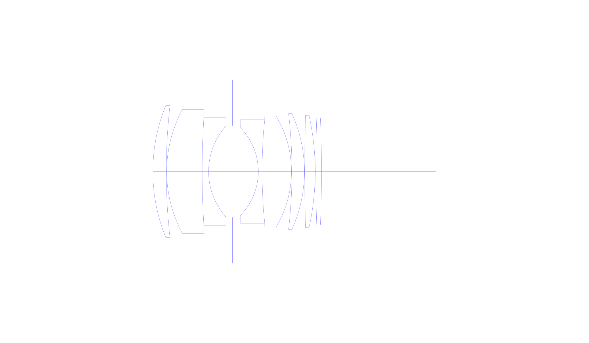
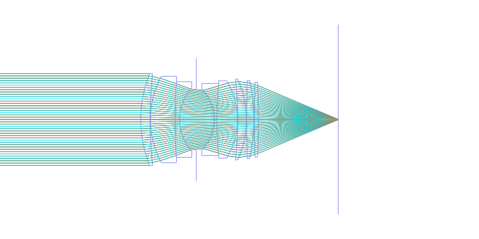
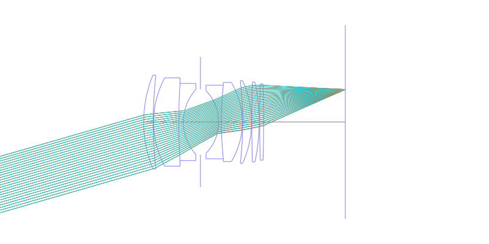
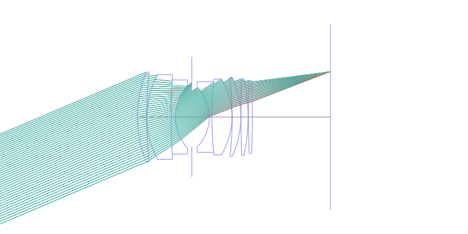
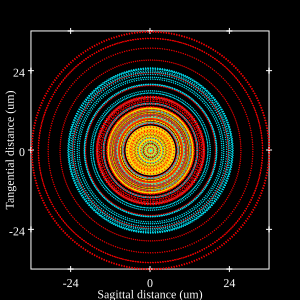
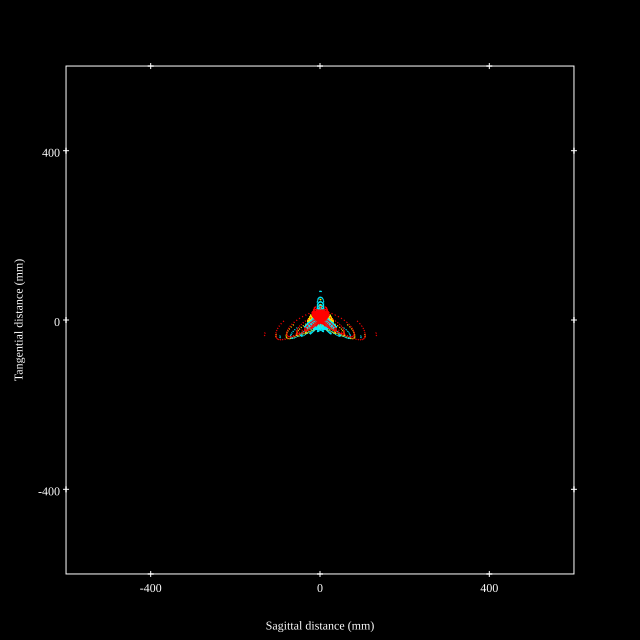
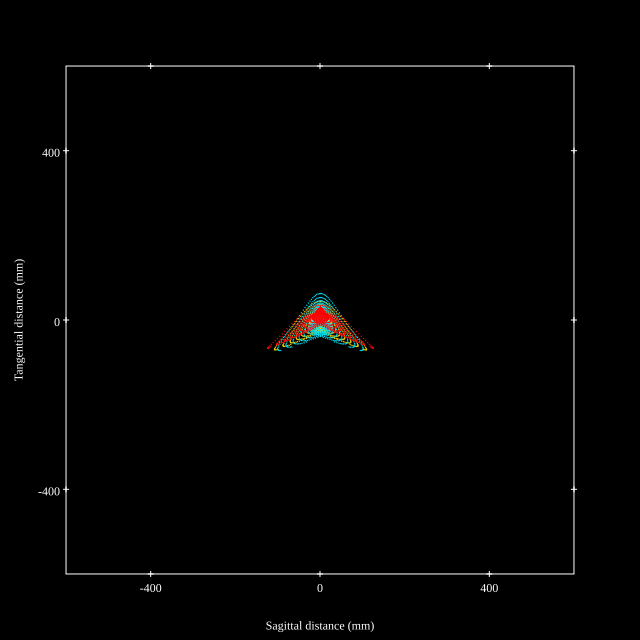

# Canon New FD 50mm f1.2L
## Patent Information
| Country | Patent Number | Example | Year of Application | Inventors | Organisation | Link |
| ---     | ---           | ---     | ---                 | ---       | ---          | ---  |
|JP | US4364644 | EX 3 | 1979 | Keiji Ikemori | Canon Inc | [link](https://patents.google.com/patent/US4364644A/en) |
## Surface Data
Note that where glass types are shown the refractive index and abbe number is as per assigned glass type

| ID  | Radius | Thickness | Diameter | nd  | vd  | Glass Make | Glass |
| --- | ---    | ---       | ---      | --- | --- | ---        | ---   |
| 1 | 55.44618 | 4.24782 | 41.8 | 1.816 | 46.6 | Ohara | S-LAH59 |
| 2 | 184.64446 | 0.14841 | 41.23728 |  |  |  |
| 3 | 40.96932 | 11.23479 | 39.37839 | 1.806098 | 40.9 | Ohara | S-LAH53 |
| 4 | 274.14388 | 2.03592 | 34.43213 | 1.6398 | 34.5 |  |
| 5 | 21.67867 | 7.59237 | 28.88556 |  |  |  |
| 6 | AS | 8.15867 | 27.9 |  |  |  |
| 7 | -19.93646 | 1.18626 | 27.9 | 1.8052 | 25.43 | Ohara | PBH6 |
| 8 | 160.40621 | 9.32076 | 32.82924 | 1.788001 | 47.4 | Ohara | S-LAH64 |
| 9 | -34.23304 | 0.14841 | 35.27635 |  |  |  |
| 10 | -159.65345 | 3.95352 | 36.51612 | 1.882997 | 40.8 | Ohara | S-LAH58 |
| 11 | -44.58685 | 0.09894 | 36.79632 |  |  |  |
| 12 | 589.89749 | 3.31092 | 35.64182 | 1.816 | 46.6 | Ohara | S-LAH59 |
| 13 | -82.62508 | 0.19788 | 35.508 |  |  |  |
| 14 | 479.36025 | 1.77888 | 33.95686 | 1.67 | 57.4 |  |
| 15 | -479.36025 | 36.3585 | 33.6 |  |  |  |
## Aspherical Data
| ID  | k   | A4  | A6  | A8  | A10 | A12 | A14 | A16 | A18 |
| --- | --- | --- | --- | --- | --- | --- | --- | --- | --- |
| 3 | 0.0 | -8.30984E-7 | 1.86871E-9 | -7.23109E-12 | 8.95373E-15 | 0.0 | 0.0 | 0.0 | 0.0 |
## Layouts

## Spot Diagrams

## Paraxial Parameters
| parameter | value |
| ---       | ---   |
| effective_focal_length |50.929
| back_focal_length | 36.416
| optical_invariant | 8.86
| object_distance | 1.0E10
| image_distance | 36.358
| power | 0.02
| pp1_H | 48.13
| ppk_H' | 14.513
| ffl_F | -2.799
| fno | 1.22
| enp_dist_P | 27.696
| enp_radius | 20.873
| exp_dist_P' | -48.64
| exp_radius | 34.859
| m | 0.001
| red | -1.9635199378282332E8
| n_obj | 1
| n_img | 1
| img_ht | 21.618
| obj_ang | 23
| obj_na | 0
| img_na | -0.379|
## Spot Analysis
| Field | Spot Mean Radius | Spot Max Radius |
| ---   | ---              | ---             |
 | 0.0 | 14.671 | 36.395|
 | 0.7 | 28.258 | 142.232|
 | 1.0 | 49.521 | 220.349|
## Resources
* [OpticalBench Compatible Data File, tab delimited](./JP1981-075613_Example03A.txt)
* [Zemax file](./JP1981-075613_Example03A.zmx)
