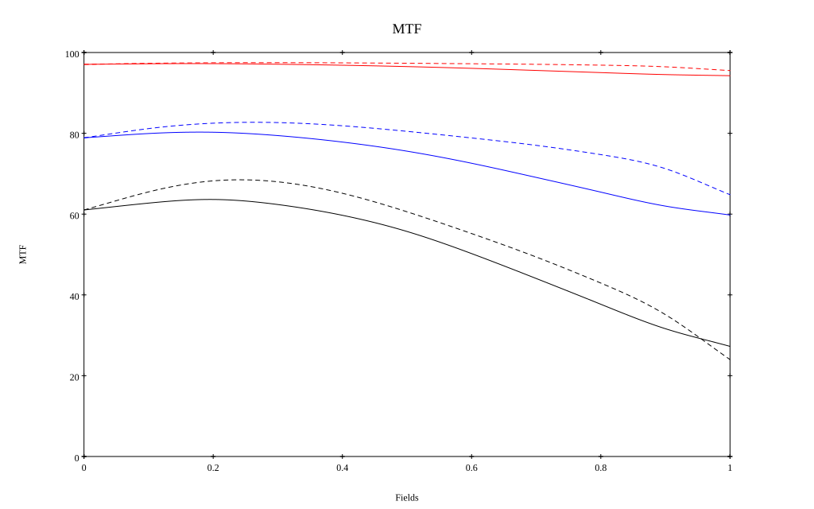
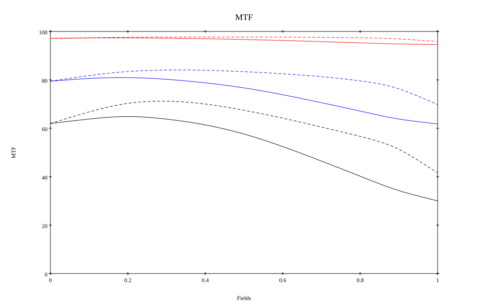

# Canon FL-F 300mm f5.6
## Patent Information
| Country | Patent Number | Example | Year of Application | Inventors | Organisation | Link |
| ---     | ---           | ---     | ---                 | ---       | ---          | ---  |
|JP | JP S47-008749 | EX 2 | 1968 | Michimi Suwa | Canon Inc  | [link](https://www.j-platpat.inpit.go.jp/c1801/PU/JP-S47-008749/12/en) |
## Surface Data
Note that where glass types are shown the refractive index and abbe number is as per assigned glass type

| ID  | Radius | Thickness | Diameter | nd  | vd  | Glass Make | Glass |
| --- | ---    | ---       | ---      | --- | --- | ---        | ---   |
| 1 | 64.077 | 8.34 | 59.0 | 1.43384 | 95.26 | Hikari | NICF-V |
| 2 | -416.883 | 0.18 | 59.0 |  |  |  |
| 3 | 66.816 | 6.219 | 59.0 | 1.43384 | 95.26 | Hikari | NICF-V |
| 4 | 420.933 | 5.991 | 59.0 |  |  |  |
| 5 | -647.256 | 3.609 | 59.0 | 1.7847 | 26.29 | Ohara | S-TIH23 |
| 6 | -191.487 | 1.479 | 59.0 | 1.8044 | 39.59 | Ohara | S-LAH63 |
| 7 | 105.162 | 60.0 | 59.0 |  |  |  |
| 8 | AS | 25.464 | 26.0 |  |  |  |
| 9 | -32.367 | 2.841 | 30.0 | 1.7432 | 49.26 | Hikari | J-LAF010 |
| 10 | 803.346 | 3.75 | 30.0 |  |  |  |
| 11 | 344.637 | 6.06 | 30.0 | 1.5927 | 35.31 | Ohara | S-FTM16 |
| 12 | -47.997 | 83.26 | 30.0 |  |  |  |
## Layouts

## Spot Diagrams

## Paraxial Parameters
| parameter | value |
| ---       | ---   |
| effective_focal_length |300.183
| back_focal_length | 83.297
| optical_invariant | 2.153
| object_distance | 1.0E10
| image_distance | 83.297
| power | 0.003
| pp1_H | -241.304
| ppk_H' | -216.887
| ffl_F | -541.487
| fno | 4.998
| enp_dist_P | 202.671
| enp_radius | 30.029
| exp_dist_P' | -37.757
| exp_radius | 12.113
| m | -0
| red | -3.331298740044373E7
| n_obj | 1
| n_img | 1
| img_ht | 21.517
| obj_ang | 4.1
| obj_na | 0
| img_na | -0.1|
## Spot Analysis
| Field | Spot Mean Radius | Spot Max Radius |
| ---   | ---              | ---             |
 | Field(x=0.0, y=0.0) | 5.517 | 15.442|
 | Field(x=0.0, y=0.1) | 5.308 | 18.553|
 | Field(x=0.0, y=0.2) | 5.247 | 19.413|
 | Field(x=0.0, y=0.3) | 5.316 | 19.482|
 | Field(x=0.0, y=0.4) | 5.467 | 18.955|
 | Field(x=0.0, y=0.5) | 5.685 | 17.954|
 | Field(x=0.0, y=0.6) | 5.954 | 17.824|
 | Field(x=0.0, y=0.7) | 6.252 | 17.797|
 | Field(x=0.0, y=0.8) | 6.581 | 17.682|
 | Field(x=0.0, y=0.9) | 6.97 | 18.276|
 | Field(x=0.0, y=1.0) | 7.45 | 18.692|
## Polychromatic Geometric MTF

* 10=red,30=blue,50=black cycles/mm
* Solid lines represent sagittal, dashed lines tangential
* To generate above, MTFs for wavelengths 587.5618(d), 486.1327(F), 656.2725(C) were calculated across 10 fields, and then averaged
## Polychromatic Geometric MTF (Weighted)

* 10=red,30=blue,50=black cycles/mm
* Solid lines represent sagittal, dashed lines tangential
* To generate above, MTFs for wavelengths 587.5618(d) wt(1.0), 656.2725(C) wt(0.475), 546.074(e) wt(0.98), 486.1327(F) wt(0.49), 435.8343(g) wt(0.15) were calculated across 10 fields, and then combined using weighted average
## Resources
* [OpticalBench Compatible Data File, tab delimited](./prescription.txt)
* [Zemax file](./JP1972-008749-Example02.zmx)

Report / Zemax file generated using [Beam42](https://github.com/BeamFour/Beam42) on 2026-09-17
