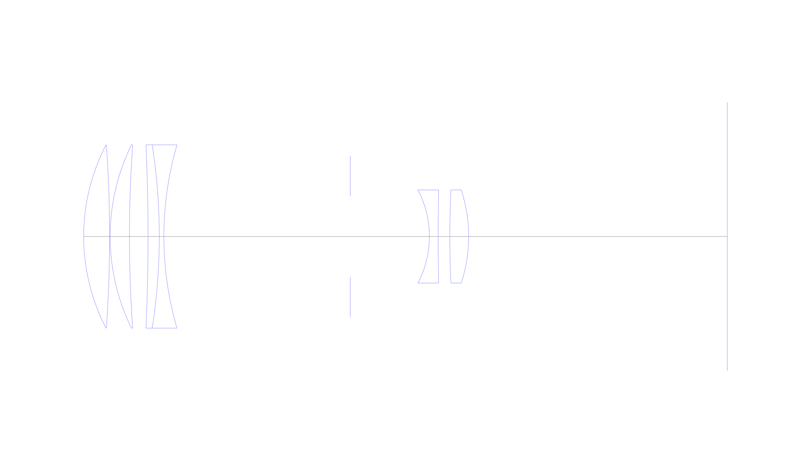
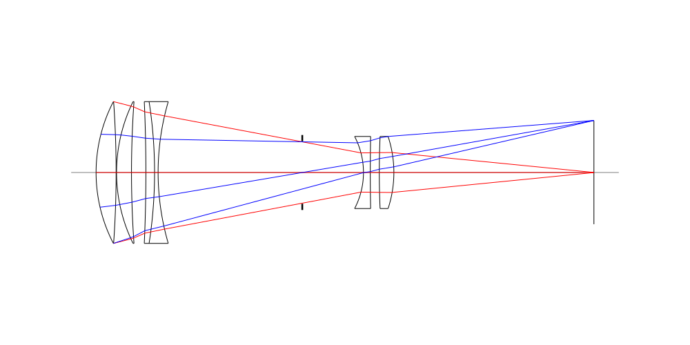
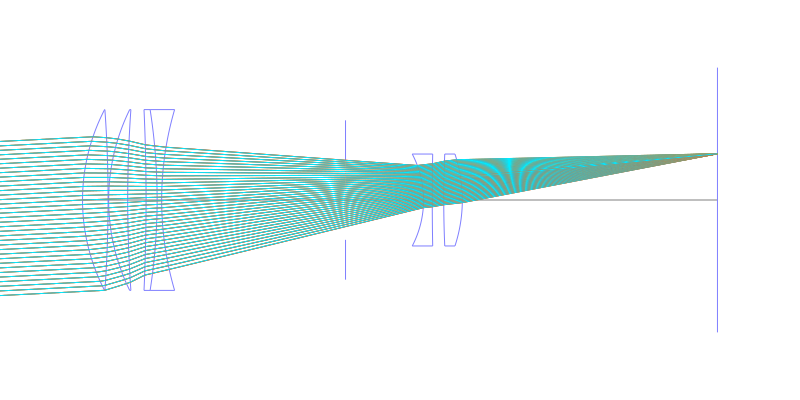
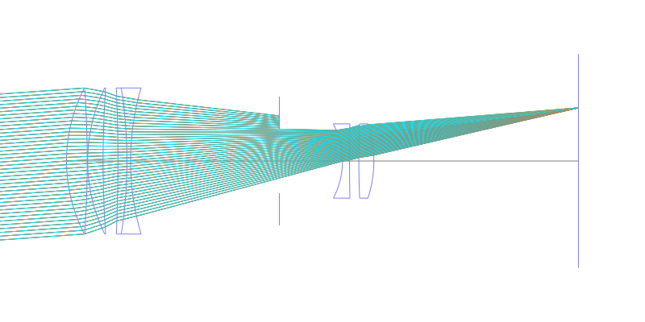
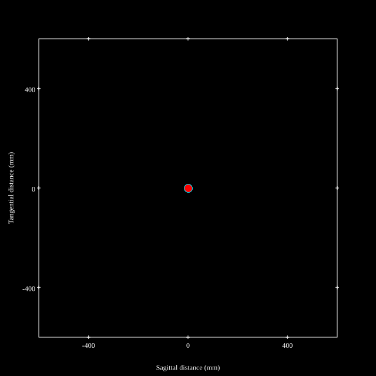
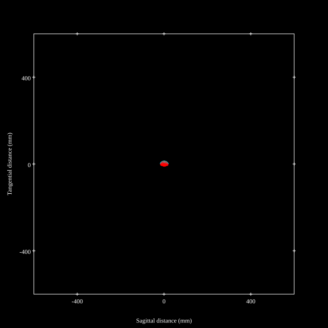
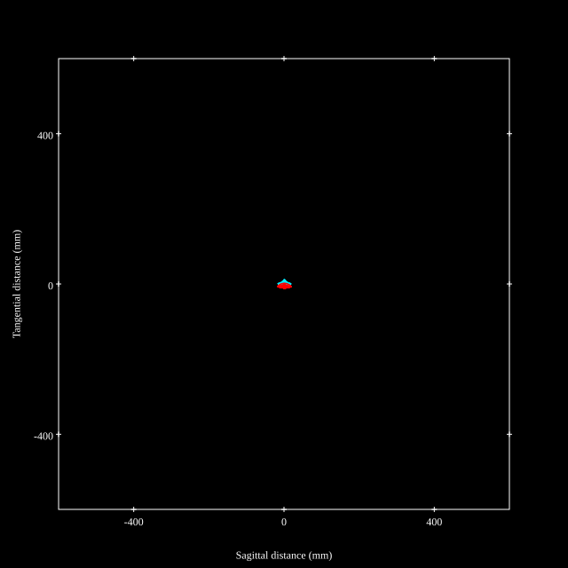

# Canon FL-F 300mm f5.6
## Patent Information
| Country | Patent Number | Example | Year of Application | Inventors | Organisation | Link |
| ---     | ---           | ---     | ---                 | ---       | ---          | ---  |
|JP | JP S47-008749 | EX 2 | 1968 | Michimi Suwa | Canon Inc  | [link](https://www.j-platpat.inpit.go.jp/c1801/PU/JP-S47-008749/12/en) |
## Surface Data
Note that where glass types are shown the refractive index and abbe number is as per assigned glass type

| ID  | Radius | Thickness | Diameter | nd  | vd  | Glass Make | Glass |
| --- | ---    | ---       | ---      | --- | --- | ---        | ---   |
| 1 | 64.077 | 8.34 | 59.0 | 1.43384 | 95.26 | Nikon | NICF-V |
| 2 | -416.883 | 0.18 | 59.0 |  |  |  |
| 3 | 66.816 | 6.219 | 59.0 | 1.43384 | 95.26 | Nikon | NICF-V |
| 4 | 420.933 | 5.991 | 59.0 |  |  |  |
| 5 | -647.256 | 3.609 | 59.0 | 1.7847 | 26.29 | Ohara | S-TIH23 |
| 6 | -191.487 | 1.479 | 59.0 | 1.8044 | 39.59 | Ohara | S-LAH63 |
| 7 | 105.162 | 60.0 | 59.0 |  |  |  |
| 8 | AS | 25.464 | 26.0 |  |  |  |
| 9 | -32.367 | 2.841 | 30.0 | 1.7432 | 49.26 | Hikari | J-LAF010 |
| 10 | 803.346 | 3.75 | 30.0 |  |  |  |
| 11 | 344.637 | 6.06 | 30.0 | 1.592701 | 35.3 | Ohara | S-FTM16 |
| 12 | -47.997 | 83.26 | 30.0 |  |  |  |
## Layouts

## Spot Diagrams

## Paraxial Parameters
| parameter | value |
| ---       | ---   |
| effective_focal_length |300.183
| back_focal_length | 83.296
| optical_invariant | 1.921
| object_distance | 1.0E10
| image_distance | 83.26
| power | 0.003
| pp1_H | -241.302
| ppk_H' | 216.886
| ffl_F | -541.485
| fno | 5.6
| enp_dist_P | 202.671
| enp_radius | 26.802
| exp_dist_P' | -37.793
| exp_radius | 10.812
| m | 0
| red | -3.331305284871202E7
| n_obj | 1
| n_img | 1
| img_ht | 21.517
| obj_ang | 4.1
| obj_na | 0
| img_na | -0.089|
## Spot Analysis
| Field | Spot Mean Radius | Spot Max Radius |
| ---   | ---              | ---             |
 | 0.0 | 5.509 | 15.302|
 | 0.7 | 7.273 | 25.742|
 | 1.0 | 9.286 | 30.765|
## Resources
* [OpticalBench Compatible Data File, tab delimited](./JP1972-008749-Example02.txt)
* [Zemax file](./JP1972-008749-Example02.zmx)
