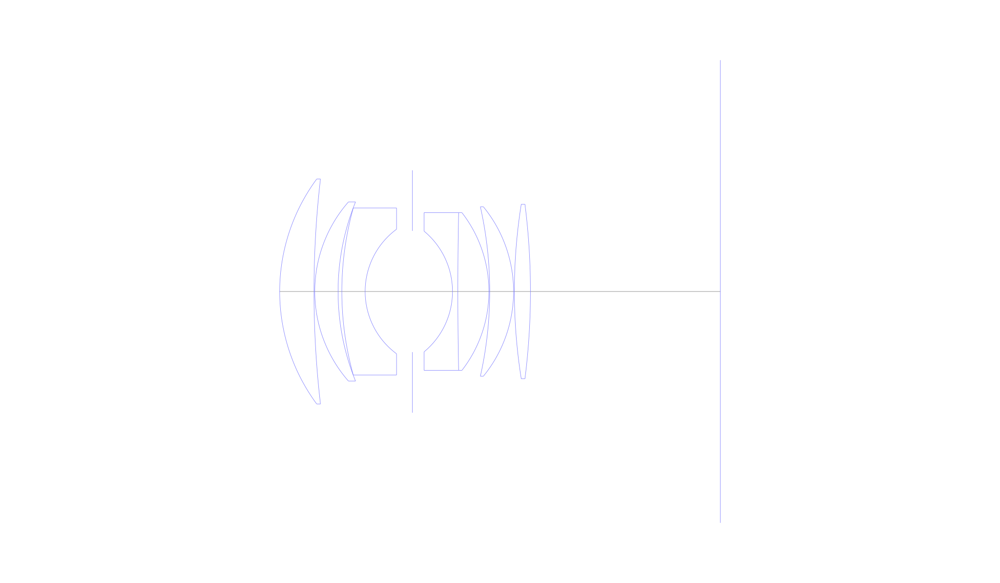
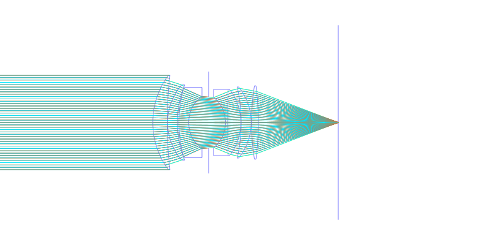
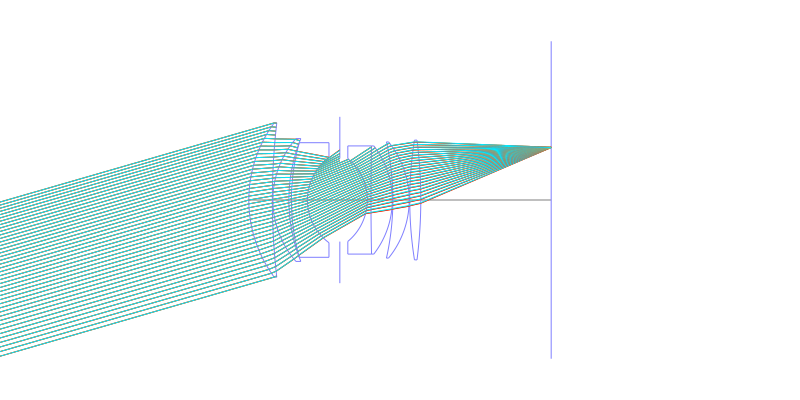
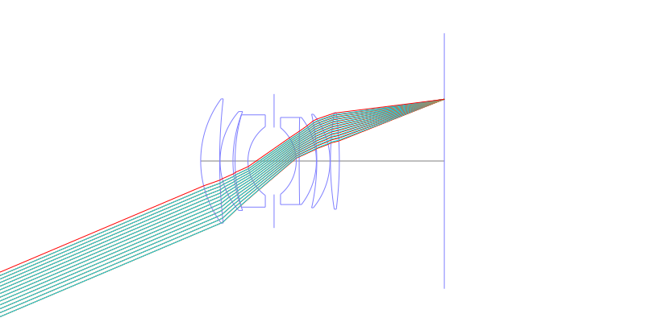
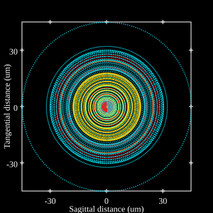
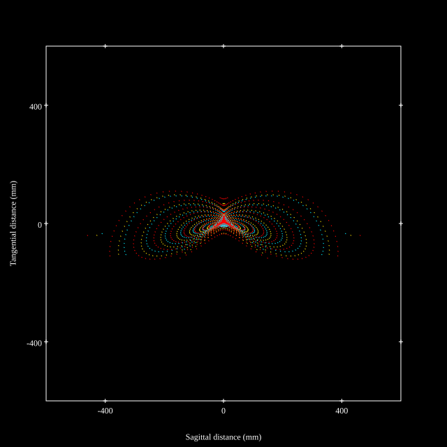
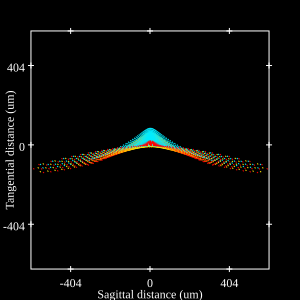

# Canon FL 50mm f1.4 v2
## Patent Information
| Country | Patent Number | Example | Year of Application | Inventors | Organisation | Link |
| ---     | ---           | ---     | ---                 | ---       | ---          | ---  |
|JP | JP 48-010083 | EX 1 | 1967 | Kikuo Momiyama | Canon Inc  | [link](https://www.j-platpat.inpit.go.jp/c1801/PU/JP-S48-010083/12/en) |
## Surface Data
Note that where glass types are shown the refractive index and abbe number is as per assigned glass type

| ID  | Radius | Thickness | Diameter | nd  | vd  | Glass Make | Glass |
| --- | ---    | ---       | ---      | --- | --- | ---        | ---   |
| 1 | 35.375 | 6.4 | 42.0 | 1.62041 | 60.25 | Hikari | J-SK16 |
| 2 | 182.85 | 0.15 | 42.0 |  |  |  |
| 3 | 25.415 | 4.35 | 33.43 | 1.6935 | 53.21 | Ohara | S-LAL13 |
| 4 | 44.595 | 0.7 | 33.43 |  |  |  |
| 5 | 58.0 | 4.35 | 31.19 | 1.58215 | 42.03 | Hoya | FL3 |
| 6 | 14.47 | 8.82 | 23.26 |  |  |  |
| 7 | AS | 7.48 | 22.637 |  |  |  |
| 8 | -14.62 | 1.0 | 22.54 | 1.7552 | 27.57 | Hikari | J-SF4 |
| 9 | 740.0 | 5.8 | 29.44 | 1.6935 | 53.21 | Ohara | S-LAL13 |
| 10 | -24.035 | 0.15 | 29.44 |  |  |  |
| 11 | -72.5 | 4.45 | 31.62 | 1.8061 | 40.93 | Ohara | S-LAH53 |
| 12 | -25.02 | 0.15 | 31.62 |  |  |  |
| 13 | 104.0 | 3.0 | 32.59 | 1.6935 | 53.21 | Ohara | S-LAL13 |
| 14 | -129.725 | 35.435 | 32.59 |  |  |  |
## Layouts

## Spot Diagrams

## Paraxial Parameters
| parameter | value |
| ---       | ---   |
| effective_focal_length |50
| back_focal_length | 35.49
| optical_invariant | 7.58
| object_distance | 1.0E10
| image_distance | 35.435
| power | 0.02
| pp1_H | 48.732
| ppk_H' | 14.51
| ffl_F | -1.269
| fno | 1.4
| enp_dist_P | 32.5
| enp_radius | 17.857
| exp_dist_P' | -38.543
| exp_radius | 26.44
| m | 0.001
| red | -1.9999938593540168E8
| n_obj | 1
| n_img | 1
| img_ht | 21.224
| obj_ang | 23
| obj_na | 0
| img_na | -0.336|
## Spot Analysis
| Field | Spot Mean Radius | Spot Max Radius |
| ---   | ---              | ---             |
 | 0.0 | 17.341 | 46.991|
 | 0.7 | 98.187 | 438.257|
 | 1.0 | 133.118 | 605.723|
## Resources
* [OpticalBench Compatible Data File, tab delimited](./JP1973-010083_Example01.txt)
* [Zemax file](./JP1973-010083_Example01.zmx)
