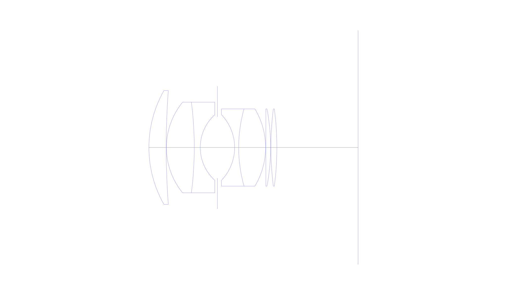
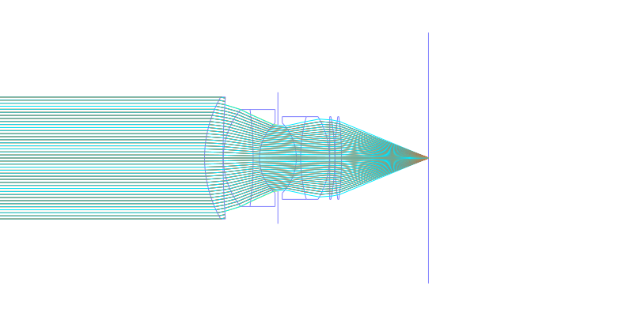
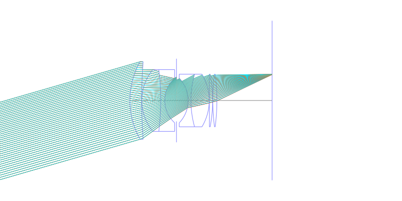
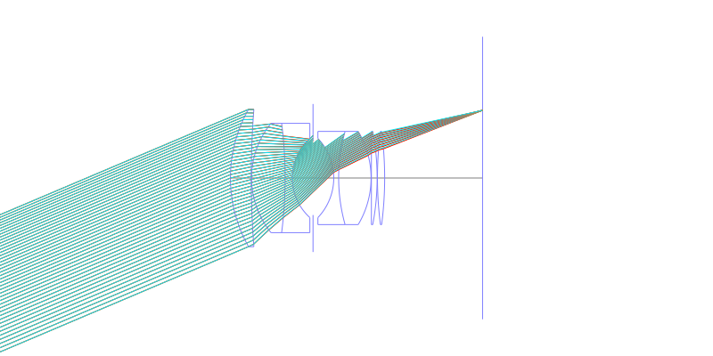
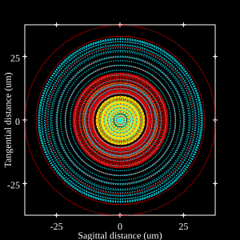
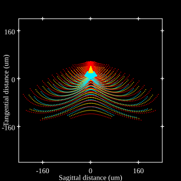
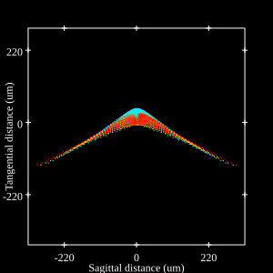

## Surface Data
Note that where glass types are shown the refractive index and abbe number is as per assigned glass type

| ID  | Radius | Thickness | Diameter | nd  | vd  | Glass Make | Glass |
| --- | ---    | ---       | ---      | --- | --- | ---        | ---   |
| 1 | 42.65 | 6.35 | 42.0 | 1.7234 | 38.0 |  |
| 2 | 273.15 | 0.1 | 42.0 |  |  |  |
| 3 | 26.45 | 10.25 | 33.43 | 1.6676 | 41.9 |  |
| 4 | -131.8 | 2.2 | 33.43 | 1.7552 | 27.5 |  |
| 5 | 16.35 | 6.325 | 24.2 |  |  |  |
| 6 | AS | 6.325 | 22.637 |  |  |  |
| 7 | -17.55 | 1.5 | 24.2 | 1.5927 | 35.4 |  |
| 8 | 52.75 | 9.9 | 28.5 | 1.713 | 53.89 |  |
| 9 | -27.75 | 0.1 | 28.5 |  |  |  |
| 10 | 0.0 | 1.75 | 28.5 | 1.72 | 50.31 |  |
| 11 | -76.4 | 0.1 | 28.5 |  |  |  |
| 12 | 112.05 | 2.2 | 28.5 | 1.744 | 44.9 |  |
| 13 | -109.75 | 29.9 | 28.5 |  |  |  |
## Layouts

## Spot Diagrams

## Paraxial Parameters
| parameter | value |
| ---       | ---   |
| effective_focal_length |49.791
| back_focal_length | 30.029
| optical_invariant | 7.548
| object_distance | 1.0E10
| image_distance | 29.9
| power | 0.02
| pp1_H | 43.195
| ppk_H' | 19.761
| ffl_F | -6.596
| fno | 1.4
| enp_dist_P | 32.022
| enp_radius | 17.782
| exp_dist_P' | -34.167
| exp_radius | 22.927
| m | 0.003
| red | -2.008414679399224E8
| n_obj | 1
| n_img | 1
| img_ht | 21.135
| obj_ang | 23
| obj_na | 0
| img_na | -0.336|
## Spot Analysis
| Field | Spot Mean Radius | Spot Max Radius |
| ---   | ---              | ---             |
 | 0.0 | 17.122 | 37.52|
 | 0.7 | 57.941 | 240.657|
 | 1.0 | 83.642 | 330.553|
## Resources
* [OpticalBench Compatible Data File, tab delimited](./JP-S40-024553_Example01.txt)
* [Zemax file](./JP-S40-024553_Example01.zmx)
