# Canon RF10-20mm f4L
## Patent Information
| Country | Patent Number | Example | Year of Application | Inventors | Organisation | Link |
| ---     | ---           | ---     | ---                 | ---       | ---          | ---  |
|US | US20240045184 | 1 | 2022 | Makoto Nakahara | Canon Inc | [link](https://patents.google.com/patent/US20240045184A1/en) |
## Surface Data
Note that where glass types are shown the refractive index and abbe number is as per assigned glass type

| ID  | Radius | Thickness | Diameter | nd  | vd  | Glass Make | Glass |
| --- | ---    | ---       | ---      | --- | --- | ---        | ---   |
| 1 | 37.0 | 3.0 | 63.08 | 1.58313 | 59.39 | Ohara | L-BAL42 |
| 2 | 17.814 | 12.2 | 48.09 |  |  |  |
| 3 | 52.582 | 1.23 | 43.11 | 1.91082 | 35.25 | Hoya | TAFD35 |
| 4 | 17.849 | 5.54 | 31.05 |  |  |  |
| 5 | 30.037 | 1.15 | 33.34 | 1.59282 | 68.62 | Hoya | FCD515 |
| 6 | 18.728 | 9.86 | 27.81 |  |  |  |
| 7 | -28.561 | 1.1 | 27.48 | 1.43875 | 94.95 | Ohara | S-FPL53 |
| 8 | 33.065 | 4.99 | 27.48 | 1.883 | 40.77 | Ohara | S-LAH58 |
| 9 | -88.917 | d9 | 27.48 |  |  |  |
| 10 | AS | d10 | a10 |  |  |  |
| 11 | 76.538 | 1.86 | 15.69 | 1.72047 | 34.71 | Ohara | S-NBH8 |
| 12 | -170.686 | d12 | 15.69 |  |  |  |
| 13 | 21.236 | 0.69 | 18.2 | 1.80809 | 22.76 | Ohara | S-NPH1 |
| 14 | 10.223 | 4.67 | 15.71 | 1.673 | 38.26 | Ohara | S-NBH52V |
| 15 | 101.506 | 0.8 | 14.4 |  |  |  |
| 16 | -48.763 | 0.55 | 14.4 | 1.883 | 40.77 | Ohara | S-LAH58 |
| 17 | 13.497 | 2.73 | 15.74 | 1.92286 | 20.88 | Hoya | FDS1 |
| 18 | 39.963 | 0.35 | 15.74 |  |  |  |
| 19 | 19.54 | 5.55 | 18.66 | 1.497 | 81.55 | Ohara | S-FPL51 |
| 20 | -31.043 | 0.15 | 18.66 |  |  |  |
| 21 | 18.566 | 0.64 | 21.38 | 2.0509 | 26.94 | Hoya | TAFD65 |
| 22 | 11.089 | 7.99 | 18.84 | 1.497 | 81.55 | Ohara | S-FPL51 |
| 23 | -43.632 | 0.35 | 18.84 |  |  |  |
| 24 | 22.204 | 0.9 | 20.54 | 1.883 | 40.77 | Ohara | S-LAH58 |
| 25 | 16.576 | 5.56 | 18.96 |  |  |  |
| 26 | -26.667 | 1.9 | 19.74 | 1.854 | 40.39 | Ohara | L-LAH85 |
| 27 | -55.445 | d27 | 22.54 |  |  |  |
| 28 | -497.495 | 7.36 | 38.99 | 1.497 | 81.55 | Ohara | S-FPL51 |
| 29 | -33.423 | d29 | 38.99 |  |  |  |
## Aspherical Data
| ID  | Type | k   | P1 | P2 | P3 | P4 | P5 | P6 | P7 |
| --- | --- | --- | --- | --- | --- | --- | --- | --- | --- |
| 1| EVEN | 0.0 | 0.0 | 2.59429E-6 | -2.61399E-8 | 5.21697E-11 | -5.59197E-14 | 3.27515E-17 | -8.57311E-21 |
| 2| EVEN | -0.876022 | 0.0 | 9.21103E-6 | -3.58438E-8 | -4.52147E-11 | 2.92832E-13 | -4.25258E-16 | 2.03592E-19 |
| 20| EVEN | 0.0 | 0.0 | 2.45229E-5 | -3.72036E-8 | -1.088E-9 | 1.0397E-11 | -1.91023E-14 | 0  |
| 26| EVEN | 0.0 | 0.0 | 1.66615E-4 | -1.90317E-6 | 1.2323E-8 | -9.41453E-11 | 4.39584E-13 | 0  |
| 27| EVEN | 0.0 | 0.0 | 1.69532E-4 | -1.38711E-6 | 4.53596E-9 | -6.87436E-12 | 2.41668E-14 | 0  |
## Variables
| Variable | 10mm f4.0 | 20mm f4.0 |
| --- | --- | --- |
| Focal length |10.33 |19.39 |
| F-Number |4.08 |4.12 |
| Angle of View |122.72 |96.26 |
| d9 | 24.06 | 2.42 |
| a10 | 9.493 | 12.579 |
| d10 | 3.18 | 3.78 |
| d12 | 4.97 | 4.37 |
| d27 | 3.36 | 19.44 |
| d29 | 12.01 | 12.01 |
# 10mm f4.0
## Layouts
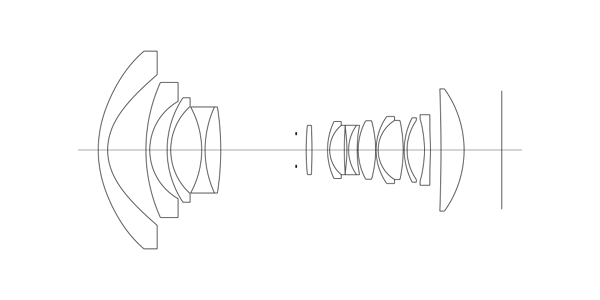
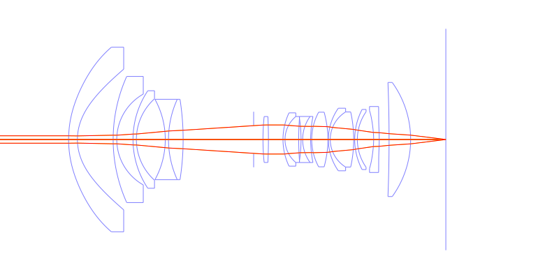
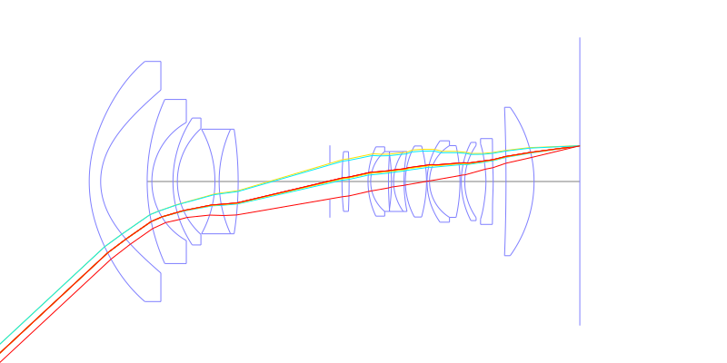
## Spot Diagrams
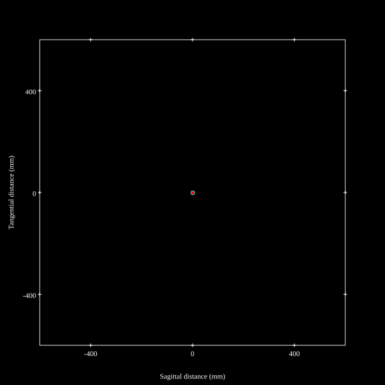
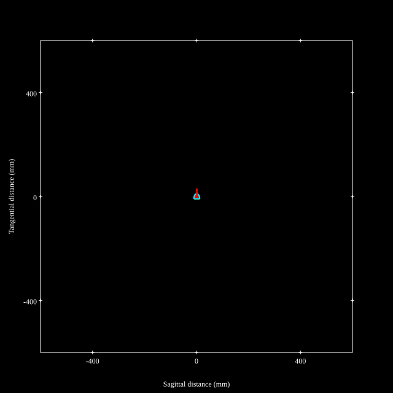
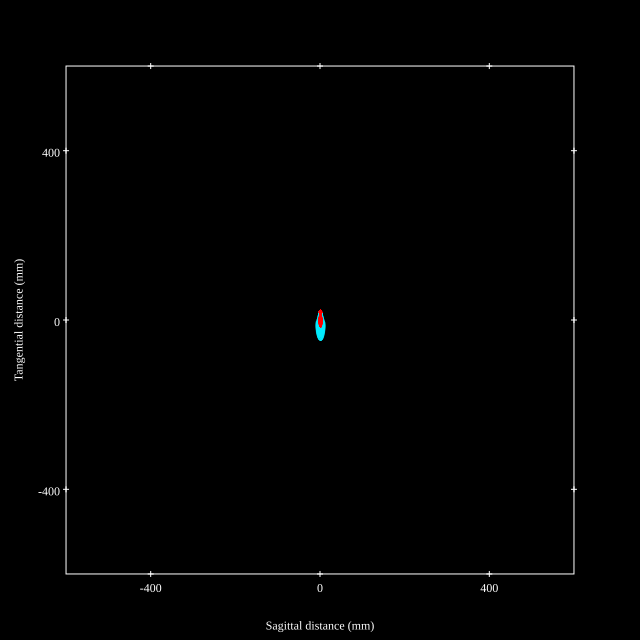
## Paraxial Parameters
| parameter | value |
| ---       | ---   |
| effective_focal_length |10.315
| back_focal_length | 12.053
| optical_invariant | 2.316
| object_distance | 1.0E10
| image_distance | 12.053
| power | 0.097
| pp1_H | 31.982
| ppk_H' | 1.738
| ffl_F | 21.667
| fno | 4.077
| enp_dist_P | 22.997
| enp_radius | 1.265
| exp_dist_P' | -67.915
| exp_radius | 9.812
| m | -0
| red | -9.69431446660234E8
| n_obj | 1
| n_img | 1
| img_ht | 18.888
| obj_ang | 61.36
| obj_na | 0
| img_na | -0.122|
## Spot Analysis
| Field | Spot Mean Radius | Spot Max Radius |
| ---   | ---              | ---             |
 | Field(x=0.0, y=0.0) | 2.997 | 6.748|
 | Field(x=0.0, y=0.1) | 3.136 | 8.248|
 | Field(x=0.0, y=0.2) | 3.325 | 8.903|
 | Field(x=0.0, y=0.3) | 3.819 | 9.888|
 | Field(x=0.0, y=0.4) | 4.713 | 11.872|
 | Field(x=0.0, y=0.5) | 5.696 | 12.551|
 | Field(x=0.0, y=0.6) | 6.152 | 12.689|
 | Field(x=0.0, y=0.7) | 6.718 | 30.336|
 | Field(x=0.0, y=0.8) | 7.986 | 42.529|
 | Field(x=0.0, y=0.9) | 8.141 | 29.441|
 | Field(x=0.0, y=1.0) | 16.167 | 46.224|
## Polychromatic Geometric MTF
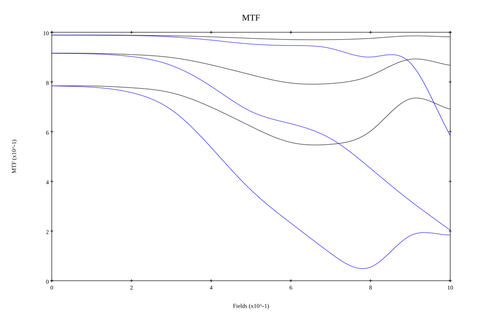
* 10,30,50 cycles/mm
* Black lines represent sagittal, blue tangential
* To generate above, MTFs for wavelengths 587.5618(d), 486.1327(F), 656.2725(C) were calculated across 10 fields, and then averaged
## Polychromatic Geometric MTF (Weighted)
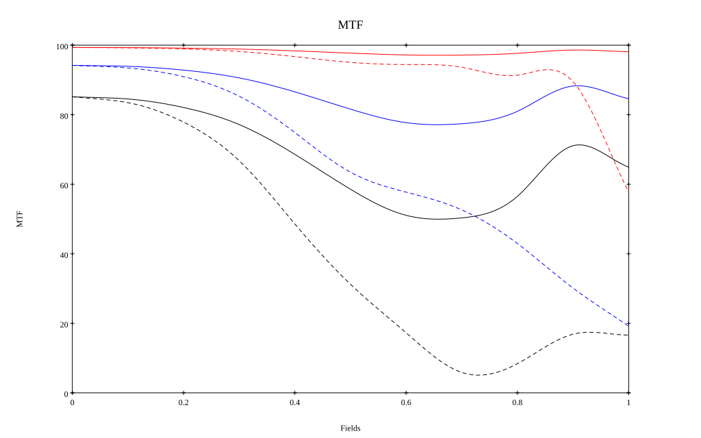
* 10,30,50 cycles/mm
* Black lines represent sagittal, blue tangential
* To generate above, MTFs for wavelengths 587.5618(d) wt(1.0), 656.2725(C) wt(0.475), 546.074(e) wt(0.98), 486.1327(F) wt(0.49), 435.8343(g) wt(0.15) were calculated across 10 fields, and then combined using weighted average
# 20mm f4.0
## Layouts
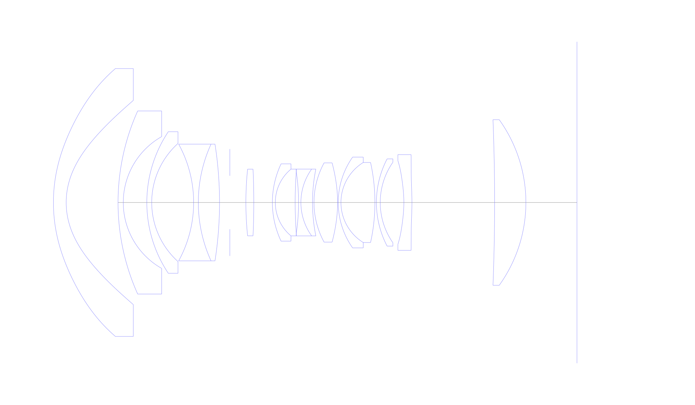
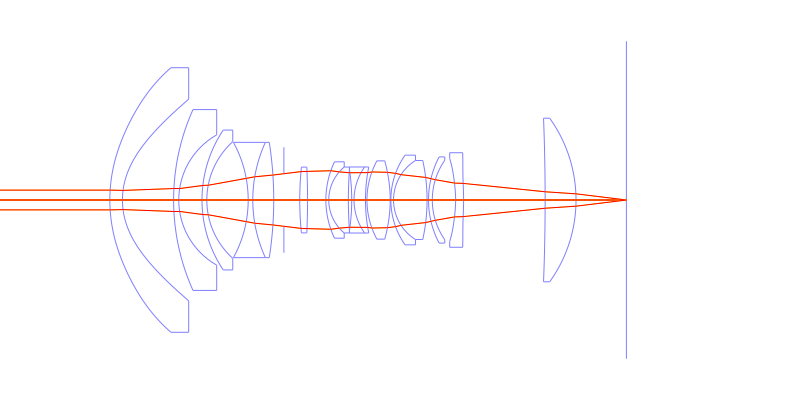
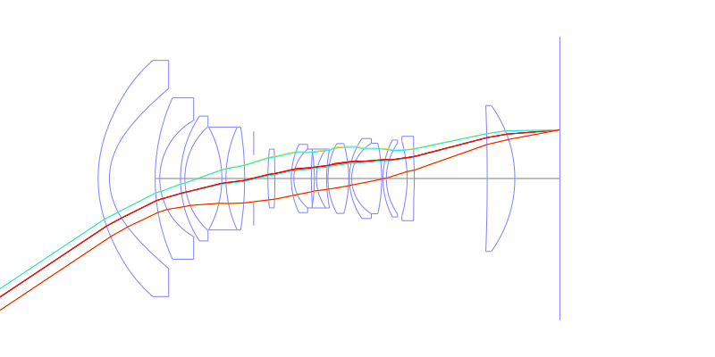
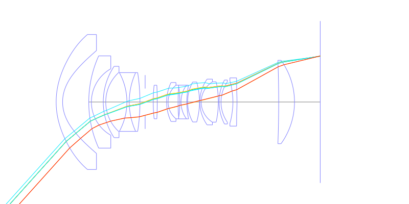
## Spot Diagrams
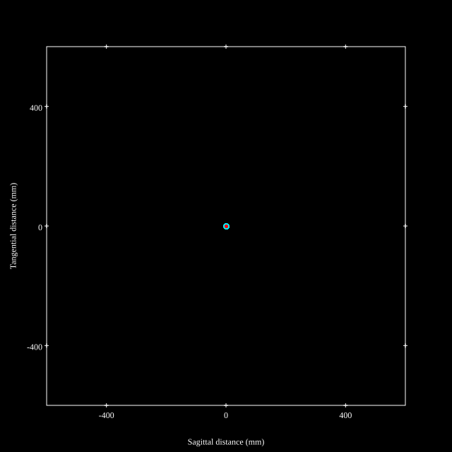

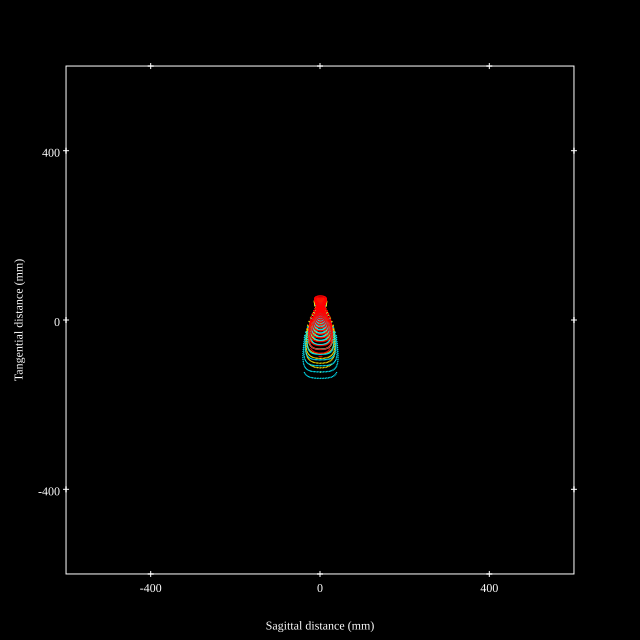
## Paraxial Parameters
| parameter | value |
| ---       | ---   |
| effective_focal_length |19.368
| back_focal_length | 11.979
| optical_invariant | 2.627
| object_distance | 1.0E10
| image_distance | 11.979
| power | 0.052
| pp1_H | 38.176
| ppk_H' | -7.389
| ffl_F | 18.808
| fno | 4.112
| enp_dist_P | 20.784
| enp_radius | 2.355
| exp_dist_P' | -177.866
| exp_radius | 23.08
| m | -0
| red | -5.16314805926281E8
| n_obj | 1
| n_img | 1
| img_ht | 21.609
| obj_ang | 48.13
| obj_na | 0
| img_na | -0.121|
## Spot Analysis
| Field | Spot Mean Radius | Spot Max Radius |
| ---   | ---              | ---             |
 | Field(x=0.0, y=0.0) | 2.816 | 8.436|
 | Field(x=0.0, y=0.1) | 2.713 | 10.575|
 | Field(x=0.0, y=0.2) | 3.225 | 12.371|
 | Field(x=0.0, y=0.3) | 3.773 | 14.438|
 | Field(x=0.0, y=0.4) | 4.78 | 15.49|
 | Field(x=0.0, y=0.5) | 6.614 | 16.721|
 | Field(x=0.0, y=0.6) | 8.916 | 21.004|
 | Field(x=0.0, y=0.7) | 11.154 | 26.732|
 | Field(x=0.0, y=0.8) | 14.482 | 40.666|
 | Field(x=0.0, y=0.9) | 23.605 | 79.563|
 | Field(x=0.0, y=1.0) | 42.484 | 136.757|
## Polychromatic Geometric MTF
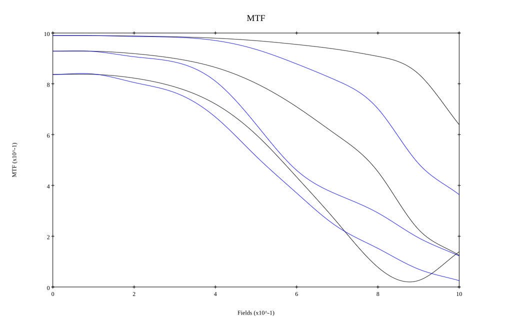
* 10,30,50 cycles/mm
* Black lines represent sagittal, blue tangential
* To generate above, MTFs for wavelengths 587.5618(d), 486.1327(F), 656.2725(C) were calculated across 10 fields, and then averaged
## Polychromatic Geometric MTF (Weighted)
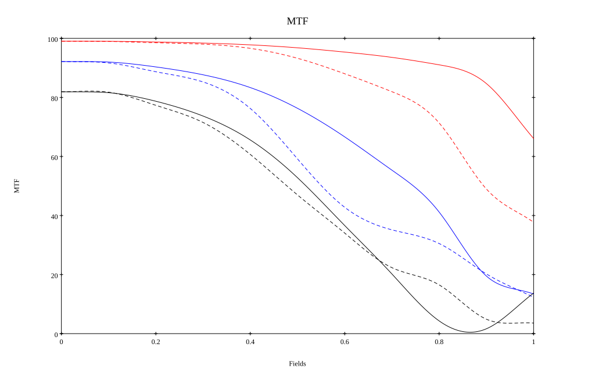
* 10,30,50 cycles/mm
* Black lines represent sagittal, blue tangential
* To generate above, MTFs for wavelengths 587.5618(d) wt(1.0), 656.2725(C) wt(0.475), 546.074(e) wt(0.98), 486.1327(F) wt(0.49), 435.8343(g) wt(0.15) were calculated across 10 fields, and then combined using weighted average
## Resources
* [OpticalBench Compatible Data File, tab delimited](./prescription.txt)
* [Zemax file](./US20240045184_Example01P.zmx)

Report / Zemax file generated using [Beam42](https://github.com/BeamFour/Beam42) on 2026-02-06
