# Canon RF100-300mm F2.8L IS USM
## Patent Information
| Country | Patent Number | Example | Year of Application | Inventors | Organisation | Link |
| ---     | ---           | ---     | ---                 | ---       | ---          | ---  |
|US | US 2026/0009984 | 4 | 2022 | Masato Katayose | Canon Inc | [link](https://patents.google.com/patent/US20260009984A1/en) |
## Surface Data
Note that where glass types are shown the refractive index and abbe number is as per assigned glass type

| ID  | Radius | Thickness | Diameter | nd  | vd  | Glass Make | Glass |
| --- | ---    | ---       | ---      | --- | --- | ---        | ---   |
| 1 | 318.412 | 9.6 | 107.66 | 1.48749 | 70.24 | Ohara | S-FSL5 |
| 2 | -861.108 | 0.5 | 107.66 |  |  |  |
| 3 | 150.245 | 12.24 | 102.62 | 1.43384 | 95.26 | Hikari | NICF-V |
| 4 | 9401.3 | 7.0 | 102.62 |  |  |  |
| 5 | 111.079 | 14.21 | 91.42 | 1.497 | 81.55 | Ohara | S-FPL51 |
| 6 | -1731.157 | 0.2 | 91.42 |  |  |  |
| 7 | -1429.819 | 2.4 | 91.42 | 1.6134 | 44.27 | Ohara | S-NBM51 |
| 8 | 100.324 | d8 | 78.45 |  |  |  |
| 9 | -6502.891 | 1.8 | 57.05 | 1.58144 | 40.75 | Ohara | S-TIL25 |
| 10 | 58.931 | 7.68 | 47.73 |  |  |  |
| 11 | -110.449 | 1.6 | 47.73 | 1.497 | 81.55 | Ohara | S-FPL51 |
| 12 | 198.706 | 0.3 | 57.05 |  |  |  |
| 13 | 101.587 | 5.82 | 49.58 | 1.85478 | 24.8 | Ohara | S-NBH56 |
| 14 | -370.711 | 1.6 | 49.58 |  |  |  |
| 15 | -131.451 | 1.6 | 50.28 | 1.76385 | 48.49 | Ohara | S-LAH96 |
| 16 | 885.349 | d16 | 51.42 |  |  |  |
| 17 | 139.669 | 5.94 | 57.68 | 1.497 | 81.55 | Ohara | S-FPL51 |
| 18 | -250.111 | 0.5 | 57.68 |  |  |  |
| 19 | 79.286 | 9.55 | 53.42 | 1.497 | 81.55 | Ohara | S-FPL51 |
| 20 | -110.681 | 1.8 | 53.42 | 1.7859 | 44.2 |  |
| 21 | 168.957 | 0.5 | 53.42 |  |  |  |
| 22 | 67.931 | 6.88 | 53.42 | 1.497 | 81.55 | Ohara | S-FPL51 |
| 23 | 8851.483 | 3.89 | 53.42 |  |  |  |
| 24 | AS | 17.94 | 45.098 |  |  |  |
| 25 | 18059.683 | 4.63 | 44.63 | 1.84666 | 23.78 | Ohara | S-TIH53 |
| 26 | -78.373 | 1.5 | 44.63 | 1.72342 | 37.96 | Ohara | S-BAH28 |
| 27 | 50.231 | 3.73 | 39.02 |  |  |  |
| 28 | 86.093 | 1.5 | 39.39 | 1.89286 | 20.36 | Ohara | S-NPH4 |
| 29 | 49.267 | 6.22 | 39.39 | 1.72916 | 54.68 | Ohara | S-LAL18 |
| 30 | -265.136 | 0.3 | 39.39 |  |  |  |
| 31 | 77.83 | 2.83 | 37.98 | 1.804 | 46.57 | Ohara | S-LAH65 |
| 32 | 190.511 | 1.5 | 37.98 |  |  |  |
| 33 | 38.86 | 2.83 | 35.24 | 1.6516 | 58.55 | Ohara | S-LAL7 |
| 34 | 55.133 | d34 | 35.24 |  |  |  |
| 35 | 334.84 | 2.79 | 31.98 | 1.89286 | 20.36 | Ohara | S-NPH4 |
| 36 | -158.15 | 1.5 | 31.98 | 1.7725 | 49.6 |  |
| 37 | 46.681 | d37 | 31.98 |  |  |  |
| 38 | 57.104 | 1.5 | 33.2 | 1.755 | 52.32 | Ohara | S-LAH97 |
| 39 | 39.022 | d39 | 33.2 |  |  |  |
| 40 | 74.395 | 11.11 | 45.78 | 1.58313 | 59.37 | Ohara | S-BAL42 |
| 41 | -70.264 | 8.49 | 45.78 |  |  |  |
| 42 | -46.66 | 1.4 | 45.45 | 1.64769 | 33.79 | Ohara | S-TIM22 |
| 43 | -141.783 | d43 | 45.45 |  |  |  |
## Aspherical Data
| ID  | Type | k   | P1 | P2 | P3 | P4 | P5 | P6 |
| --- | --- | --- | --- | --- | --- | --- | --- | --- |
| 41| EVEN | 0.0 | 0.0 | -1.73775E-6 | 1.43818E-10 | -1.24546E-12 | 1.73713E-15 | -5.94146E-19 |
## Variables
| Variable | 100mm f2.8 | 300mm f2.8 |
| --- | --- | --- |
| Focal length |103.0 |295.0 |
| F-Number |2.9 |2.91 |
| Angle of View |23.72 |8.38 |
| d8 | 5.83 | 87.14 |
| d16 | 82.31 | 1.0 |
| d34 | 6.72 | 4.67 |
| d37 | 5.01 | 9.54 |
| d39 | 27.9 | 25.41 |
| d43 | 35.45 | 35.45 |
# 100mm f2.8
## Layouts
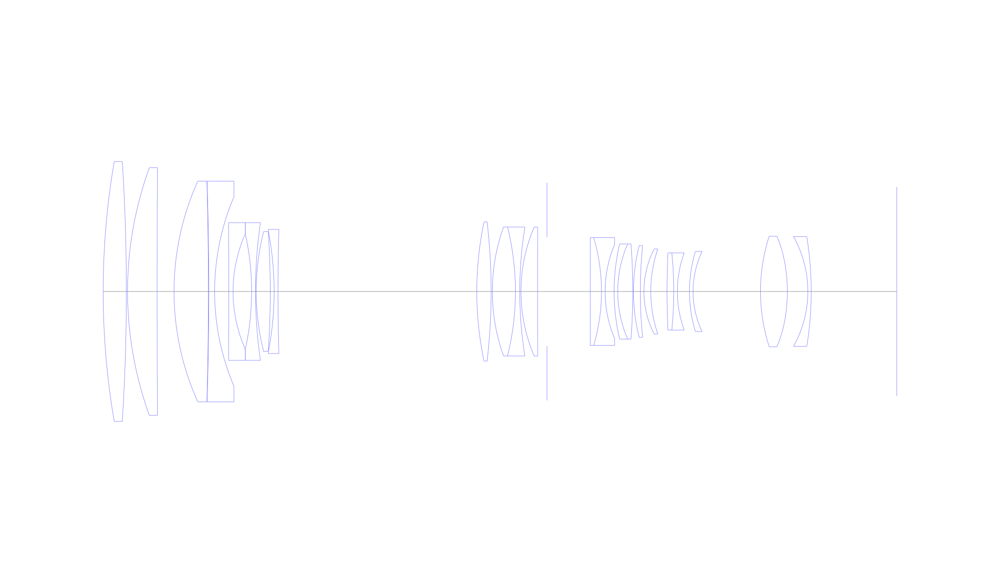
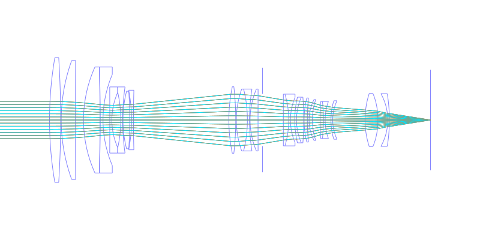
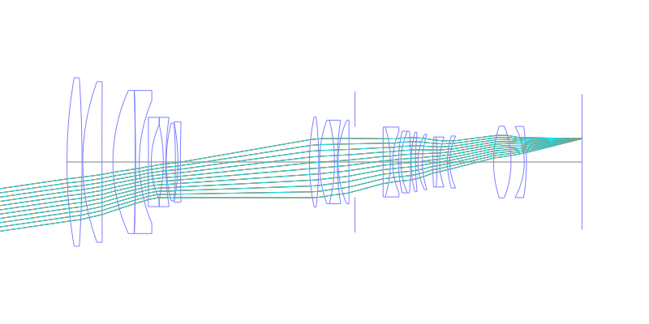
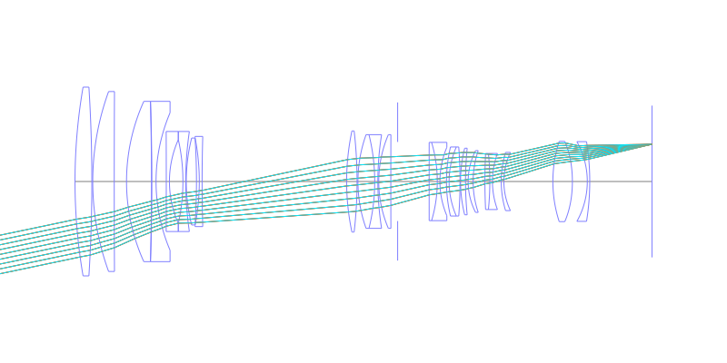
## Spot Diagrams
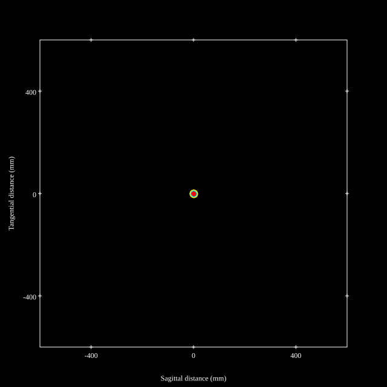
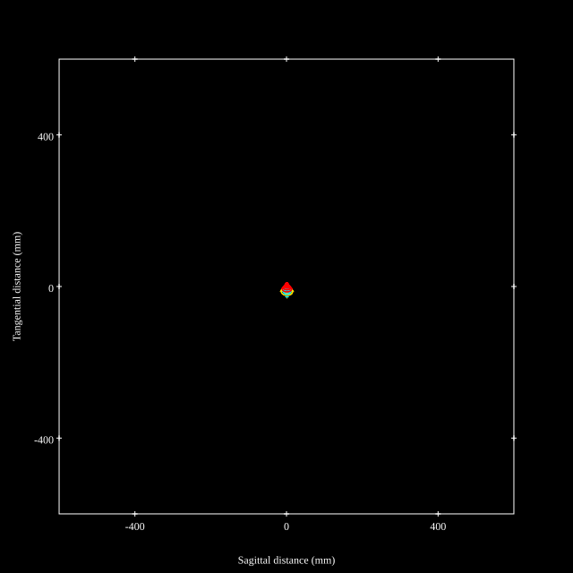
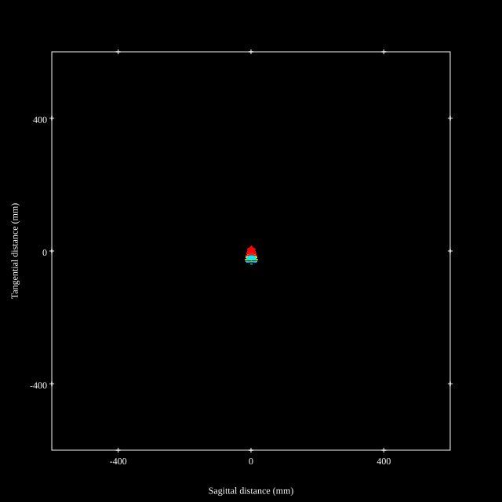
## Paraxial Parameters
| parameter | value |
| ---       | ---   |
| effective_focal_length |102.986
| back_focal_length | 35.419
| optical_invariant | 3.73
| object_distance | 1.0E10
| image_distance | 35.419
| power | 0.01
| pp1_H | 184.768
| ppk_H' | -67.567
| ffl_F | 81.783
| fno | 2.899
| enp_dist_P | 156.477
| enp_radius | 17.76
| exp_dist_P' | -106.606
| exp_radius | 24.487
| m | -0
| red | -9.710100589814882E7
| n_obj | 1
| n_img | 1
| img_ht | 21.627
| obj_ang | 11.86
| obj_na | 0
| img_na | -0.17|
## Spot Analysis
| Field | Spot Mean Radius | Spot Max Radius |
| ---   | ---              | ---             |
 | Field(x=0.0, y=0.0) | 5.729 | 14.679|
 | Field(x=0.0, y=0.1) | 5.493 | 18.642|
 | Field(x=0.0, y=0.2) | 5.668 | 22.68|
 | Field(x=0.0, y=0.3) | 6.659 | 25.932|
 | Field(x=0.0, y=0.4) | 6.654 | 26.332|
 | Field(x=0.0, y=0.5) | 6.624 | 26.238|
 | Field(x=0.0, y=0.6) | 6.261 | 27.32|
 | Field(x=0.0, y=0.7) | 6.438 | 29.104|
 | Field(x=0.0, y=0.8) | 7.231 | 31.262|
 | Field(x=0.0, y=0.9) | 8.45 | 33.863|
 | Field(x=0.0, y=1.0) | 9.436 | 36.029|
## Polychromatic Geometric MTF
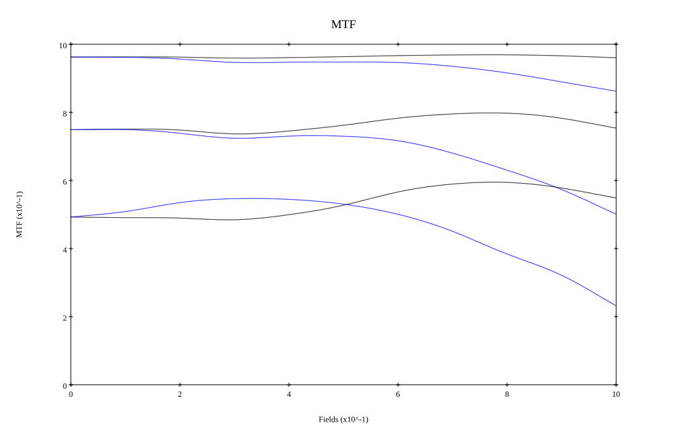
* 10,30,50 cycles/mm
* Black lines represent sagittal, blue tangential
* To generate above, MTFs for wavelengths 587.5618(d), 486.1327(F), 656.2725(C) were calculated across 10 fields, and then averaged
## Polychromatic Geometric MTF (Weighted)
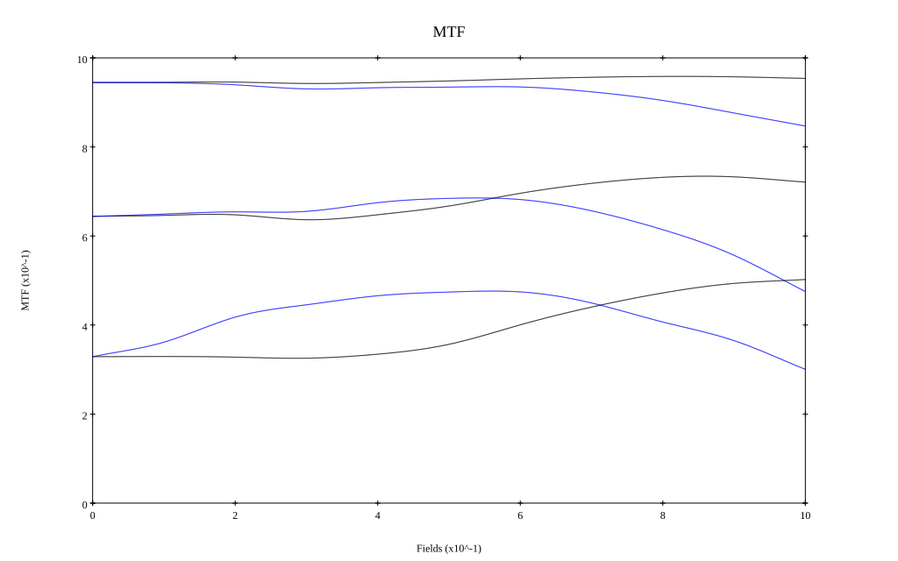
* 10,30,50 cycles/mm
* Black lines represent sagittal, blue tangential
* To generate above, MTFs for wavelengths 587.5618(d) wt(1.0), 656.2725(C) wt(0.475), 546.074(e) wt(0.98), 486.1327(F) wt(0.49), 435.8343(g) wt(0.15) were calculated across 10 fields, and then combined using weighted average
# 300mm f2.8
## Layouts
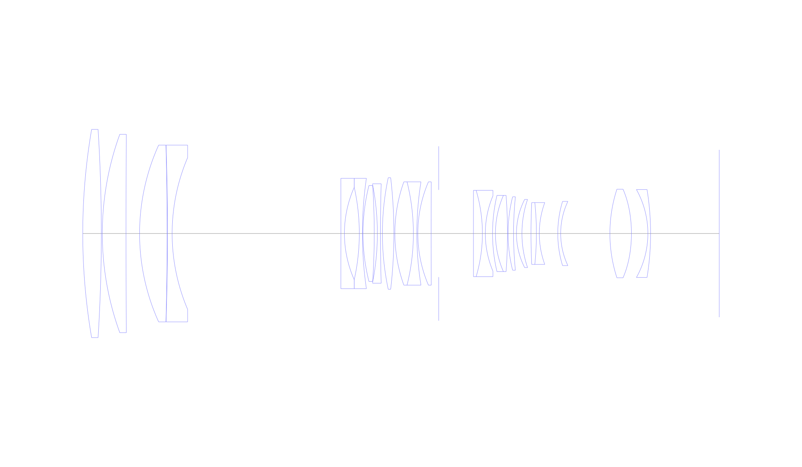
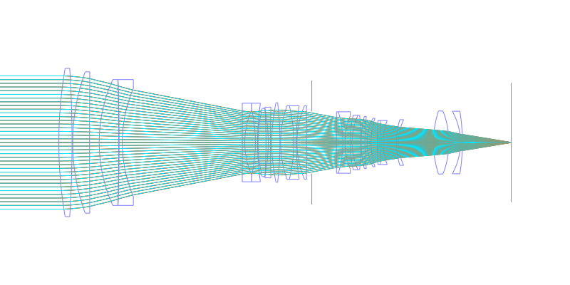
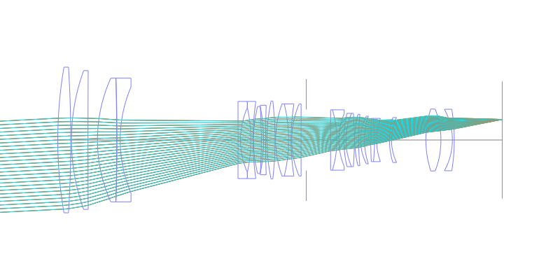
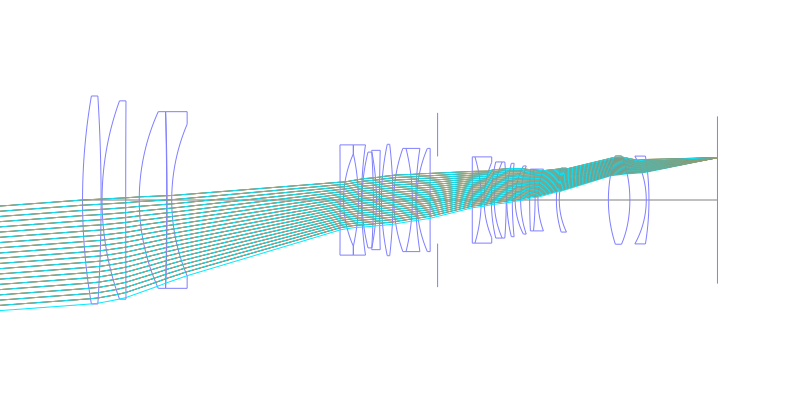
## Spot Diagrams

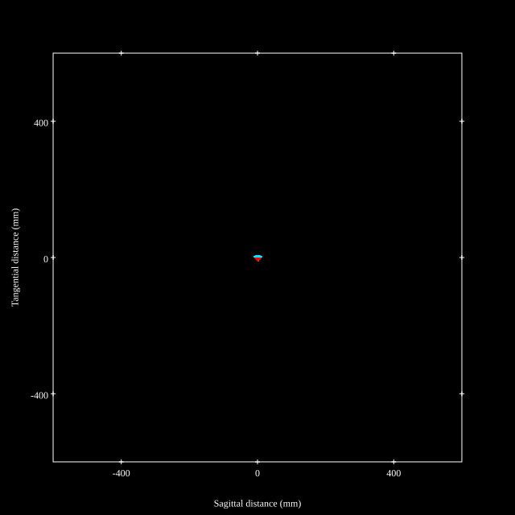

## Paraxial Parameters
| parameter | value |
| ---       | ---   |
| effective_focal_length |294.989
| back_focal_length | 35.45
| optical_invariant | 3.718
| object_distance | 1.0E10
| image_distance | 35.45
| power | 0.003
| pp1_H | 122.873
| ppk_H' | -259.539
| ffl_F | -172.116
| fno | 2.907
| enp_dist_P | 440.891
| enp_radius | 50.746
| exp_dist_P' | -106.503
| exp_radius | 24.42
| m | -0
| red | -3.389953892230992E7
| n_obj | 1
| n_img | 1
| img_ht | 21.611
| obj_ang | 4.19
| obj_na | 0
| img_na | -0.17|
## Spot Analysis
| Field | Spot Mean Radius | Spot Max Radius |
| ---   | ---              | ---             |
 | Field(x=0.0, y=0.0) | 2.984 | 6.809|
 | Field(x=0.0, y=0.1) | 2.824 | 7.189|
 | Field(x=0.0, y=0.2) | 2.668 | 7.176|
 | Field(x=0.0, y=0.3) | 2.648 | 7.726|
 | Field(x=0.0, y=0.4) | 2.818 | 8.531|
 | Field(x=0.0, y=0.5) | 3.098 | 9.563|
 | Field(x=0.0, y=0.6) | 3.423 | 10.731|
 | Field(x=0.0, y=0.7) | 3.721 | 11.828|
 | Field(x=0.0, y=0.8) | 4.049 | 12.507|
 | Field(x=0.0, y=0.9) | 4.319 | 12.338|
 | Field(x=0.0, y=1.0) | 4.074 | 11.105|
## Polychromatic Geometric MTF
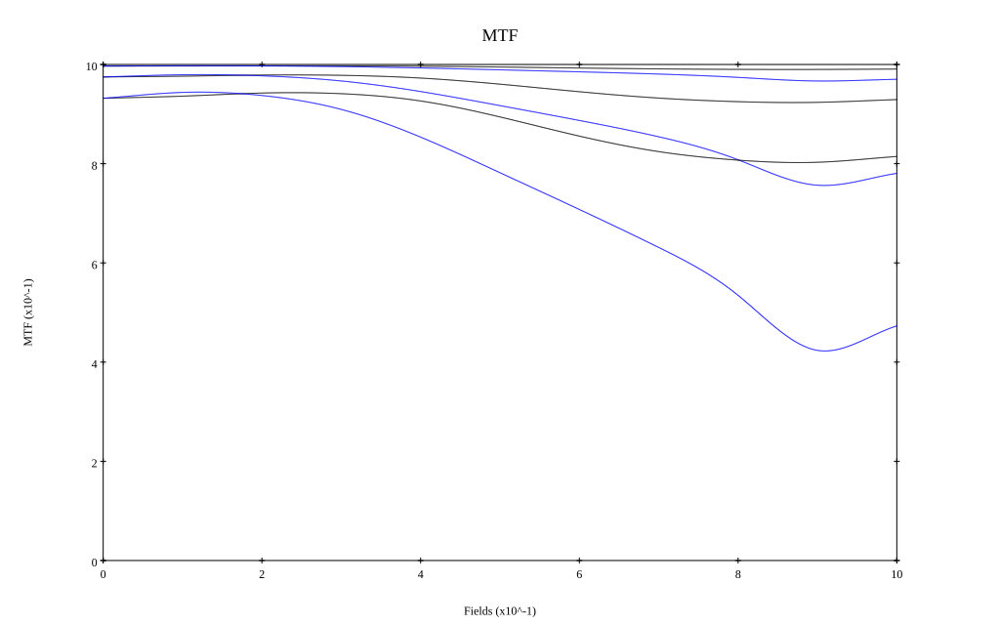
* 10,30,50 cycles/mm
* Black lines represent sagittal, blue tangential
* To generate above, MTFs for wavelengths 587.5618(d), 486.1327(F), 656.2725(C) were calculated across 10 fields, and then averaged
## Polychromatic Geometric MTF (Weighted)
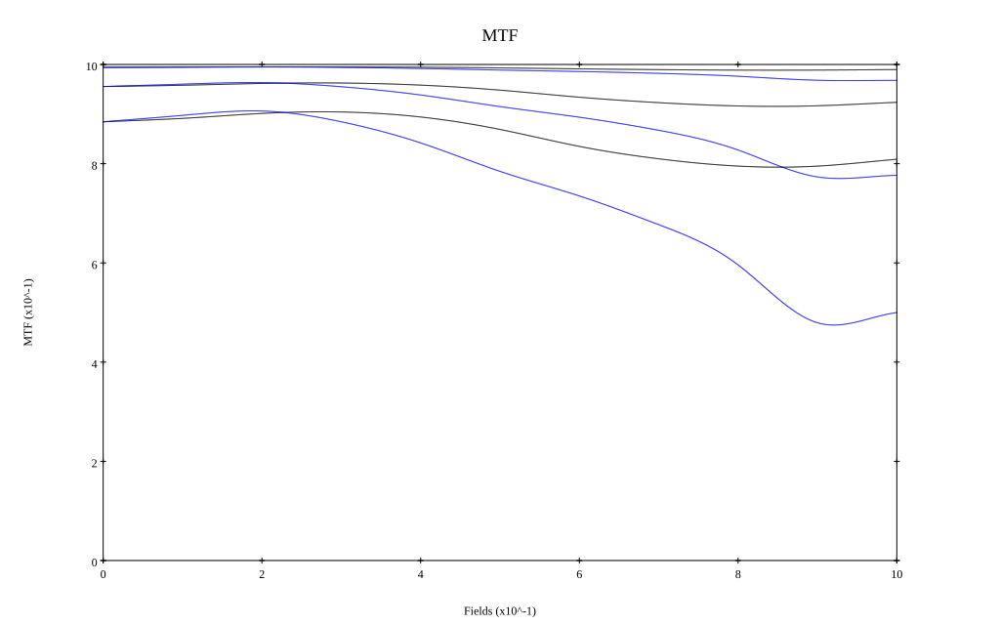
* 10,30,50 cycles/mm
* Black lines represent sagittal, blue tangential
* To generate above, MTFs for wavelengths 587.5618(d) wt(1.0), 656.2725(C) wt(0.475), 546.074(e) wt(0.98), 486.1327(F) wt(0.49), 435.8343(g) wt(0.15) were calculated across 10 fields, and then combined using weighted average
## Resources
* [OpticalBench Compatible Data File, tab delimited](./prescription.txt)
* [Zemax file](./US20260009984_Example04P.zmx)

Report / Zemax file generated using [Beam42](https://github.com/BeamFour/Beam42) on 2026-04-11
