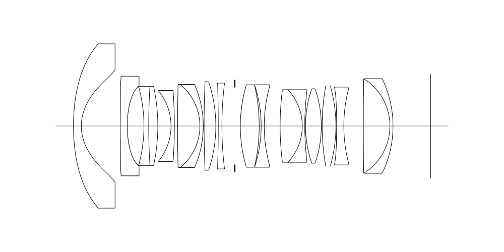
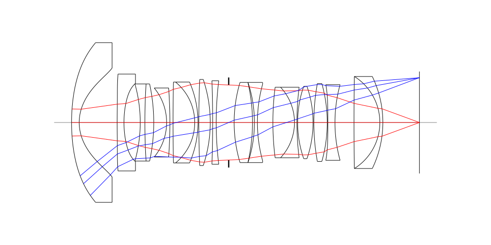
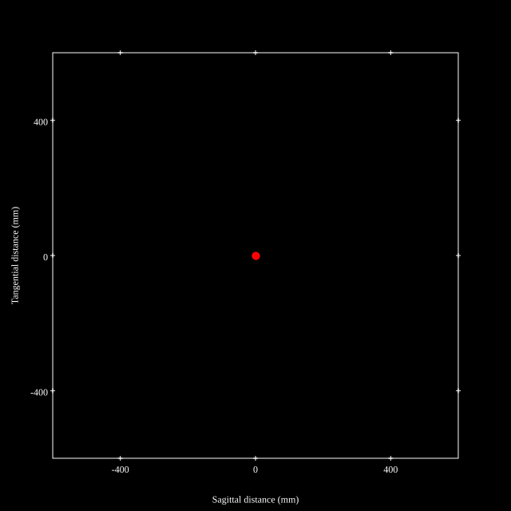
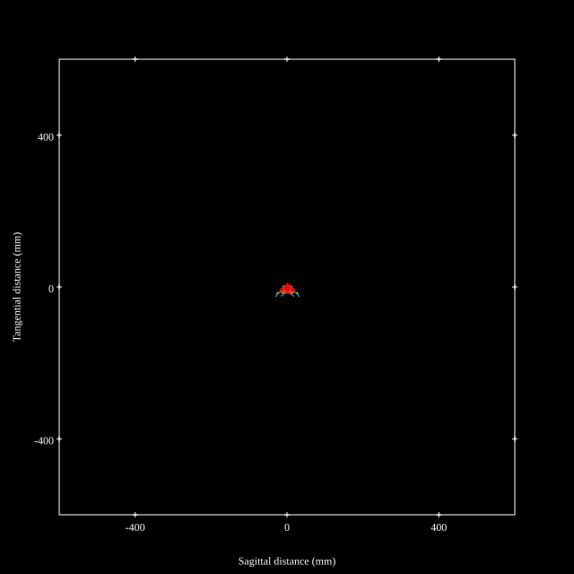
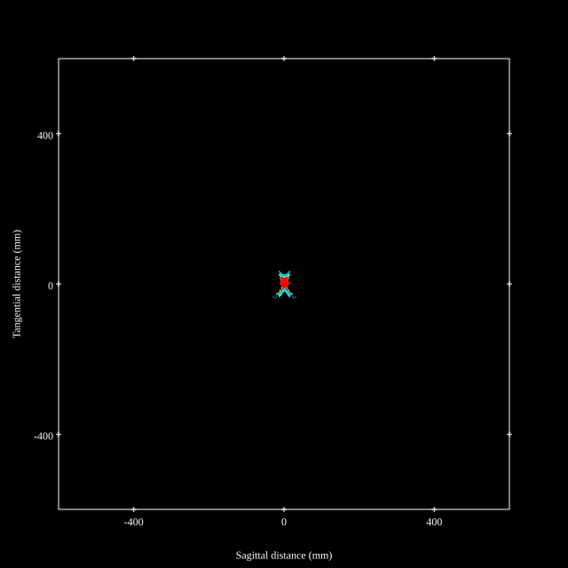
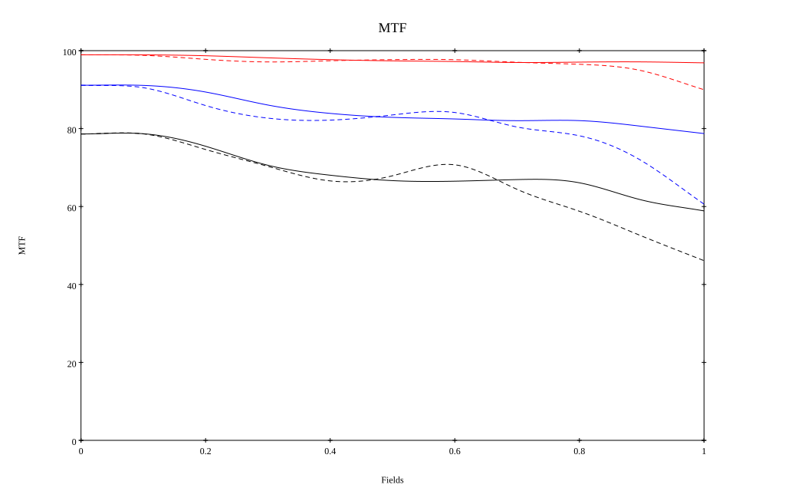
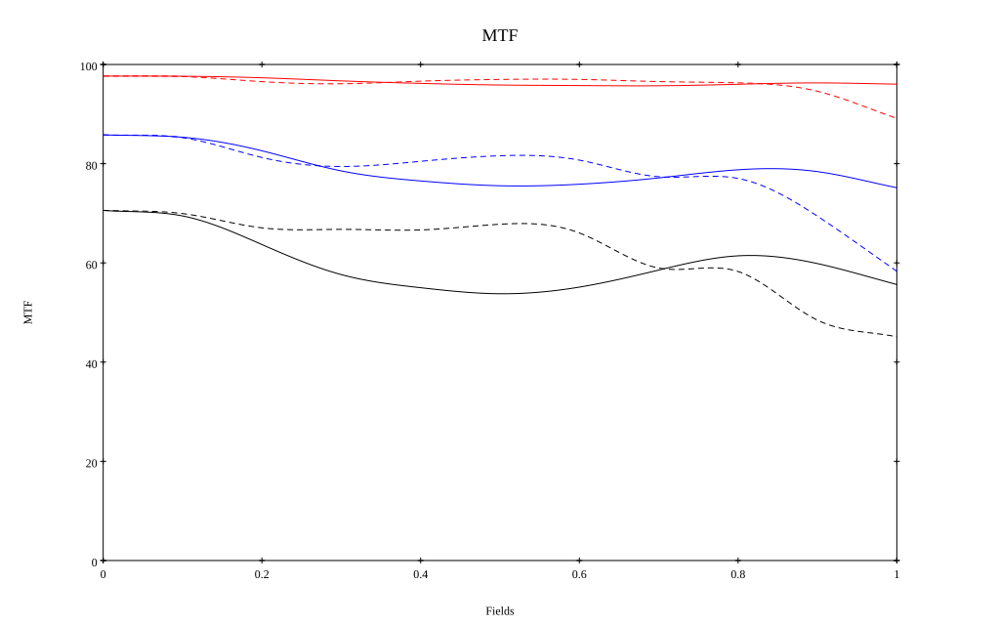

# Canon RF 14mm F1.4 L VCM
## Patent Information
| Country | Patent Number | Example | Year of Application | Inventors | Organisation | Link |
| ---     | ---           | ---     | ---                 | ---       | ---          | ---  |
|US | US20260235852 | 1 | 2023 | WATANABE TATSURO | Canon Inc | [link](https://worldwide.espacenet.com/patent/search?q=pn%3DUS20260235852A1) |
## Surface Data
Note that where glass types are shown the refractive index and abbe number is as per assigned glass type

| ID  | Radius | Thickness | Diameter | nd  | vd  | Glass Make | Glass |
| --- | ---    | ---       | ---      | --- | --- | ---        | ---   |
| 1 | 72.028 | 2.8 | 58.66 | 1.58313 | 59.46 | Hoya | BACD12 |
| 2 | 16.266 | 13.91 | 39.96 |  |  |  |
| 3 | 230.372 | 2.5 | 35.58 | 1.854 | 40.39 | Ohara | L-LAH85 |
| 4 | 36.824 | 5.96 | 28.76 |  |  |  |
| 5 | -52.544 | 1.7 | 28.33 | 1.497 | 81.61 | Hoya | FCD1 |
| 6 | 227.055 | 3.25 | 28.33 | 2.001 | 29.13 | Hoya | TAFD55 |
| 7 | -66.875 | 4.72 | 28.33 |  |  |  |
| 8 | -19.936 | 1.2 | 25.34 | 1.43384 | 95.26 | Hikari | NICF-A |
| 9 | -174.771 | 1.15 | 25.34 |  |  |  |
| 10 | 666.926 | 7.95 | 29.72 | 1.755 | 52.32 | Hoya | TAC6 |
| 11 | -19.196 | 1.2 | 29.72 | 1.90366 | 31.32 | Hoya | TAFD25 |
| 12 | -37.194 | 0.3 | 29.72 |  |  |  |
| 13 | 366.22 | 4.19 | 31.62 | 2.001 | 29.13 | Hoya | TAFD55 |
| 14 | -49.913 | 0.88 | 31.62 |  |  |  |
| 15 | -452.541 | 1.3 | 30.66 | 1.85478 | 24.8 | Ohara | S-NBH56 |
| 16 | 126.23 | 4.59 | 30.66 |  |  |  |
| 17 | AS | 1.99 | 27.552 |  |  |  |
| 18 | 51.465 | 6.73 | 29.44 | 1.7432 | 49.3 | Ohara | L-LAM60 |
| 19 | -64.595 | 0.7 | 29.44 | 1.5706 | 20.1 |  |
| 20 | -47.173 | 1.1 | 29.44 | 1.66565 | 35.6 |  |
| 21 | 52.87 | 5.67 | 28.08 |  |  |  |
| 22 | 102.903 | 7.91 | 25.9 | 1.59282 | 68.62 | Hoya | FCD505 |
| 23 | -18.997 | 0.9 | 25.9 | 1.85478 | 24.8 | Ohara | S-NBH56 |
| 24 | 104.859 | 0.26 | 25.9 |  |  |  |
| 25 | 40.761 | 5.64 | 26.58 | 1.53775 | 74.7 | Ohara | S-FPM3 |
| 26 | -40.761 | 0.3 | 26.58 |  |  |  |
| 27 | 80.536 | 4.9 | 28.6 | 1.92286 | 20.88 | Hoya | E-FDS1 |
| 28 | -52.817 | 0.24 | 28.6 |  |  |  |
| 29 | -451.581 | 2.6 | 27.78 | 1.854 | 40.39 | Ohara | L-LAH85 |
| 30 | 52.55 | 6.98 | 27.78 |  |  |  |
| 31 | 1258.224 | 9.47 | 33.78 | 1.59282 | 68.62 | Hoya | FCD505 |
| 32 | -19.963 | 1.1 | 33.78 | 2.001 | 29.13 | Hoya | TAFD55 |
| 33 | -38.825 | 13.413 | 33.78 |  |  |  |
## Aspherical Data
| ID  | Type | k   | P1 | P2 | P3 | P4 | P5 | P6 | P7 |
| --- | --- | --- | --- | --- | --- | --- | --- | --- | --- |
| 1| EVEN | 0.0 | 0.0 | 2.85263E-6 | -1.06525E-9 | 6.56552E-12 | -1.19824E-14 | 1.27858E-17 | -5.74533E-21 |
| 2| EVEN | -0.763673 | 0.0 | 3.24368E-7 | 1.3829E-8 | -2.16651E-10 | 1.03526E-12 | -2.85465E-15 | 2.51224E-18 |
| 3| EVEN | 0.0 | 0.0 | -1.9333E-5 | 5.99502E-8 | 2.63193E-11 | -1.91446E-13 | 0.0 | 0  |
| 4| EVEN | 0.0 | 0.0 | -1.26314E-6 | 8.53091E-8 | 3.29375E-10 | -1.43389E-12 | 6.79219E-15 | 0  |
| 29| EVEN | 0.0 | 0.0 | -1.36198E-5 | -5.539E-9 | 2.76263E-11 | -2.94829E-13 | 7.2534E-16 | 0  |
## Layouts

## Spot Diagrams

## Paraxial Parameters
| parameter | value |
| ---       | ---   |
| effective_focal_length |14.417
| back_focal_length | 13.42
| optical_invariant | 6.454
| object_distance | 1.0E10
| image_distance | 13.42
| power | 0.069
| pp1_H | 32.175
| ppk_H' | -0.997
| ffl_F | 17.758
| fno | 1.45
| enp_dist_P | 19.849
| enp_radius | 4.97
| exp_dist_P' | -85.986
| exp_radius | 34.272
| m | -0
| red | -6.936447335287869E8
| n_obj | 1
| n_img | 1
| img_ht | 18.72
| obj_ang | 52.4
| obj_na | 0
| img_na | -0.345|
## Spot Analysis
| Field | Spot Mean Radius | Spot Max Radius |
| ---   | ---              | ---             |
 | Field(x=0.0, y=0.0) | 3.263 | 9.764|
 | Field(x=0.0, y=0.1) | 3.402 | 15.838|
 | Field(x=0.0, y=0.2) | 4.322 | 23.228|
 | Field(x=0.0, y=0.3) | 5.051 | 24.592|
 | Field(x=0.0, y=0.4) | 5.132 | 28.542|
 | Field(x=0.0, y=0.5) | 5.158 | 34.796|
 | Field(x=0.0, y=0.6) | 5.29 | 38.303|
 | Field(x=0.0, y=0.7) | 5.742 | 42.716|
 | Field(x=0.0, y=0.8) | 5.948 | 48.247|
 | Field(x=0.0, y=0.9) | 6.655 | 46.207|
 | Field(x=0.0, y=1.0) | 8.742 | 49.374|
## Polychromatic Geometric MTF

* 10=red,30=blue,50=black cycles/mm
* Solid lines represent sagittal, dashed lines tangential
* To generate above, MTFs for wavelengths 587.5618(d), 486.1327(F), 656.2725(C) were calculated across 10 fields, and then averaged
## Polychromatic Geometric MTF (Weighted)

* 10=red,30=blue,50=black cycles/mm
* Solid lines represent sagittal, dashed lines tangential
* To generate above, MTFs for wavelengths 587.5618(d) wt(1.0), 656.2725(C) wt(0.475), 546.074(e) wt(0.98), 486.1327(F) wt(0.49), 435.8343(g) wt(0.15) were calculated across 10 fields, and then combined using weighted average
## Resources
* [OpticalBench Compatible Data File, tab delimited](./prescription.txt)
* [Zemax file](./US20260235852_Example01.zmx)

Report / Zemax file generated using [Beam42](https://github.com/BeamFour/Beam42) on 2026-09-06
