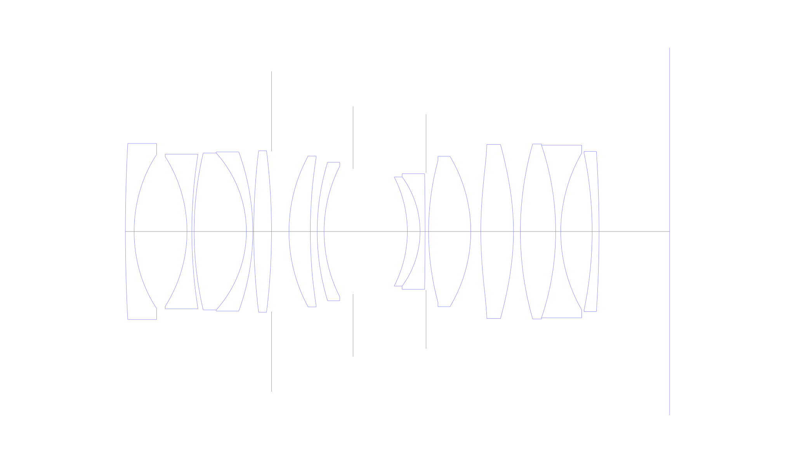
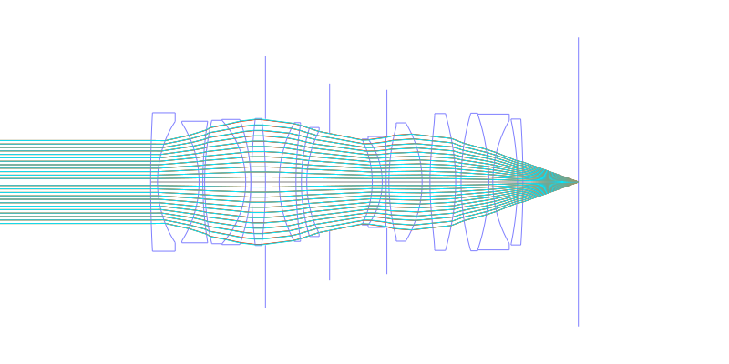
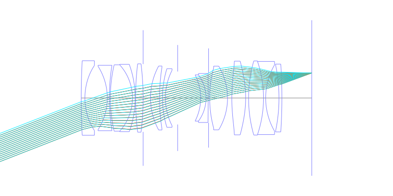
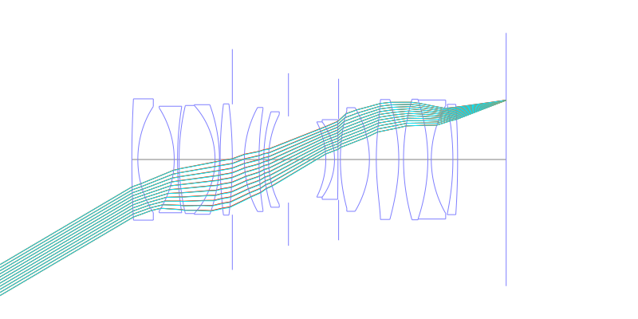
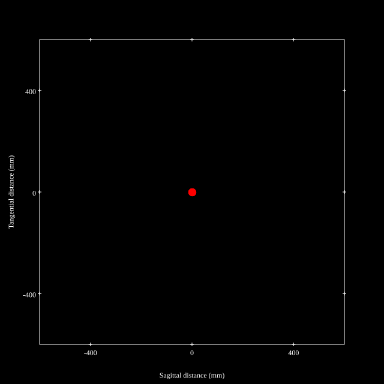
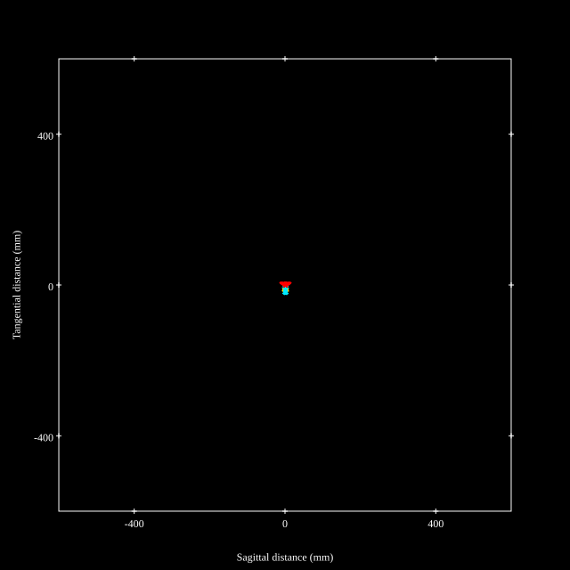
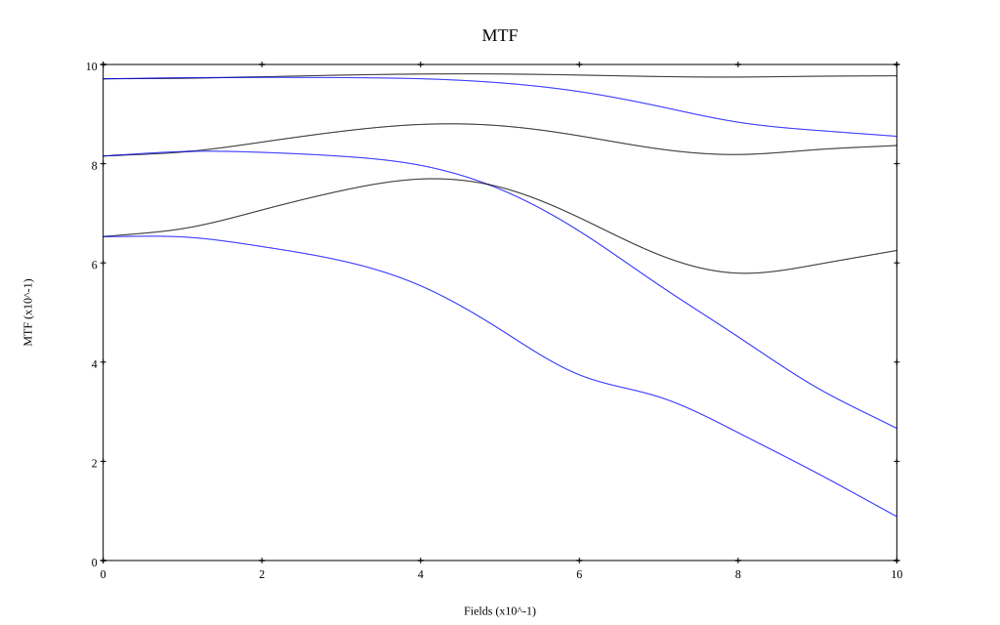
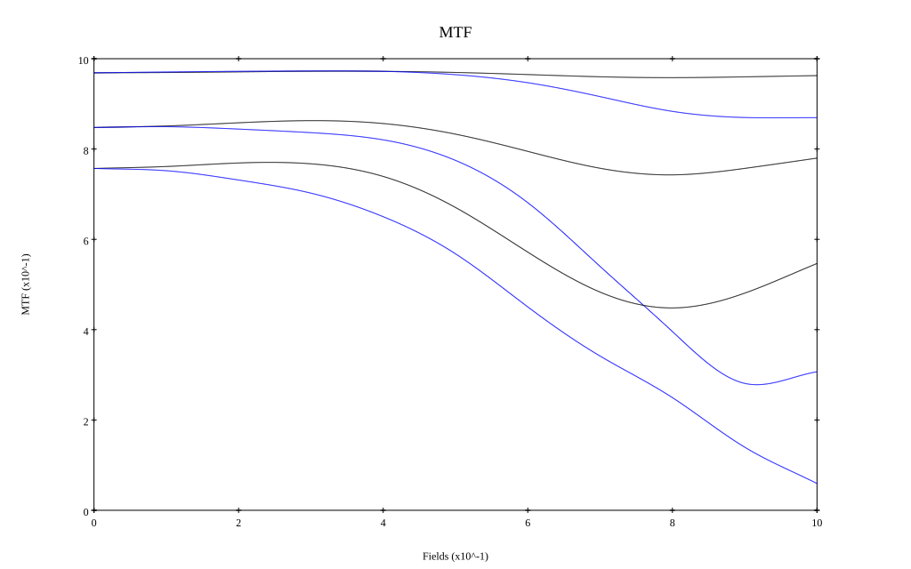

# Canon RF 35mm f1.4L
## Patent Information
| Country | Patent Number | Example | Year of Application | Inventors | Organisation | Link |
| ---     | ---           | ---     | ---                 | ---       | ---          | ---  |
|US | US20240302626 | EX 2 | 2023 | Takashi Ode,Takahiro Hatada | Canon Inc | [link](https://patents.google.com/patent/US20240302626A1/en) |
## Surface Data
Note that where glass types are shown the refractive index and abbe number is as per assigned glass type

| ID  | Radius | Thickness | Diameter | nd  | vd  | Glass Make | Glass |
| --- | ---    | ---       | ---      | --- | --- | ---        | ---   |
| 1 | 360.451 | 1.9 | 38.39 | 1.58313 | 59.39 | Ohara | L-BAL42 |
| 2 | 32.174 | 11.511 | 33.541 |  |  |  |
| 3 | -30.402 | 1.05 | 32.652 | 1.51633 | 64.14 | Ohara | S-BSL7 |
| 4 | 106.61 | 0.5 | 33.703 |  |  |  |
| 5 | 75.064 | 11.371 | 34.154 | 1.7645 | 49.1 | Ohara | L-LAH91 |
| 6 | -25.535 | 1.4 | 34.197 | 1.85478 | 24.8 | Ohara | S-NBH56 |
| 7 | -50.76 | 0.2 | 34.692 |  |  |  |
| 8 | 146.103 | 3.873 | 35.206 | 2.00069 | 25.46 | Hoya | TAFD40 |
| 9 | -143.19 | 0.0 | 35.205 |  |  |  |
| 10 | FS | 3.8 | 34.931 |  |  |  |
| 11 | 34.518 | 4.646 | 32.914 | 1.59522 | 67.74 | Ohara | S-FPM2 |
| 12 | 103.07 | 1.5 | 31.973 |  |  |  |
| 13 | 51.466 | 1.5 | 30.219 | 1.77047 | 29.74 | Hoya | NBFD29 |
| 14 | 31.46 | 6.316 | 28.478 |  |  |  |
| 15 | AS | 11.81 | 27.298 |  |  |  |
| 16 | -26.046 | 2.759 | 23.658 | 1.497 | 81.55 | Ohara | S-FPL51 |
| 17 | -20.122 | 1.1 | 23.804 | 1.77047 | 29.74 | Hoya | NBFD29 |
| 18 | -779.954 | 0.2 | 25.214 |  |  |  |
| 19 | FS | 0.558 | 25.55 |  |  |  |
| 20 | 59.443 | 9.185 | 30.836 | 1.497 | 81.55 | Ohara | S-FPL51 |
| 21 | -31.899 | 2.186 | 32.795 |  |  |  |
| 22 | 89.503 | 7.114 | 37.179 | 1.804 | 46.57 | Ohara | S-LAH65 |
| 23 | -56.118 | 1.5 | 37.945 |  |  |  |
| 24 | 69.336 | 7.684 | 38.174 | 2.001 | 29.14 | Ohara | S-LAH99 |
| 25 | -58.895 | 1.1 | 37.662 | 1.77047 | 29.74 | Hoya | NBFD29 |
| 26 | 34.256 | 6.839 | 34.145 |  |  |  |
| 27 | -83.829 | 1.5 | 34.223 | 1.6134 | 44.27 | Ohara | S-NBM51 |
| 28 | -262.53 | 15.36 | 34.9 |  |  |  |
## Aspherical Data
| ID  | k   | P1  | P2  | P3  | P3 | P5 | P6 | P7 | P8 | P9 | P10 |
| --- | --- | --- | --- | --- | --- | --- | --- | --- | --- | --- | --- |
| 2 | 0.0 | 0.0 | 1.697231E-6 | -9.598092E-9 | 1.251928E-10 | -6.39375E-13 | 1.679648E-15 | -1.671035E-18 | 0.0 | 0.0 | 0.0 |
| 22 | 0.0 | 0.0 | -4.587706E-6 | 1.115432E-9 | -8.943226E-12 | -4.870968E-15 | 0.0 | 0.0 | 0.0 | 0.0 | 0.0 |
| 23 | 0.0 | 0.0 | 3.931361E-6 | 1.682398E-9 | -8.682252E-12 | 5.83728E-15 | 0.0 | 0.0 | 0.0 | 0.0 | 0.0 |
## Layouts

## Spot Diagrams

## Paraxial Parameters
| parameter | value |
| ---       | ---   |
| effective_focal_length |33.978
| back_focal_length | 15.372
| optical_invariant | 6.854
| object_distance | 1.0E10
| image_distance | 15.372
| power | 0.029
| pp1_H | 44.734
| ppk_H' | -18.606
| ffl_F | 10.756
| fno | 1.46
| enp_dist_P | 26.002
| enp_radius | 11.636
| exp_dist_P' | -60.343
| exp_radius | 25.934
| m | -0
| red | -2.943052742144901E8
| n_obj | 1
| n_img | 1
| img_ht | 20.015
| obj_ang | 30.5
| obj_na | 0
| img_na | -0.324|
## Spot Analysis
| Field | Spot Mean Radius | Spot Max Radius |
| ---   | ---              | ---             |
 | Field(x=0.0, y=0.0) | 4.944 | 13.924|
 | Field(x=0.0, y=0.1) | 4.881 | 15.999|
 | Field(x=0.0, y=0.2) | 4.742 | 15.531|
 | Field(x=0.0, y=0.3) | 4.618 | 15.805|
 | Field(x=0.0, y=0.4) | 4.638 | 15.994|
 | Field(x=0.0, y=0.5) | 5.083 | 17.423|
 | Field(x=0.0, y=0.6) | 5.886 | 21.569|
 | Field(x=0.0, y=0.7) | 7.07 | 24.171|
 | Field(x=0.0, y=0.8) | 8.099 | 24.241|
 | Field(x=0.0, y=0.9) | 8.521 | 23.241|
 | Field(x=0.0, y=1.0) | 8.852 | 23.403|
## Polychromatic Geometric MTF

* 10,30,50 cycles/mm
* Black lines represent sagittal, blue tangential
* To generate above, MTFs for wavelengths 587.5618(d), 486.1327(F), 656.2725(C) were calculated across 10 fields, and then averaged
## Polychromatic Geometric MTF (Weighted)

* 10,30,50 cycles/mm
* Black lines represent sagittal, blue tangential
* To generate above, MTFs for wavelengths 587.5618(d) wt(1.0), 656.2725(C) wt(0.475), 546.074(e) wt(0.98), 486.1327(F) wt(0.49), 435.8343(g) wt(0.15) were calculated across 10 fields, and then combined using weighted average
## Resources
* [OpticalBench Compatible Data File, tab delimited](./US20240302626_Example02.txt)
* [Zemax file](./US20240302626_Example02.zmx)
