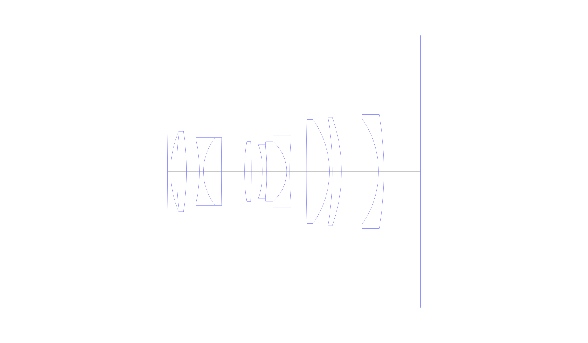
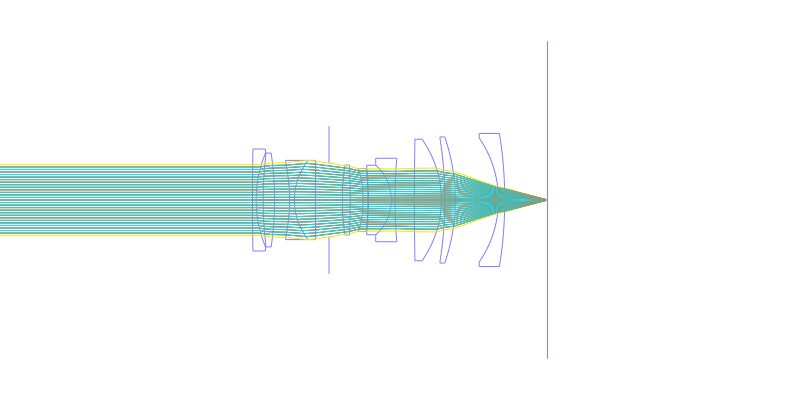
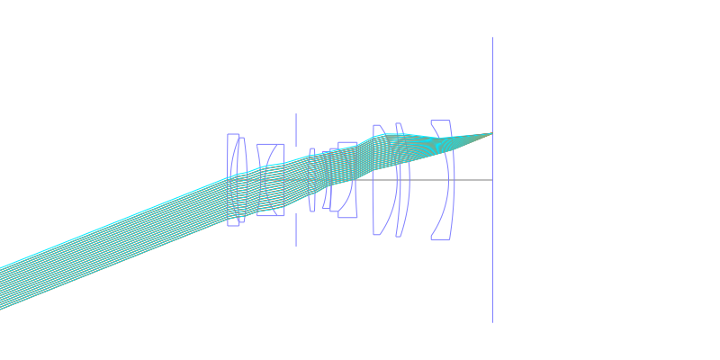
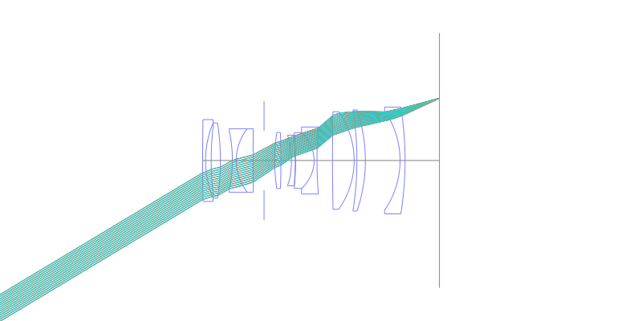
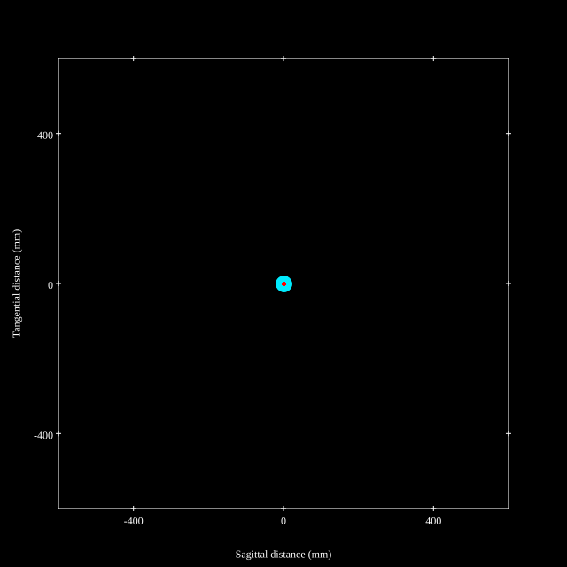
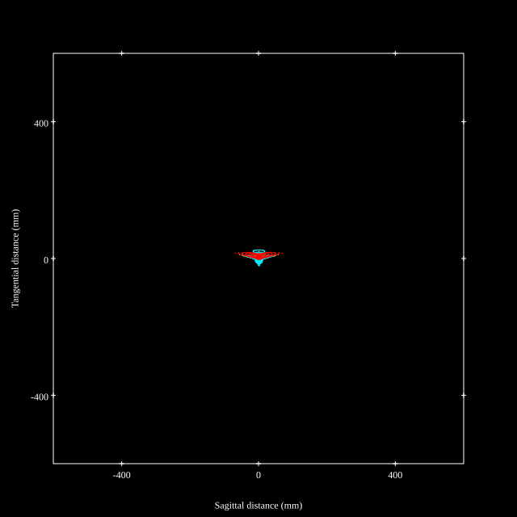
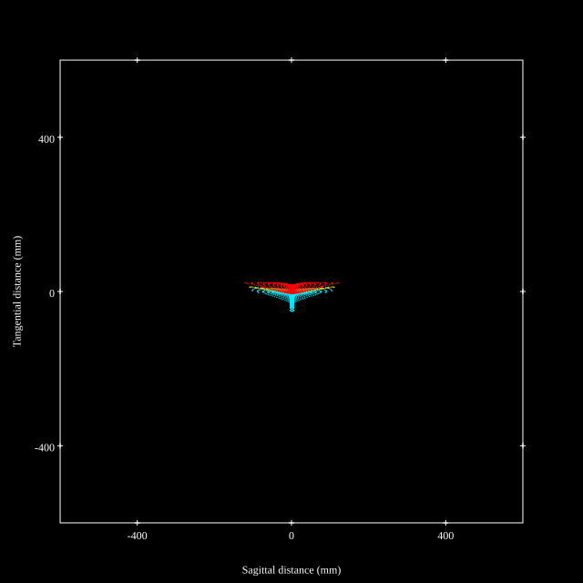
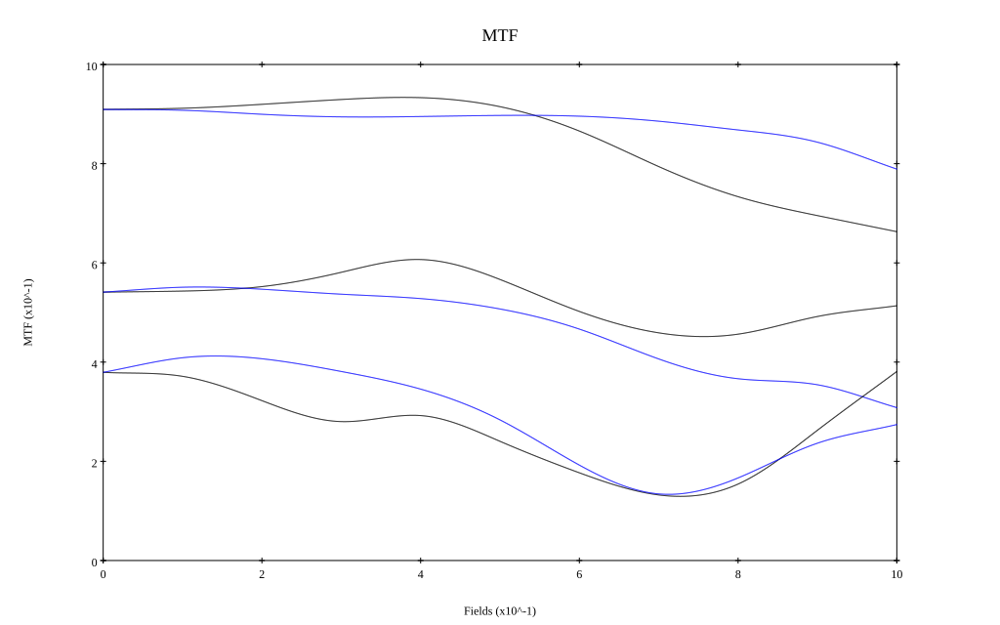
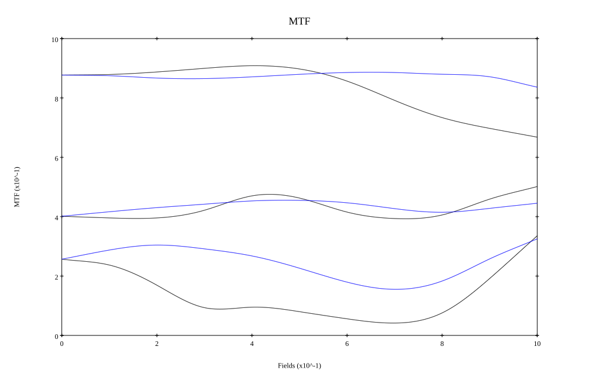

# Canon RF35mm F1.8 Macro IS STM
## Patent Information
| Country | Patent Number | Example | Year of Application | Inventors | Organisation | Link |
| ---     | ---           | ---     | ---                 | ---       | ---          | ---  |
|US | US20190113711 | EX 1 | 2017 | Shinya Okuoka | Canon Inc | [link](https://patents.google.com/patent/US20190113711A1/en) |
## Surface Data
Note that where glass types are shown the refractive index and abbe number is as per assigned glass type

| ID  | Radius | Thickness | Diameter | nd  | vd  | Glass Make | Glass |
| --- | ---    | ---       | ---      | --- | --- | ---        | ---   |
| 1 | 800.0 | 1.0 | 27.8 | 1.80809 | 22.76 | Ohara | S-NPH1 |
| 2 | 33.296 | 1.92 | 25.64 |  |  |  |
| 3 | 103.801 | 3.11 | 25.57 | 2.001 | 29.14 | Ohara | S-LAH99 |
| 4 | -86.901 | 4.09 | 25.07 |  |  |  |
| 5 | -47.674 | 1.3 | 20.44 | 1.51742 | 52.43 | Ohara | S-NSL36 |
| 6 | 17.367 | 5.73 | 21.6 | 1.90043 | 37.37 | Hoya | TAFD37 |
| 7 | 777.674 | 3.72 | 21.26 |  |  |  |
| 8 | AS | 3.62 | 20.16 |  |  |  |
| 9 | 64.497 | 2.12 | 19.04 | 1.6968 | 55.53 | Ohara | S-LAL14 |
| 10 | -262.934 | 3.56 | 18.69 |  |  |  |
| 11 | -35.963 | 1.3 | 17.1 | 1.58313 | 59.37 | Ohara | S-BAL42 |
| 12 | -93.55 | 0.13 | 17.19 |  |  |  |
| 13 | -84.988 | 6.26 | 17.29 | 1.883 | 40.77 | Ohara | S-LAH58 |
| 14 | -12.701 | 1.0 | 18.97 | 1.85478 | 24.8 | Ohara | S-NBH56 |
| 15 | 135.0 | 5.27 | 22.77 |  |  |  |
| 16 | 800.0 | 7.35 | 31.72 | 1.90043 | 37.37 | Hoya | TAFD37 |
| 17 | -28.799 | 0.95 | 33.14 |  |  |  |
| 18 | -109.518 | 2.86 | 34.06 | 1.6968 | 55.53 | Ohara | S-LAL14 |
| 19 | -53.092 | 11.79 | 34.38 |  |  |  |
| 20 | -29.766 | 1.7 | 33.78 | 1.5927 | 35.31 | Ohara | S-FTM16 |
| 21 | -114.3 | 11.66 | 36.27 |  |  |  |
## Aspherical Data
| ID  | k   | P1  | P2  | P3  | P3 | P5 | P6 | P7 | P8 | P9 | P10 |
| --- | --- | --- | --- | --- | --- | --- | --- | --- | --- | --- | --- |
| 11 | 0.0 | 0.0 | -4.61997E-5 | -9.22837E-8 | -4.60687E-10 | 1.65555E-13 | 0.0 | 0.0 | 0.0 | 0.0 | 0.0 |
## Layouts

## Spot Diagrams

## Paraxial Parameters
| parameter | value |
| ---       | ---   |
| effective_focal_length |36.009
| back_focal_length | 11.669
| optical_invariant | 5.848
| object_distance | 1.0E10
| image_distance | 11.669
| power | 0.028
| pp1_H | 27.854
| ppk_H' | -24.34
| ffl_F | -8.155
| fno | 1.85
| enp_dist_P | 14.339
| enp_radius | 9.732
| exp_dist_P' | -45.967
| exp_radius | 15.58
| m | -0
| red | -2.777080677719606E8
| n_obj | 1
| n_img | 1
| img_ht | 21.636
| obj_ang | 31
| obj_na | 0
| img_na | -0.261|
## Spot Analysis
| Field | Spot Mean Radius | Spot Max Radius |
| ---   | ---              | ---             |
 | Field(x=0.0, y=0.0) | 9.312 | 21.015|
 | Field(x=0.0, y=0.1) | 9.313 | 25.114|
 | Field(x=0.0, y=0.2) | 9.324 | 29.067|
 | Field(x=0.0, y=0.3) | 9.2 | 31.125|
 | Field(x=0.0, y=0.4) | 9.126 | 32.176|
 | Field(x=0.0, y=0.5) | 9.56 | 32.423|
 | Field(x=0.0, y=0.6) | 11.086 | 54.08|
 | Field(x=0.0, y=0.7) | 13.995 | 71.894|
 | Field(x=0.0, y=0.8) | 18.254 | 91.551|
 | Field(x=0.0, y=0.9) | 23.181 | 110.494|
 | Field(x=0.0, y=1.0) | 27.768 | 123.432|
## Polychromatic Geometric MTF

* 10,30,50 cycles/mm
* Black lines represent sagittal, blue tangential
* To generate above, MTFs for wavelengths 587.5618(d), 486.1327(F), 656.2725(C) were calculated across 10 fields, and then averaged
## Polychromatic Geometric MTF (Weighted)

* 10,30,50 cycles/mm
* Black lines represent sagittal, blue tangential
* To generate above, MTFs for wavelengths 587.5618(d) wt(1.0), 656.2725(C) wt(0.475), 546.074(e) wt(0.98), 486.1327(F) wt(0.49), 435.8343(g) wt(0.15) were calculated across 10 fields, and then combined using weighted average
## Resources
* [OpticalBench Compatible Data File, tab delimited](./US20190113711_Example01P.txt)
* [Zemax file](./US20190113711_Example01P.zmx)
